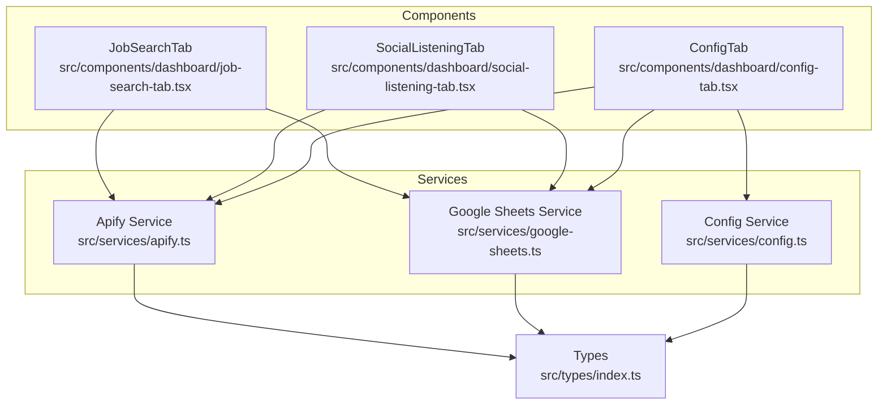
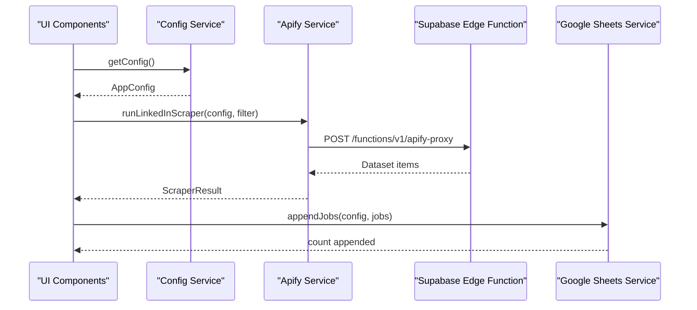
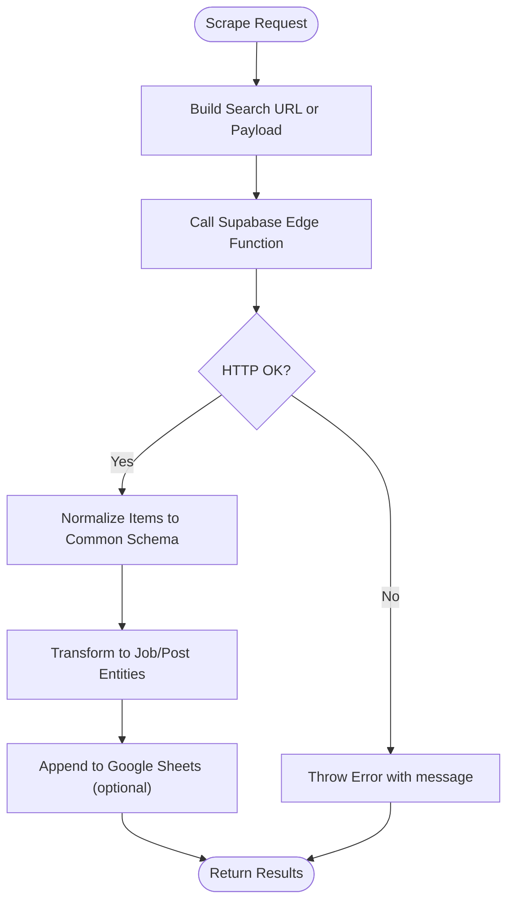
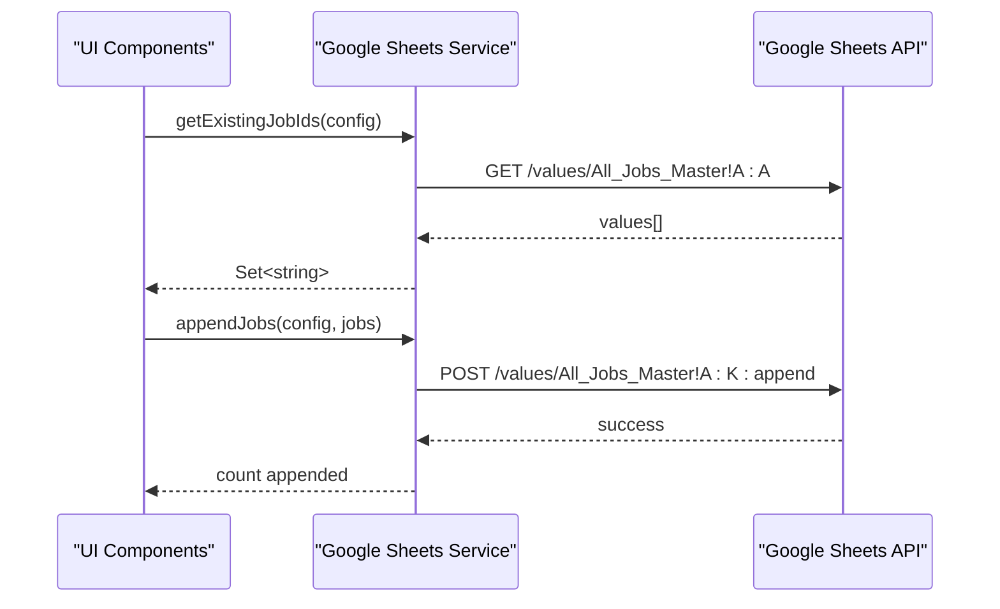
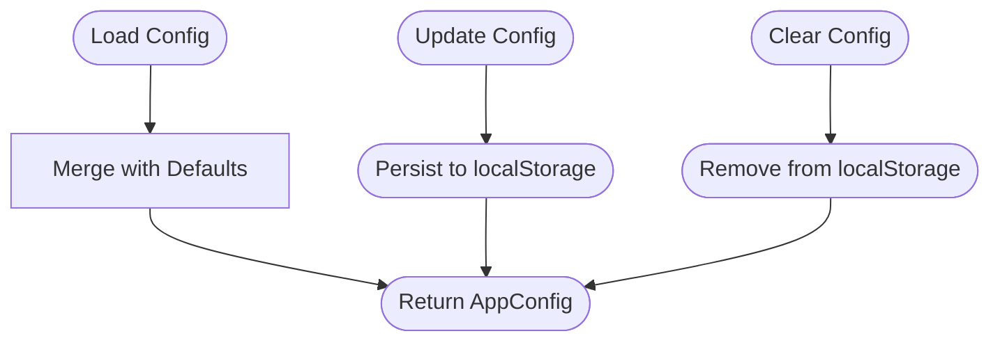
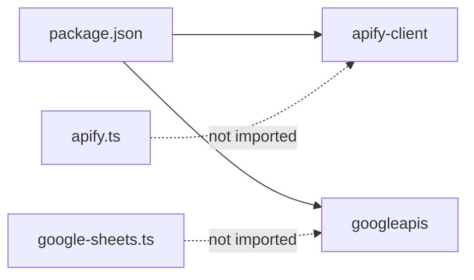

# API Reference

<cite>
**Referenced Files in This Document**
- [apify.ts](file://src/services/apify.ts)
- [google-sheets.ts](file://src/services/google-sheets.ts)
- [config.ts](file://src/services/config.ts)
- [index.ts](file://src/types/index.ts)
- [job-search-tab.tsx](file://src/components/dashboard/job-search-tab.tsx)
- [social-listening-tab.tsx](file://src/components/dashboard/social-listening-tab.tsx)
- [config-tab.tsx](file://src/components/dashboard/config-tab.tsx)
- [App.tsx](file://src/App.tsx)
- [package.json](file://package.json)
</cite>

## Table of Contents
1. [Introduction](#introduction)
2. [Project Structure](#project-structure)
3. [Core Components](#core-components)
4. [Architecture Overview](#architecture-overview)
5. [Detailed Component Analysis](#detailed-component-analysis)
6. [Dependency Analysis](#dependency-analysis)
7. [Performance Considerations](#performance-considerations)
8. [Troubleshooting Guide](#troubleshooting-guide)
9. [Conclusion](#conclusion)
10. [Appendices](#appendices)

## Introduction
This document provides a comprehensive API reference for the HuntSync AI job dashboard. It covers:
- Apify service API for scraping job listings and LinkedIn posts
- Google Sheets service API for data persistence and retrieval
- Configuration service API for managing credentials and settings
- Public interfaces, method parameters, return types, and error handling patterns
- Authentication requirements, rate limiting considerations, and API versioning
- Migration notes and backwards compatibility guidance

## Project Structure
The application is organized around three primary service modules and shared types:
- Services: Apify scraping, Google Sheets persistence, and configuration storage
- Components: Dashboard tabs that orchestrate service usage
- Types: Shared data models and enums used across services and components

**Diagram sources**
- [apify.ts:1-348](file://src/services/apify.ts#L1-L348)
- [google-sheets.ts:1-354](file://src/services/google-sheets.ts#L1-L354)
- [config.ts:1-66](file://src/services/config.ts#L1-L66)
- [job-search-tab.tsx:1-523](file://src/components/dashboard/job-search-tab.tsx#L1-L523)
- [social-listening-tab.tsx:1-276](file://src/components/dashboard/social-listening-tab.tsx#L1-L276)
- [config-tab.tsx:1-502](file://src/components/dashboard/config-tab.tsx#L1-L502)
- [index.ts:1-159](file://src/types/index.ts#L1-L159)

**Section sources**
- [apify.ts:1-348](file://src/services/apify.ts#L1-L348)
- [google-sheets.ts:1-354](file://src/services/google-sheets.ts#L1-L354)
- [config.ts:1-66](file://src/services/config.ts#L1-L66)
- [index.ts:1-159](file://src/types/index.ts#L1-L159)
- [job-search-tab.tsx:1-523](file://src/components/dashboard/job-search-tab.tsx#L1-L523)
- [social-listening-tab.tsx:1-276](file://src/components/dashboard/social-listening-tab.tsx#L1-L276)
- [config-tab.tsx:1-502](file://src/components/dashboard/config-tab.tsx#L1-L502)
- [App.tsx:1-67](file://src/App.tsx#L1-L67)

## Core Components
This section documents the public APIs exposed by each service module.

### Apify Service API
Purpose: Orchestrates scraping via Apify actors through a Supabase Edge Function proxy. Provides normalization and transformation utilities for scraped data.

Key exports and types:
- Interfaces and types used by the service
  - [ApifyDatasetItem:119-145](file://src/types/index.ts#L119-L145)
  - [SearchFilter:45-54](file://src/types/index.ts#L45-L54)
  - [ScraperResult:53-56](file://src/services/apify.ts#L53-L56)
  - [ApifyConfig:69-81](file://src/types/index.ts#L69-L81)
  - [ApifyRunResponse:113-117](file://src/types/index.ts#L113-L117)

Public methods:
- [testApifyConnection(apiToken):25-42](file://src/services/apify.ts#L25-L42)
  - Purpose: Validates Apify connectivity via the proxy endpoint
  - Parameters: apiToken (string)
  - Returns: Promise<{ success: boolean; error?: string }>
  - Errors: Returns { success: false, error } on failure; throws on network errors
- [runLinkedInScraper(config, filter):84-113](file://src/services/apify.ts#L84-L113)
  - Purpose: Scrapes LinkedIn jobs using a generated search URL
  - Parameters: config (ApifyConfig), filter (SearchFilter)
  - Returns: Promise<ScraperResult>
  - Errors: Throws on HTTP errors from the proxy
- [runIndeedScraper(config, filter):116-146](file://src/services/apify.ts#L116-L146)
  - Purpose: Scrapes Indeed jobs using position/location parameters
  - Parameters: config (ApifyConfig), filter (SearchFilter)
  - Returns: Promise<ScraperResult>
  - Errors: Throws on HTTP errors from the proxy
- [runNaukriScraper(config, filter):149-164](file://src/services/apify.ts#L149-L164)
  - Purpose: Scrapes Naukri jobs
  - Parameters: config (ApifyConfig), filter (SearchFilter)
  - Returns: Promise<ScraperResult>
  - Errors: Throws on HTTP errors from the proxy
- [runGlassdoorScraper(config, filter):167-182](file://src/services/apify.ts#L167-L182)
  - Purpose: Scrapes Glassdoor jobs
  - Parameters: config (ApifyConfig), filter (SearchFilter)
  - Returns: Promise<ScraperResult>
  - Errors: Throws on HTTP errors from the proxy
- [runInternshalaScraper(config, filter):185-200](file://src/services/apify.ts#L185-L200)
  - Purpose: Scrapes Internshala jobs
  - Parameters: config (ApifyConfig), filter (SearchFilter)
  - Returns: Promise<ScraperResult>
  - Errors: Throws on HTTP errors from the proxy
- [runWellfoundScraper(config, filter):203-218](file://src/services/apify.ts#L203-L218)
  - Purpose: Scrapes Wellfound jobs
  - Parameters: config (ApifyConfig), filter (SearchFilter)
  - Returns: Promise<ScraperResult>
  - Errors: Throws on HTTP errors from the proxy
- [runFounditScraper(config, filter):221-236](file://src/services/apify.ts#L221-L236)
  - Purpose: Scrapes Foundit jobs
  - Parameters: config (ApifyConfig), filter (SearchFilter)
  - Returns: Promise<ScraperResult>
  - Errors: Throws on HTTP errors from the proxy
- [runHiristScraper(config, filter):239-254](file://src/services/apify.ts#L239-L254)
  - Purpose: Scrapes Hirist jobs
  - Parameters: config (ApifyConfig), filter (SearchFilter)
  - Returns: Promise<ScraperResult>
  - Errors: Throws on HTTP errors from the proxy
- [runShineScraper(config, filter):257-272](file://src/services/apify.ts#L257-L272)
  - Purpose: Scrapes Shine jobs
  - Parameters: config (ApifyConfig), filter (SearchFilter)
  - Returns: Promise<ScraperResult>
  - Errors: Throws on HTTP errors from the proxy
- [runLinkedInPostScraper(config, searchQuery):289-299](file://src/services/apify.ts#L289-L299)
  - Purpose: Scrapes LinkedIn posts for social listening
  - Parameters: config (ApifyConfig), searchQuery (string)
  - Returns: Promise<ApifyDatasetItem[]>
  - Errors: Throws on HTTP errors from the proxy
- [transformApifyItemToJob(item, platform):301-318](file://src/services/apify.ts#L301-L318)
  - Purpose: Converts a normalized dataset item to a Job entity
  - Parameters: item (ApifyDatasetItem), platform (string)
  - Returns: Job
- [transformApifyItemToLinkedInPost(item):320-330](file://src/services/apify.ts#L320-L330)
  - Purpose: Converts a normalized dataset item to a LinkedInHiringPost entity
  - Parameters: item (ApifyDatasetItem)
  - Returns: LinkedInHiringPost
- [buildBooleanSearchQuery(userInput):345-347](file://src/services/apify.ts#L345-L347)
  - Purpose: Builds a boolean query for LinkedIn post scraping
  - Parameters: userInput (string)
  - Returns: string

Common usage patterns:
- Validate credentials: [testApifyConnection:25-42](file://src/services/apify.ts#L25-L42)
- Run a single platform scraper: [runLinkedInScraper:84-113](file://src/services/apify.ts#L84-L113)
- Transform results: [transformApifyItemToJob:301-318](file://src/services/apify.ts#L301-L318)
- Social listening: [runLinkedInPostScraper:289-299](file://src/services/apify.ts#L289-L299) + [transformApifyItemToLinkedInPost:320-330](file://src/services/apify.ts#L320-L330)

Integration guidelines:
- Use [ApifyConfig:69-81](file://src/types/index.ts#L69-L81) to pass actor IDs and tokens
- Normalize results via [normalizeItems:275-286](file://src/services/apify.ts#L275-L286) before persistence
- Respect timeouts and actor limits enforced by Apify

**Section sources**
- [apify.ts:1-348](file://src/services/apify.ts#L1-L348)
- [index.ts:45-145](file://src/types/index.ts#L45-L145)
- [job-search-tab.tsx:160-230](file://src/components/dashboard/job-search-tab.tsx#L160-L230)
- [social-listening-tab.tsx:62-95](file://src/components/dashboard/social-listening-tab.tsx#L62-L95)

### Google Sheets Service API
Purpose: Manages data persistence and retrieval via Google Sheets using a service account JWT flow.

Key exports and types:
- Interfaces and types used by the service
  - [Job:11-23](file://src/types/index.ts#L11-L23)
  - [LinkedInHiringPost:31-39](file://src/types/index.ts#L31-L39)
  - [GCPConfig:83-86](file://src/types/index.ts#L83-L86)

Public methods:
- [testGCPConnection(config):104-119](file://src/services/google-sheets.ts#L104-L119)
  - Purpose: Validates Google Sheets API access
  - Parameters: config (GCPConfig)
  - Returns: Promise<{ success: boolean; error?: string }>
  - Errors: Returns { success: false, error } on failures; throws on network errors
- [getExistingJobIds(config):141-150](file://src/services/google-sheets.ts#L141-L150)
  - Purpose: Retrieves existing job IDs to deduplicate
  - Parameters: config (GCPConfig)
  - Returns: Promise<Set<string>>
- [getExistingPostIds(config):152-160](file://src/services/google-sheets.ts#L152-L160)
  - Purpose: Retrieves existing post IDs to deduplicate
  - Parameters: config (GCPConfig)
  - Returns: Promise<Set<string>>
- [appendJobs(config, jobs):162-200](file://src/services/google-sheets.ts#L162-L200)
  - Purpose: Appends new jobs to the "All_Jobs_Master" sheet
  - Parameters: config (GCPConfig), jobs (Job[])
  - Returns: Promise<number> (count of appended rows)
  - Errors: Throws on HTTP errors from Sheets API
- [appendLinkedInPosts(config, posts):202-236](file://src/services/google-sheets.ts#L202-L236)
  - Purpose: Appends new posts to the "LinkedIn_Hiring_Posts" sheet
  - Parameters: config (GCPConfig), posts (LinkedInHiringPost[])
  - Returns: Promise<number> (count of appended rows)
  - Errors: Throws on HTTP errors from Sheets API
- [getAllJobs(config):238-259](file://src/services/google-sheets.ts#L238-L259)
  - Purpose: Loads all jobs from the "All_Jobs_Master" sheet
  - Parameters: config (GCPConfig)
  - Returns: Promise<Job[]>
- [getAllLinkedInPosts(config):261-278](file://src/services/google-sheets.ts#L261-L278)
  - Purpose: Loads all LinkedIn posts from the "LinkedIn_Hiring_Posts" sheet
  - Parameters: config (GCPConfig)
  - Returns: Promise<LinkedInHiringPost[]>
- [updateJobStatus(config, jobId, status):280-313](file://src/services/google-sheets.ts#L280-L313)
  - Purpose: Updates a job’s application status in the "All_Jobs_Master" sheet
  - Parameters: config (GCPConfig), jobId (string), status (string)
  - Returns: Promise<void>
  - Errors: Throws if job not found or update fails
- [updatePostStatus(config, postId, status):315-347](file://src/services/google-sheets.ts#L315-L347)
  - Purpose: Updates a post’s status in the "LinkedIn_Hiring_Posts" sheet
  - Parameters: config (GCPConfig), postId (string), status (string)
  - Returns: Promise<void>
  - Errors: Throws if post not found or update fails
- [wipeAllData(config):349-354](file://src/services/google-sheets.ts#L349-L354)
  - Purpose: Clears both sheets
  - Parameters: config (GCPConfig)
  - Returns: Promise<void>

Common usage patterns:
- Deduplicate before append: [getExistingJobIds:141-150](file://src/services/google-sheets.ts#L141-L150) and [getExistingPostIds:152-160](file://src/services/google-sheets.ts#L152-L160)
- Persist results: [appendJobs:162-200](file://src/services/google-sheets.ts#L162-L200) and [appendLinkedInPosts:202-236](file://src/services/google-sheets.ts#L202-L236)
- Load and display: [getAllJobs:238-259](file://src/services/google-sheets.ts#L238-L259) and [getAllLinkedInPosts:261-278](file://src/services/google-sheets.ts#L261-L278)
- Update statuses: [updateJobStatus:280-313](file://src/services/google-sheets.ts#L280-L313) and [updatePostStatus:315-347](file://src/services/google-sheets.ts#L315-L347)

Integration guidelines:
- Use [GCPConfig:83-86](file://src/types/index.ts#L83-L86) with service account JSON and spreadsheet ID
- Cache and refresh access tokens automatically
- Handle sheet existence gracefully (some methods return empty sets on missing sheets)

**Section sources**
- [google-sheets.ts:1-354](file://src/services/google-sheets.ts#L1-L354)
- [index.ts:11-86](file://src/types/index.ts#L11-L86)
- [job-search-tab.tsx:90-104](file://src/components/dashboard/job-search-tab.tsx#L90-L104)
- [social-listening-tab.tsx:46-60](file://src/components/dashboard/social-listening-tab.tsx#L46-L60)

### Configuration Service API
Purpose: Manages persistent configuration in localStorage, including defaults and updates.

Public methods:
- [getConfig():26-43](file://src/services/config.ts#L26-L43)
  - Purpose: Loads merged configuration from localStorage with defaults
  - Returns: AppConfig
- [saveConfig(config):45-47](file://src/services/config.ts#L45-L47)
  - Purpose: Persists configuration to localStorage
  - Parameters: config (AppConfig)
- [updateApifyConfig(updates):49-54](file://src/services/config.ts#L49-L54)
  - Purpose: Updates Apify configuration and persists
  - Parameters: updates (Partial<ApifyConfig>)
  - Returns: ApifyConfig
- [updateGCPConfig(updates):56-61](file://src/services/config.ts#L56-L61)
  - Purpose: Updates GCP configuration and persists
  - Parameters: updates (Partial<GCPConfig>)
  - Returns: GCPConfig
- [clearConfig():63-65](file://src/services/config.ts#L63-L65)
  - Purpose: Removes all configuration from localStorage

Common usage patterns:
- Initialize UI state: [getConfig:26-43](file://src/services/config.ts#L26-L43)
- Save user edits: [updateApifyConfig:49-54](file://src/services/config.ts#L49-L54), [updateGCPConfig:56-61](file://src/services/config.ts#L56-L61)
- Reset configuration: [clearConfig:63-65](file://src/services/config.ts#L63-L65)

Integration guidelines:
- Defaults are applied for missing fields
- Use [ApifyConfig:69-81](file://src/types/index.ts#L69-L81) and [GCPConfig:83-86](file://src/types/index.ts#L83-L86) shapes consistently

**Section sources**
- [config.ts:1-66](file://src/services/config.ts#L1-L66)
- [index.ts:69-91](file://src/types/index.ts#L69-L91)
- [config-tab.tsx:28-42](file://src/components/dashboard/config-tab.tsx#L28-L42)

## Architecture Overview
High-level flow of scraping and persistence:

**Diagram sources**
- [job-search-tab.tsx:160-230](file://src/components/dashboard/job-search-tab.tsx#L160-L230)
- [apify.ts:59-81](file://src/services/apify.ts#L59-L81)
- [google-sheets.ts:162-200](file://src/services/google-sheets.ts#L162-L200)

## Detailed Component Analysis

### Apify Service Methods
- Connection testing: [testApifyConnection:25-42](file://src/services/apify.ts#L25-L42)
- Platform scrapers: [runLinkedInScraper:84-113](file://src/services/apify.ts#L84-L113), [runIndeedScraper:116-146](file://src/services/apify.ts#L116-L146), [runNaukriScraper:149-164](file://src/services/apify.ts#L149-L164), [runGlassdoorScraper:167-182](file://src/services/apify.ts#L167-L182), [runInternshalaScraper:185-200](file://src/services/apify.ts#L185-L200), [runWellfoundScraper:203-218](file://src/services/apify.ts#L203-L218), [runFounditScraper:221-236](file://src/services/apify.ts#L221-L236), [runHiristScraper:239-254](file://src/services/apify.ts#L239-L254), [runShineScraper:257-272](file://src/services/apify.ts#L257-L272)
- Social listening: [runLinkedInPostScraper:289-299](file://src/services/apify.ts#L289-L299)
- Transformation: [transformApifyItemToJob:301-318](file://src/services/apify.ts#L301-L318), [transformApifyItemToLinkedInPost:320-330](file://src/services/apify.ts#L320-L330)
- Utilities: [buildBooleanSearchQuery:345-347](file://src/services/apify.ts#L345-L347)

**Diagram sources**
- [apify.ts:59-81](file://src/services/apify.ts#L59-L81)
- [apify.ts:101-113](file://src/services/apify.ts#L101-L113)
- [apify.ts:301-330](file://src/services/apify.ts#L301-L330)

**Section sources**
- [apify.ts:1-348](file://src/services/apify.ts#L1-L348)
- [job-search-tab.tsx:160-230](file://src/components/dashboard/job-search-tab.tsx#L160-L230)
- [social-listening-tab.tsx:62-95](file://src/components/dashboard/social-listening-tab.tsx#L62-L95)

### Google Sheets Service Methods
- Connection testing: [testGCPConnection:104-119](file://src/services/google-sheets.ts#L104-L119)
- Token management: [getAccessToken:12-60](file://src/services/google-sheets.ts#L12-L60), [signJWT:62-102](file://src/services/google-sheets.ts#L62-L102)
- Fetch wrapper: [sheetsFetch:121-139](file://src/services/google-sheets.ts#L121-L139)
- Deduplication: [getExistingJobIds:141-150](file://src/services/google-sheets.ts#L141-L150), [getExistingPostIds:152-160](file://src/services/google-sheets.ts#L152-L160)
- Persistence: [appendJobs:162-200](file://src/services/google-sheets.ts#L162-L200), [appendLinkedInPosts:202-236](file://src/services/google-sheets.ts#L202-L236)
- Retrieval: [getAllJobs:238-259](file://src/services/google-sheets.ts#L238-L259), [getAllLinkedInPosts:261-278](file://src/services/google-sheets.ts#L261-L278)
- Updates: [updateJobStatus:280-313](file://src/services/google-sheets.ts#L280-L313), [updatePostStatus:315-347](file://src/services/google-sheets.ts#L315-L347)
- Cleanup: [wipeAllData:349-354](file://src/services/google-sheets.ts#L349-L354)

**Diagram sources**
- [google-sheets.ts:141-200](file://src/services/google-sheets.ts#L141-L200)

**Section sources**
- [google-sheets.ts:1-354](file://src/services/google-sheets.ts#L1-L354)
- [job-search-tab.tsx:90-104](file://src/components/dashboard/job-search-tab.tsx#L90-L104)
- [social-listening-tab.tsx:46-60](file://src/components/dashboard/social-listening-tab.tsx#L46-L60)

### Configuration Service Methods
- [getConfig:26-43](file://src/services/config.ts#L26-L43)
- [saveConfig:45-47](file://src/services/config.ts#L45-L47)
- [updateApifyConfig:49-54](file://src/services/config.ts#L49-L54)
- [updateGCPConfig:56-61](file://src/services/config.ts#L56-L61)
- [clearConfig:63-65](file://src/services/config.ts#L63-L65)

**Diagram sources**
- [config.ts:26-65](file://src/services/config.ts#L26-L65)

**Section sources**
- [config.ts:1-66](file://src/services/config.ts#L1-L66)
- [config-tab.tsx:28-42](file://src/components/dashboard/config-tab.tsx#L28-L42)

## Dependency Analysis
External libraries and their roles:
- apify-client: Used in the project dependencies but not imported in the provided service files
- googleapis: Used in the project dependencies but not imported in the provided service files
- Other UI and utility libraries are used by components

**Diagram sources**
- [package.json:12-37](file://package.json#L12-L37)
- [apify.ts:1-14](file://src/services/apify.ts#L1-L14)
- [google-sheets.ts:1-11](file://src/services/google-sheets.ts#L1-L11)

**Section sources**
- [package.json:1-48](file://package.json#L1-L48)
- [apify.ts:1-14](file://src/services/apify.ts#L1-L14)
- [google-sheets.ts:1-11](file://src/services/google-sheets.ts#L1-L11)

## Performance Considerations
- Network latency: Both Apify and Google Sheets calls are network-bound; batch operations where possible (e.g., append multiple rows in one call)
- Rate limiting: No explicit rate limit handling is implemented in the services; monitor external provider quotas and implement retries with backoff if needed
- Token caching: Access tokens are cached until expiry; ensure proper cache invalidation on configuration changes
- Deduplication: Use existing ID sets to avoid redundant writes and reduce API calls
- UI responsiveness: Debounce or throttle frequent operations (e.g., status updates) and show loading states

## Troubleshooting Guide
Common issues and resolutions:
- Apify connection failures
  - Verify API token and actor IDs in configuration
  - Use [testApifyConnection:25-42](file://src/services/apify.ts#L25-L42) to diagnose
  - Check proxy endpoint availability
- Google Sheets access errors
  - Confirm service account JSON and spreadsheet ID
  - Ensure the service account has editor access to the spreadsheet
  - Use [testGCPConnection:104-119](file://src/services/google-sheets.ts#L104-L119) to validate
- HTTP errors during scraping or persistence
  - Inspect thrown errors and surface user-friendly messages
  - Retry transient failures with exponential backoff
- Data not appearing in UI
  - Ensure GCP configuration is present before loading data
  - Use [getAllJobs:238-259](file://src/services/google-sheets.ts#L238-L259) and [getAllLinkedInPosts:261-278](file://src/services/google-sheets.ts#L261-L278) to refresh
- Status updates failing
  - Confirm job/post exists before updating
  - Use [updateJobStatus:280-313](file://src/services/google-sheets.ts#L280-L313) and [updatePostStatus:315-347](file://src/services/google-sheets.ts#L315-L347)

**Section sources**
- [apify.ts:25-42](file://src/services/apify.ts#L25-L42)
- [google-sheets.ts:104-119](file://src/services/google-sheets.ts#L104-L119)
- [job-search-tab.tsx:90-104](file://src/components/dashboard/job-search-tab.tsx#L90-L104)
- [social-listening-tab.tsx:46-60](file://src/components/dashboard/social-listening-tab.tsx#L46-L60)

## Conclusion
The HuntSync AI dashboard exposes a clean separation of concerns:
- Apify service handles scraping and normalization
- Google Sheets service manages persistence and retrieval
- Configuration service centralizes credential management

Adhering to the documented interfaces and error handling patterns ensures robust integrations and maintainable code.

## Appendices

### Authentication Requirements
- Apify
  - Requires an API token and actor IDs
  - Use [testApifyConnection:25-42](file://src/services/apify.ts#L25-L42) to validate
- Google Sheets
  - Requires a service account JSON key and spreadsheet ID
  - Use [testGCPConnection:104-119](file://src/services/google-sheets.ts#L104-L119) to validate

**Section sources**
- [apify.ts:25-42](file://src/services/apify.ts#L25-L42)
- [google-sheets.ts:104-119](file://src/services/google-sheets.ts#L104-L119)
- [config-tab.tsx:43-89](file://src/components/dashboard/config-tab.tsx#L43-L89)

### Rate Limiting Information
- Not explicitly implemented in the services
- Monitor external provider quotas and implement client-side throttling or retry policies as needed

### API Versioning
- No explicit versioning is indicated in the codebase
- Maintain backward compatibility by preserving method signatures and return types

### Migration Notes and Backwards Compatibility
- Preserve existing method signatures when extending functionality
- Add new optional parameters with defaults to avoid breaking changes
- Document any changes to data schemas in [index.ts:1-159](file://src/types/index.ts#L1-L159)