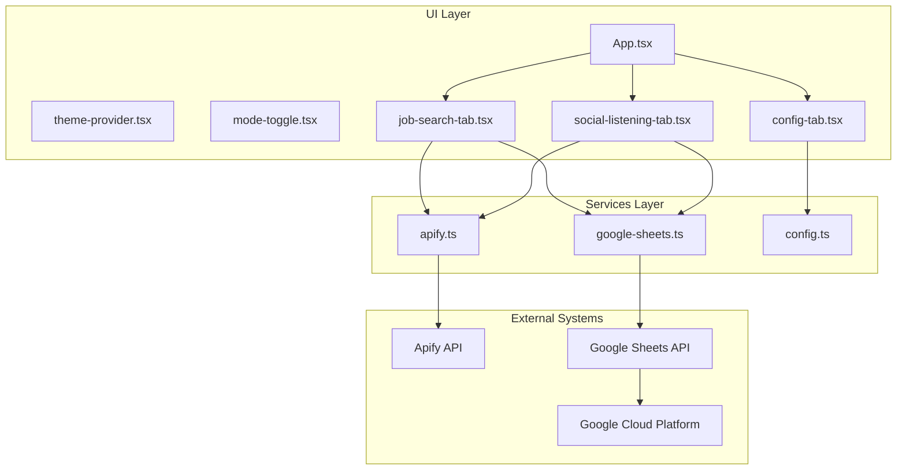
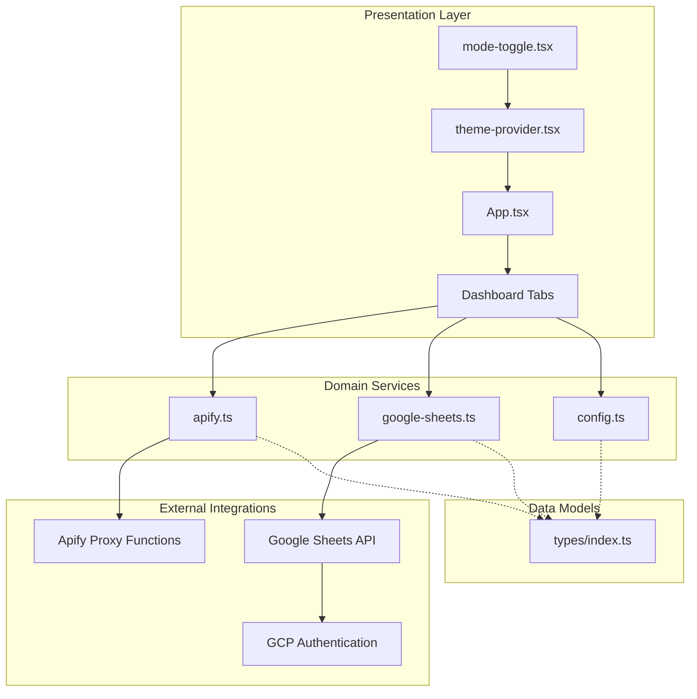
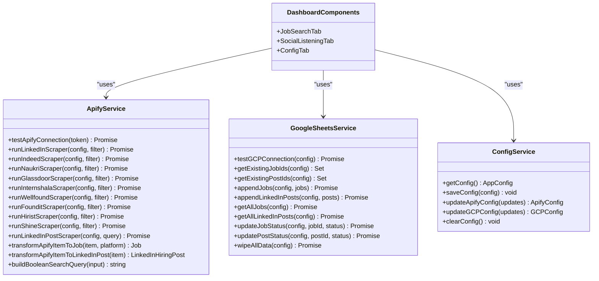
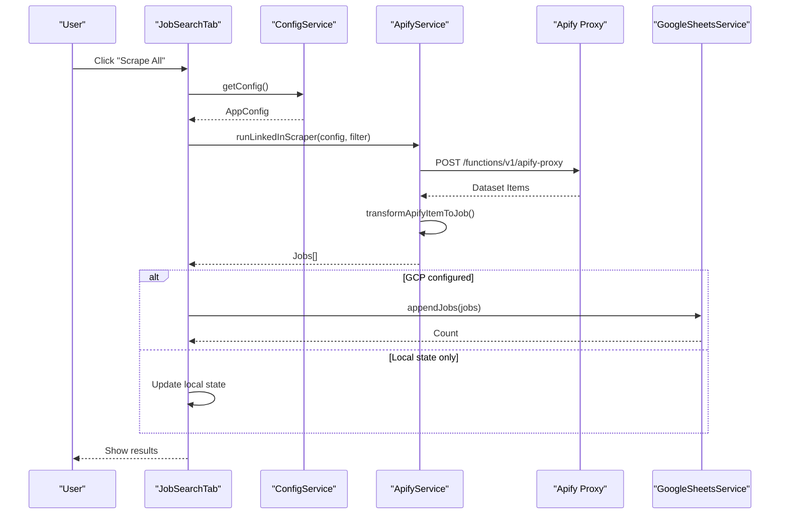
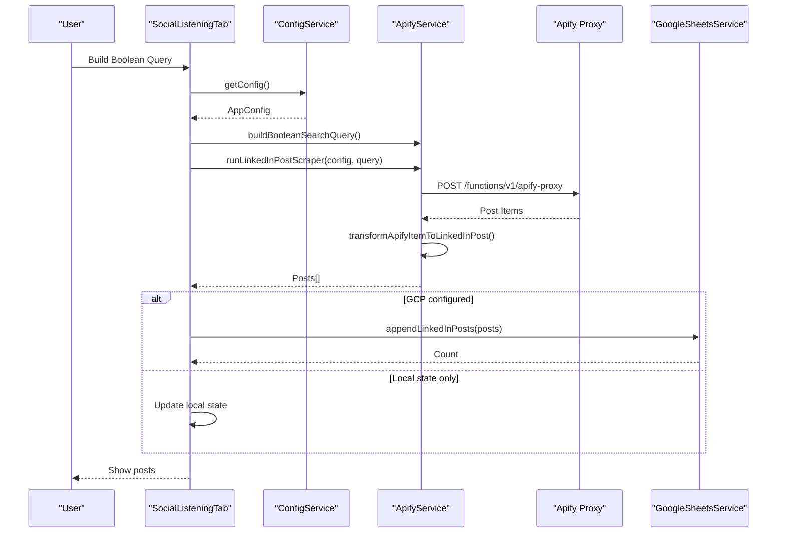
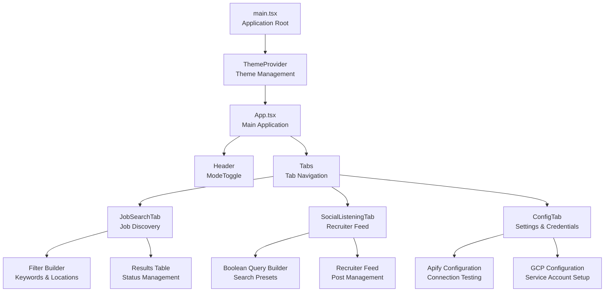
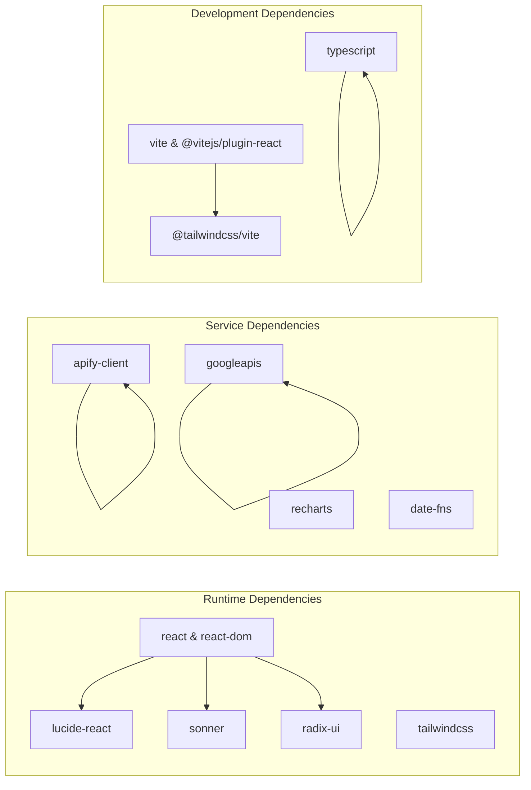

# Architecture Overview

<cite>
**Referenced Files in This Document**
- [App.tsx](file://src/App.tsx)
- [main.tsx](file://src/main.tsx)
- [apify.ts](file://src/services/apify.ts)
- [google-sheets.ts](file://src/services/google-sheets.ts)
- [config.ts](file://src/services/config.ts)
- [job-search-tab.tsx](file://src/components/dashboard/job-search-tab.tsx)
- [social-listening-tab.tsx](file://src/components/dashboard/social-listening-tab.tsx)
- [config-tab.tsx](file://src/components/dashboard/config-tab.tsx)
- [types/index.ts](file://src/types/index.ts)
- [theme-provider.tsx](file://src/components/theme-provider.tsx)
- [mode-toggle.tsx](file://src/components/mode-toggle.tsx)
- [vite.config.ts](file://vite.config.ts)
- [package.json](file://package.json)
</cite>

## Table of Contents
1. [Introduction](#introduction)
2. [Project Structure](#project-structure)
3. [Core Components](#core-components)
4. [Architecture Overview](#architecture-overview)
5. [Detailed Component Analysis](#detailed-component-analysis)
6. [Dependency Analysis](#dependency-analysis)
7. [Performance Considerations](#performance-considerations)
8. [Security Considerations](#security-considerations)
9. [Scalability Considerations](#scalability-considerations)
10. [Troubleshooting Guide](#troubleshooting-guide)
11. [Conclusion](#conclusion)

## Introduction
HuntSync AI is a React-based job search and social listening dashboard designed to aggregate job postings from multiple sources and track hiring signals on LinkedIn. The system follows a service-oriented architecture with clear separation between the UI layer, service layer, and external integrations. It integrates with Apify for web scraping and Google Sheets for persistent data storage, while maintaining a responsive UI built with modern React patterns and a theming provider.

## Project Structure
The project is organized around a clear separation of concerns:
- UI Layer: React components under src/components, including dashboard tabs and reusable UI primitives
- Services Layer: Encapsulated business logic for external integrations under src/services
- Types: Shared TypeScript interfaces and enums under src/types
- Application Entry: Root component rendering and theming provider setup
- Tooling: Vite configuration and Tailwind CSS integration

**Diagram sources**
- [App.tsx:12-63](file://src/App.tsx#L12-L63)
- [apify.ts:1-348](file://src/services/apify.ts#L1-L348)
- [google-sheets.ts:1-354](file://src/services/google-sheets.ts#L1-L354)
- [config.ts:1-66](file://src/services/config.ts#L1-L66)

**Section sources**
- [vite.config.ts:1-15](file://vite.config.ts#L1-L15)
- [package.json:1-48](file://package.json#L1-L48)

## Core Components
The system centers around three primary dashboard tabs that expose distinct functionality while sharing common services and data models:

- Job Search Tab: Provides filtering capabilities, scraping orchestration across multiple job boards, and job listing management with status updates
- Social Listening Tab: Enables construction of boolean search queries to discover hiring posts and manage recruiter feed status
- Configuration Tab: Manages Apify and Google Sheets credentials, connection testing, and destructive operations

Shared services handle:
- Apify integration for web scraping job listings and LinkedIn posts
- Google Sheets API for data persistence and retrieval
- Local configuration management with localStorage

**Section sources**
- [job-search-tab.tsx:73-522](file://src/components/dashboard/job-search-tab.tsx#L73-L522)
- [social-listening-tab.tsx:36-275](file://src/components/dashboard/social-listening-tab.tsx#L36-L275)
- [config-tab.tsx:28-501](file://src/components/dashboard/config-tab.tsx#L28-L501)

## Architecture Overview
The architecture employs a layered pattern with explicit boundaries between UI, services, and external systems:

**Diagram sources**
- [App.tsx:12-63](file://src/App.tsx#L12-L63)
- [theme-provider.tsx:80-220](file://src/components/theme-provider.tsx#L80-L220)
- [apify.ts:1-348](file://src/services/apify.ts#L1-L348)
- [google-sheets.ts:1-354](file://src/services/google-sheets.ts#L1-L354)
- [config.ts:1-66](file://src/services/config.ts#L1-L66)
- [types/index.ts:1-159](file://src/types/index.ts#L1-L159)

## Detailed Component Analysis

### Service Layer Pattern
The service layer encapsulates all external integrations and business logic:

**Diagram sources**
- [apify.ts:25-348](file://src/services/apify.ts#L25-L348)
- [google-sheets.ts:104-354](file://src/services/google-sheets.ts#L104-L354)
- [config.ts:26-66](file://src/services/config.ts#L26-L66)
- [job-search-tab.tsx:73-522](file://src/components/dashboard/job-search-tab.tsx#L73-L522)
- [social-listening-tab.tsx:36-275](file://src/components/dashboard/social-listening-tab.tsx#L36-L275)
- [config-tab.tsx:28-501](file://src/components/dashboard/config-tab.tsx#L28-L501)

### Data Flow: Job Scraping Pipeline
The job scraping process demonstrates the service-oriented architecture:

**Diagram sources**
- [job-search-tab.tsx:160-230](file://src/components/dashboard/job-search-tab.tsx#L160-L230)
- [apify.ts:84-146](file://src/services/apify.ts#L84-L146)
- [google-sheets.ts:162-200](file://src/services/google-sheets.ts#L162-L200)

### Data Flow: Social Listening Pipeline
The social listening workflow follows similar patterns:

**Diagram sources**
- [social-listening-tab.tsx:62-95](file://src/components/dashboard/social-listening-tab.tsx#L62-L95)
- [apify.ts:289-347](file://src/services/apify.ts#L289-L347)
- [google-sheets.ts:202-236](file://src/services/google-sheets.ts#L202-L236)

### Component Hierarchy Starting from App.tsx
The component hierarchy demonstrates React's composition pattern:

**Diagram sources**
- [main.tsx:8-14](file://src/main.tsx#L8-L14)
- [App.tsx:12-63](file://src/App.tsx#L12-L63)
- [job-search-tab.tsx:247-521](file://src/components/dashboard/job-search-tab.tsx#L247-L521)
- [social-listening-tab.tsx:127-274](file://src/components/dashboard/social-listening-tab.tsx#L127-L274)
- [config-tab.tsx:118-501](file://src/components/dashboard/config-tab.tsx#L118-L501)

**Section sources**
- [main.tsx:1-15](file://src/main.tsx#L1-L15)
- [App.tsx:1-67](file://src/App.tsx#L1-L67)

## Dependency Analysis
The system maintains clean dependencies through TypeScript interfaces and modular service design:

**Diagram sources**
- [package.json:12-37](file://package.json#L12-L37)

**Section sources**
- [package.json:1-48](file://package.json#L1-L48)

## Performance Considerations
The system incorporates several performance optimizations:

- **Caching Strategy**: Google Sheets service caches access tokens with expiry management to minimize authentication overhead
- **Conditional Rendering**: Components render loading states and skeleton UI during asynchronous operations
- **Efficient Data Updates**: Batch operations for appending data to Google Sheets reduce API calls
- **Local State Management**: Filtering and UI state remain client-side to minimize network requests
- **Resource Loading**: Lazy loading patterns through React component composition

## Security Considerations
Security is addressed through multiple layers:

- **Configuration Storage**: Sensitive credentials are stored in localStorage with optional visibility toggles
- **Access Token Management**: Google Sheets API uses JWT-based authentication with proper key handling
- **Connection Testing**: Separate test endpoints validate external service connectivity without exposing secrets
- **Authorization Headers**: Proper OAuth2 token injection for external API calls
- **Environment Separation**: Supabase Edge Function proxy prevents direct exposure of Apify tokens

## Scalability Considerations
The architecture supports horizontal and vertical scaling:

- **Service Isolation**: Each external integration is encapsulated in dedicated services, enabling independent scaling
- **Batch Operations**: Google Sheets batch appends reduce API call frequency
- **Modular Components**: Dashboard tabs can be independently optimized and scaled
- **Caching Strategy**: Token caching reduces repeated authentication overhead
- **Asynchronous Processing**: Long-running scraping operations don't block the UI thread

## Troubleshooting Guide
Common issues and resolution strategies:

**Apify Connection Issues**
- Verify API token configuration in the Configuration tab
- Test connection using the built-in connection tester
- Check Apify actor IDs and ensure proper permissions

**Google Sheets Integration Problems**
- Confirm service account JSON key validity and private key presence
- Verify spreadsheet ID format and accessibility
- Ensure proper sharing permissions for the service account email
- Check token expiration and cache invalidation

**Data Persistence Issues**
- Use the wipe operation to reset corrupted data states
- Verify unique job ID generation and deduplication logic
- Monitor API rate limits and implement retry strategies

**UI State Synchronization**
- Local filters persist in localStorage for session continuity
- Theme preferences sync across browser tabs via localStorage events
- Toast notifications provide immediate feedback for user actions

**Section sources**
- [config-tab.tsx:43-89](file://src/components/dashboard/config-tab.tsx#L43-L89)
- [google-sheets.ts:104-119](file://src/services/google-sheets.ts#L104-L119)
- [apify.ts:25-42](file://src/services/apify.ts#L25-L42)

## Conclusion
HuntSync AI demonstrates a well-structured React application with clear service layer boundaries and robust integration patterns. The architecture successfully separates concerns between UI presentation, business logic encapsulation, and external system integration. The service-oriented design enables maintainability, testability, and future extensibility while providing a responsive user experience through thoughtful component composition and state management.

The system's modular approach to configuration management, data persistence, and external API integration creates a solid foundation for continued development and enhancement of job discovery and social listening capabilities.