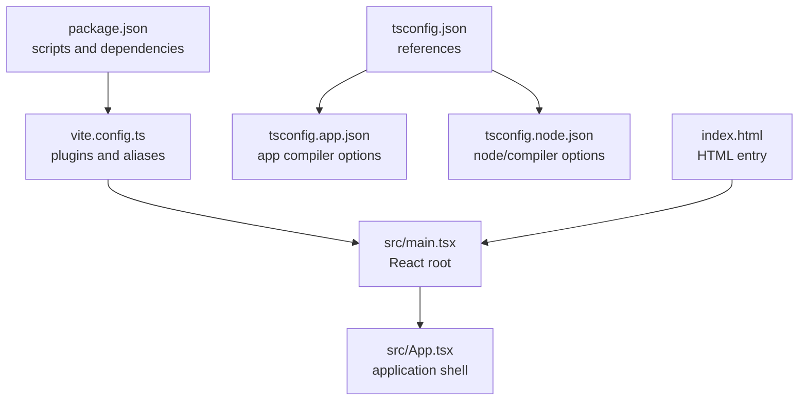
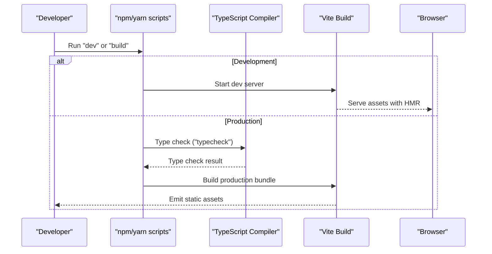
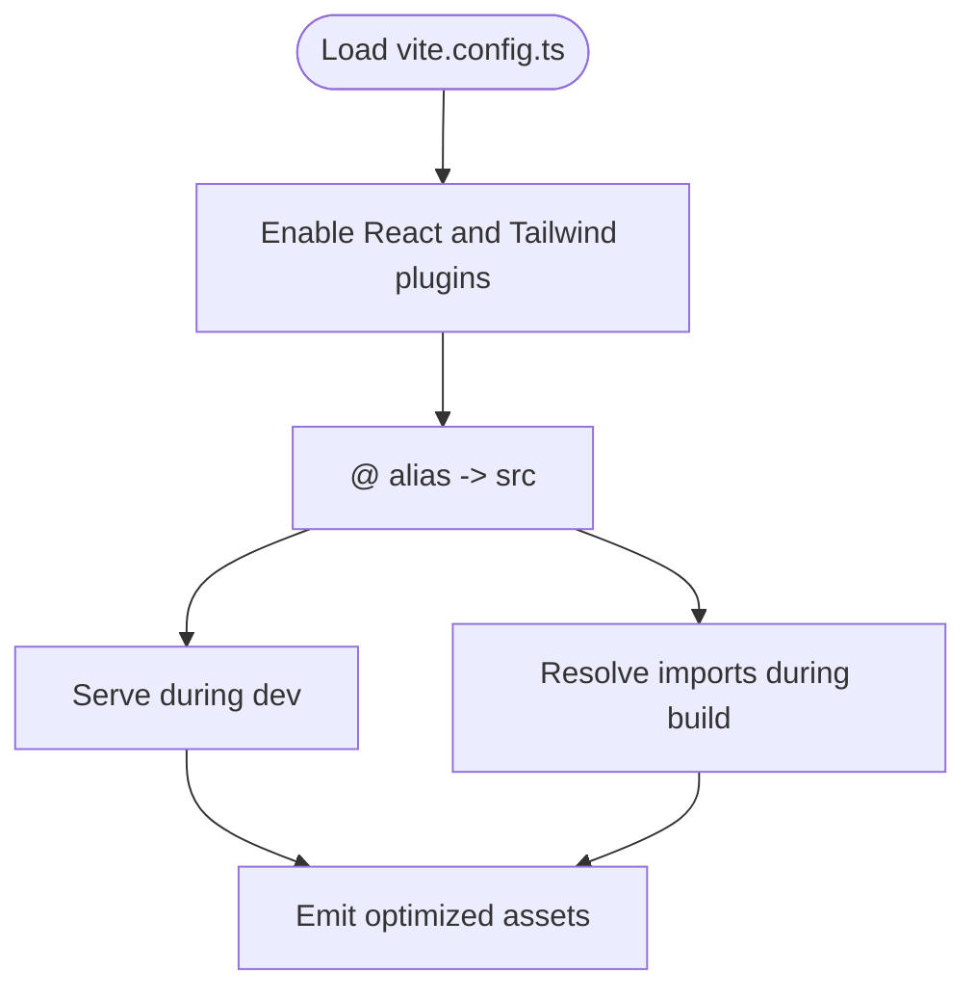
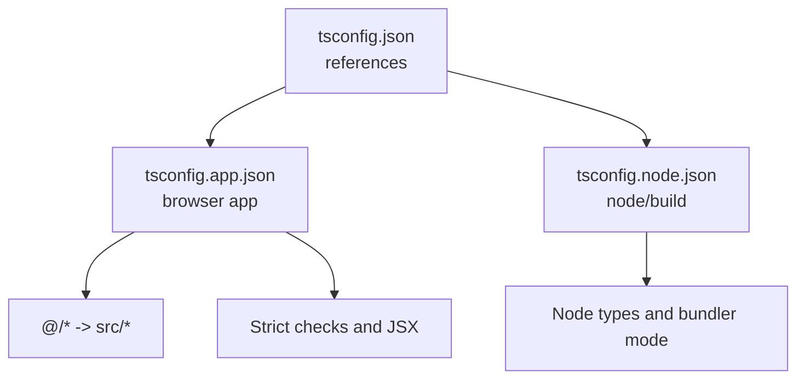
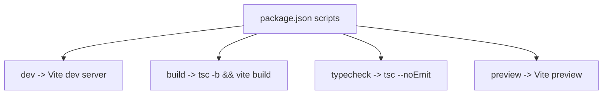
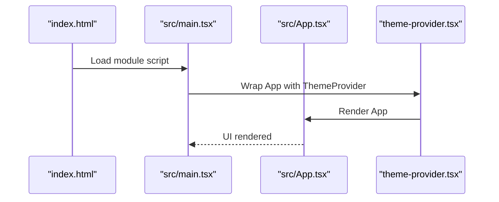
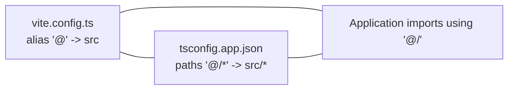
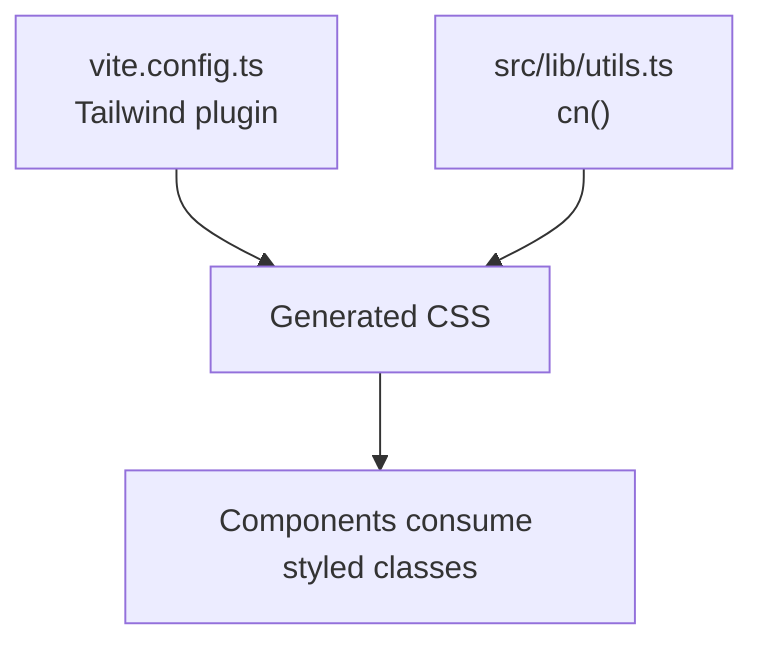
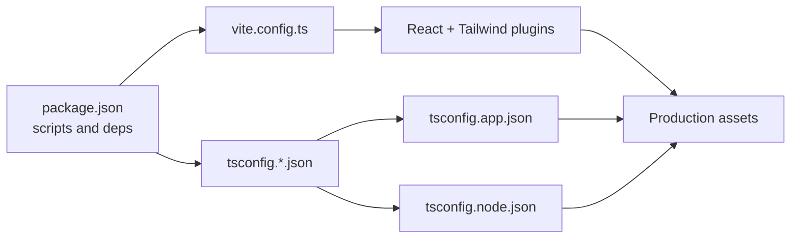

# Build and Deployment

<cite>
**Referenced Files in This Document**
- [package.json](file://package.json)
- [vite.config.ts](file://vite.config.ts)
- [tsconfig.json](file://tsconfig.json)
- [tsconfig.app.json](file://tsconfig.app.json)
- [tsconfig.node.json](file://tsconfig.node.json)
- [index.html](file://index.html)
- [src/main.tsx](file://src/main.tsx)
- [src/App.tsx](file://src/App.tsx)
- [src/components/theme-provider.tsx](file://src/components/theme-provider.tsx)
- [src/lib/utils.ts](file://src/lib/utils.ts)
</cite>

## Table of Contents
1. [Introduction](#introduction)
2. [Project Structure](#project-structure)
3. [Core Components](#core-components)
4. [Architecture Overview](#architecture-overview)
5. [Detailed Component Analysis](#detailed-component-analysis)
6. [Dependency Analysis](#dependency-analysis)
7. [Performance Considerations](#performance-considerations)
8. [Troubleshooting Guide](#troubleshooting-guide)
9. [Conclusion](#conclusion)
10. [Appendices](#appendices)

## Introduction
This document explains the build and deployment process for the project, focusing on the Vite build configuration, TypeScript compilation and path mapping, type checking workflows, build scripts, environment handling, and production preparation. It also outlines deployment strategies, CI/CD integration approaches, performance optimization techniques, and troubleshooting best practices.

## Project Structure
The project uses a modern frontend stack with Vite for bundling and development, TypeScript for type safety, and Tailwind CSS v4 via the Vite plugin for styling. The configuration is split across multiple TypeScript configuration files and a single Vite configuration file. The HTML entry point mounts the React application, which is organized under a dedicated source directory with path aliases.

**Diagram sources**
- [package.json:1-48](file://package.json#L1-L48)
- [vite.config.ts:1-15](file://vite.config.ts#L1-L15)
- [tsconfig.json:1-14](file://tsconfig.json#L1-L14)
- [tsconfig.app.json:1-33](file://tsconfig.app.json#L1-L33)
- [tsconfig.node.json:1-27](file://tsconfig.node.json#L1-L27)
- [index.html:1-14](file://index.html#L1-L14)
- [src/main.tsx:1-15](file://src/main.tsx#L1-L15)
- [src/App.tsx:1-67](file://src/App.tsx#L1-L67)

**Section sources**
- [package.json:1-48](file://package.json#L1-L48)
- [vite.config.ts:1-15](file://vite.config.ts#L1-L15)
- [tsconfig.json:1-14](file://tsconfig.json#L1-L14)
- [tsconfig.app.json:1-33](file://tsconfig.app.json#L1-L33)
- [tsconfig.node.json:1-27](file://tsconfig.node.json#L1-L27)
- [index.html:1-14](file://index.html#L1-L14)
- [src/main.tsx:1-15](file://src/main.tsx#L1-L15)
- [src/App.tsx:1-67](file://src/App.tsx#L1-L67)

## Core Components
- Vite configuration defines plugins and path aliases for efficient development and optimized production builds.
- TypeScript configuration splits app and node environments with strict compiler options and bundler-aware settings.
- Build scripts orchestrate type checking and Vite builds, enabling local development, production builds, and previewing.

Key responsibilities:
- Vite: development server, HMR, asset handling, and production bundling.
- TypeScript: type checking, module resolution, and path mapping.
- Scripts: dev, build, typecheck, and preview commands.

**Section sources**
- [vite.config.ts:1-15](file://vite.config.ts#L1-L15)
- [tsconfig.app.json:1-33](file://tsconfig.app.json#L1-L33)
- [tsconfig.node.json:1-27](file://tsconfig.node.json#L1-L27)
- [package.json:6-11](file://package.json#L6-L11)

## Architecture Overview
The build pipeline integrates TypeScript compilation with Vite bundling. The HTML entry point loads the compiled script, while Vite resolves aliases and applies plugins for React and Tailwind CSS.

**Diagram sources**
- [package.json:6-11](file://package.json#L6-L11)
- [vite.config.ts:1-15](file://vite.config.ts#L1-L15)
- [index.html:1-14](file://index.html#L1-L14)

## Detailed Component Analysis

### Vite Configuration
- Plugins: React and Tailwind CSS v4 plugin are enabled for JSX transform and CSS generation.
- Path alias: The "@" alias maps to the src directory, simplifying imports across the codebase.
- Purpose: Streamlines development ergonomics and ensures consistent asset handling for production.

**Diagram sources**
- [vite.config.ts:1-15](file://vite.config.ts#L1-L15)

**Section sources**
- [vite.config.ts:1-15](file://vite.config.ts#L1-L15)

### TypeScript Configuration
- Root references two projects: app and node, enabling separate compiler options per environment.
- App configuration:
  - Targets modern JS environments and DOM APIs.
  - Uses bundler-aware module resolution and JSX transform.
  - Enforces strictness and unused checks.
  - Includes path mapping for "@/*".
- Node configuration:
  - Targets Node runtime and enables bundler-aware settings.
  - Includes Vite config for type-aware bundling.
- Purpose: Ensures accurate type checking and module resolution for both browser and build-time code.

**Diagram sources**
- [tsconfig.json:1-14](file://tsconfig.json#L1-L14)
- [tsconfig.app.json:1-33](file://tsconfig.app.json#L1-L33)
- [tsconfig.node.json:1-27](file://tsconfig.node.json#L1-L27)

**Section sources**
- [tsconfig.json:1-14](file://tsconfig.json#L1-L14)
- [tsconfig.app.json:1-33](file://tsconfig.app.json#L1-L33)
- [tsconfig.node.json:1-27](file://tsconfig.node.json#L1-L27)

### Build Scripts
- dev: Starts the Vite development server for interactive development and hot module replacement.
- build: Runs TypeScript project references followed by a Vite production build.
- typecheck: Executes TypeScript without emitting outputs to validate types locally.
- preview: Serves the production build locally for verification.

**Diagram sources**
- [package.json:6-11](file://package.json#L6-L11)

**Section sources**
- [package.json:6-11](file://package.json#L6-L11)

### HTML Entry Point and Application Bootstrap
- The HTML file defines the root element and loads the module script pointing to the main entry.
- The main entry initializes the React root, applies theme provider, and renders the App component.

**Diagram sources**
- [index.html:1-14](file://index.html#L1-L14)
- [src/main.tsx:1-15](file://src/main.tsx#L1-L15)
- [src/App.tsx:1-67](file://src/App.tsx#L1-L67)
- [src/components/theme-provider.tsx:1-231](file://src/components/theme-provider.tsx#L1-L231)

**Section sources**
- [index.html:1-14](file://index.html#L1-L14)
- [src/main.tsx:1-15](file://src/main.tsx#L1-L15)
- [src/App.tsx:1-67](file://src/App.tsx#L1-L67)
- [src/components/theme-provider.tsx:1-231](file://src/components/theme-provider.tsx#L1-L231)

### Path Mapping and Import Aliases
- Both Vite and TypeScript configurations define the "@" alias to the src directory.
- This enables concise imports across the application, improving readability and maintainability.

**Diagram sources**
- [vite.config.ts:9-13](file://vite.config.ts#L9-L13)
- [tsconfig.app.json:27-29](file://tsconfig.app.json#L27-L29)
- [tsconfig.json:8-12](file://tsconfig.json#L8-L12)

**Section sources**
- [vite.config.ts:9-13](file://vite.config.ts#L9-L13)
- [tsconfig.app.json:27-29](file://tsconfig.app.json#L27-L29)
- [tsconfig.json:8-12](file://tsconfig.json#L8-L12)

### Environment Variables and Build-Time Constants
- Vite exposes environment variables prefixed with VITE_ at build time. Non-prefixed variables are not injected into the client bundle.
- Recommended practice: Prefix all client-facing environment variables with VITE_ to ensure availability in the browser.
- For secrets or server-side values, avoid injecting them into the client bundle.

[No sources needed since this section provides general guidance]

### Asset Handling and CSS Pipeline
- Tailwind CSS v4 is integrated via the Vite plugin, enabling JIT-style CSS generation and purging.
- Utility functions demonstrate Tailwind class merging patterns used across components.

**Diagram sources**
- [vite.config.ts:2-2](file://vite.config.ts#L2-L2)
- [src/lib/utils.ts:1-7](file://src/lib/utils.ts#L1-L7)

**Section sources**
- [vite.config.ts:2-2](file://vite.config.ts#L2-L2)
- [src/lib/utils.ts:1-7](file://src/lib/utils.ts#L1-L7)

### Production Optimizations
- Vite performs tree-shaking, minification, and asset optimization by default in production builds.
- Keep module resolution and bundler mode consistent with TypeScript settings to avoid duplicate modules and improve cacheability.
- Prefer dynamic imports for large optional features to reduce initial bundle size.

[No sources needed since this section provides general guidance]

### Bundle Analysis and Profiling
- Use Vite’s built-in preview server after building to inspect the generated assets.
- Consider integrating a third-party bundle analyzer for deeper insights into module sizes and dependencies.

[No sources needed since this section provides general guidance]

### Deployment Preparation
- Build artifacts are emitted to the default dist directory by Vite.
- Verify the preview server locally before deploying.
- Ensure environment variables are configured appropriately for the target platform.

[No sources needed since this section provides general guidance]

### Deployment Strategies and CI/CD Integration
- Static hosting: Deploy the dist folder to platforms supporting static sites.
- Server-side rendering: If adopting SSR later, integrate a compatible adapter and configure server entry points accordingly.
- CI/CD: Add jobs to run typecheck, build, and preview verification. Cache node_modules and Vite/TSC build artifacts to speed up pipelines.

[No sources needed since this section provides general guidance]

## Dependency Analysis
The build relies on Vite and TypeScript working in tandem, with Tailwind CSS v4 plugin enhancing the styling pipeline. The React plugin accelerates development and HMR.

**Diagram sources**
- [package.json:1-48](file://package.json#L1-L48)
- [vite.config.ts:1-15](file://vite.config.ts#L1-L15)
- [tsconfig.app.json:1-33](file://tsconfig.app.json#L1-L33)
- [tsconfig.node.json:1-27](file://tsconfig.node.json#L1-L27)

**Section sources**
- [package.json:1-48](file://package.json#L1-L48)
- [vite.config.ts:1-15](file://vite.config.ts#L1-L15)
- [tsconfig.app.json:1-33](file://tsconfig.app.json#L1-L33)
- [tsconfig.node.json:1-27](file://tsconfig.node.json#L1-L27)

## Performance Considerations
- Keep module resolution consistent between Vite and TypeScript to prevent duplicate modules.
- Use dynamic imports for heavy features to reduce initial load.
- Leverage Tailwind’s purge and minification in production.
- Monitor bundle composition and remove unused dependencies regularly.

[No sources needed since this section provides general guidance]

## Troubleshooting Guide
Common issues and resolutions:
- Missing VITE_ prefix for environment variables: Ensure all client-facing variables are prefixed with VITE_ so they are injected at build time.
- Path alias errors: Confirm that both Vite and TypeScript configs define the "@" alias consistently.
- Type errors blocking build: Run the typecheck script locally to catch issues early.
- Unexpected CSS or styling regressions: Verify Tailwind plugin is enabled and Tailwind directives are present in styles.
- Preview differs from dev: Use the preview command to confirm production behavior matches expectations.

**Section sources**
- [package.json:6-11](file://package.json#L6-L11)
- [vite.config.ts:9-13](file://vite.config.ts#L9-L13)
- [tsconfig.app.json:27-29](file://tsconfig.app.json#L27-L29)
- [tsconfig.json:8-12](file://tsconfig.json#L8-L12)

## Conclusion
The project’s build system combines Vite and TypeScript with Tailwind CSS to deliver a fast, type-safe, and maintainable frontend. By aligning configuration across Vite and TypeScript, leveraging the provided scripts, and following the recommended practices, teams can achieve reliable development workflows and robust deployments.

## Appendices
- Best practices summary:
  - Prefix environment variables with VITE_ for client consumption.
  - Keep path aliases synchronized between Vite and TypeScript.
  - Run typecheck locally and in CI to prevent runtime surprises.
  - Use preview to validate production builds.
  - Adopt dynamic imports and keep dependencies lean.

[No sources needed since this section provides general guidance]