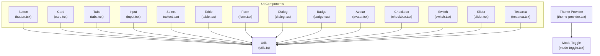
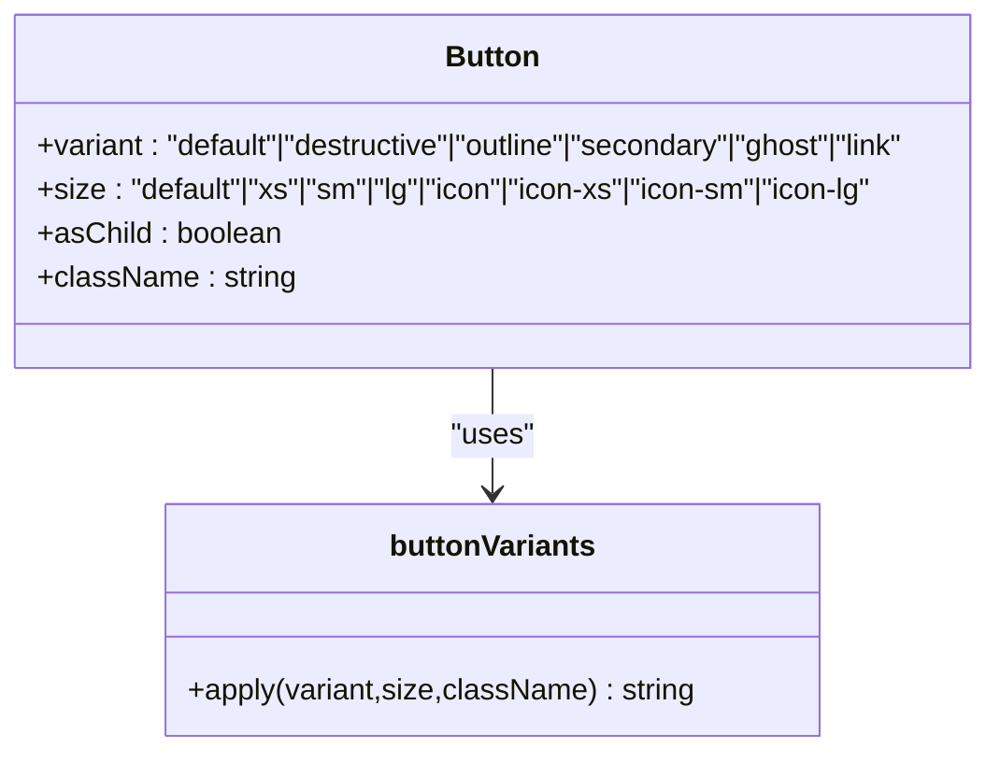
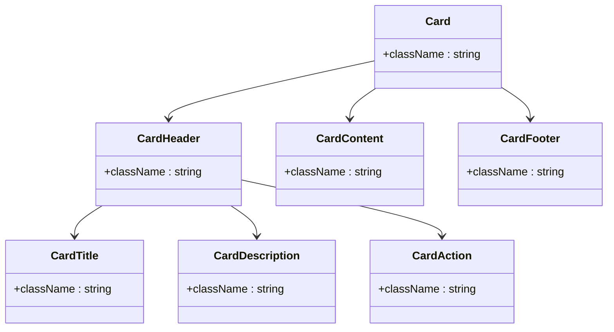
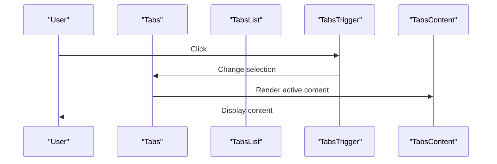
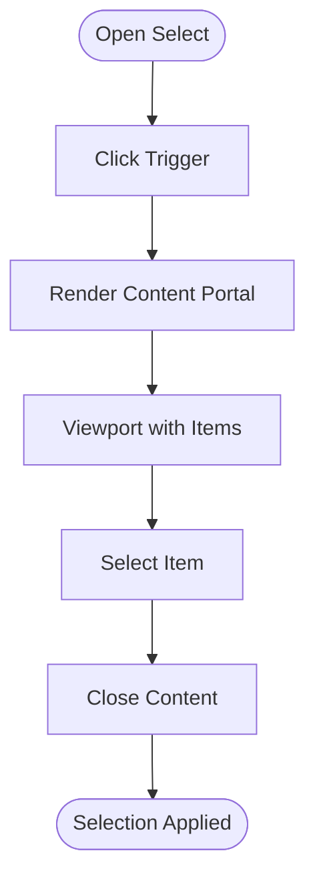
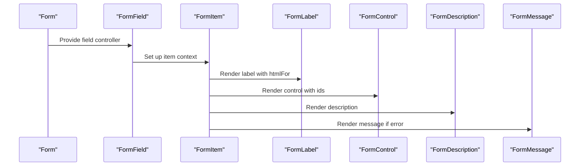
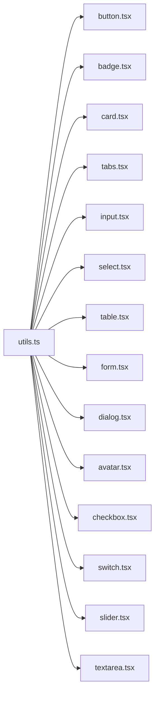

# Component Library

<cite>
**Referenced Files in This Document**
- [button.tsx](file://src/components/ui/button.tsx)
- [card.tsx](file://src/components/ui/card.tsx)
- [tabs.tsx](file://src/components/ui/tabs.tsx)
- [input.tsx](file://src/components/ui/input.tsx)
- [select.tsx](file://src/components/ui/select.tsx)
- [table.tsx](file://src/components/ui/table.tsx)
- [form.tsx](file://src/components/ui/form.tsx)
- [dialog.tsx](file://src/components/ui/dialog.tsx)
- [badge.tsx](file://src/components/ui/badge.tsx)
- [avatar.tsx](file://src/components/ui/avatar.tsx)
- [checkbox.tsx](file://src/components/ui/checkbox.tsx)
- [switch.tsx](file://src/components/ui/switch.tsx)
- [slider.tsx](file://src/components/ui/slider.tsx)
- [textarea.tsx](file://src/components/ui/textarea.tsx)
- [utils.ts](file://src/lib/utils.ts)
- [theme-provider.tsx](file://src/components/theme-provider.tsx)
- [mode-toggle.tsx](file://src/components/mode-toggle.tsx)
- [use-mobile.ts](file://src/hooks/use-mobile.ts)
- [index.css](file://src/index.css)
- [package.json](file://package.json)
</cite>

## Table of Contents
1. [Introduction](#introduction)
2. [Project Structure](#project-structure)
3. [Core Components](#core-components)
4. [Architecture Overview](#architecture-overview)
5. [Detailed Component Analysis](#detailed-component-analysis)
6. [Dependency Analysis](#dependency-analysis)
7. [Performance Considerations](#performance-considerations)
8. [Troubleshooting Guide](#troubleshooting-guide)
9. [Conclusion](#conclusion)
10. [Appendices](#appendices)

## Introduction
This document describes a comprehensive UI component library built on Radix UI primitives and styled with Tailwind CSS. It covers component APIs, composition patterns, accessibility, responsive behavior, theming (light/dark mode), and extension guidelines. The library emphasizes:
- Consistent styling via Tailwind utilities and a shared cn() merge utility
- Variants and sizes powered by class-variance-authority (CVA)
- Semantic data attributes for testing and styling hooks
- Accessibility through Radix UI’s primitives and proper ARIA attributes
- Responsive design using container queries and responsive breakpoints

## Project Structure
The UI components live under src/components/ui and are composed with:
- Radix UI primitives for behavior and accessibility
- Tailwind CSS for styling
- class-variance-authority for variant-driven styles
- A shared cn() utility for safe class merging

**Diagram sources**
- [button.tsx:1-65](file://src/components/ui/button.tsx#L1-L65)
- [card.tsx:1-93](file://src/components/ui/card.tsx#L1-L93)
- [tabs.tsx:1-92](file://src/components/ui/tabs.tsx#L1-L92)
- [input.tsx:1-22](file://src/components/ui/input.tsx#L1-L22)
- [select.tsx:1-191](file://src/components/ui/select.tsx#L1-L191)
- [table.tsx:1-117](file://src/components/ui/table.tsx#L1-L117)
- [form.tsx:1-166](file://src/components/ui/form.tsx#L1-L166)
- [dialog.tsx:1-157](file://src/components/ui/dialog.tsx#L1-L157)
- [badge.tsx:1-49](file://src/components/ui/badge.tsx#L1-L49)
- [avatar.tsx:1-110](file://src/components/ui/avatar.tsx#L1-L110)
- [checkbox.tsx:1-33](file://src/components/ui/checkbox.tsx#L1-L33)
- [switch.tsx:1-34](file://src/components/ui/switch.tsx#L1-L34)
- [slider.tsx:1-62](file://src/components/ui/slider.tsx#L1-L62)
- [textarea.tsx:1-19](file://src/components/ui/textarea.tsx#L1-L19)
- [utils.ts:1-7](file://src/lib/utils.ts#L1-L7)
- [theme-provider.tsx](file://src/components/theme-provider.tsx)
- [mode-toggle.tsx](file://src/components/mode-toggle.tsx)

**Section sources**
- [button.tsx:1-65](file://src/components/ui/button.tsx#L1-L65)
- [card.tsx:1-93](file://src/components/ui/card.tsx#L1-L93)
- [tabs.tsx:1-92](file://src/components/ui/tabs.tsx#L1-L92)
- [input.tsx:1-22](file://src/components/ui/input.tsx#L1-L22)
- [select.tsx:1-191](file://src/components/ui/select.tsx#L1-L191)
- [table.tsx:1-117](file://src/components/ui/table.tsx#L1-L117)
- [form.tsx:1-166](file://src/components/ui/form.tsx#L1-L166)
- [dialog.tsx:1-157](file://src/components/ui/dialog.tsx#L1-L157)
- [badge.tsx:1-49](file://src/components/ui/badge.tsx#L1-L49)
- [avatar.tsx:1-110](file://src/components/ui/avatar.tsx#L1-L110)
- [checkbox.tsx:1-33](file://src/components/ui/checkbox.tsx#L1-L33)
- [switch.tsx:1-34](file://src/components/ui/switch.tsx#L1-L34)
- [slider.tsx:1-62](file://src/components/ui/slider.tsx#L1-L62)
- [textarea.tsx:1-19](file://src/components/ui/textarea.tsx#L1-L19)
- [utils.ts:1-7](file://src/lib/utils.ts#L1-L7)

## Core Components
This section documents the primary UI components included in the library, focusing on props, attributes, events, and customization options.

- Button
  - Purpose: Action primatives with variants and sizes.
  - Props:
    - variant: "default" | "destructive" | "outline" | "secondary" | "ghost" | "link"
    - size: "default" | "xs" | "sm" | "lg" | "icon" | "icon-xs" | "icon-sm" | "icon-lg"
    - asChild: boolean (renders as a slot root)
    - Inherits button attributes (e.g., type, disabled, onClick)
  - Attributes:
    - data-slot="button"
    - data-variant, data-size
  - Events:
    - Standard button events (onClick, onKeyDown, onFocus, onBlur)
  - Accessibility:
    - Focus-visible ring and outline
    - Disabled state handled
  - Customization:
    - Extend variants/sizes via buttonVariants CVA
    - Override className for additional styles

- Card
  - Purpose: Content containers with header, title, description, action, content, and footer slots.
  - Props:
    - className for each subcomponent
  - Attributes:
    - data-slot on each subcomponent
  - Composition:
    - Card > CardHeader > CardTitle, CardDescription, CardAction
    - Card > CardContent
    - Card > CardFooter
  - Accessibility:
    - No explicit ARIA roles; relies on semantic HTML
  - Customization:
    - Modify Tailwind classes per subcomponent

- Tabs
  - Purpose: Tabbed interface with list and triggers.
  - Props:
    - orientation: "horizontal" | "vertical"
    - variant: "default" | "line" (on TabsList)
  - Attributes:
    - data-slot on each part
    - data-orientation
    - data-variant
  - Events:
    - Radix UI Tabs events (selection change)
  - Accessibility:
    - Uses Radix UI Tabs primitives
  - Customization:
    - Variant styling via tabsListVariants CVA

- Input
  - Purpose: Single-line text input.
  - Props:
    - type: input type
    - Inherits input attributes (value, onChange, placeholder)
  - Attributes:
    - data-slot="input"
  - Accessibility:
    - Focus-visible ring and invalid state styling
  - Customization:
    - Add icons or adornments via wrapper composition

- Select
  - Purpose: Dropdown selection with trigger, content, items, and scroll buttons.
  - Props:
    - Trigger: size "sm" | "default"
    - Content: position "item-aligned" | "popper", align "center"
    - Others: Root, Group, Value, Label, Item, Separator, ScrollUp/DownButton
  - Attributes:
    - data-slot on each part
    - data-size on trigger
  - Accessibility:
    - Uses Radix UI Select primitives
  - Customization:
    - Adjust sizing and alignment via props
    - Customize item layout with children

- Table
  - Purpose: Scrollable table with container wrapper and semantic parts.
  - Props:
    - className for each part
  - Attributes:
    - data-slot on each part
  - Accessibility:
    - Uses native table semantics
  - Customization:
    - Tailwind classes for rows, cells, headers

- Form
  - Purpose: Integration with react-hook-form for labels, controls, descriptions, and messages.
  - Components:
    - Form (provider), FormField, FormItem
    - FormLabel, FormControl, FormDescription, FormMessage
  - Hooks:
    - useFormField
  - Accessibility:
    - Links labels to controls via ids and aria-describedby/invalid
  - Customization:
    - Compose with any input component (Input, Textarea, Select, etc.)

- Dialog
  - Purpose: Modal overlay with close button and optional footer.
  - Props:
    - showCloseButton: boolean
    - Content: inherits Radix Dialog Content props
  - Attributes:
    - data-slot on each part
  - Accessibility:
    - Overlay and focus trapping via Radix UI
  - Customization:
    - Control close button visibility and layout

- Badge
  - Purpose: Label or indicator with variants.
  - Props:
    - variant: "default" | "secondary" | "destructive" | "outline" | "ghost" | "link"
    - asChild: boolean
  - Attributes:
    - data-slot="badge"
    - data-variant
  - Customization:
    - Extend variants via badgeVariants CVA

- Avatar
  - Purpose: User identity with image, fallback, badge, and grouping.
  - Props:
    - size: "default" | "sm" | "lg"
  - Attributes:
    - data-slot on each part
    - data-size on root and group
  - Accessibility:
    - No explicit ARIA roles
  - Customization:
    - Size variants and group spacing

- Checkbox
  - Purpose: Binary selection with check indicator.
  - Props:
    - Inherits Radix UI Checkbox props
  - Attributes:
    - data-slot, data-state
  - Accessibility:
    - Focus-visible ring and invalid state styling

- Switch
  - Purpose: On/off toggle with size option.
  - Props:
    - size: "sm" | "default"
  - Attributes:
    - data-slot, data-size
  - Accessibility:
    - Focus-visible ring

- Slider
  - Purpose: Range slider supporting single and multi-value.
  - Props:
    - defaultValue, value, min, max
  - Attributes:
    - data-slot, data-disabled, data-orientation
  - Accessibility:
    - Keyboard accessible via Radix UI

- Textarea
  - Purpose: Multi-line text input.
  - Props:
    - Inherits textarea attributes
  - Attributes:
    - data-slot
  - Accessibility:
    - Focus-visible ring and invalid state styling

**Section sources**
- [button.tsx:1-65](file://src/components/ui/button.tsx#L1-L65)
- [card.tsx:1-93](file://src/components/ui/card.tsx#L1-L93)
- [tabs.tsx:1-92](file://src/components/ui/tabs.tsx#L1-L92)
- [input.tsx:1-22](file://src/components/ui/input.tsx#L1-L22)
- [select.tsx:1-191](file://src/components/ui/select.tsx#L1-L191)
- [table.tsx:1-117](file://src/components/ui/table.tsx#L1-L117)
- [form.tsx:1-166](file://src/components/ui/form.tsx#L1-L166)
- [dialog.tsx:1-157](file://src/components/ui/dialog.tsx#L1-L157)
- [badge.tsx:1-49](file://src/components/ui/badge.tsx#L1-L49)
- [avatar.tsx:1-110](file://src/components/ui/avatar.tsx#L1-L110)
- [checkbox.tsx:1-33](file://src/components/ui/checkbox.tsx#L1-L33)
- [switch.tsx:1-34](file://src/components/ui/switch.tsx#L1-L34)
- [slider.tsx:1-62](file://src/components/ui/slider.tsx#L1-L62)
- [textarea.tsx:1-19](file://src/components/ui/textarea.tsx#L1-L19)

## Architecture Overview
The component library follows a layered architecture:
- Base primitives: Radix UI primitives provide behavior and accessibility.
- Styling layer: Tailwind utilities and the cn() merge utility ensure consistent, composable styles.
- Variants: class-variance-authority defines variant and size scales for components like Button and Badge.
- Composition: Many components expose subcomponents (e.g., Card, Tabs, Select, Form) enabling structured layouts.
- Theming: Theme provider and mode toggle integrate with light/dark modes.

```mermaid
graph TB
PRIM["Radix UI Primitives"]
CVA["class-variance-authority (CVA)"]
TW["Tailwind CSS"]
CN["cn() Merge Utility<br/>(utils.ts)"]
THEME["Theme Provider<br/>(theme-provider.tsx)"]
MODE["Mode Toggle<br/>(mode-toggle.tsx)"]
PRIM --> BTN["Button"]
PRIM --> TABS["Tabs"]
PRIM --> SELECT["Select"]
PRIM --> DLG["Dialog"]
PRIM --> CHECK["Checkbox"]
PRIM --> SWITCH["Switch"]
PRIM --> SLIDER["Slider"]
CVA --> BTN
CVA --> BADGE["Badge"]
TW --> BTN
TW --> CARD["Card"]
TW --> TABS
TW --> SELECT
TW --> TABLE["Table"]
TW --> FORM["Form"]
TW --> DLG
TW --> BADGE
TW --> AVA["Avatar"]
TW --> CHECK
TW --> SWITCH
TW --> SLIDER
TW --> TEXTAREA["Textarea"]
TW --> INPUT["Input"]
CN --> BTN
CN --> CARD
CN --> TABS
CN --> SELECT
CN --> TABLE
CN --> FORM
CN --> DLG
CN --> BADGE
CN --> AVA
CN --> CHECK
CN --> SWITCH
CN --> SLIDER
CN --> TEXTAREA
CN --> INPUT
THEME --> MODE
```

**Diagram sources**
- [button.tsx:1-65](file://src/components/ui/button.tsx#L1-L65)
- [badge.tsx:1-49](file://src/components/ui/badge.tsx#L1-L49)
- [tabs.tsx:1-92](file://src/components/ui/tabs.tsx#L1-L92)
- [select.tsx:1-191](file://src/components/ui/select.tsx#L1-L191)
- [dialog.tsx:1-157](file://src/components/ui/dialog.tsx#L1-L157)
- [checkbox.tsx:1-33](file://src/components/ui/checkbox.tsx#L1-L33)
- [switch.tsx:1-34](file://src/components/ui/switch.tsx#L1-L34)
- [slider.tsx:1-62](file://src/components/ui/slider.tsx#L1-L62)
- [card.tsx:1-93](file://src/components/ui/card.tsx#L1-L93)
- [table.tsx:1-117](file://src/components/ui/table.tsx#L1-L117)
- [form.tsx:1-166](file://src/components/ui/form.tsx#L1-L166)
- [input.tsx:1-22](file://src/components/ui/input.tsx#L1-L22)
- [textarea.tsx:1-19](file://src/components/ui/textarea.tsx#L1-L19)
- [utils.ts:1-7](file://src/lib/utils.ts#L1-L7)
- [theme-provider.tsx](file://src/components/theme-provider.tsx)
- [mode-toggle.tsx](file://src/components/mode-toggle.tsx)

## Detailed Component Analysis

### Button
- Implementation highlights:
  - Uses CVA for variant and size scales
  - Supports asChild rendering via Radix Slot
  - Focus-visible ring and disabled state handling
  - SVG pointer-events disabled by default for icon-friendly usage
- Props and attributes:
  - variant, size, asChild, className, and native button props
  - data-slot="button", data-variant, data-size
- Accessibility:
  - Focus-visible ring and outline
  - Disabled pointer-events and reduced opacity
- Customization:
  - Extend buttonVariants to add new variants/sizes
  - Combine with icons by passing SVG as child

**Diagram sources**
- [button.tsx:7-39](file://src/components/ui/button.tsx#L7-L39)

**Section sources**
- [button.tsx:1-65](file://src/components/ui/button.tsx#L1-L65)

### Card
- Composition pattern:
  - CardHeader hosts title, description, and action
  - Grid layout adapts when action is present
  - Footer supports borders and padding
- Attributes:
  - data-slot on each subcomponent
- Accessibility:
  - Semantic divs; no ARIA roles required
- Customization:
  - Tailwind classes per slot; adjust paddings and shadows

**Diagram sources**
- [card.tsx:5-92](file://src/components/ui/card.tsx#L5-L92)

**Section sources**
- [card.tsx:1-93](file://src/components/ui/card.tsx#L1-L93)

### Tabs
- Behavior:
  - Horizontal or vertical orientation
  - Two list variants: default and line
- Attributes:
  - data-slot on each part
  - data-orientation, data-variant
- Accessibility:
  - Radix UI Tabs provide keyboard navigation and ARIA roles
- Customization:
  - Adjust variant styling via tabsListVariants
  - Control active state indicators

**Diagram sources**
- [tabs.tsx:9-91](file://src/components/ui/tabs.tsx#L9-L91)

**Section sources**
- [tabs.tsx:1-92](file://src/components/ui/tabs.tsx#L1-L92)

### Input
- Styling:
  - Focus-visible ring and invalid state styling
  - Dark mode background variant
- Attributes:
  - data-slot="input"
- Customization:
  - Wrap with icons or buttons for composite inputs

**Section sources**
- [input.tsx:1-22](file://src/components/ui/input.tsx#L1-L22)

### Select
- Structure:
  - Root, Trigger, Content, Portal, Viewport
  - Group, Label, Item, Separator
  - ScrollUp/Down buttons
- Props:
  - Trigger size, Content position and align
- Attributes:
  - data-slot on each part; data-size on trigger
- Accessibility:
  - Radix UI Select handles keyboard and ARIA
- Customization:
  - Adjust popper vs item-aligned positioning
  - Customize item layout with children

**Diagram sources**
- [select.tsx:9-191](file://src/components/ui/select.tsx#L9-L191)

**Section sources**
- [select.tsx:1-191](file://src/components/ui/select.tsx#L1-L191)

### Table
- Container:
  - Scrollable wrapper for small screens
- Parts:
  - Table, TableHeader, TableBody, TableFooter
  - TableRow, TableHead, TableCell, TableCaption
- Attributes:
  - data-slot on each part
- Accessibility:
  - Native table semantics
- Customization:
  - Tailwind classes for hover, selected, and borders

**Section sources**
- [table.tsx:1-117](file://src/components/ui/table.tsx#L1-L117)

### Form
- Integration:
  - Provides Form, FormField, FormItem
  - Exposes useFormField hook for labels, controls, descriptions, and messages
- Accessibility:
  - Links labels to controls and manages aria-invalid and aria-describedby
- Customization:
  - Compose with any input component (Input, Textarea, Select, Checkbox, etc.)

**Diagram sources**
- [form.tsx:17-165](file://src/components/ui/form.tsx#L17-L165)

**Section sources**
- [form.tsx:1-166](file://src/components/ui/form.tsx#L1-L166)

### Dialog
- Structure:
  - Root, Trigger, Portal, Overlay, Content, Header/Footer, Title, Description, Close
- Props:
  - showCloseButton flag
- Attributes:
  - data-slot on each part
- Accessibility:
  - Overlay and focus trapping via Radix UI
- Customization:
  - Control close button visibility and layout

**Section sources**
- [dialog.tsx:1-157](file://src/components/ui/dialog.tsx#L1-L157)

### Badge
- Implementation:
  - Uses CVA for variant scale
  - Supports asChild rendering
- Attributes:
  - data-slot="badge", data-variant
- Customization:
  - Extend badgeVariants to add new variants

**Section sources**
- [badge.tsx:1-49](file://src/components/ui/badge.tsx#L1-L49)

### Avatar
- Composition:
  - Avatar, AvatarImage, AvatarFallback, AvatarBadge
  - AvatarGroup and AvatarGroupCount for groups
- Props:
  - size: "default" | "sm" | "lg"
- Attributes:
  - data-slot on each part; data-size on root and group
- Customization:
  - Adjust size variants and group spacing

**Section sources**
- [avatar.tsx:1-110](file://src/components/ui/avatar.tsx#L1-L110)

### Checkbox, Switch, Slider, Textarea
- Checkbox:
  - Focus-visible ring and invalid state styling
  - Indicator with checkmark icon
- Switch:
  - Size variants and thumb translation
- Slider:
  - Supports single and multi-value sliders
  - Orientation-aware track and range
- Textarea:
  - Focus-visible ring and invalid state styling

**Section sources**
- [checkbox.tsx:1-33](file://src/components/ui/checkbox.tsx#L1-L33)
- [switch.tsx:1-34](file://src/components/ui/switch.tsx#L1-L34)
- [slider.tsx:1-62](file://src/components/ui/slider.tsx#L1-L62)
- [textarea.tsx:1-19](file://src/components/ui/textarea.tsx#L1-L19)

## Dependency Analysis
- Internal dependencies:
  - All components depend on cn() from utils.ts for class merging
  - Many components depend on Radix UI primitives
  - Button and Badge use CVA for variants
- Theming:
  - Theme provider and mode toggle enable light/dark mode
  - Components reflect theme via Tailwind color classes and dark variants
- External libraries:
  - class-variance-authority for variants
  - lucide-react for icons
  - react-hook-form for Form integration

**Diagram sources**
- [utils.ts:1-7](file://src/lib/utils.ts#L1-L7)
- [button.tsx:1-65](file://src/components/ui/button.tsx#L1-L65)
- [badge.tsx:1-49](file://src/components/ui/badge.tsx#L1-L49)
- [card.tsx:1-93](file://src/components/ui/card.tsx#L1-L93)
- [tabs.tsx:1-92](file://src/components/ui/tabs.tsx#L1-L92)
- [input.tsx:1-22](file://src/components/ui/input.tsx#L1-L22)
- [select.tsx:1-191](file://src/components/ui/select.tsx#L1-L191)
- [table.tsx:1-117](file://src/components/ui/table.tsx#L1-L117)
- [form.tsx:1-166](file://src/components/ui/form.tsx#L1-L166)
- [dialog.tsx:1-157](file://src/components/ui/dialog.tsx#L1-L157)
- [avatar.tsx:1-110](file://src/components/ui/avatar.tsx#L1-L110)
- [checkbox.tsx:1-33](file://src/components/ui/checkbox.tsx#L1-L33)
- [switch.tsx:1-34](file://src/components/ui/switch.tsx#L1-L34)
- [slider.tsx:1-62](file://src/components/ui/slider.tsx#L1-L62)
- [textarea.tsx:1-19](file://src/components/ui/textarea.tsx#L1-L19)

**Section sources**
- [utils.ts:1-7](file://src/lib/utils.ts#L1-L7)
- [package.json](file://package.json)

## Performance Considerations
- Prefer variants and sizes via CVA to avoid runtime branching
- Use asChild where appropriate to minimize DOM nodes
- Keep className merges minimal; leverage defaults and data-slot attributes
- Avoid heavy computations inside render; memoize derived values (e.g., Slider values)
- Use container queries and responsive utilities judiciously to prevent layout thrashing
- Bundle size: Tree-shake unused components and icons

## Troubleshooting Guide
- Focus rings not visible:
  - Ensure focus-visible ring utilities are available in Tailwind
  - Verify theme includes ring color tokens
- Invalid state styling not applied:
  - Confirm aria-invalid is set on inputs
  - Check dark mode variants for destructive colors
- Select/Dialog overlays not covering viewport:
  - Confirm portal rendering and z-index stacking context
- Form labels not linked to controls:
  - Ensure useFormField is used within FormField/FormItems
  - Verify htmlFor and aria-describedby ids match
- Slider thumb misalignment:
  - Check orientation and size classes
  - Ensure translate-x transitions are applied

**Section sources**
- [input.tsx:1-22](file://src/components/ui/input.tsx#L1-L22)
- [select.tsx:1-191](file://src/components/ui/select.tsx#L1-L191)
- [dialog.tsx:1-157](file://src/components/ui/dialog.tsx#L1-L157)
- [form.tsx:1-166](file://src/components/ui/form.tsx#L1-L166)
- [slider.tsx:1-62](file://src/components/ui/slider.tsx#L1-L62)

## Conclusion
This UI component library combines Radix UI’s accessible primitives with Tailwind CSS and CVA-driven variants to deliver a consistent, extensible design system. By leveraging data attributes, composition patterns, and theme-aware tokens, teams can build accessible, responsive interfaces while maintaining design consistency across the application.

## Appendices

### Styling System and Theming
- Styling foundation:
  - Tailwind utilities for layout, colors, spacing, and typography
  - cn() merges classes safely, resolving conflicts
- Theme integration:
  - Theme provider enables light/dark mode
  - Mode toggle switches themes
  - Components adapt via dark: prefixed utilities and theme-aware tokens
- Extending styles:
  - Add new variants via CVA in Button and Badge
  - Introduce new sizes by extending variant scales
  - Use data-slot attributes for targeted overrides

**Section sources**
- [utils.ts:1-7](file://src/lib/utils.ts#L1-L7)
- [theme-provider.tsx](file://src/components/theme-provider.tsx)
- [mode-toggle.tsx](file://src/components/mode-toggle.tsx)

### Accessibility Features
- Focus management:
  - Focus-visible rings and outline resets
  - Disabled states reduce interactivity and opacity
- ARIA and roles:
  - Radix UI primitives supply ARIA roles and live regions
  - Form components manage aria-invalid and aria-describedby
- Keyboard navigation:
  - Tabs, Select, Slider, and Dialog support keyboard interactions

**Section sources**
- [tabs.tsx:1-92](file://src/components/ui/tabs.tsx#L1-L92)
- [select.tsx:1-191](file://src/components/ui/select.tsx#L1-L191)
- [slider.tsx:1-62](file://src/components/ui/slider.tsx#L1-L62)
- [form.tsx:1-166](file://src/components/ui/form.tsx#L1-L166)

### Responsive Design
- Breakpoints and container queries:
  - Use responsive utilities (e.g., md:, sm:) for adaptive typography and spacing
  - Container queries enable component-level responsiveness
- Mobile considerations:
  - Dialog max-width and centering for small screens
  - Select content positioning adapts to viewport
  - Hook use-mobile can drive mobile-specific layouts

**Section sources**
- [dialog.tsx:1-157](file://src/components/ui/dialog.tsx#L1-L157)
- [select.tsx:1-191](file://src/components/ui/select.tsx#L1-L191)
- [use-mobile.ts](file://src/hooks/use-mobile.ts)

### Cross-Browser Compatibility
- Radix UI primitives provide cross-browser behavior for focus, ARIA, and animations
- Tailwind utilities are supported across modern browsers
- Icons from lucide-react rely on SVG rendering

**Section sources**
- [tabs.tsx:1-92](file://src/components/ui/tabs.tsx#L1-L92)
- [select.tsx:1-191](file://src/components/ui/select.tsx#L1-L191)
- [dialog.tsx:1-157](file://src/components/ui/dialog.tsx#L1-L157)

### Integration with React Hooks
- Form integration:
  - useFormField provides ids and state for labels, controls, descriptions, and messages
- Stateful components:
  - Dialog, Select, Tabs, Slider expose controlled/uncontrolled patterns via props
- Custom hooks:
  - use-mobile supports responsive behavior

**Section sources**
- [form.tsx:1-166](file://src/components/ui/form.tsx#L1-L166)
- [dialog.tsx:1-157](file://src/components/ui/dialog.tsx#L1-L157)
- [select.tsx:1-191](file://src/components/ui/select.tsx#L1-L191)
- [tabs.tsx:1-92](file://src/components/ui/tabs.tsx#L1-L92)
- [slider.tsx:1-62](file://src/components/ui/slider.tsx#L1-L62)
- [use-mobile.ts](file://src/hooks/use-mobile.ts)