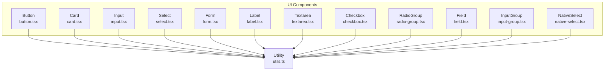
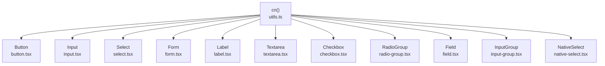
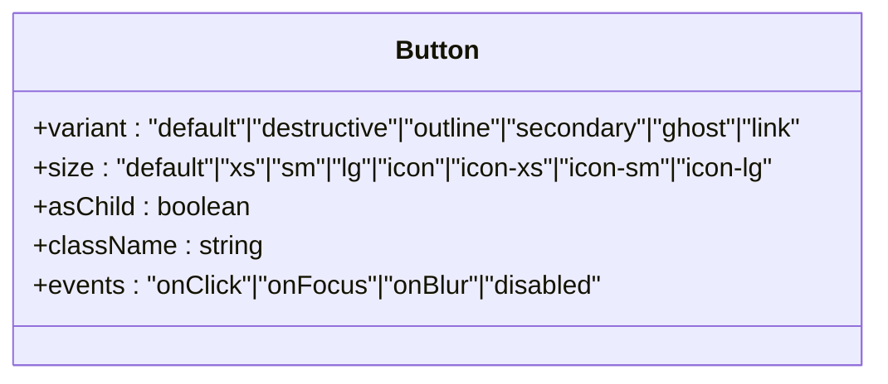
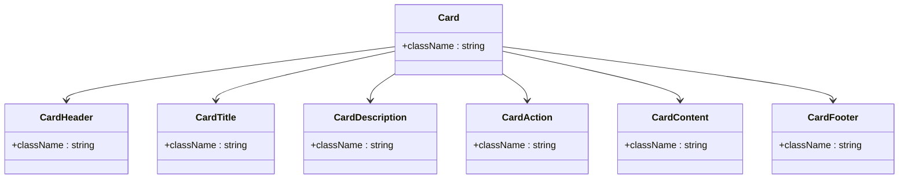
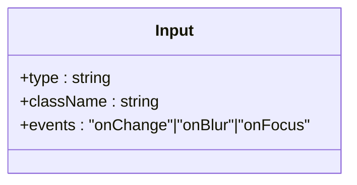
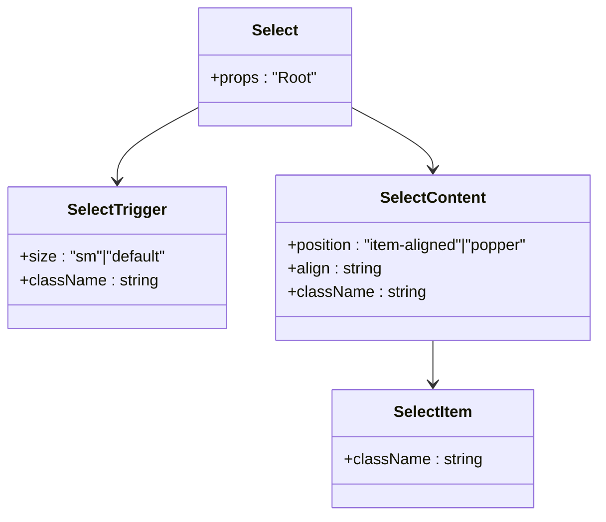
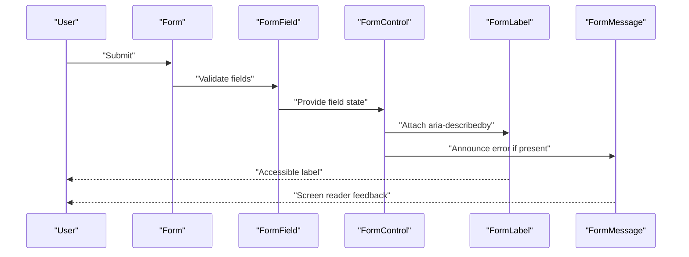
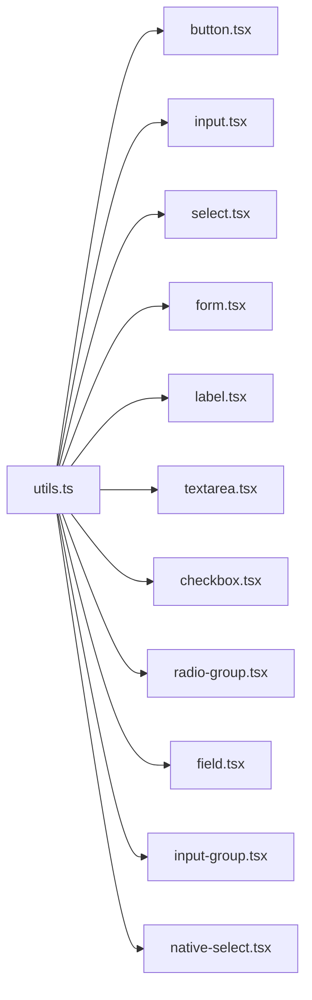

# Core Components

<cite>
**Referenced Files in This Document**
- [button.tsx](file://src/components/ui/button.tsx)
- [card.tsx](file://src/components/ui/card.tsx)
- [input.tsx](file://src/components/ui/input.tsx)
- [select.tsx](file://src/components/ui/select.tsx)
- [form.tsx](file://src/components/ui/form.tsx)
- [label.tsx](file://src/components/ui/label.tsx)
- [textarea.tsx](file://src/components/ui/textarea.tsx)
- [checkbox.tsx](file://src/components/ui/checkbox.tsx)
- [radio-group.tsx](file://src/components/ui/radio-group.tsx)
- [field.tsx](file://src/components/ui/field.tsx)
- [input-group.tsx](file://src/components/ui/input-group.tsx)
- [native-select.tsx](file://src/components/ui/native-select.tsx)
- [utils.ts](file://src/lib/utils.ts)
- [App.tsx](file://src/App.tsx)
</cite>

## Table of Contents
1. [Introduction](#introduction)
2. [Project Structure](#project-structure)
3. [Core Components](#core-components)
4. [Architecture Overview](#architecture-overview)
5. [Detailed Component Analysis](#detailed-component-analysis)
6. [Dependency Analysis](#dependency-analysis)
7. [Performance Considerations](#performance-considerations)
8. [Accessibility and Keyboard Navigation](#accessibility-and-keyboard-navigation)
9. [Troubleshooting Guide](#troubleshooting-guide)
10. [Conclusion](#conclusion)

## Introduction
This document provides comprehensive documentation for the core UI components used in the application: Button, Card, Input, Select, and Form. It covers each component’s props interface, default values, event handlers, styling options, accessibility features, keyboard navigation support, screen reader compatibility, customization guidelines, and integration patterns with React hooks. Practical usage examples demonstrate common scenarios such as form validation, button states, and input interactions.

## Project Structure
The UI components are organized under src/components/ui and share a consistent styling approach using Tailwind CSS utilities via a shared cn utility. The Form component integrates with react-hook-form to provide robust form handling, labeling, and validation feedback.

**Diagram sources**
- [button.tsx:1-65](file://src/components/ui/button.tsx#L1-L65)
- [card.tsx:1-93](file://src/components/ui/card.tsx#L1-L93)
- [input.tsx:1-22](file://src/components/ui/input.tsx#L1-L22)
- [select.tsx:1-191](file://src/components/ui/select.tsx#L1-L191)
- [form.tsx:1-166](file://src/components/ui/form.tsx#L1-L166)
- [label.tsx:1-23](file://src/components/ui/label.tsx#L1-L23)
- [textarea.tsx:1-19](file://src/components/ui/textarea.tsx#L1-L19)
- [checkbox.tsx:1-33](file://src/components/ui/checkbox.tsx#L1-L33)
- [radio-group.tsx:1-46](file://src/components/ui/radio-group.tsx#L1-L46)
- [field.tsx:1-249](file://src/components/ui/field.tsx#L1-L249)
- [input-group.tsx:1-169](file://src/components/ui/input-group.tsx#L1-L169)
- [native-select.tsx:1-54](file://src/components/ui/native-select.tsx#L1-L54)
- [utils.ts:1-7](file://src/lib/utils.ts#L1-L7)

**Section sources**
- [button.tsx:1-65](file://src/components/ui/button.tsx#L1-L65)
- [card.tsx:1-93](file://src/components/ui/card.tsx#L1-L93)
- [input.tsx:1-22](file://src/components/ui/input.tsx#L1-L22)
- [select.tsx:1-191](file://src/components/ui/select.tsx#L1-L191)
- [form.tsx:1-166](file://src/components/ui/form.tsx#L1-L166)
- [utils.ts:1-7](file://src/lib/utils.ts#L1-L7)

## Core Components
This section outlines the primary UI components and their capabilities.

- Button
  - Purpose: Renders interactive buttons with consistent variants and sizes.
  - Key props: variant, size, asChild, className, and standard button attributes.
  - Defaults: variant="default", size="default".
  - Styling: Uses class-variance-authority for variant and size combinations; integrates focus-visible ring and aria-invalid styles.
  - Accessibility: Inherits standard button semantics; supports focus-visible ring and aria-invalid states.

- Card
  - Purpose: Provides a flexible container with header, title, description, action, content, and footer slots.
  - Key props: className for each subcomponent; all accept standard div attributes.
  - Defaults: None; relies on semantic slot data attributes for styling hooks.
  - Styling: Tailwind-based layout with responsive spacing and borders.

- Input
  - Purpose: Standard text input with focus and invalid states.
  - Key props: type, className, and standard input attributes.
  - Defaults: None; applies focus-visible ring and aria-invalid styles.
  - Styling: Consistent height, padding, and ring focus behavior.

- Select
  - Purpose: Accessible dropdown selector built on radix-ui primitives.
  - Key props: Root, Trigger, Content, Item, Label, Separator, ScrollUp/Down buttons; includes size and positioning options.
  - Defaults: Trigger size defaults to "default"; Content position defaults to "item-aligned".
  - Styling: Popper vs item-aligned positioning; viewport sizing; scroll indicators.

- Form
  - Purpose: Integrates react-hook-form with accessible labels, descriptions, controls, and error messages.
  - Key exports: Form, FormItem, FormLabel, FormControl, FormDescription, FormMessage, FormField, useFormField.
  - Defaults: None; manages aria-* attributes automatically based on field state.
  - Accessibility: Connects labels to controls via generated IDs; sets aria-invalid and aria-describedby dynamically.

**Section sources**
- [button.tsx:7-39](file://src/components/ui/button.tsx#L7-L39)
- [card.tsx:5-82](file://src/components/ui/card.tsx#L5-L82)
- [input.tsx:5-19](file://src/components/ui/input.tsx#L5-L19)
- [select.tsx:9-88](file://src/components/ui/select.tsx#L9-L88)
- [form.tsx:17-165](file://src/components/ui/form.tsx#L17-L165)

## Architecture Overview
The components follow a consistent pattern:
- Shared utility: cn merges clsx and tailwind-merge for deterministic class composition.
- Primitive composition: Many components wrap radix-ui primitives to maintain accessibility.
- Data attributes: Components annotate DOM nodes with data-slot and data-* attributes to enable styling hooks and testing.
- Form integration: Form components rely on react-hook-form contexts to manage validation and accessibility attributes.

**Diagram sources**
- [utils.ts:4-6](file://src/lib/utils.ts#L4-L6)
- [button.tsx:5-5](file://src/components/ui/button.tsx#L5-L5)
- [input.tsx:3-3](file://src/components/ui/input.tsx#L3-L3)
- [select.tsx:7-7](file://src/components/ui/select.tsx#L7-L7)
- [form.tsx:14-14](file://src/components/ui/form.tsx#L14-L14)
- [label.tsx:4-4](file://src/components/ui/label.tsx#L4-L4)
- [textarea.tsx:3-3](file://src/components/ui/textarea.tsx#L3-L3)
- [checkbox.tsx:7-7](file://src/components/ui/checkbox.tsx#L7-L7)
- [radio-group.tsx:7-7](file://src/components/ui/radio-group.tsx#L7-L7)
- [field.tsx:6-6](file://src/components/ui/field.tsx#L6-L6)
- [input-group.tsx:4-4](file://src/components/ui/input-group.tsx#L4-L4)
- [native-select.tsx:4-4](file://src/components/ui/native-select.tsx#L4-L4)

## Detailed Component Analysis

### Button
- Props
  - variant: "default" | "destructive" | "outline" | "secondary" | "ghost" | "link"
  - size: "default" | "xs" | "sm" | "lg" | "icon" | "icon-xs" | "icon-sm" | "icon-lg"
  - asChild: boolean to render as a Slot root
  - className: additional classes
  - Standard button attributes (onClick, disabled, etc.)
- Defaults
  - variant="default", size="default"
- Event handlers
  - Inherits standard button events; focus-visible ring managed internally
- Styling options
  - Variant-specific background, text, and hover styles
  - Size-specific height, padding, and icon spacing
  - Focus-visible ring around button
  - Disabled state and aria-invalid styles
- Accessibility
  - Inherits button semantics; focus-visible ring for keyboard navigation
  - aria-invalid integration for form feedback

**Diagram sources**
- [button.tsx:41-62](file://src/components/ui/button.tsx#L41-L62)

**Section sources**
- [button.tsx:7-39](file://src/components/ui/button.tsx#L7-L39)
- [button.tsx:41-62](file://src/components/ui/button.tsx#L41-L62)

### Card
- Subcomponents
  - Card, CardHeader, CardTitle, CardDescription, CardAction, CardContent, CardFooter
- Props
  - className for each subcomponent; accepts standard div attributes
- Defaults
  - None; uses semantic data-slot attributes for styling hooks
- Styling options
  - Grid-based header layout with optional action column
  - Responsive spacing and border/shadow classes
- Accessibility
  - No explicit ARIA roles; relies on semantic HTML structure

**Diagram sources**
- [card.tsx:5-82](file://src/components/ui/card.tsx#L5-L82)

**Section sources**
- [card.tsx:5-82](file://src/components/ui/card.tsx#L5-L82)

### Input
- Props
  - type: standard input type
  - className: additional classes
  - Standard input attributes (onChange, onBlur, value, etc.)
- Defaults
  - None; consistent focus-visible ring and aria-invalid integration
- Styling options
  - Height, padding, border, and ring focus behavior
- Accessibility
  - Inherits standard input semantics; focus-visible ring and aria-invalid states

**Diagram sources**
- [input.tsx:5-19](file://src/components/ui/input.tsx#L5-L19)

**Section sources**
- [input.tsx:5-19](file://src/components/ui/input.tsx#L5-L19)

### Select
- Subcomponents
  - Select, SelectGroup, SelectValue, SelectTrigger, SelectContent, SelectLabel, SelectItem, SelectSeparator, SelectScrollUpButton, SelectScrollDownButton
- Props
  - SelectTrigger: size ("sm" | "default")
  - SelectContent: position ("item-aligned" | "popper"), align
  - Others: standard radix-ui primitive props
- Defaults
  - Trigger size="default"; Content position="item-aligned"
- Styling options
  - Trigger focus-visible ring and aria-invalid integration
  - Content animation and popper positioning
- Accessibility
  - Built on radix-ui primitives; supports keyboard navigation and screen readers

**Diagram sources**
- [select.tsx:9-189](file://src/components/ui/select.tsx#L9-L189)

**Section sources**
- [select.tsx:9-189](file://src/components/ui/select.tsx#L9-L189)

### Form
- Exports
  - Form, FormItem, FormLabel, FormControl, FormDescription, FormMessage, FormField, useFormField
- Behavior
  - Generates unique IDs for items and fields
  - Sets aria-invalid and aria-describedby based on field state
  - Provides useFormField hook to access field metadata and state
- Defaults
  - None; relies on react-hook-form contexts
- Accessibility
  - Connects labels to controls via htmlFor and generated IDs
  - Announces error messages via aria-describedby

**Diagram sources**
- [form.tsx:17-165](file://src/components/ui/form.tsx#L17-L165)

**Section sources**
- [form.tsx:17-165](file://src/components/ui/form.tsx#L17-L165)

## Dependency Analysis
- Utility dependency
  - All components depend on cn for class merging.
- Primitive dependencies
  - Select, Checkbox, RadioGroup, and Label use radix-ui primitives.
- Form integration
  - Form components integrate with react-hook-form for validation and accessibility.

**Diagram sources**
- [utils.ts:4-6](file://src/lib/utils.ts#L4-L6)
- [button.tsx:5-5](file://src/components/ui/button.tsx#L5-L5)
- [input.tsx:3-3](file://src/components/ui/input.tsx#L3-L3)
- [select.tsx:7-7](file://src/components/ui/select.tsx#L7-L7)
- [form.tsx:14-14](file://src/components/ui/form.tsx#L14-L14)
- [label.tsx:4-4](file://src/components/ui/label.tsx#L4-L4)
- [textarea.tsx:3-3](file://src/components/ui/textarea.tsx#L3-L3)
- [checkbox.tsx:7-7](file://src/components/ui/checkbox.tsx#L7-L7)
- [radio-group.tsx:7-7](file://src/components/ui/radio-group.tsx#L7-L7)
- [field.tsx:6-6](file://src/components/ui/field.tsx#L6-L6)
- [input-group.tsx:4-4](file://src/components/ui/input-group.tsx#L4-L4)
- [native-select.tsx:4-4](file://src/components/ui/native-select.tsx#L4-L4)

**Section sources**
- [utils.ts:4-6](file://src/lib/utils.ts#L4-L6)
- [button.tsx:5-5](file://src/components/ui/button.tsx#L5-L5)
- [input.tsx:3-3](file://src/components/ui/input.tsx#L3-L3)
- [select.tsx:7-7](file://src/components/ui/select.tsx#L7-L7)
- [form.tsx:14-14](file://src/components/ui/form.tsx#L14-L14)
- [label.tsx:4-4](file://src/components/ui/label.tsx#L4-L4)
- [textarea.tsx:3-3](file://src/components/ui/textarea.tsx#L3-L3)
- [checkbox.tsx:7-7](file://src/components/ui/checkbox.tsx#L7-L7)
- [radio-group.tsx:7-7](file://src/components/ui/radio-group.tsx#L7-L7)
- [field.tsx:6-6](file://src/components/ui/field.tsx#L6-L6)
- [input-group.tsx:4-4](file://src/components/ui/input-group.tsx#L4-L4)
- [native-select.tsx:4-4](file://src/components/ui/native-select.tsx#L4-L4)

## Performance Considerations
- Class merging
  - cn uses clsx and tailwind-merge to avoid redundant classes and reduce bundle size.
- Conditional rendering
  - FormMessage conditionally renders only when there is an error to minimize DOM nodes.
- Primitive composition
  - Using radix-ui primitives avoids heavy abstractions while preserving accessibility.

[No sources needed since this section provides general guidance]

## Accessibility and Keyboard Navigation
- Focus management
  - Buttons and inputs apply focus-visible rings; Select triggers and items support keyboard navigation.
- Screen reader compatibility
  - FormLabel connects to FormControl via htmlFor; FormMessage and FormDescription provide descriptive context.
  - Select uses radix-ui primitives ensuring ARIA attributes are applied.
- Keyboard navigation
  - Select supports arrow keys and Enter/Space for item selection.
  - Cards and other containers do not introduce custom keyboard handlers; rely on native browser behavior.

**Section sources**
- [button.tsx:8-8](file://src/components/ui/button.tsx#L8-L8)
- [input.tsx:11-13](file://src/components/ui/input.tsx#L11-L13)
- [select.tsx:36-50](file://src/components/ui/select.tsx#L36-L50)
- [form.tsx:95-120](file://src/components/ui/form.tsx#L95-L120)

## Troubleshooting Guide
- Button appears disabled unexpectedly
  - Verify disabled prop and ensure className does not override disabled styles.
- Input focus ring not visible
  - Confirm focus-visible ring classes are not overridden by global styles.
- Select dropdown not opening
  - Ensure Select.Root is properly wrapped and Select.Portal is rendered.
- Form validation not announced
  - Confirm FormField wraps the control and FormMessage is present to announce errors.
- Icon sizing inside Button/Input/Select
  - Icons without explicit size classes default to a compact size; specify appropriate size classes if needed.

**Section sources**
- [button.tsx:8-8](file://src/components/ui/button.tsx#L8-L8)
- [input.tsx:11-13](file://src/components/ui/input.tsx#L11-L13)
- [select.tsx:61-87](file://src/components/ui/select.tsx#L61-L87)
- [form.tsx:136-154](file://src/components/ui/form.tsx#L136-L154)

## Conclusion
The core UI components provide a cohesive, accessible, and customizable foundation for building forms and interactive layouts. They leverage shared utilities, radix-ui primitives, and react-hook-form to ensure consistent behavior, strong accessibility, and maintainable styling. By following the documented patterns and guidelines, teams can implement reliable UI interactions while preserving design consistency across the application.