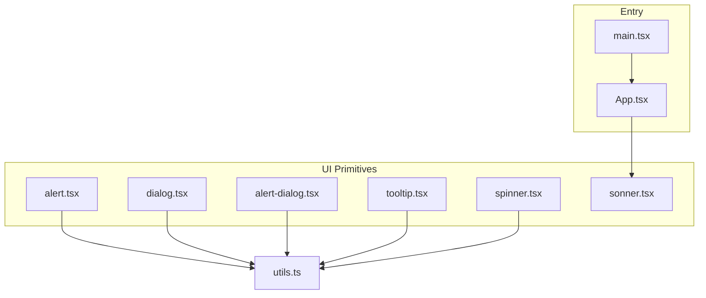
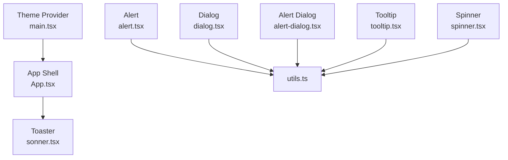
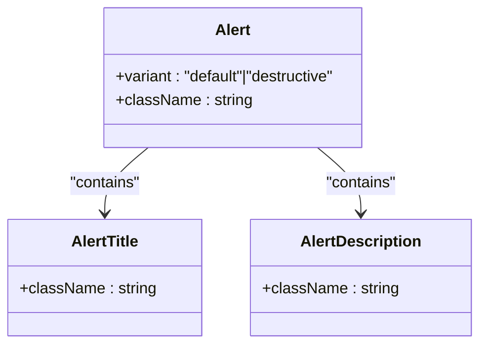
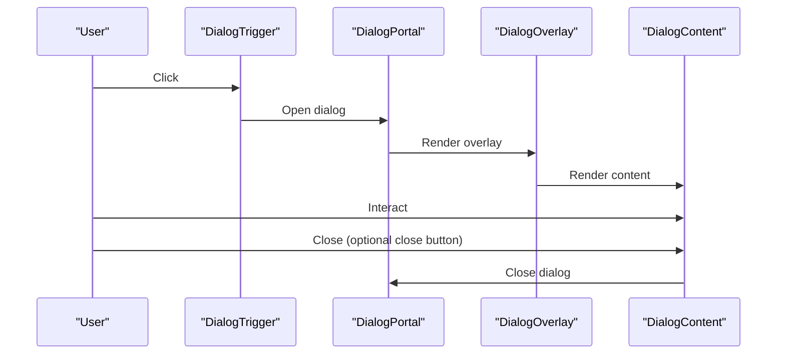
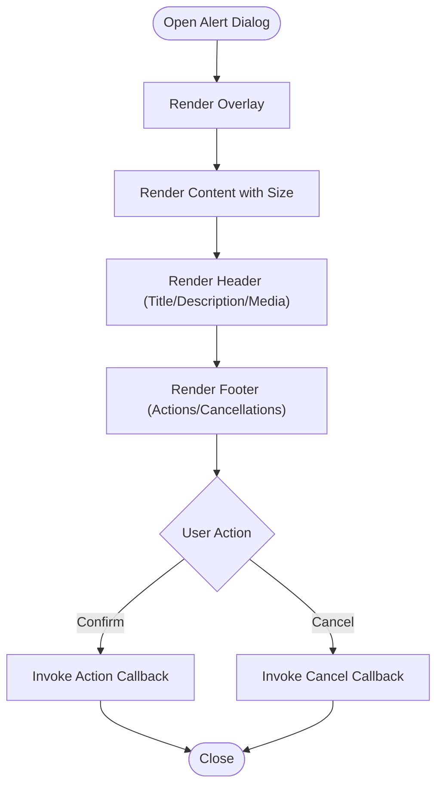
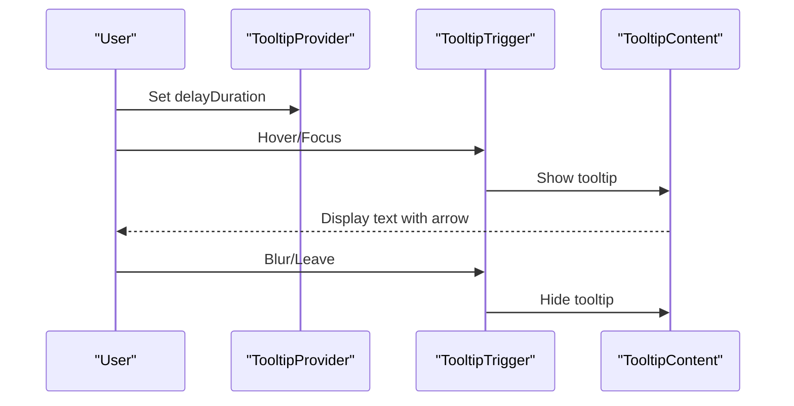
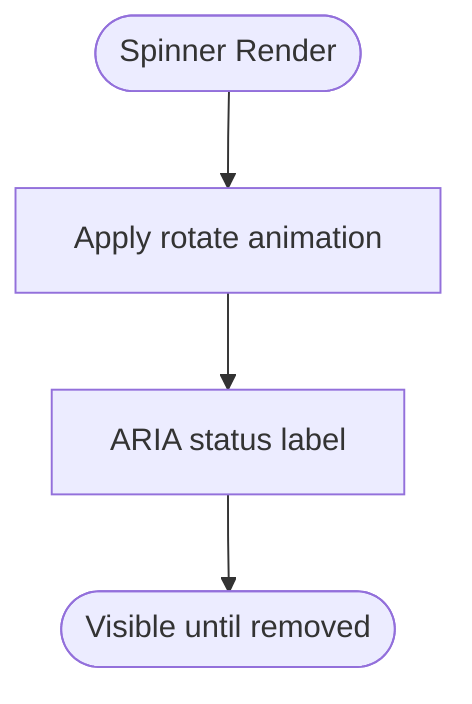
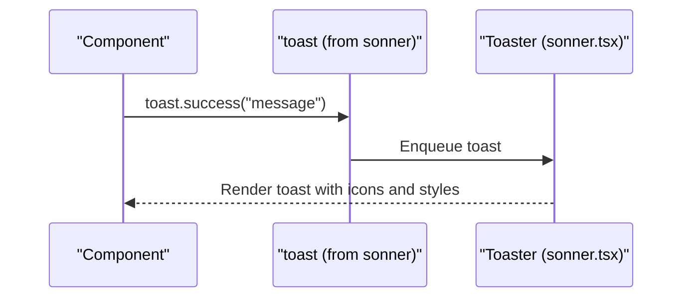
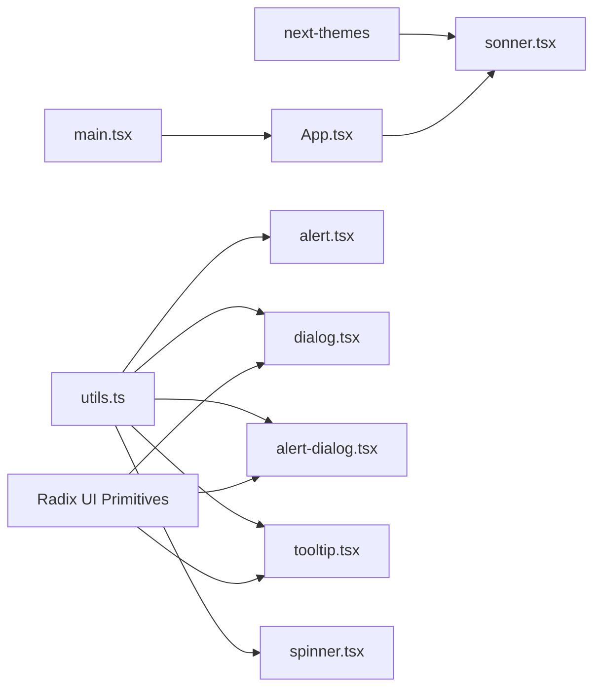

# Feedback Components

<cite>
**Referenced Files in This Document**
- [alert.tsx](file://src/components/ui/alert.tsx)
- [alert-dialog.tsx](file://src/components/ui/alert-dialog.tsx)
- [dialog.tsx](file://src/components/ui/dialog.tsx)
- [tooltip.tsx](file://src/components/ui/tooltip.tsx)
- [spinner.tsx](file://src/components/ui/spinner.tsx)
- [sonner.tsx](file://src/components/ui/sonner.tsx)
- [utils.ts](file://src/lib/utils.ts)
- [App.tsx](file://src/App.tsx)
- [main.tsx](file://src/main.tsx)
- [job-search-tab.tsx](file://src/components/dashboard/job-search-tab.tsx)
</cite>

## Table of Contents
1. [Introduction](#introduction)
2. [Project Structure](#project-structure)
3. [Core Components](#core-components)
4. [Architecture Overview](#architecture-overview)
5. [Detailed Component Analysis](#detailed-component-analysis)
6. [Dependency Analysis](#dependency-analysis)
7. [Performance Considerations](#performance-considerations)
8. [Accessibility and UX Guidelines](#accessibility-and-ux-guidelines)
9. [Troubleshooting Guide](#troubleshooting-guide)
10. [Conclusion](#conclusion)

## Introduction
This document explains the feedback and interaction components used in the dashboard: Alert, Dialog, Alert Dialog, Tooltip, Spinner, and the integrated Toast system via Sonner. It covers state management, animation behaviors, user interaction patterns, accessibility features, and practical examples for notifications, modal dialogs, loading states, and contextual help. Guidance is also provided for integrating these components with application state and ensuring appropriate feedback timing.

## Project Structure
The feedback components are implemented as reusable UI primitives located under src/components/ui/. They rely on shared utilities for class merging and integrate with Radix UI primitives for accessible base behaviors. The application initializes global theming and toast delivery in the main entry and app shell.

**Diagram sources**
- [main.tsx:1-15](file://src/main.tsx#L1-L15)
- [App.tsx:1-67](file://src/App.tsx#L1-L67)
- [alert.tsx:1-67](file://src/components/ui/alert.tsx#L1-L67)
- [dialog.tsx:1-157](file://src/components/ui/dialog.tsx#L1-L157)
- [alert-dialog.tsx:1-195](file://src/components/ui/alert-dialog.tsx#L1-L195)
- [tooltip.tsx:1-56](file://src/components/ui/tooltip.tsx#L1-L56)
- [spinner.tsx:1-17](file://src/components/ui/spinner.tsx#L1-L17)
- [sonner.tsx:1-41](file://src/components/ui/sonner.tsx#L1-L41)
- [utils.ts:1-7](file://src/lib/utils.ts#L1-L7)

**Section sources**
- [main.tsx:1-15](file://src/main.tsx#L1-L15)
- [App.tsx:1-67](file://src/App.tsx#L1-L67)

## Core Components
- Alert: A contextual notice container with optional icon support and semantic roles for assistive technologies.
- Dialog: A flexible overlay dialog built on Radix UI primitives with animated open/close transitions and optional close controls.
- Alert Dialog: A specialized confirmation dialog with action/cancel buttons and optional media area.
- Tooltip: A provider-driven tooltip with arrow, side offsets, and animated entrance/exit.
- Spinner: A lightweight animated loader with accessible labeling.
- Sonner Toast: A themed toast notification system integrated into the app shell.

These components share a consistent design language and rely on Tailwind-based class composition and Radix UI’s accessibility primitives.

**Section sources**
- [alert.tsx:1-67](file://src/components/ui/alert.tsx#L1-L67)
- [dialog.tsx:1-157](file://src/components/ui/dialog.tsx#L1-L157)
- [alert-dialog.tsx:1-195](file://src/components/ui/alert-dialog.tsx#L1-L195)
- [tooltip.tsx:1-56](file://src/components/ui/tooltip.tsx#L1-L56)
- [spinner.tsx:1-17](file://src/components/ui/spinner.tsx#L1-L17)
- [sonner.tsx:1-41](file://src/components/ui/sonner.tsx#L1-L41)

## Architecture Overview
The feedback system is composed of:
- Primitive wrappers around Radix UI roots, triggers, portals, overlays, and content.
- Utility-driven class composition for responsive and theme-aware styling.
- Global toast integration via Sonner, initialized at the application root.
- Optional theme-awareness for consistent color tokens across components.

**Diagram sources**
- [App.tsx:1-67](file://src/App.tsx#L1-L67)
- [main.tsx:1-15](file://src/main.tsx#L1-L15)
- [sonner.tsx:1-41](file://src/components/ui/sonner.tsx#L1-L41)
- [alert.tsx:1-67](file://src/components/ui/alert.tsx#L1-L67)
- [dialog.tsx:1-157](file://src/components/ui/dialog.tsx#L1-L157)
- [alert-dialog.tsx:1-195](file://src/components/ui/alert-dialog.tsx#L1-L195)
- [tooltip.tsx:1-56](file://src/components/ui/tooltip.tsx#L1-L56)
- [spinner.tsx:1-17](file://src/components/ui/spinner.tsx#L1-L17)
- [utils.ts:1-7](file://src/lib/utils.ts#L1-L7)

## Detailed Component Analysis

### Alert
- Purpose: Present contextual messages with optional icons and semantic roles for screen readers.
- State management: Stateless container; variant selection is controlled by props.
- Animation: No internal animations; relies on parent containers for layout transitions.
- Interaction: Intended as a static notice; interactive actions should be placed outside or via nested elements.
- Accessibility: Uses role="alert" and data-slot attributes for consistent identification.

**Diagram sources**
- [alert.tsx:22-67](file://src/components/ui/alert.tsx#L22-L67)

**Section sources**
- [alert.tsx:1-67](file://src/components/ui/alert.tsx#L1-L67)

### Dialog
- Purpose: Modal overlay for focused interactions with configurable content areas.
- State management: Controlled by Radix UI state attributes (open/closed); expose showCloseButton flag.
- Animation: Uses data-state selectors to drive fade and zoom transitions.
- Interaction: Provides overlay, portal, header/footer, title, and description slots; optional close button.
- Accessibility: Focus trapping and overlay behavior handled by Radix UI; close button includes screen-reader text.

**Diagram sources**
- [dialog.tsx:8-80](file://src/components/ui/dialog.tsx#L8-L80)

**Section sources**
- [dialog.tsx:1-157](file://src/components/ui/dialog.tsx#L1-L157)

### Alert Dialog
- Purpose: Confirmation-style dialog with action/cancel buttons and optional media area.
- State management: Inherits state from Radix UI; size prop toggles max-width.
- Animation: Same state-driven enter/exit animations as Dialog.
- Interaction: Exposes AlertDialogAction and AlertDialogCancel that wrap Button; supports AlertDialogMedia for illustrative icons.
- Accessibility: Modal behavior enforced; integrates with Button semantics.

**Diagram sources**
- [alert-dialog.tsx:7-66](file://src/components/ui/alert-dialog.tsx#L7-L66)

**Section sources**
- [alert-dialog.tsx:1-195](file://src/components/ui/alert-dialog.tsx#L1-L195)

### Tooltip
- Purpose: Provide contextual help on hover/focus with arrow alignment and smooth animations.
- State management: Provider manages global delayDuration; individual TooltipContent supports sideOffset.
- Animation: Uses data-state and side attributes to animate slide and fade transitions.
- Interaction: TooltipTrigger activates TooltipContent; Arrow renders aligned pointer.
- Accessibility: Integrates with Radix UI focus management and keyboard navigation.

**Diagram sources**
- [tooltip.tsx:6-53](file://src/components/ui/tooltip.tsx#L6-L53)

**Section sources**
- [tooltip.tsx:1-56](file://src/components/ui/tooltip.tsx#L1-L56)

### Spinner
- Purpose: Lightweight loading indicator with accessible labeling.
- State management: Stateless; spinning animation is purely presentational.
- Animation: Uses CSS animation to rotate the loader icon.
- Interaction: No user interaction; intended for inline placement during async operations.
- Accessibility: role="status" and aria-label provide screen reader context.

**Diagram sources**
- [spinner.tsx:5-14](file://src/components/ui/spinner.tsx#L5-L14)

**Section sources**
- [spinner.tsx:1-17](file://src/components/ui/spinner.tsx#L1-L17)

### Toast (Sonner)
- Purpose: Non-blocking notifications for success, info, warning, error, and loading states.
- State management: Centralized via Sonner; app-wide Toaster registered at root.
- Animation: Styled transitions for toast appearance/disappearance.
- Interaction: toast.success(), toast.error(), toast.info(), toast.warning(), toast.loading() invoked from components.
- Theming: Inherits theme from next-themes and applies CSS variables for consistent look.

**Diagram sources**
- [sonner.tsx:13-38](file://src/components/ui/sonner.tsx#L13-L38)
- [job-search-tab.tsx:146-229](file://src/components/dashboard/job-search-tab.tsx#L146-L229)

**Section sources**
- [sonner.tsx:1-41](file://src/components/ui/sonner.tsx#L1-L41)
- [job-search-tab.tsx:1-507](file://src/components/dashboard/job-search-tab.tsx#L1-L507)

## Dependency Analysis
- Shared utilities: All components depend on cn() from utils.ts for composing Tailwind classes.
- Radix UI primitives: Dialog, Alert Dialog, and Tooltip are thin wrappers around radix-ui components.
- Theming: Sonner respects the active theme via next-themes; Spinner and Alerts use theme tokens for colors.
- Application integration: App.tsx mounts Toaster globally; main.tsx wraps the app with ThemeProvider.

**Diagram sources**
- [utils.ts:1-7](file://src/lib/utils.ts#L1-L7)
- [dialog.tsx:1-157](file://src/components/ui/dialog.tsx#L1-L157)
- [alert-dialog.tsx:1-195](file://src/components/ui/alert-dialog.tsx#L1-L195)
- [tooltip.tsx:1-56](file://src/components/ui/tooltip.tsx#L1-L56)
- [sonner.tsx:1-41](file://src/components/ui/sonner.tsx#L1-L41)
- [App.tsx:1-67](file://src/App.tsx#L1-L67)
- [main.tsx:1-15](file://src/main.tsx#L1-L15)

**Section sources**
- [utils.ts:1-7](file://src/lib/utils.ts#L1-L7)
- [dialog.tsx:1-157](file://src/components/ui/dialog.tsx#L1-L157)
- [alert-dialog.tsx:1-195](file://src/components/ui/alert-dialog.tsx#L1-L195)
- [tooltip.tsx:1-56](file://src/components/ui/tooltip.tsx#L1-L56)
- [sonner.tsx:1-41](file://src/components/ui/sonner.tsx#L1-L41)
- [App.tsx:1-67](file://src/App.tsx#L1-L67)
- [main.tsx:1-15](file://src/main.tsx#L1-L15)

## Performance Considerations
- Prefer stateless primitives: Components like Spinner and Alert avoid unnecessary re-renders.
- Defer heavy work off main thread: Use async operations and keep UI updates minimal while animating.
- Limit toast queue: Batch or debounce frequent toasts to prevent stacking and layout thrashing.
- Use CSS containment: For large lists inside Dialog/Alert Dialog, consider scroll areas to reduce paint cost.
- Avoid forced synchronous layouts: Batch DOM reads/writes and leverage requestAnimationFrame for animations.

## Accessibility and UX Guidelines
- Screen readers
  - Use role="alert" on Alert containers to signal urgent messages.
  - Provide concise, descriptive labels for Spinner via aria-label.
  - Ensure Dialog/Alert Dialog titles and descriptions are meaningful and unique.
  - Include visible focus indicators and keyboard navigation support via Radix UI.
- Focus management
  - On open, move focus into the dialog content; on close, return focus to the trigger.
  - Keep focus trapped within the dialog while open.
- Keyboard navigation
  - Support Escape to close dialogs; confirm/cancel actions reachable via Tab order.
  - Ensure tooltips are dismissible via Escape and do not trap focus.
- Feedback timing
  - Toast durations: Short for success/info; longer for warnings/errors; avoid auto-dismiss for critical actions.
  - Spinner: Show during short operations; replace with definitive state after completion.
  - Alerts: Use destructive variant sparingly; pair with actionable steps.
- Integration with state management
  - Manage open/closed state via local component state or centralized stores; propagate state to Radix UI roots.
  - For toasts, centralize invocations in service layers or hooks to avoid scattered imperative calls.

## Troubleshooting Guide
- Dialog does not close on overlay click
  - Verify DialogOverlay and DialogClose are both present and properly wired.
  - Ensure DialogContent receives the showCloseButton prop if needed.
- Tooltip not appearing
  - Confirm TooltipProvider is mounted and delayDuration is appropriate.
  - Check that TooltipTrigger is wrapping the element and TooltipContent is rendered.
- Spinner not visible
  - Ensure the component is included in the DOM and not hidden by parent styles.
  - Confirm role="status" and aria-label are present for accessibility.
- Toast icons not rendering
  - Confirm Toaster is mounted at the app root and theme is applied.
  - Verify next-themes is functioning and theme tokens are available.

**Section sources**
- [dialog.tsx:32-80](file://src/components/ui/dialog.tsx#L32-L80)
- [tooltip.tsx:6-53](file://src/components/ui/tooltip.tsx#L6-L53)
- [spinner.tsx:5-14](file://src/components/ui/spinner.tsx#L5-L14)
- [sonner.tsx:13-38](file://src/components/ui/sonner.tsx#L13-L38)

## Conclusion
The feedback components provide a cohesive, accessible, and animated toolkit for notifications, modals, tooltips, and loading states. By leveraging Radix UI primitives, shared utilities, and a centralized toast system, the application ensures consistent UX across states and interactions. Following the accessibility and UX guidelines will help maintain inclusive experiences and predictable feedback timing.