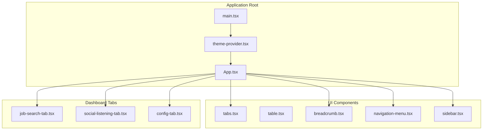
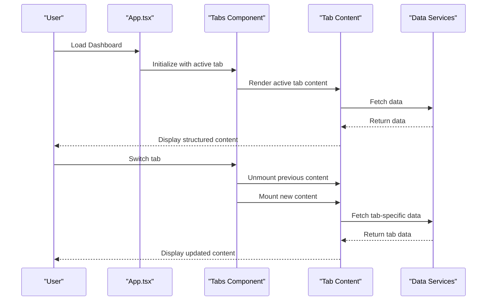
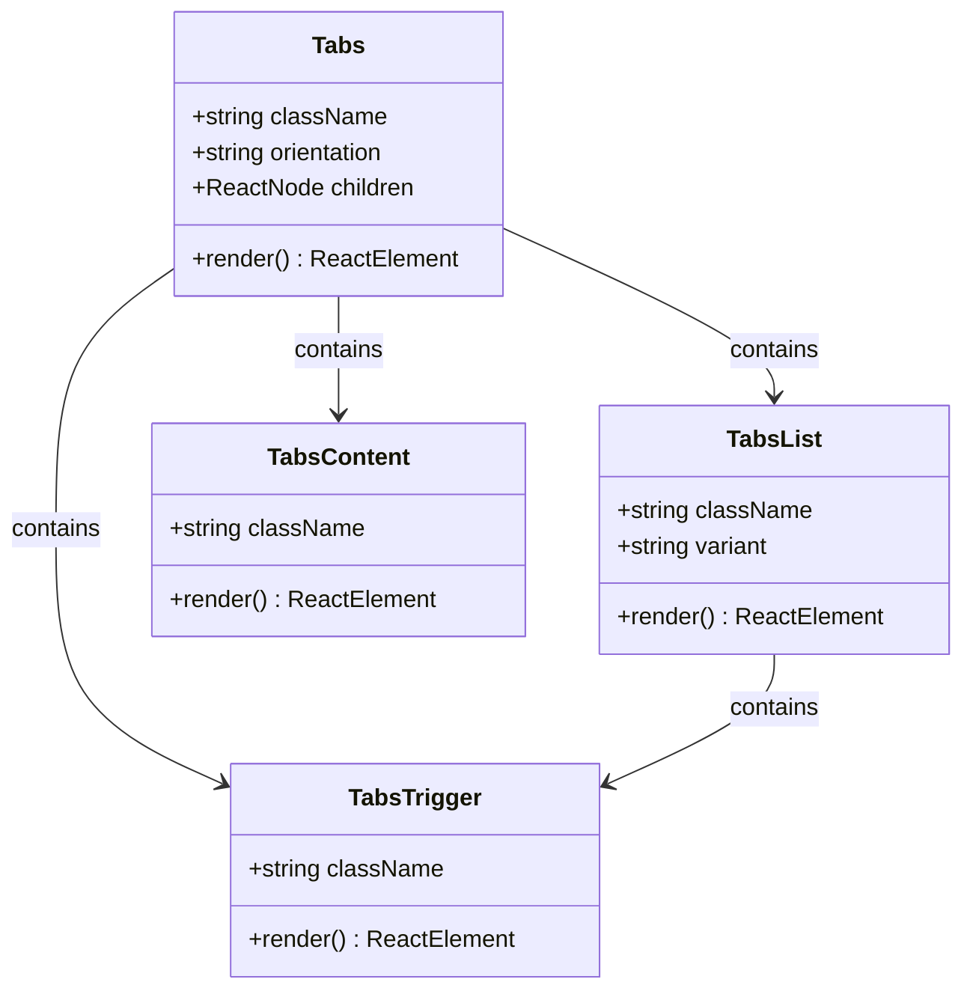
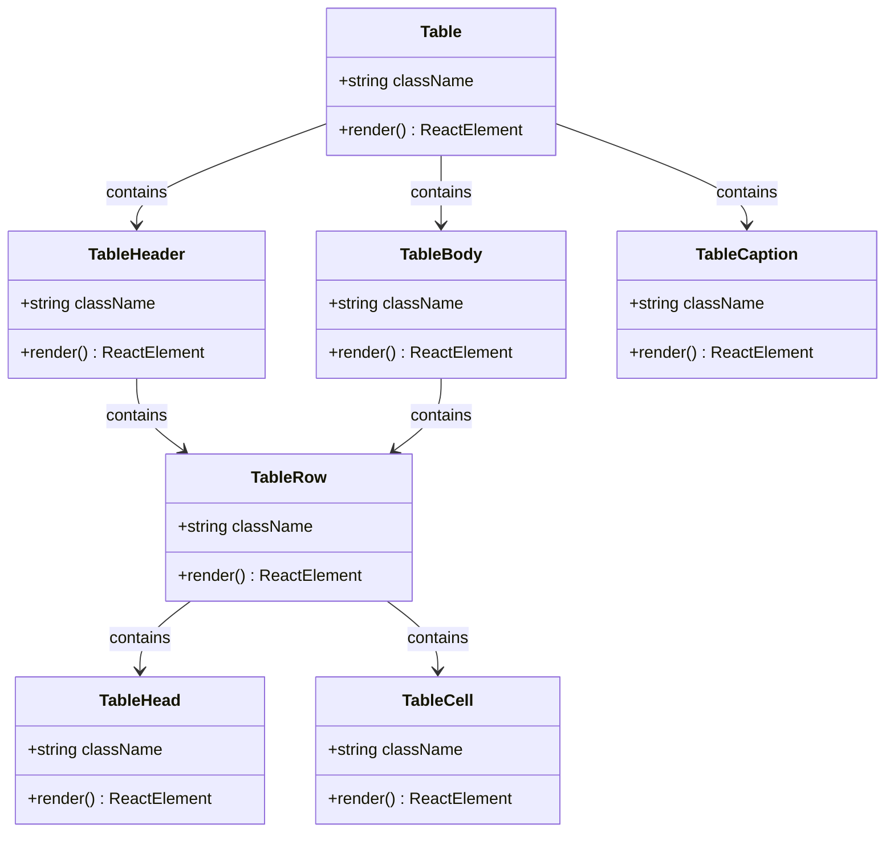
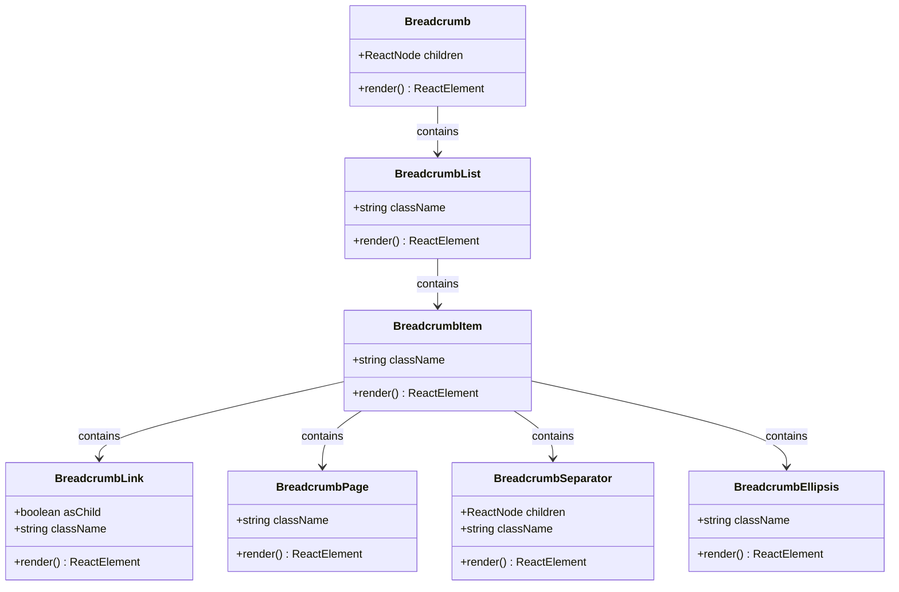
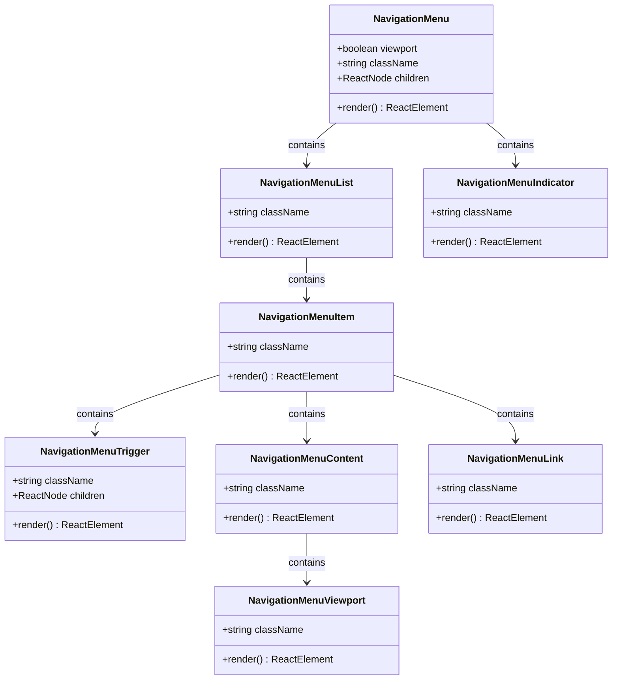
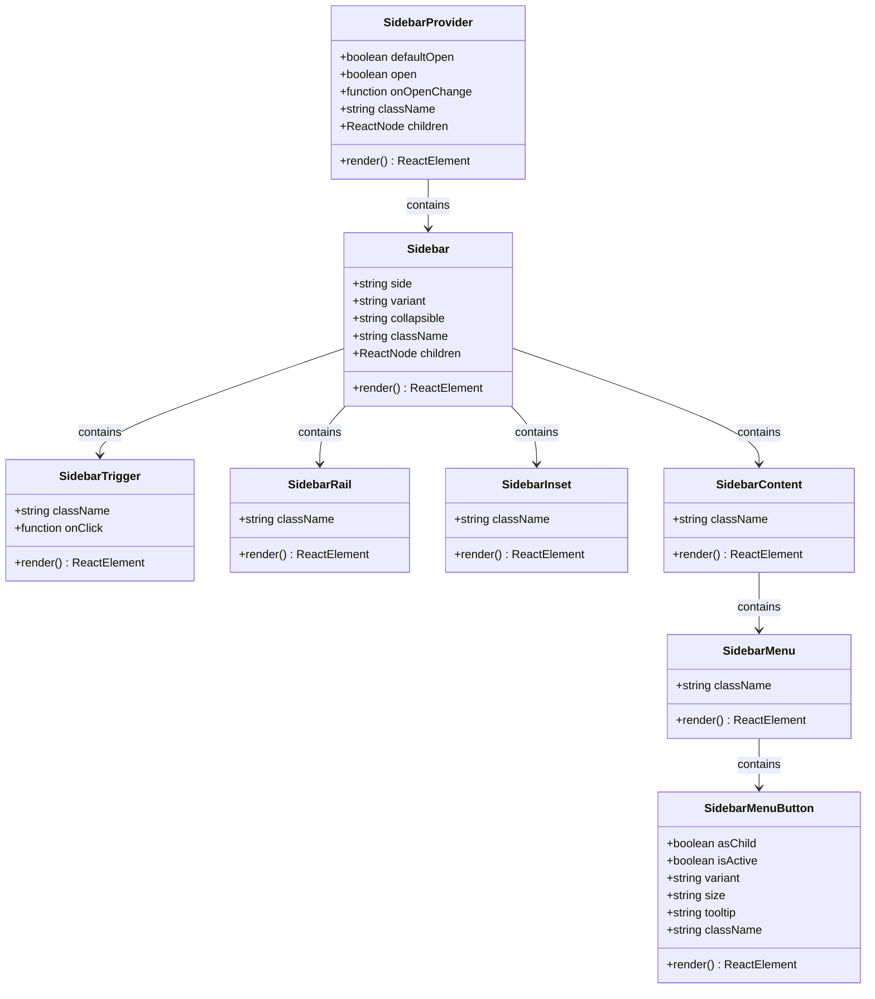
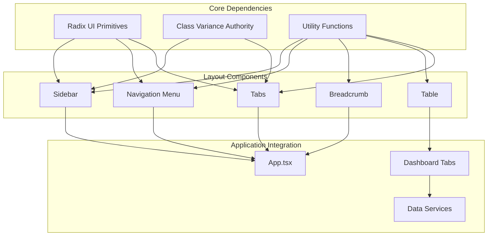

# Layout Components

<cite>
**Referenced Files in This Document**
- [App.tsx](file://src/App.tsx)
- [main.tsx](file://src/main.tsx)
- [tabs.tsx](file://src/components/ui/tabs.tsx)
- [table.tsx](file://src/components/ui/table.tsx)
- [breadcrumb.tsx](file://src/components/ui/breadcrumb.tsx)
- [navigation-menu.tsx](file://src/components/ui/navigation-menu.tsx)
- [sidebar.tsx](file://src/components/ui/sidebar.tsx)
- [job-search-tab.tsx](file://src/components/dashboard/job-search-tab.tsx)
- [social-listening-tab.tsx](file://src/components/dashboard/social-listening-tab.tsx)
- [config-tab.tsx](file://src/components/dashboard/config-tab.tsx)
- [theme-provider.tsx](file://src/components/theme-provider.tsx)
- [use-mobile.ts](file://src/hooks/use-mobile.ts)
- [utils.ts](file://src/lib/utils.ts)
- [index.ts](file://src/types/index.ts)
</cite>

## Table of Contents
1. [Introduction](#introduction)
2. [Project Structure](#project-structure)
3. [Core Components](#core-components)
4. [Architecture Overview](#architecture-overview)
5. [Detailed Component Analysis](#detailed-component-analysis)
6. [Dependency Analysis](#dependency-analysis)
7. [Performance Considerations](#performance-considerations)
8. [Troubleshooting Guide](#troubleshooting-guide)
9. [Conclusion](#conclusion)

## Introduction
This document provides comprehensive documentation for the layout and structural components of the job search dashboard application. It focuses on five key layout components: Tabs, Table, Breadcrumb, Navigation Menu, and Sidebar. The documentation covers component APIs, data binding patterns, interaction behaviors, responsive design implementations, and integration with the routing system. It also includes guidelines for customizing layout behavior and maintaining consistent user experience across different screen sizes.

## Project Structure
The application follows a modular structure with layout components organized under `src/components/ui/` and dashboard-specific tabs under `src/components/dashboard/`. The main application entry point (`App.tsx`) orchestrates the primary layout using Tabs, while the Sidebar component provides navigation scaffolding for the dashboard.

**Diagram sources**
- [main.tsx:1-15](file://src/main.tsx#L1-L15)
- [theme-provider.tsx:1-231](file://src/components/theme-provider.tsx#L1-L231)
- [App.tsx:1-67](file://src/App.tsx#L1-L67)

**Section sources**
- [main.tsx:1-15](file://src/main.tsx#L1-L15)
- [App.tsx:1-67](file://src/App.tsx#L1-L67)

## Core Components
This section documents the five primary layout components and their roles in the application's page structure.

### Tabs Component
The Tabs component serves as the primary navigation container for the dashboard, organizing the main functional areas into distinct tabs. It integrates with Radix UI primitives and provides variant styling through class variance authority.

Key features:
- Orientation support (horizontal/vertical)
- Variant styling (default/line)
- Accessible tab switching with keyboard navigation
- Responsive behavior through data attributes

**Section sources**
- [tabs.tsx:1-92](file://src/components/ui/tabs.tsx#L1-L92)
- [App.tsx:33-58](file://src/App.tsx#L33-L58)

### Table Component
The Table component provides a comprehensive data presentation system with responsive design capabilities. It wraps native HTML table elements with enhanced styling and accessibility features.

Key features:
- Horizontal scrolling for small screens
- Semantic table structure with proper row/column labeling
- Hover and selection states
- Responsive design for mobile devices

**Section sources**
- [table.tsx:1-117](file://src/components/ui/table.tsx#L1-L117)
- [job-search-tab.tsx:428-501](file://src/components/dashboard/job-search-tab.tsx#L428-L501)

### Breadcrumb Component
The Breadcrumb component provides navigational context for hierarchical pages, offering clear pathways back to parent sections. It supports both anchor links and programmatic navigation.

Key features:
- Accessible navigation structure with ARIA attributes
- Flexible separator customization
- Ellipsis support for long paths
- Child slot composition for flexible content

**Section sources**
- [breadcrumb.tsx:1-110](file://src/components/ui/breadcrumb.tsx#L1-L110)

### Navigation Menu Component
The Navigation Menu component offers sophisticated dropdown navigation with animated transitions and viewport positioning. It supports complex nested menu structures with smooth animations.

Key features:
- Animated viewport transitions
- Nested menu support
- Trigger indicators with chevrons
- Focus management and keyboard navigation
- Responsive breakpoint handling

**Section sources**
- [navigation-menu.tsx:1-169](file://src/components/ui/navigation-menu.tsx#L1-L169)

### Sidebar Component
The Sidebar component provides a comprehensive navigation solution with multiple variants, responsive behavior, and state persistence. It supports desktop and mobile contexts with intelligent adaptation.

Key features:
- Multiple variants (sidebar/floating/inset)
- Collapsible modes (offcanvas/icon/none)
- Mobile-first responsive design
- State persistence via cookies
- Keyboard shortcuts (Ctrl/Cmd + B)
- Tooltips and rail interactions

**Section sources**
- [sidebar.tsx:1-727](file://src/components/ui/sidebar.tsx#L1-L727)

## Architecture Overview
The layout architecture combines declarative UI components with reactive state management to create a cohesive user experience across different screen sizes and interaction patterns.

**Diagram sources**
- [App.tsx:12-64](file://src/App.tsx#L12-L64)
- [tabs.tsx:9-26](file://src/components/ui/tabs.tsx#L9-L26)

The architecture demonstrates a clean separation of concerns where the App component manages global state and layout, while individual tab components handle their specific data fetching and rendering logic.

**Section sources**
- [App.tsx:12-64](file://src/App.tsx#L12-L64)

## Detailed Component Analysis

### Tabs Component Implementation
The Tabs component leverages Radix UI's primitive components to provide accessible tabbed interfaces with enhanced styling capabilities.

**Diagram sources**
- [tabs.tsx:9-91](file://src/components/ui/tabs.tsx#L9-L91)

Implementation patterns:
- Uses `data-slot` attributes for styling hooks
- Implements variant-based styling through class variance authority
- Supports horizontal and vertical orientations
- Provides accessible ARIA attributes automatically

**Section sources**
- [tabs.tsx:1-92](file://src/components/ui/tabs.tsx#L1-L92)

### Table Component Implementation
The Table component provides a robust data presentation system with responsive design and accessibility features.

**Diagram sources**
- [table.tsx:7-116](file://src/components/ui/table.tsx#L7-L116)

Responsive design features:
- Horizontal scrolling container for small screens
- Flexible column widths with whitespace management
- Hover effects and selection states
- Proper semantic markup for screen readers

**Section sources**
- [table.tsx:1-117](file://src/components/ui/table.tsx#L1-L117)

### Breadcrumb Component Implementation
The Breadcrumb component provides hierarchical navigation with flexible child composition.

**Diagram sources**
- [breadcrumb.tsx:7-109](file://src/components/ui/breadcrumb.tsx#L7-L109)

Accessibility features:
- Proper ARIA labels and roles
- Keyboard navigation support
- Screen reader friendly structure
- Semantic HTML element usage

**Section sources**
- [breadcrumb.tsx:1-110](file://src/components/ui/breadcrumb.tsx#L1-L110)

### Navigation Menu Component Implementation
The Navigation Menu component provides sophisticated dropdown navigation with animated transitions.

**Diagram sources**
- [navigation-menu.tsx:8-168](file://src/components/ui/navigation-menu.tsx#L8-L168)

Animation and interaction features:
- Smooth slide-in/out animations
- Viewport positioning for dropdowns
- Trigger rotation indicators
- Focus management and keyboard navigation

**Section sources**
- [navigation-menu.tsx:1-169](file://src/components/ui/navigation-menu.tsx#L1-L169)

### Sidebar Component Implementation
The Sidebar component provides a comprehensive navigation solution with multiple variants and responsive behavior.

**Diagram sources**
- [sidebar.tsx:56-726](file://src/components/ui/sidebar.tsx#L56-L726)

Responsive design features:
- Mobile-first approach with sheet-based overlay
- Desktop sidebar with collapsible modes
- State persistence via cookies
- Keyboard shortcuts for quick access
- Tooltips for collapsed state

**Section sources**
- [sidebar.tsx:1-727](file://src/components/ui/sidebar.tsx#L1-L727)

## Dependency Analysis
The layout components demonstrate a well-structured dependency hierarchy with clear separation between UI primitives and application-specific implementations.

**Diagram sources**
- [tabs.tsx:3-7](file://src/components/ui/tabs.tsx#L3-L7)
- [table.tsx:3-5](file://src/components/ui/table.tsx#L3-L5)
- [utils.ts:1-7](file://src/lib/utils.ts#L1-L7)

Key dependency patterns:
- All components depend on shared utility functions for styling
- UI primitives rely on Radix UI for accessibility and state management
- Variant styling uses class variance authority for consistent design tokens
- Application integration occurs through the main App component

**Section sources**
- [utils.ts:1-7](file://src/lib/utils.ts#L1-L7)
- [App.tsx:1-67](file://src/App.tsx#L1-L67)

## Performance Considerations
The layout components are designed with performance optimization in mind through several key strategies:

### Rendering Optimization
- **Lazy loading**: Sidebar content is conditionally rendered based on device context
- **State management**: Centralized state through React Context to minimize re-renders
- **CSS custom properties**: Dynamic styling through CSS variables for efficient updates
- **Component memoization**: Strategic use of React.memo for static components

### Memory Management
- **Event cleanup**: Proper cleanup of media query listeners and keyboard handlers
- **Cookie management**: Efficient state persistence with automatic cleanup
- **Resource disposal**: Proper removal of event listeners in useEffect cleanup functions

### Accessibility Performance
- **Focus management**: Automatic focus restoration and management
- **Keyboard navigation**: Full keyboard accessibility without performance impact
- **Screen reader support**: Optimized ARIA attributes for assistive technologies

## Troubleshooting Guide

### Common Issues and Solutions

#### Sidebar Not Responding to Toggles
**Symptoms**: Sidebar fails to expand/collapse on mobile devices
**Causes**: 
- Media query listener not properly attached
- Cookie state conflicts
- Missing useIsMobile hook

**Solutions**:
- Verify useIsMobile hook is properly imported and initialized
- Check cookie permissions and expiration settings
- Ensure proper event listener cleanup in useEffect

#### Tabs Content Not Updating
**Symptoms**: Tab switching doesn't render new content
**Causes**:
- State not properly managed in App component
- Missing key props for content components
- Incorrect value prop binding

**Solutions**:
- Verify activeTab state is properly passed to Tabs component
- Ensure each TabsContent has unique value prop
- Check that onValueChange callback updates state correctly

#### Table Responsiveness Issues
**Symptoms**: Table content clipped or not scrollable on small screens
**Causes**:
- Container width constraints
- CSS overflow properties
- Fixed column widths

**Solutions**:
- Verify parent container allows horizontal scrolling
- Check CSS overflow-x properties
- Use responsive column sizing with min-width constraints

#### Navigation Menu Animation Problems
**Symptoms**: Dropdown menus don't animate or appear incorrectly
**Causes**:
- Viewport positioning conflicts
- CSS animation timing issues
- Missing motion utilities

**Solutions**:
- Verify viewport CSS variables are properly calculated
- Check animation duration and easing functions
- Ensure proper cleanup of animation event listeners

**Section sources**
- [sidebar.tsx:96-110](file://src/components/ui/sidebar.tsx#L96-L110)
- [App.tsx:13-13](file://src/App.tsx#L13-L13)
- [table.tsx:9-19](file://src/components/ui/table.tsx#L9-L19)

## Conclusion
The layout components provide a robust foundation for building responsive, accessible, and maintainable user interfaces. The implementation demonstrates best practices in component architecture, state management, and accessibility compliance. The modular design allows for easy customization and extension while maintaining consistency across the application.

Key strengths of the implementation include:
- Comprehensive accessibility support through ARIA attributes and keyboard navigation
- Responsive design patterns that adapt to different screen sizes
- Clean separation of concerns with clear component boundaries
- Extensive customization options through variant styling and props
- Performance optimizations through efficient rendering and memory management

The components serve as excellent examples of modern React development practices and provide a solid foundation for building complex dashboard applications.