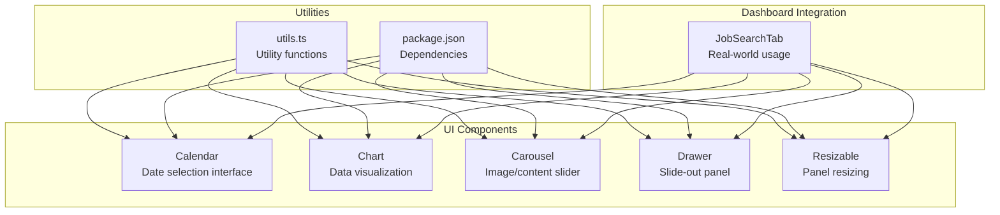
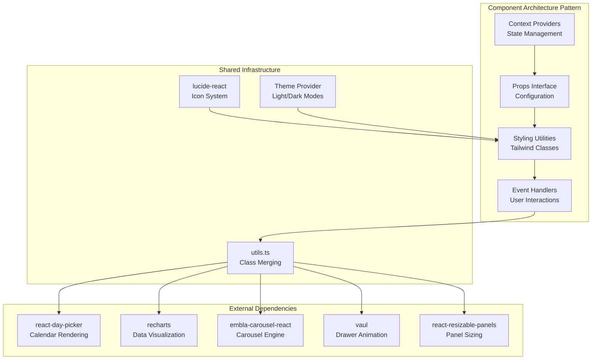
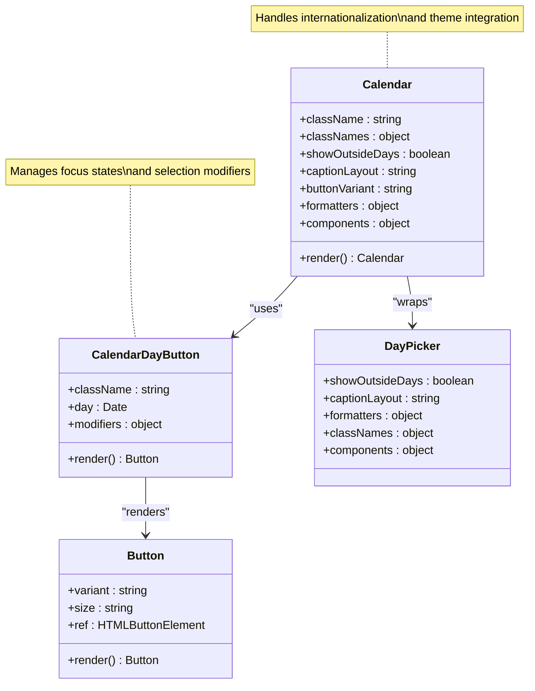
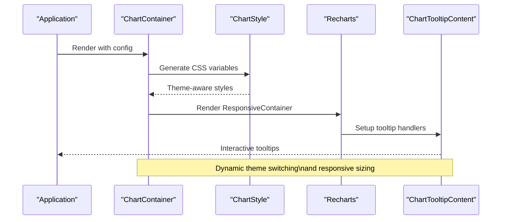
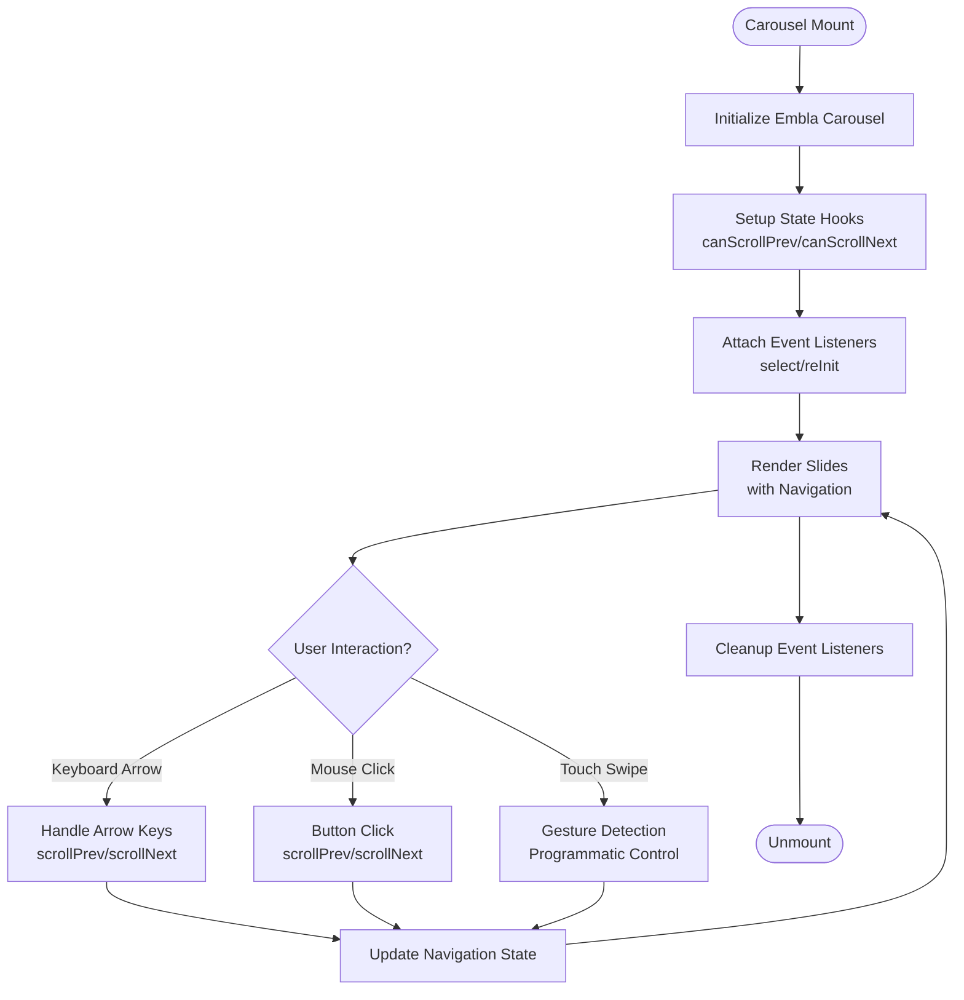
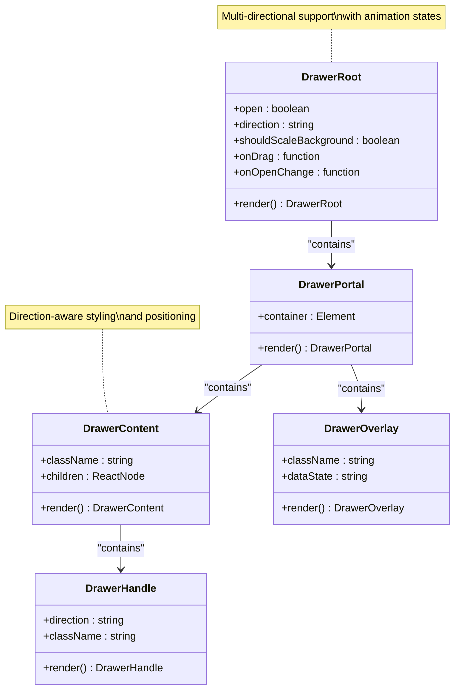
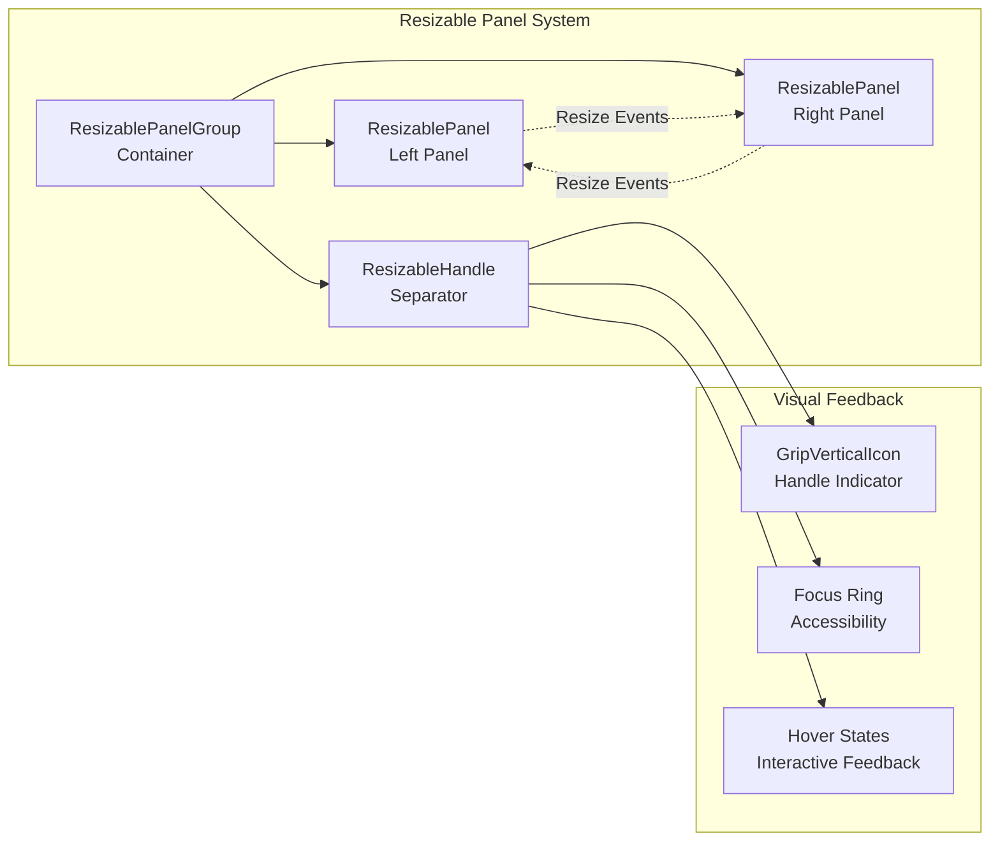

# Specialized Components

<cite>
**Referenced Files in This Document**
- [calendar.tsx](file://src/components/ui/calendar.tsx)
- [chart.tsx](file://src/components/ui/chart.tsx)
- [carousel.tsx](file://src/components/ui/carousel.tsx)
- [drawer.tsx](file://src/components/ui/drawer.tsx)
- [resizable.tsx](file://src/components/ui/resizable.tsx)
- [utils.ts](file://src/lib/utils.ts)
- [package.json](file://package.json)
- [job-search-tab.tsx](file://src/components/dashboard/job-search-tab.tsx)
</cite>

## Table of Contents
1. [Introduction](#introduction)
2. [Project Structure](#project-structure)
3. [Core Components](#core-components)
4. [Architecture Overview](#architecture-overview)
5. [Detailed Component Analysis](#detailed-component-analysis)
6. [Dependency Analysis](#dependency-analysis)
7. [Performance Considerations](#performance-considerations)
8. [Troubleshooting Guide](#troubleshooting-guide)
9. [Conclusion](#conclusion)

## Introduction
This document provides comprehensive technical documentation for five specialized UI components: Calendar, Chart, Carousel, Drawer, and Resizable. These components are designed to enhance user interaction and data presentation within the job search dashboard. Each component offers advanced features, flexible configuration options, and robust integration patterns suitable for modern React applications.

The components leverage external libraries while maintaining consistent styling through shared utility functions and Tailwind CSS classes. They support responsive design patterns, accessibility standards, and performance optimization techniques essential for production environments.

## Project Structure
The specialized components are organized within the UI component library under the `src/components/ui/` directory. Each component maintains a focused responsibility with clear export boundaries and consistent internal architecture.



**Diagram sources**
- [calendar.tsx:1-221](file://src/components/ui/calendar.tsx#L1-L221)
- [chart.tsx:1-375](file://src/components/ui/chart.tsx#L1-L375)
- [carousel.tsx:1-240](file://src/components/ui/carousel.tsx#L1-L240)
- [drawer.tsx:1-136](file://src/components/ui/drawer.tsx#L1-L136)
- [resizable.tsx:1-52](file://src/components/ui/resizable.tsx#L1-L52)
- [utils.ts:1-7](file://src/lib/utils.ts#L1-L7)
- [package.json:1-53](file://package.json#L1-L53)

**Section sources**
- [calendar.tsx:1-221](file://src/components/ui/calendar.tsx#L1-L221)
- [chart.tsx:1-375](file://src/components/ui/chart.tsx#L1-L375)
- [carousel.tsx:1-240](file://src/components/ui/carousel.tsx#L1-L240)
- [drawer.tsx:1-136](file://src/components/ui/drawer.tsx#L1-L136)
- [resizable.tsx:1-52](file://src/components/ui/resizable.tsx#L1-L52)
- [utils.ts:1-7](file://src/lib/utils.ts#L1-L7)
- [package.json:1-53](file://package.json#L1-L53)

## Core Components
This section provides an overview of each specialized component's primary functionality and key characteristics.

### Calendar Component
The Calendar component provides an internationalized date picker interface built on react-day-picker. It offers extensive customization options for appearance, behavior, and accessibility while maintaining keyboard navigation support.

Key capabilities include:
- Month/year navigation with animated transitions
- Range selection and single date selection modes
- Internationalization support with locale-aware formatting
- Customizable button styles and visual themes
- Accessibility-compliant keyboard navigation
- Responsive layout adaptation for different screen sizes

### Chart Component
The Chart system provides a comprehensive data visualization framework powered by Recharts. It includes container management, theme-aware styling, and reusable tooltip and legend components.

Primary features encompass:
- Responsive container with automatic dimension handling
- Theme-aware color management for light/dark modes
- Configurable tooltip formatting and positioning
- Legend customization with icon support
- Extensible configuration system for chart items
- Performance-optimized rendering pipeline

### Carousel Component
The Carousel implements a feature-rich image and content slider using Embla Carousel. It provides smooth animations, gesture support, and comprehensive accessibility features.

Notable features include:
- Horizontal and vertical orientation support
- Keyboard navigation with arrow keys
- Plugin architecture for extended functionality
- Gesture detection for touch devices
- Automatic slide synchronization
- Accessible ARIA attributes and roles

### Drawer Component
The Drawer component delivers a sophisticated slide-out panel system using Vaul. It supports multiple directions, smooth animations, and seamless integration with existing layouts.

Core capabilities:
- Multi-directional sliding (top, bottom, left, right)
- Smooth entrance/exit animations with fade effects
- Overlay management and backdrop handling
- Portal-based rendering for proper stacking context
- Touch-friendly handles with visual indicators
- Responsive breakpoint adaptation

### Resizable Component
The Resizable system enables dynamic panel resizing with precise control and visual feedback. It integrates seamlessly with layout systems and provides intuitive user interaction.

Key features:
- Bidirectional resizing (horizontal/vertical)
- Visual grip handles with hover states
- Programmatic resize control
- Orientation-aware styling
- Focus management for accessibility
- Consistent spacing and alignment

**Section sources**
- [calendar.tsx:18-180](file://src/components/ui/calendar.tsx#L18-L180)
- [chart.tsx:42-82](file://src/components/ui/chart.tsx#L42-L82)
- [carousel.tsx:43-131](file://src/components/ui/carousel.tsx#L43-L131)
- [drawer.tsx:8-73](file://src/components/ui/drawer.tsx#L8-L73)
- [resizable.tsx:6-49](file://src/components/ui/resizable.tsx#L6-L49)

## Architecture Overview
The specialized components follow a consistent architectural pattern emphasizing composition, context management, and utility-driven styling.



**Diagram sources**
- [calendar.tsx:3-16](file://src/components/ui/calendar.tsx#L3-L16)
- [chart.tsx:3-7](file://src/components/ui/chart.tsx#L3-L7)
- [carousel.tsx:2-8](file://src/components/ui/carousel.tsx#L2-L8)
- [drawer.tsx:3-6](file://src/components/ui/drawer.tsx#L3-L6)
- [resizable.tsx:1-4](file://src/components/ui/resizable.tsx#L1-L4)
- [utils.ts:1-7](file://src/lib/utils.ts#L1-L7)

The architecture emphasizes:
- **Composition over inheritance**: Each component composes smaller, focused pieces
- **Context isolation**: State management remains local to component boundaries
- **Utility-first styling**: Consistent class merging through shared utilities
- **External library integration**: Clean abstraction layers around third-party dependencies

## Detailed Component Analysis

### Calendar Component Analysis
The Calendar component serves as a comprehensive date selection interface with extensive customization capabilities.



**Diagram sources**
- [calendar.tsx:18-221](file://src/components/ui/calendar.tsx#L18-L221)

Key implementation patterns:
- **Internationalization**: Locale-aware month formatting and caption layouts
- **Theme integration**: CSS custom properties for color management
- **Accessibility**: Proper ARIA attributes and keyboard navigation
- **Responsive design**: Adaptive layouts for different screen sizes

Advanced configuration options include:
- Custom button variants and sizes
- Formatted caption layouts
- Outside day visibility controls
- Component-level customization hooks

**Section sources**
- [calendar.tsx:18-180](file://src/components/ui/calendar.tsx#L18-L180)
- [calendar.tsx:182-221](file://src/components/ui/calendar.tsx#L182-L221)

### Chart Component Analysis
The Chart system provides a sophisticated data visualization framework with theme-aware styling and comprehensive configuration options.



**Diagram sources**
- [chart.tsx:42-82](file://src/components/ui/chart.tsx#L42-L82)
- [chart.tsx:84-115](file://src/components/ui/chart.tsx#L84-L115)
- [chart.tsx:119-271](file://src/components/ui/chart.tsx#L119-L271)

Core architectural elements:
- **ChartContext**: Centralized configuration management
- **ChartStyle**: Dynamic CSS variable generation for themes
- **ChartTooltipContent**: Advanced tooltip formatting and positioning
- **ChartLegendContent**: Customizable legend rendering

Configuration patterns:
- **Theme-aware colors**: Separate light/dark mode color definitions
- **Dynamic sizing**: Initial dimensions with responsive container support
- **Extensible payloads**: Flexible data structure handling

**Section sources**
- [chart.tsx:26-40](file://src/components/ui/chart.tsx#L26-L40)
- [chart.tsx:42-82](file://src/components/ui/chart.tsx#L42-L82)
- [chart.tsx:84-115](file://src/components/ui/chart.tsx#L84-L115)
- [chart.tsx:119-271](file://src/components/ui/chart.tsx#L119-L271)
- [chart.tsx:273-328](file://src/components/ui/chart.tsx#L273-L328)
- [chart.tsx:330-365](file://src/components/ui/chart.tsx#L330-L365)

### Carousel Component Analysis
The Carousel component implements a high-performance slider system with comprehensive gesture and keyboard support.



**Diagram sources**
- [carousel.tsx:52-103](file://src/components/ui/carousel.tsx#L52-L103)
- [carousel.tsx:76-87](file://src/components/ui/carousel.tsx#L76-L87)

Implementation highlights:
- **Orientation flexibility**: Horizontal/vertical axis support
- **State synchronization**: Real-time navigation state updates
- **Event management**: Comprehensive event listener lifecycle
- **Accessibility compliance**: Keyboard navigation and ARIA roles

Navigation patterns:
- **Programmatic control**: API-based slide manipulation
- **Automatic state updates**: Real-time navigation availability
- **Plugin architecture**: Extensible functionality through plugins

**Section sources**
- [carousel.tsx:15-41](file://src/components/ui/carousel.tsx#L15-L41)
- [carousel.tsx:43-131](file://src/components/ui/carousel.tsx#L43-L131)
- [carousel.tsx:133-170](file://src/components/ui/carousel.tsx#L133-L170)
- [carousel.tsx:172-230](file://src/components/ui/carousel.tsx#L172-L230)

### Drawer Component Analysis
The Drawer component provides a sophisticated slide-out panel system with smooth animations and multi-directional support.



**Diagram sources**
- [drawer.tsx:8-12](file://src/components/ui/drawer.tsx#L8-L12)
- [drawer.tsx:48-73](file://src/components/ui/drawer.tsx#L48-L73)
- [drawer.tsx:20-24](file://src/components/ui/drawer.tsx#L20-L24)

Key architectural features:
- **Portal rendering**: Proper DOM stacking context management
- **Direction-aware styling**: CSS selectors for different slide directions
- **Animation orchestration**: Smooth entrance/exit transitions
- **Overlay management**: Background dimming and backdrop handling

Animation patterns:
- **Fade transitions**: Opacity-based entrance/exit effects
- **Directional movement**: Position-based slide animations
- **Handle indicators**: Visual cues for drag interactions

**Section sources**
- [drawer.tsx:8-73](file://src/components/ui/drawer.tsx#L8-L73)
- [drawer.tsx:75-122](file://src/components/ui/drawer.tsx#L75-L122)

### Resizable Component Analysis
The Resizable system enables dynamic panel resizing with precise control and visual feedback mechanisms.



**Diagram sources**
- [resizable.tsx:6-49](file://src/components/ui/resizable.tsx#L6-L49)

System architecture:
- **Panel grouping**: Logical container for resizable sections
- **Handle mechanics**: Interactive separator with visual indicators
- **Orientation awareness**: CSS classes for horizontal/vertical modes
- **Focus management**: Keyboard accessibility and visual feedback

Interaction patterns:
- **Drag gestures**: Precise resize control with snap points
- **Visual indicators**: Handle grips and hover states
- **Programmatic control**: API-based resize operations
- **Accessibility support**: Keyboard navigation and screen reader compatibility

**Section sources**
- [resizable.tsx:6-49](file://src/components/ui/resizable.tsx#L6-L49)

## Dependency Analysis
The specialized components rely on a carefully curated set of external dependencies that enable their advanced functionality while maintaining performance and compatibility.

```mermaid
graph TB
subgraph "Core Dependencies"
React["react@^19.2.4<br/>Runtime"]
Lucide["lucide-react@^1.6.0<br/>Icons"]
Tailwind["tailwind-merge@^3.5.0<br/>CSS Merging"]
end
subgraph "Calendar"
RDP["react-day-picker@^9.14.0<br/>Date Picker"]
end
subgraph "Charts"
Recharts["recharts@^3.8.0<br/>Visualization"]
Redux["@reduxjs/toolkit@^1.9.0<br/>State Management"]
end
subgraph "Carousel"
Embla["embla-carousel-react@^8.6.0<br/>Slider Engine"]
end
subgraph "Drawers"
Vaul["vaul@^1.1.2<br/>Slide Animations"]
end
subgraph "Panels"
Panels["react-resizable-panels@^4.7.6<br/>Panel Sizing"]
end
subgraph "Utilities"
CLSX["clsx@^2.1.1<br/>Class Merging"]
end
React --> RDP
React --> Recharts
React --> Embla
React --> Vaul
React --> Panels
Lucide --> RDP
Lucide --> Embla
Lucide --> Vaul
Lucide --> Panels
Tailwind --> CLSX
CLSX --> Tailwind
Recharts --> Redux
```

**Diagram sources**
- [package.json:14-39](file://package.json#L14-L39)

Dependency management strategies:
- **Version pinning**: Specific versions for stability and predictability
- **Peer dependencies**: Shared React instances across components
- **Tree shaking**: Modular imports to minimize bundle size
- **CSS optimization**: Tailwind merge for efficient class combination

Integration patterns:
- **Component composition**: Each dependency serves a specific purpose
- **Utility layer**: Shared utilities reduce duplication across components
- **Theme integration**: Consistent styling through shared infrastructure

**Section sources**
- [package.json:14-39](file://package.json#L14-L39)
- [utils.ts:1-7](file://src/lib/utils.ts#L1-L7)

## Performance Considerations
Each specialized component implements various optimization techniques to ensure smooth performance across different device types and usage scenarios.

### Memory Management Strategies
- **Event listener cleanup**: Proper removal of event handlers during component unmount
- **State optimization**: Minimal state updates through selective re-renders
- **Reference management**: Proper cleanup of DOM references and timers
- **Context isolation**: Localized state prevents unnecessary prop drilling

### Rendering Optimizations
- **Lazy loading**: Components defer heavy operations until needed
- **Virtualization**: Large datasets handled efficiently through virtual scrolling
- **Debouncing**: Input handlers use debounced updates for better responsiveness
- **Memoization**: Expensive computations cached through React.memo and useMemo

### Bundle Size Considerations
- **Tree shaking**: Modular imports allow unused code elimination
- **Code splitting**: Large dependencies loaded on demand
- **Icon optimization**: SVG icons included only when used
- **CSS optimization**: Tailwind utilities merged efficiently

### Accessibility and Responsiveness
- **Responsive breakpoints**: Mobile-first design with adaptive layouts
- **Keyboard navigation**: Full keyboard accessibility support
- **Screen reader compatibility**: ARIA attributes and semantic markup
- **Touch optimization**: Gesture recognition for mobile devices

## Troubleshooting Guide
Common issues and their solutions when working with specialized components.

### Calendar Component Issues
**Problem**: Incorrect date formatting or localization
- **Solution**: Verify locale settings and ensure proper formatters are provided
- **Debug**: Check `captionLayout` and `formatters.formatMonthDropdown` configuration

**Problem**: Navigation buttons not responding
- **Solution**: Ensure proper button variant assignment and event handler attachment
- **Debug**: Verify `buttonVariant` prop and component registration

### Chart Component Issues
**Problem**: Colors not updating in theme changes
- **Solution**: Confirm `ChartContainer` wraps all chart components
- **Debug**: Check CSS variable generation and theme provider configuration

**Problem**: Tooltips not displaying correctly
- **Solution**: Verify `ChartTooltipContent` props and payload structure
- **Debug**: Inspect `getPayloadConfigFromPayload` function execution

### Carousel Component Issues
**Problem**: Slides not animating smoothly
- **Solution**: Check Embla Carousel initialization and plugin configurations
- **Debug**: Verify `orientation` prop and axis alignment

**Problem**: Navigation controls disabled unexpectedly
- **Solution**: Review `canScrollPrev/canScrollNext` state updates
- **Debug**: Examine event listener attachment and API state management

### Drawer Component Issues
**Problem**: Drawer not appearing or disappearing
- **Solution**: Ensure proper portal rendering and overlay management
- **Debug**: Check `DrawerPortal` and `DrawerOverlay` component mounting

**Problem**: Animation glitches or jank
- **Solution**: Verify CSS transitions and animation timing
- **Debug**: Review `data-vaul-drawer-direction` attribute updates

### Resizable Component Issues
**Problem**: Panels not resizing correctly
- **Solution**: Check `ResizablePanelGroup` orientation and handle configuration
- **Debug**: Verify `withHandle` prop and visual grip rendering

**Problem**: Resize handle not visible
- **Solution**: Ensure proper CSS class application and focus states
- **Debug**: Check `aria-orientation` attribute and hover state management

**Section sources**
- [calendar.tsx:42-46](file://src/components/ui/calendar.tsx#L42-L46)
- [chart.tsx:64-72](file://src/components/ui/chart.tsx#L64-L72)
- [carousel.tsx:94-103](file://src/components/ui/carousel.tsx#L94-L103)
- [drawer.tsx:54-71](file://src/components/ui/drawer.tsx#L54-L71)
- [resizable.tsx:34-49](file://src/components/ui/resizable.tsx#L34-L49)

## Conclusion
The specialized components (Calendar, Chart, Carousel, Drawer, and Resizable) represent a cohesive system of advanced UI building blocks designed for modern React applications. Each component demonstrates:

- **Architectural excellence**: Clean separation of concerns with proper context management
- **Performance optimization**: Carefully implemented strategies for memory management and rendering efficiency
- **Accessibility compliance**: Comprehensive keyboard navigation and screen reader support
- **Responsive design**: Adaptive layouts that work across all device types
- **Extensibility**: Flexible configuration options and plugin architectures

The components integrate seamlessly through shared utilities and consistent styling patterns, while external dependencies are carefully managed to maintain optimal bundle sizes and runtime performance. Their implementation provides a solid foundation for building sophisticated user interfaces with minimal boilerplate code.

These components serve as excellent examples of how to balance functionality, performance, and maintainability in modern React component development, offering developers powerful tools for creating engaging and accessible user experiences.