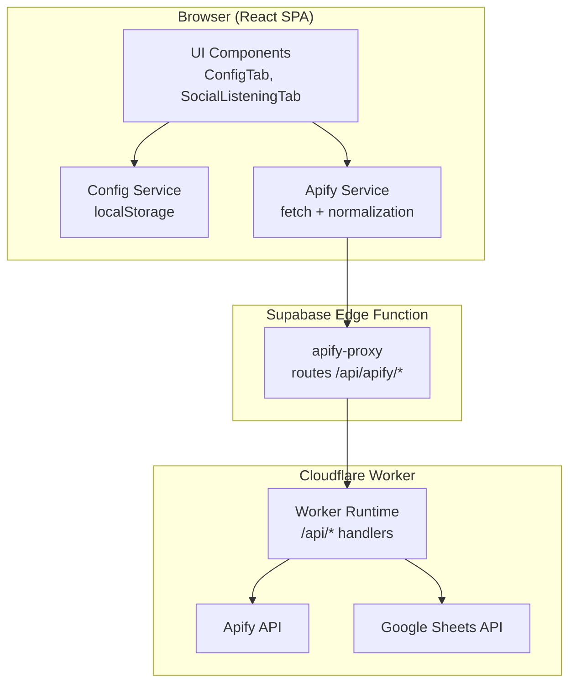
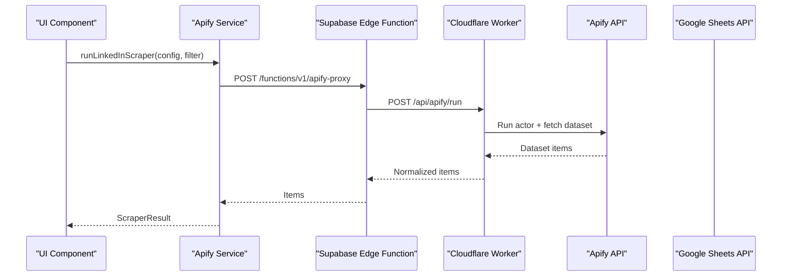
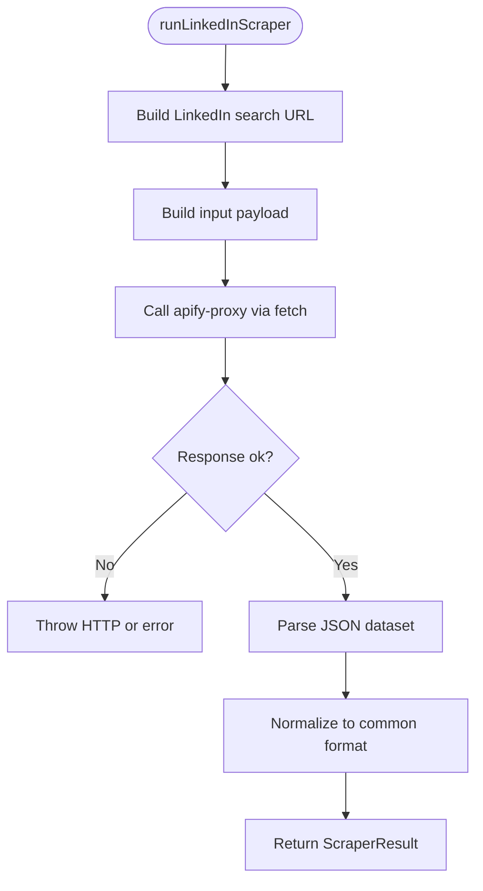
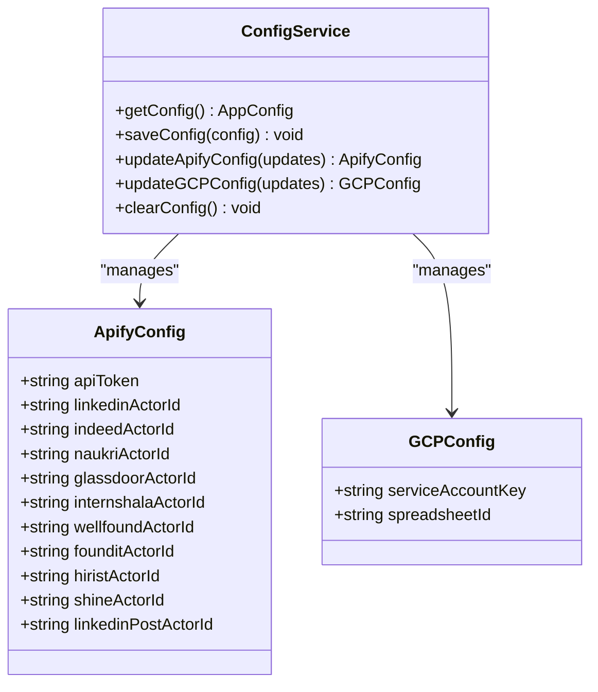
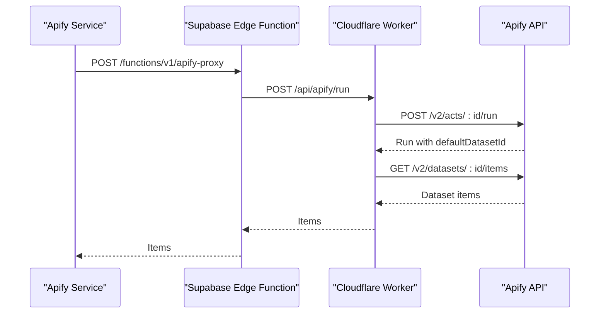
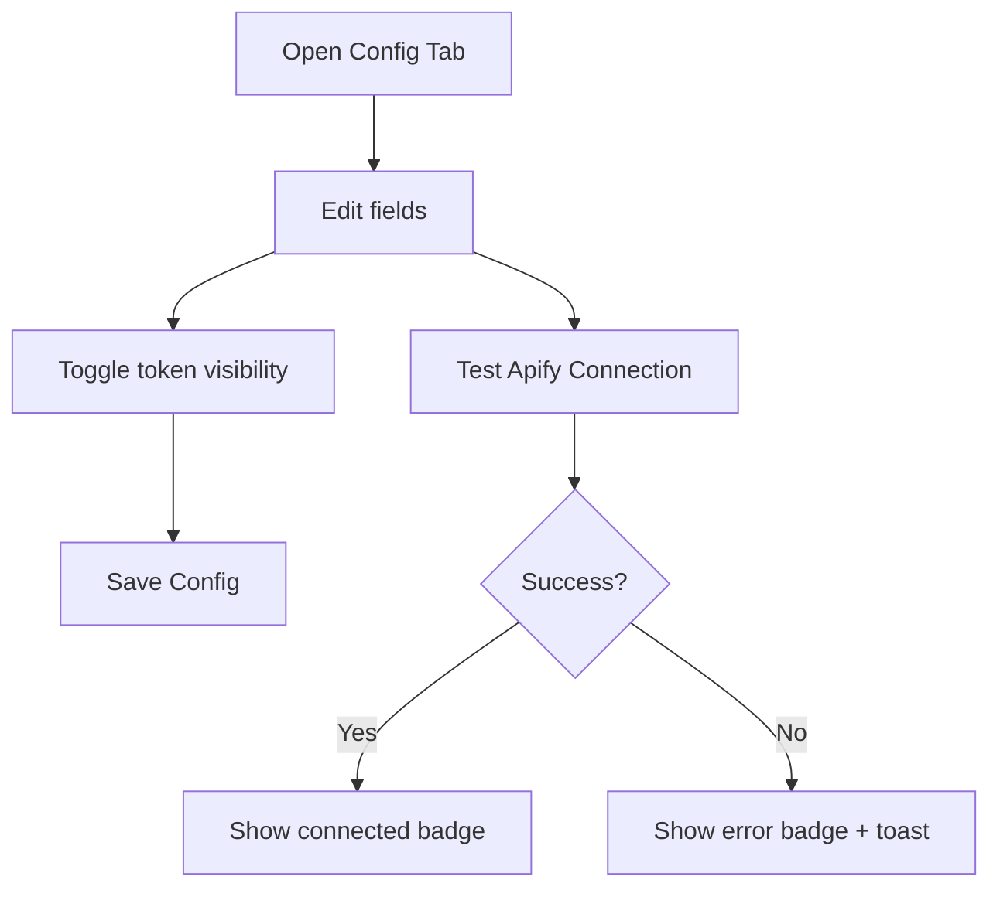
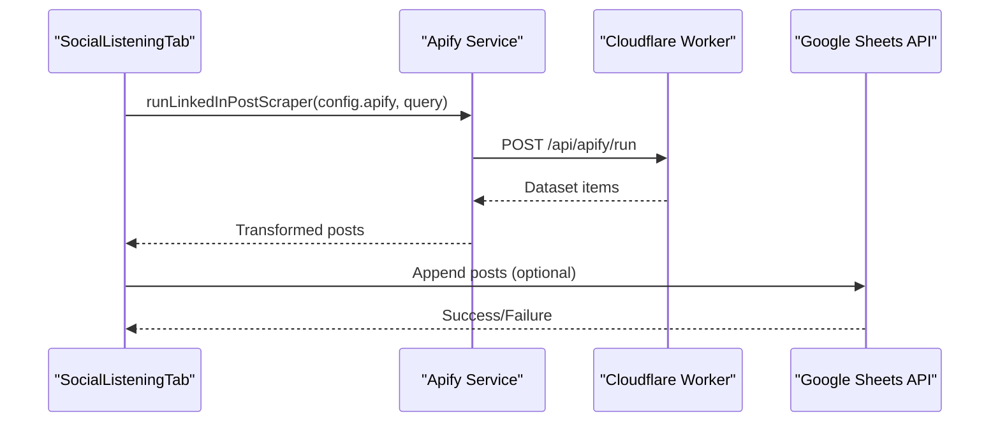
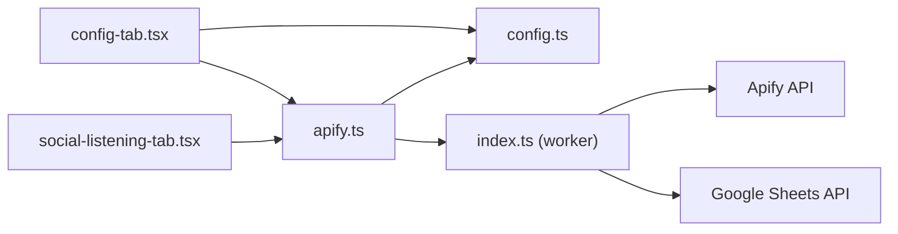

# Apify Integration

<cite>
**Referenced Files in This Document**
- [apify.ts](file://src/services/apify.ts)
- [config.ts](file://src/services/config.ts)
- [config-tab.tsx](file://src/components/dashboard/config-tab.tsx)
- [social-listening-tab.tsx](file://src/components/dashboard/social-listening-tab.tsx)
- [index.ts](file://worker/index.ts)
- [index.ts](file://src/types/index.ts)
- [package.json](file://package.json)
</cite>

## Table of Contents
1. [Introduction](#introduction)
2. [Project Structure](#project-structure)
3. [Core Components](#core-components)
4. [Architecture Overview](#architecture-overview)
5. [Detailed Component Analysis](#detailed-component-analysis)
6. [Dependency Analysis](#dependency-analysis)
7. [Performance Considerations](#performance-considerations)
8. [Troubleshooting Guide](#troubleshooting-guide)
9. [Conclusion](#conclusion)

## Introduction
This document explains the Apify integration system used by the job dashboard to automate job discovery across multiple job boards and to perform social listening on LinkedIn. The integration proxies requests through a Cloudflare Worker-backed Supabase Edge Function to Apify, while storing configuration locally in the browser and backing up results to Google Sheets.

## Project Structure
The Apify integration spans several layers:
- Frontend services that orchestrate scraping and normalization
- Local configuration management
- Cloudflare Worker that acts as a secure proxy to Apify and Google Sheets
- UI components for configuration and social listening

**Diagram sources**
- [apify.ts:1-348](file://src/services/apify.ts#L1-L348)
- [config.ts:1-66](file://src/services/config.ts#L1-L66)
- [config-tab.tsx:1-502](file://src/components/dashboard/config-tab.tsx#L1-L502)
- [social-listening-tab.tsx:1-276](file://src/components/dashboard/social-listening-tab.tsx#L1-L276)
- [index.ts:175-202](file://worker/index.ts#L175-L202)

**Section sources**
- [apify.ts:1-348](file://src/services/apify.ts#L1-L348)
- [config.ts:1-66](file://src/services/config.ts#L1-L66)
- [config-tab.tsx:1-502](file://src/components/dashboard/config-tab.tsx#L1-L502)
- [social-listening-tab.tsx:1-276](file://src/components/dashboard/social-listening-tab.tsx#L1-L276)
- [index.ts:1-497](file://worker/index.ts#L1-L497)

## Core Components
- Apify Service: Orchestrates scraping via a proxy, normalizes outputs, and transforms items to internal types.
- Configuration Service: Manages Apify and Google Cloud credentials in localStorage with defaults and updates.
- Cloudflare Worker: Implements secure routes for Apify and Google Sheets, including token acquisition and dataset retrieval.
- UI Components: Provide configuration forms, connection testing, and social listening workflows.

**Section sources**
- [apify.ts:1-348](file://src/services/apify.ts#L1-L348)
- [config.ts:1-66](file://src/services/config.ts#L1-L66)
- [index.ts:175-202](file://worker/index.ts#L175-L202)

## Architecture Overview
The system uses a proxy model to keep secrets out of the browser:
- The frontend sends requests to a Supabase Edge Function endpoint.
- The Edge Function forwards to the Cloudflare Worker, which authenticates with Apify and Google Sheets.
- Results are normalized and returned to the frontend.

**Diagram sources**
- [apify.ts:58-81](file://src/services/apify.ts#L58-L81)
- [index.ts:191-202](file://worker/index.ts#L191-L202)

## Detailed Component Analysis

### Apify Service
Responsibilities:
- Test Apify connectivity via the proxy.
- Build platform-specific inputs and run scrapers.
- Normalize diverse Apify outputs to a common format.
- Transform items to internal Job and LinkedInHiringPost types.

Key behaviors:
- Uses a Supabase Edge Function endpoint to proxy Apify calls.
- Applies timeouts and error handling during dataset retrieval.
- Normalizes fields across platforms (e.g., title, company, location, URL, date, type, description, salary).
- Generates deterministic IDs for deduplication.

**Diagram sources**
- [apify.ts:84-113](file://src/services/apify.ts#L84-L113)

**Section sources**
- [apify.ts:25-42](file://src/services/apify.ts#L25-L42)
- [apify.ts:58-81](file://src/services/apify.ts#L58-L81)
- [apify.ts:84-113](file://src/services/apify.ts#L84-L113)
- [apify.ts:115-146](file://src/services/apify.ts#L115-L146)
- [apify.ts:148-272](file://src/services/apify.ts#L148-L272)
- [apify.ts:288-299](file://src/services/apify.ts#L288-L299)
- [apify.ts:301-347](file://src/services/apify.ts#L301-L347)

### Configuration Management
Responsibilities:
- Provide default Apify actor IDs for multiple platforms.
- Persist and merge configuration in localStorage.
- Expose update functions for Apify and GCP settings.

Highlights:
- Defaults include actor IDs for LinkedIn Jobs, Indeed, Naukri, Glassdoor, Internshala, Wellfound, Foundit, Hirist, Shine, and LinkedIn Post Scraper.
- Updates are merged with existing stored config.

**Diagram sources**
- [config.ts:26-65](file://src/services/config.ts#L26-L65)
- [index.ts:69-91](file://src/types/index.ts#L69-L91)

**Section sources**
- [config.ts:7-19](file://src/services/config.ts#L7-L19)
- [config.ts:26-65](file://src/services/config.ts#L26-L65)
- [index.ts:69-91](file://src/types/index.ts#L69-L91)

### Cloudflare Worker (Proxy and APIs)
Responsibilities:
- Act as a secure proxy to Apify and Google Sheets.
- Implement Apify routes: test and run.
- Implement Google Sheets routes: test, append, update status, wipe.
- Manage access tokens for Google Sheets using RS256 JWT.

Key routes:
- Apify: /api/apify/test, /api/apify/run
- Google Sheets: /api/config/test-gcp, /api/jobs/append, /api/posts/append, /api/wipe

**Diagram sources**
- [index.ts:151-172](file://worker/index.ts#L151-L172)
- [index.ts:191-202](file://worker/index.ts#L191-L202)

**Section sources**
- [index.ts:13-24](file://worker/index.ts#L13-L24)
- [index.ts:151-172](file://worker/index.ts#L151-L172)
- [index.ts:180-202](file://worker/index.ts#L180-L202)
- [index.ts:392-405](file://worker/index.ts#L392-L405)

### UI Components

#### Configuration Tab
- Provides fields for Apify API token and actor IDs for multiple platforms.
- Supports toggling token visibility and testing connectivity.
- Saves configuration to localStorage and clears it when needed.

**Diagram sources**
- [config-tab.tsx:120-278](file://src/components/dashboard/config-tab.tsx#L120-L278)

**Section sources**
- [config-tab.tsx:134-168](file://src/components/dashboard/config-tab.tsx#L134-L168)
- [config-tab.tsx:170-237](file://src/components/dashboard/config-tab.tsx#L170-L237)
- [config-tab.tsx:240-276](file://src/components/dashboard/config-tab.tsx#L240-L276)

#### Social Listening Tab
- Builds boolean search queries for LinkedIn posts.
- Runs the LinkedIn Post Scraper and displays results.
- Integrates with Google Sheets for persistence.

**Diagram sources**
- [social-listening-tab.tsx:62-95](file://src/components/dashboard/social-listening-tab.tsx#L62-L95)
- [apify.ts:288-299](file://src/services/apify.ts#L288-L299)

**Section sources**
- [social-listening-tab.tsx:36-95](file://src/components/dashboard/social-listening-tab.tsx#L36-L95)
- [apify.ts:288-299](file://src/services/apify.ts#L288-L299)

## Dependency Analysis
- Frontend depends on:
  - Apify Service for scraping and normalization.
  - Configuration Service for local storage.
  - Cloudflare Worker routes for secure API access.
- Backend depends on:
  - Apify API for actor runs and datasets.
  - Google Sheets API for persistence.

**Diagram sources**
- [apify.ts:1-348](file://src/services/apify.ts#L1-L348)
- [config.ts:1-66](file://src/services/config.ts#L1-L66)
- [config-tab.tsx:1-502](file://src/components/dashboard/config-tab.tsx#L1-L502)
- [social-listening-tab.tsx:1-276](file://src/components/dashboard/social-listening-tab.tsx#L1-L276)
- [index.ts:1-497](file://worker/index.ts#L1-L497)

**Section sources**
- [package.json:12-37](file://package.json#L12-L37)
- [apify.ts:1-348](file://src/services/apify.ts#L1-L348)
- [index.ts:1-497](file://worker/index.ts#L1-L497)

## Performance Considerations
- Timeout configuration: The proxy sets a 300-second timeout for Apify runs to accommodate long-running scrapers.
- Deduplication: Job IDs are generated deterministically to prevent duplicates across runs.
- Batch writes: Google Sheets backups use append operations to minimize overhead.
- Caching: Access tokens for Google Sheets are cached with expiry to reduce repeated token generation.

[No sources needed since this section provides general guidance]

## Troubleshooting Guide

### API Token Setup
- Obtain the token from the Apify Console Integrations page.
- Use the “Test Connection” button in the Configuration tab to validate.
- The token is stored locally in the browser; ensure you have saved it before testing.

**Section sources**
- [config-tab.tsx:157-167](file://src/components/dashboard/config-tab.tsx#L157-L167)
- [apify.ts:25-42](file://src/services/apify.ts#L25-L42)

### Actor ID Configuration
- Default actor IDs are pre-populated for:
  - LinkedIn Jobs: curated actor ID
  - Indeed: curated actor ID
  - Naukri: curated actor ID
  - Glassdoor: curated actor ID
  - Internshala: curated actor ID
  - Wellfound: curated actor ID
  - Foundit: curated actor ID
  - Hirist: curated actor ID
  - Shine: curated actor ID
  - LinkedIn Post Scraper: official actor ID

Validation requirements:
- Ensure the actor IDs are valid and accessible under your Apify account.
- Test each actor by running a small scrape from the UI after saving configuration.

**Section sources**
- [config.ts:7-19](file://src/services/config.ts#L7-L19)
- [config-tab.tsx:170-237](file://src/components/dashboard/config-tab.tsx#L170-L237)

### Connection Testing Mechanism
- Apify: The UI calls a test function that posts to the proxy with a minimal actor input. The backend verifies connectivity against the Apify API.
- Google Sheets: The UI calls a dedicated test route that attempts to access the spreadsheet using a generated OAuth2 token.

Error handling:
- UI shows badges indicating connection status and toast notifications for failures.
- Errors include network failures, invalid tokens, and HTTP errors.

**Section sources**
- [apify.ts:25-42](file://src/services/apify.ts#L25-L42)
- [config-tab.tsx:43-65](file://src/components/dashboard/config-tab.tsx#L43-L65)
- [index.ts:392-405](file://worker/index.ts#L392-L405)

### Credential Management
- Token visibility: Toggle to show/hide sensitive fields in the UI.
- Secure storage: Credentials are stored in localStorage on the client. No secrets are transmitted to external servers except via the proxy.
- Token masking: The backend masks the Apify token in configuration responses.

Security best practices:
- Limit actor permissions to only what is necessary.
- Rotate tokens periodically.
- Avoid committing configuration to version control.

**Section sources**
- [config-tab.tsx:134-156](file://src/components/dashboard/config-tab.tsx#L134-L156)
- [config-tab.tsx:294-318](file://src/components/dashboard/config-tab.tsx#L294-L318)
- [index.ts:346-352](file://worker/index.ts#L346-L352)

### Common Issues and Fixes
- Rate limiting: Apify may throttle requests. Retry later or adjust search scope.
- Invalid actor IDs: Verify actor IDs in the Apify Console and update in the Configuration tab.
- Network errors: Confirm proxy availability and internet connectivity.
- Google Sheets errors: Ensure the Service Account has editor access to the spreadsheet and the spreadsheet ID is correct.

**Section sources**
- [apify.ts:75-78](file://src/services/apify.ts#L75-L78)
- [index.ts:162-171](file://worker/index.ts#L162-L171)

### Step-by-Step Setup Instructions
1. Create an Apify account and obtain an API token from the Integrations page.
2. Create a Google Cloud project, enable the Google Sheets API, and create a Service Account. Download the JSON key.
3. Create a Google Spreadsheet with sheets named “All_Jobs_Master” and “LinkedIn_Hiring_Posts”. Share it with the Service Account email address.
4. In the Configuration tab, paste your Apify API token and the Google Service Account JSON key. Enter the spreadsheet ID.
5. Click “Test Connection” for both Apify and Google Sheets. Both should show “Connected”.
6. Navigate to the Job Search or Social Listening tabs to run scrapers.

**Section sources**
- [config-tab.tsx:441-498](file://src/components/dashboard/config-tab.tsx#L441-L498)

## Conclusion
The Apify integration leverages a secure proxy architecture to centralize sensitive credentials and API interactions. By combining configurable actor IDs, robust error handling, and local configuration storage, the system enables reliable job board scraping and social listening workflows. Following the setup and troubleshooting steps ensures smooth operation and secure handling of credentials.