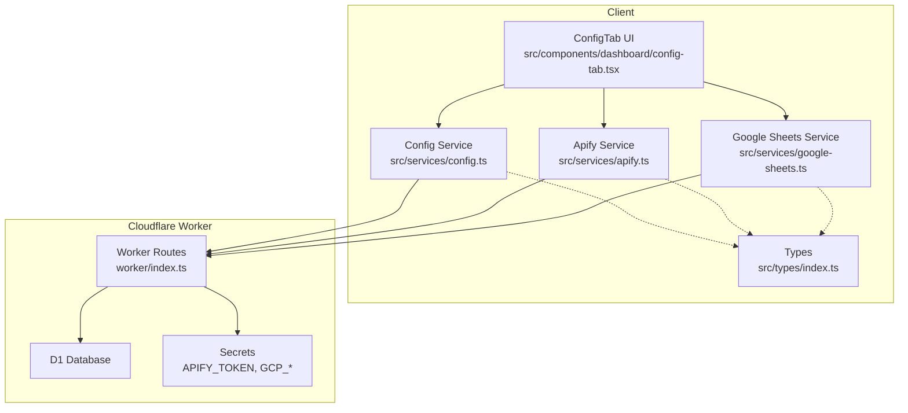
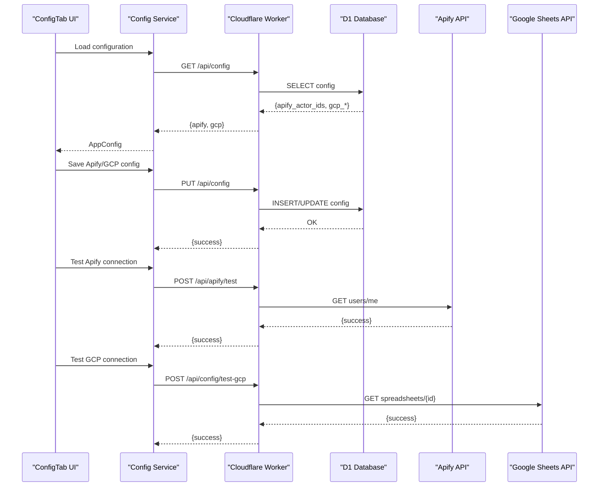
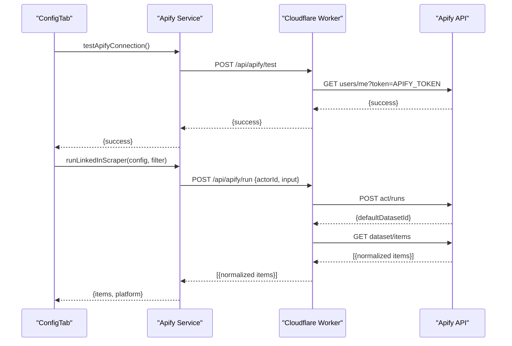
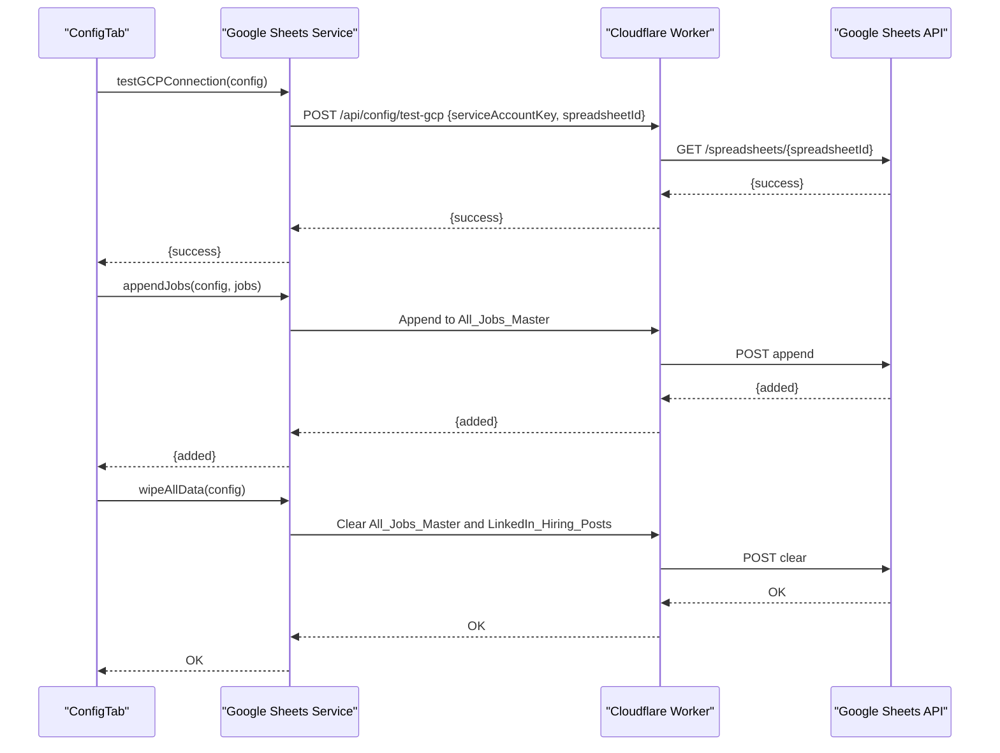
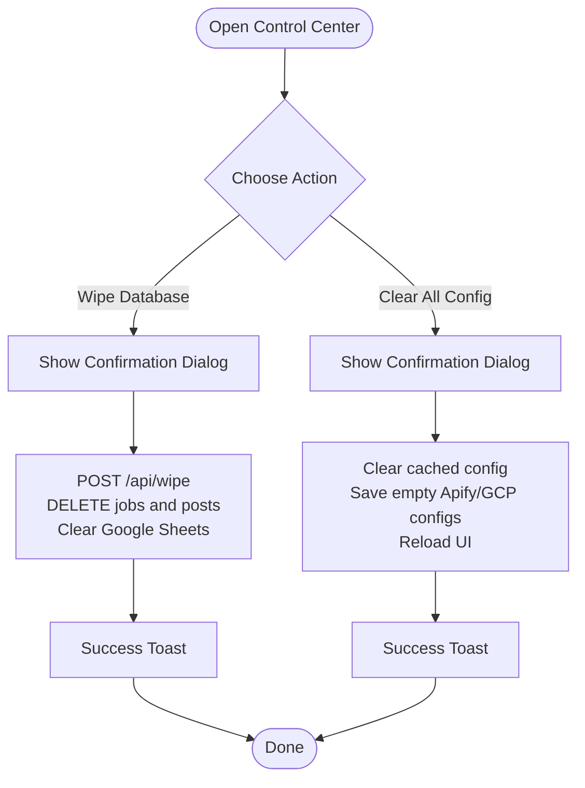
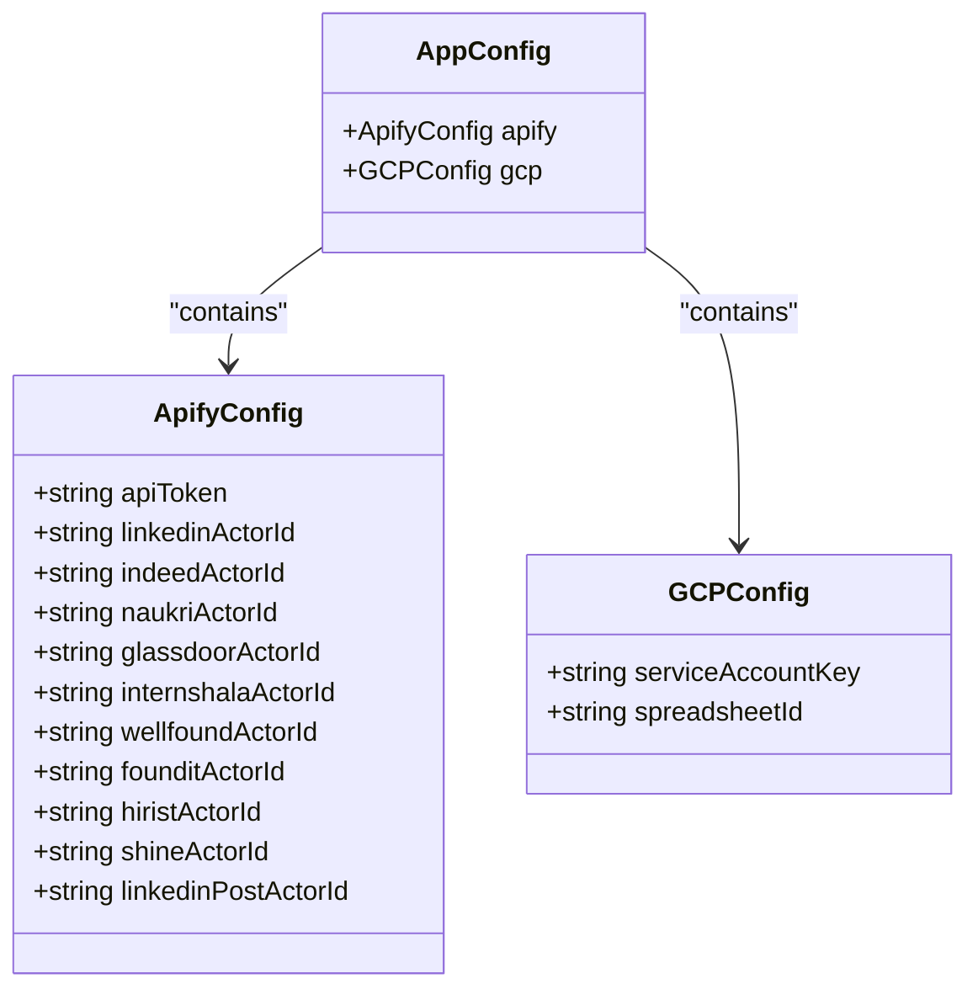
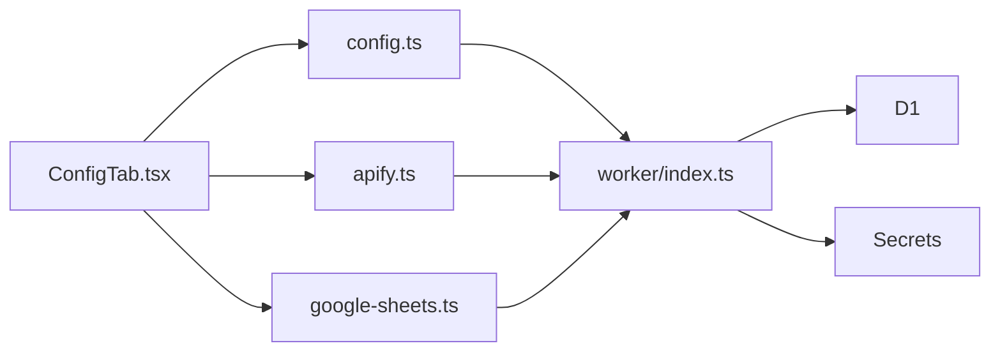

# Configuration Management

<cite>
**Referenced Files in This Document**
- [config.ts](file://src/services/config.ts)
- [apify.ts](file://src/services/apify.ts)
- [google-sheets.ts](file://src/services/google-sheets.ts)
- [config-tab.tsx](file://src/components/dashboard/config-tab.tsx)
- [index.ts](file://worker/index.ts)
- [wrangler.toml](file://wrangler.toml)
- [index.ts](file://src/types/index.ts)
</cite>

## Table of Contents
1. [Introduction](#introduction)
2. [Project Structure](#project-structure)
3. [Core Components](#core-components)
4. [Architecture Overview](#architecture-overview)
5. [Detailed Component Analysis](#detailed-component-analysis)
6. [Dependency Analysis](#dependency-analysis)
7. [Performance Considerations](#performance-considerations)
8. [Troubleshooting Guide](#troubleshooting-guide)
9. [Conclusion](#conclusion)

## Introduction
This document provides comprehensive documentation for the configuration management system powering the job dashboard application. It covers integration with Apify and Google Sheets, control center functionality for data wiping and configuration clearing, configuration persistence mechanisms, and security considerations for storing credentials. It also includes step-by-step setup guides, troubleshooting procedures, and best practices for maintaining secure configurations.

## Project Structure
The configuration management system spans client-side services, a Cloudflare Worker backend, and shared TypeScript types. The key areas are:
- Client-side configuration store and UI controls
- Apify integration for job scraping
- Google Sheets integration for backup and synchronization
- Cloudflare Worker routes handling configuration persistence and API operations
- Shared type definitions for configuration structures

**Diagram sources**
- [config-tab.tsx:1-507](file://src/components/dashboard/config-tab.tsx#L1-L507)
- [config.ts:1-166](file://src/services/config.ts#L1-L166)
- [apify.ts:1-677](file://src/services/apify.ts#L1-L677)
- [google-sheets.ts:1-446](file://src/services/google-sheets.ts#L1-L446)
- [index.ts:1-499](file://worker/index.ts#L1-L499)
- [index.ts:69-91](file://src/types/index.ts#L69-L91)

**Section sources**
- [config-tab.tsx:1-507](file://src/components/dashboard/config-tab.tsx#L1-L507)
- [config.ts:1-166](file://src/services/config.ts#L1-L166)
- [apify.ts:1-677](file://src/services/apify.ts#L1-L677)
- [google-sheets.ts:1-446](file://src/services/google-sheets.ts#L1-L446)
- [index.ts:1-499](file://worker/index.ts#L1-L499)
- [index.ts:69-91](file://src/types/index.ts#L69-L91)

## Core Components
- Configuration Store: Provides default configuration values, loads/saves configuration to/from the server, and exposes update functions for Apify and Google Sheets settings.
- Apify Integration: Handles connection testing, actor runs, and normalization of scraped data into a unified format.
- Google Sheets Integration: Manages service account authentication, spreadsheet access, and bidirectional synchronization of jobs and LinkedIn posts.
- Control Center: Offers destructive operations such as wiping database and spreadsheet data and clearing configuration.
- Persistence and Security: Uses Cloudflare D1 for primary storage, Google Sheets as backup, and secrets management for sensitive tokens.

**Section sources**
- [config.ts:27-100](file://src/services/config.ts#L27-L100)
- [apify.ts:22-30](file://src/services/apify.ts#L22-L30)
- [google-sheets.ts:196-211](file://src/services/google-sheets.ts#L196-L211)
- [config-tab.tsx:105-134](file://src/components/dashboard/config-tab.tsx#L105-L134)
- [index.ts:338-392](file://worker/index.ts#L338-L392)

## Architecture Overview
The configuration system operates through a layered architecture:
- UI Layer: The ConfigTab component renders configuration forms, connection status indicators, and control actions.
- Service Layer: Services encapsulate network operations for Apify and Google Sheets, and manage local configuration updates.
- Worker Layer: Cloudflare Worker routes handle server-side configuration retrieval/saving, Apify proxying, and Google Sheets backup operations.
- Storage Layer: D1 database stores jobs, posts, filters, and configuration key-value pairs; Google Sheets acts as a backup.

**Diagram sources**
- [config-tab.tsx:39-103](file://src/components/dashboard/config-tab.tsx#L39-L103)
- [config.ts:35-69](file://src/services/config.ts#L35-L69)
- [index.ts:339-407](file://worker/index.ts#L339-L407)
- [apify.ts:22-30](file://src/services/apify.ts#L22-L30)
- [google-sheets.ts:196-211](file://src/services/google-sheets.ts#L196-L211)

## Detailed Component Analysis

### Apify Integration
The Apify integration enables connection testing and scraping job listings via Cloudflare Worker routes. The system supports multiple job platforms and normalizes outputs into a unified format.

- API token management: Stored as a secret in the Cloudflare Worker environment; exposed to the UI as a masked value.
- Actor ID configuration: Stored in the database under a dedicated key and merged with defaults.
- Connection testing: Validates Apify token and actor accessibility via the Worker route.
- Scraping: Proxies requests through the Worker to Apify, then returns normalized datasets.

**Diagram sources**
- [apify.ts:22-30](file://src/services/apify.ts#L22-L30)
- [apify.ts:47-63](file://src/services/apify.ts#L47-L63)
- [index.ts:182-204](file://worker/index.ts#L182-L204)
- [index.ts:154-174](file://worker/index.ts#L154-L174)

**Section sources**
- [apify.ts:22-30](file://src/services/apify.ts#L22-L30)
- [apify.ts:66-95](file://src/services/apify.ts#L66-L95)
- [apify.ts:413-442](file://src/services/apify.ts#L413-L442)
- [index.ts:154-174](file://worker/index.ts#L154-L174)
- [index.ts:182-204](file://worker/index.ts#L182-L204)

### Google Sheets Integration
The Google Sheets integration manages service account authentication, spreadsheet access, and bidirectional synchronization of jobs and LinkedIn posts.

- Authentication: Uses RS256 JWT signed with the service account private key; caches access tokens with expiry handling.
- Permissions: Requires editor access to both sheets ("All_Jobs_Master" and "LinkedIn_Hiring_Posts").
- Synchronization: Inserts new records only (deduplication by ID), preserving existing data.

**Diagram sources**
- [google-sheets.ts:196-211](file://src/services/google-sheets.ts#L196-L211)
- [google-sheets.ts:254-292](file://src/services/google-sheets.ts#L254-L292)
- [google-sheets.ts:441-446](file://src/services/google-sheets.ts#L441-L446)
- [index.ts:394-407](file://worker/index.ts#L394-L407)
- [index.ts:106-151](file://worker/index.ts#L106-L151)

**Section sources**
- [google-sheets.ts:104-152](file://src/services/google-sheets.ts#L104-L152)
- [google-sheets.ts:196-211](file://src/services/google-sheets.ts#L196-L211)
- [google-sheets.ts:254-328](file://src/services/google-sheets.ts#L254-L328)
- [google-sheets.ts:441-446](file://src/services/google-sheets.ts#L441-L446)
- [index.ts:48-92](file://worker/index.ts#L48-L92)
- [index.ts:106-151](file://worker/index.ts#L106-L151)

### Control Center Functionality
The control center provides destructive operations for data management and configuration cleanup.

- Wipe Database: Removes all job and LinkedIn post records from D1 and clears both Google Sheets sheets.
- Clear All Config: Clears cached configuration and saves empty values to the server, resetting UI to defaults.

**Diagram sources**
- [config-tab.tsx:105-134](file://src/components/dashboard/config-tab.tsx#L105-L134)
- [index.ts:452-465](file://worker/index.ts#L452-L465)

**Section sources**
- [config-tab.tsx:105-134](file://src/components/dashboard/config-tab.tsx#L105-L134)
- [config-tab.tsx:419-441](file://src/components/dashboard/config-tab.tsx#L419-L441)
- [index.ts:452-465](file://worker/index.ts#L452-L465)

### Configuration Persistence and Security
Configuration persistence combines local caching and server-side storage with strict security boundaries.

- Local storage: Stores Apify API token and actor IDs for quick UI access; sensitive token is masked in the UI.
- Server storage: D1 database persists configuration key-value pairs; Apify token remains server-side secret.
- Secrets management: APIFY_TOKEN and GCP credentials are set via Cloudflare Wrangler secrets.

**Diagram sources**
- [index.ts:69-91](file://src/types/index.ts#L69-L91)
- [config.ts:107-161](file://src/services/config.ts#L107-L161)
- [index.ts:339-392](file://worker/index.ts#L339-L392)
- [wrangler.toml:14-18](file://wrangler.toml#L14-L18)

**Section sources**
- [config.ts:126-161](file://src/services/config.ts#L126-L161)
- [config.ts:35-69](file://src/services/config.ts#L35-L69)
- [index.ts:339-392](file://worker/index.ts#L339-L392)
- [wrangler.toml:14-18](file://wrangler.toml#L14-L18)

## Dependency Analysis
The configuration system exhibits clear separation of concerns with minimal coupling between UI, services, and backend routes.

- Coupling: UI depends on services; services depend on Worker routes; Worker routes depend on D1 and external APIs.
- Cohesion: Each module encapsulates a single responsibility (configuration, Apify, Sheets).
- External dependencies: Apify API, Google Sheets API, Cloudflare D1 and secrets.

**Diagram sources**
- [config-tab.tsx:24-26](file://src/components/dashboard/config-tab.tsx#L24-L26)
- [config.ts:35-69](file://src/services/config.ts#L35-L69)
- [apify.ts:22-30](file://src/services/apify.ts#L22-L30)
- [google-sheets.ts:196-211](file://src/services/google-sheets.ts#L196-L211)
- [index.ts:177-468](file://worker/index.ts#L177-L468)

**Section sources**
- [config-tab.tsx:24-26](file://src/components/dashboard/config-tab.tsx#L24-L26)
- [config.ts:35-69](file://src/services/config.ts#L35-L69)
- [apify.ts:22-30](file://src/services/apify.ts#L22-L30)
- [google-sheets.ts:196-211](file://src/services/google-sheets.ts#L196-L211)
- [index.ts:177-468](file://worker/index.ts#L177-L468)

## Performance Considerations
- Token caching: Google Sheets access tokens are cached with expiry to minimize repeated authentication overhead.
- Deduplication: New records are inserted only if IDs are not already present, reducing write volume.
- Batch operations: D1 batch inserts improve throughput when appending multiple jobs or posts.
- Connection testing: UI tests avoid unnecessary retries by disabling buttons during ongoing checks.

[No sources needed since this section provides general guidance]

## Troubleshooting Guide
Common configuration errors and resolutions:

- Apify token not set
  - Symptom: Connection test fails with a server error indicating the token secret is missing.
  - Resolution: Set the APIFY_TOKEN secret via Wrangler and redeploy the Worker.
  - Section sources
    - [index.ts:183-189](file://worker/index.ts#L183-L189)
    - [wrangler.toml:16-18](file://wrangler.toml#L16-L18)

- Invalid service account JSON
  - Symptom: Google Sheets connection test reports invalid JSON or missing private key.
  - Resolution: Ensure the service account JSON is valid and contains the private key; paste the entire JSON into the configuration field.
  - Section sources
    - [google-sheets.ts:110-114](file://src/services/google-sheets.ts#L110-L114)
    - [index.ts:51-51](file://worker/index.ts#L51-L51)

- Spreadsheet ID not found
  - Symptom: Access denied or spreadsheet not accessible.
  - Resolution: Verify the spreadsheet ID from the URL and confirm the service account email has editor access to both sheets.
  - Section sources
    - [google-sheets.ts:199-207](file://src/services/google-sheets.ts#L199-L207)
    - [index.ts:398-403](file://worker/index.ts#L398-L403)

- Duplicate entries not syncing
  - Symptom: Jobs or posts appear to be skipped.
  - Resolution: The system deduplicates by ID; ensure IDs are unique and correctly formatted.
  - Section sources
    - [google-sheets.ts:258-259](file://src/services/google-sheets.ts#L258-L259)
    - [index.ts:219-221](file://worker/index.ts#L219-L221)

- Data wipe did not remove all rows
  - Symptom: Some rows remain after wipe.
  - Resolution: Wiping clears only the data area; manual deletion of headers or additional rows may be required.
  - Section sources
    - [google-sheets.ts:443-444](file://src/services/google-sheets.ts#L443-L444)
    - [index.ts:146-147](file://worker/index.ts#L146-L147)

Best practices for secure credentials:
- Store API tokens and service account keys as Cloudflare Worker secrets.
- Mask sensitive fields in the UI; avoid exposing raw secrets.
- Limit service account permissions to the minimum required scopes.
- Regularly rotate secrets and review access logs.

**Section sources**
- [config-tab.tsx:156-173](file://src/components/dashboard/config-tab.tsx#L156-L173)
- [google-sheets.ts:110-114](file://src/services/google-sheets.ts#L110-L114)
- [google-sheets.ts:199-207](file://src/services/google-sheets.ts#L199-L207)
- [google-sheets.ts:258-259](file://src/services/google-sheets.ts#L258-L259)
- [google-sheets.ts:443-444](file://src/services/google-sheets.ts#L443-L444)
- [wrangler.toml:16-18](file://wrangler.toml#L16-L18)

## Conclusion
The configuration management system integrates Apify and Google Sheets securely and efficiently, with clear separation between UI, services, and backend routes. It supports robust connection testing, deduplicated synchronization, and safe control center operations. By following the setup guides and best practices outlined here, administrators can maintain reliable and secure configurations for job scraping and data backup.