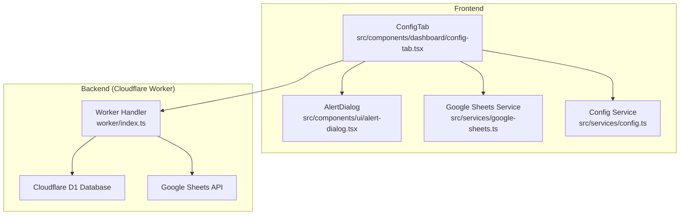
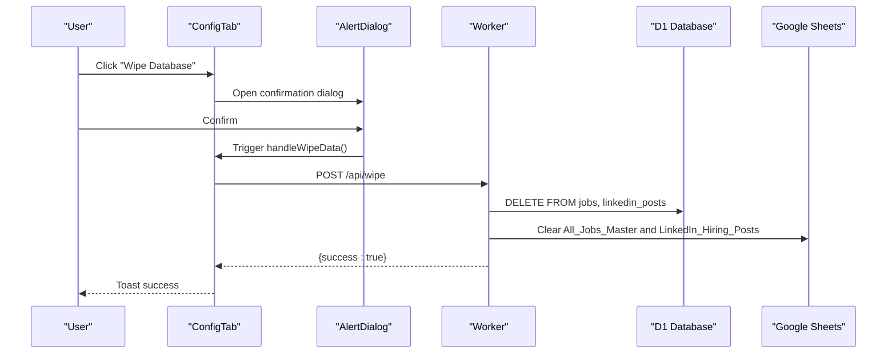
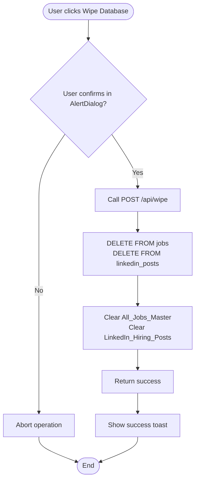
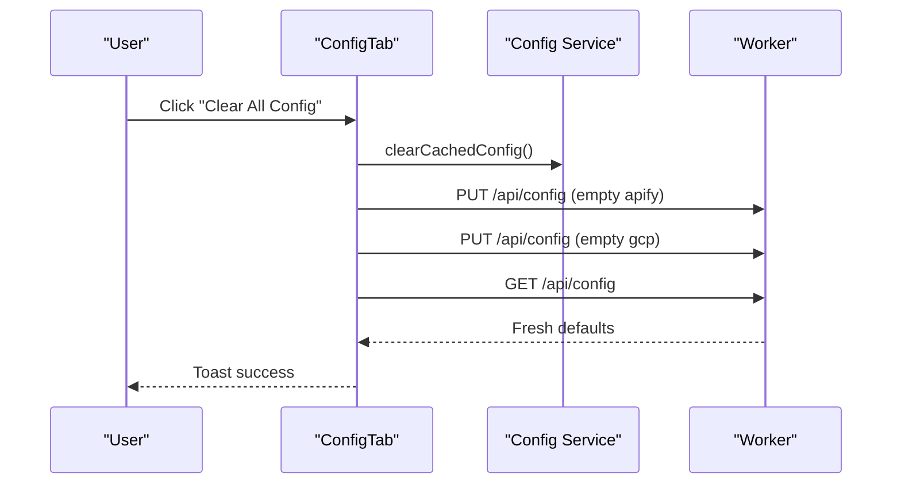
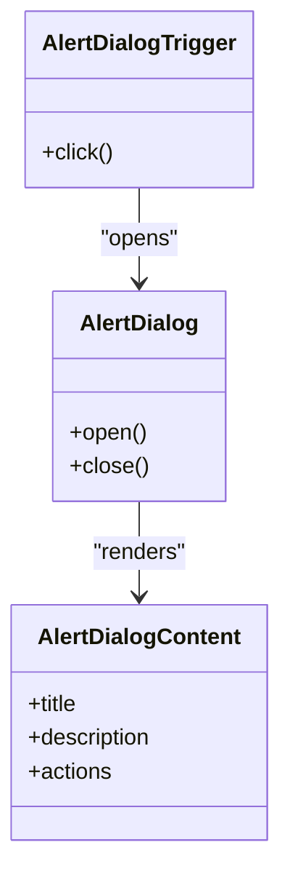
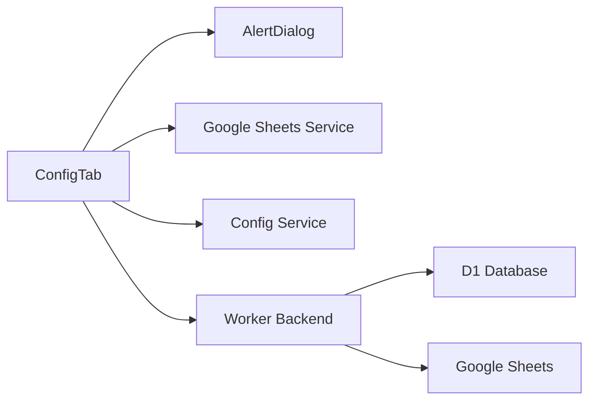

# Control Center

<cite>
**Referenced Files in This Document**
- [App.tsx](file://src/App.tsx)
- [config-tab.tsx](file://src/components/dashboard/config-tab.tsx)
- [alert-dialog.tsx](file://src/components/ui/alert-dialog.tsx)
- [google-sheets.ts](file://src/services/google-sheets.ts)
- [config.ts](file://src/services/config.ts)
- [apify.ts](file://src/services/apify.ts)
- [job-search-tab.tsx](file://src/components/dashboard/job-search-tab.tsx)
- [social-listening-tab.tsx](file://src/components/dashboard/social-listening-tab.tsx)
- [index.ts](file://worker/index.ts)
- [types/index.ts](file://src/types/index.ts)
</cite>

## Table of Contents
1. [Introduction](#introduction)
2. [Project Structure](#project-structure)
3. [Core Components](#core-components)
4. [Architecture Overview](#architecture-overview)
5. [Detailed Component Analysis](#detailed-component-analysis)
6. [Dependency Analysis](#dependency-analysis)
7. [Performance Considerations](#performance-considerations)
8. [Troubleshooting Guide](#troubleshooting-guide)
9. [Conclusion](#conclusion)
10. [Appendices](#appendices)

## Introduction
This document explains the Control Center functionality for data wiping and configuration clearing. It covers:
- Permanent deletion of job records and LinkedIn posts from both Cloudflare D1 and Google Sheets
- Configuration clearing and its impact on application state
- The alert dialog system used for destructive operations and user confirmation
- Security considerations and the irreversible nature of data deletion
- Step-by-step guides with warnings and safeguards
- Backup recommendations and recovery procedures

## Project Structure
The Control Center resides in the Configuration tab and coordinates with backend APIs served by the Cloudflare Worker. The frontend uses a reusable alert dialog component to confirm destructive actions.

**Diagram sources**
- [config-tab.tsx](file://src/components/dashboard/config-tab.tsx)
- [alert-dialog.tsx](file://src/components/ui/alert-dialog.tsx)
- [google-sheets.ts](file://src/services/google-sheets.ts)
- [config.ts](file://src/services/config.ts)
- [index.ts](file://worker/index.ts)

**Section sources**
- [App.tsx](file://src/App.tsx)
- [config-tab.tsx](file://src/components/dashboard/config-tab.tsx)
- [index.ts](file://worker/index.ts)

## Core Components
- Control Center UI: Provides buttons to wipe all data and clear all configuration.
- Alert Dialog: Enforces explicit user confirmation for destructive actions.
- Google Sheets Service: Implements Google Sheets backup and wipe operations.
- Worker Backend: Executes data deletion in D1 and clears Sheets via server-side JWT.
- Config Service: Manages client-side and server-side configuration state.

**Section sources**
- [config-tab.tsx](file://src/components/dashboard/config-tab.tsx)
- [alert-dialog.tsx](file://src/components/ui/alert-dialog.tsx)
- [google-sheets.ts](file://src/services/google-sheets.ts)
- [config.ts](file://src/services/config.ts)
- [index.ts](file://worker/index.ts)

## Architecture Overview
The Control Center triggers backend routes that:
- Delete all rows from jobs and linkedin_posts tables in D1
- Clear both Google Sheets sheets (All_Jobs_Master and LinkedIn_Hiring_Posts)
- Optionally update local configuration caches

**Diagram sources**
- [config-tab.tsx](file://src/components/dashboard/config-tab.tsx)
- [alert-dialog.tsx](file://src/components/ui/alert-dialog.tsx)
- [index.ts](file://worker/index.ts)

## Detailed Component Analysis

### Data Wiping Procedures
This section documents the permanent deletion of job records and LinkedIn posts.

- Scope of deletion:
  - Cloudflare D1 tables: jobs and linkedin_posts
  - Google Sheets: All_Jobs_Master and LinkedIn_Hiring_Posts sheets

- Frontend flow:
  - The ConfigTab exposes a destructive action that opens an AlertDialog.
  - On confirmation, handleWipeData invokes the backend wipe route.

- Backend flow:
  - Worker deletes all rows from jobs and linkedin_posts.
  - Worker clears both Sheets using server-side JWT authentication.

- Implications:
  - Irreversible operation; no undo.
  - Both primary storage (D1) and backup (Google Sheets) are affected.
  - Scraping and viewing data afterward will show empty results until new data is appended.

**Diagram sources**
- [config-tab.tsx](file://src/components/dashboard/config-tab.tsx)
- [index.ts](file://worker/index.ts)

**Section sources**
- [config-tab.tsx](file://src/components/dashboard/config-tab.tsx)
- [index.ts](file://worker/index.ts)
- [google-sheets.ts](file://src/services/google-sheets.ts)

### Configuration Clearing Process
This section explains how to clear saved configuration and its effects on application state.

- What is cleared:
  - Client-side: localStorage entry for configuration
  - Server-side: stored configuration values are removed
  - UI state: connection status badges reset to unknown

- How it works:
  - The ConfigTab provides a "Clear All Config" action.
  - Clears local cache and saves empty configuration to server.
  - Reloads configuration from server to reflect cleared state.

- Implications:
  - Requires re-entry of API tokens and actor IDs.
  - GCP service account key and spreadsheet ID must be re-entered.
  - Apify actor mappings revert to defaults.

**Diagram sources**
- [config-tab.tsx](file://src/components/dashboard/config-tab.tsx)
- [config.ts](file://src/services/config.ts)
- [index.ts](file://worker/index.ts)

**Section sources**
- [config-tab.tsx](file://src/components/dashboard/config-tab.tsx)
- [config.ts](file://src/services/config.ts)
- [index.ts](file://worker/index.ts)

### Alert Dialog System for Destructive Operations
The Control Center uses a shared AlertDialog component to enforce explicit user confirmation before destructive actions.

- Behavior:
  - Wraps destructive buttons with AlertDialog.
  - Displays a warning message and two actions: Cancel and Confirm.
  - On Confirm, executes the destructive handler.

- Security:
  - Prevents accidental data loss by requiring explicit confirmation.
  - Keeps destructive actions visible and intentional.

**Diagram sources**
- [alert-dialog.tsx](file://src/components/ui/alert-dialog.tsx)

**Section sources**
- [config-tab.tsx](file://src/components/dashboard/config-tab.tsx)
- [alert-dialog.tsx](file://src/components/ui/alert-dialog.tsx)

### Security Considerations
- Irreversibility:
  - Wipe operations permanently remove data from both D1 and Google Sheets.
  - No built-in rollback mechanism in the frontend or backend.

- Authentication and secrets:
  - Apify token is managed server-side via Cloudflare Worker Secrets.
  - GCP service account key is used server-side to mint JWTs for Google Sheets API.

- Risk mitigation:
  - Use the alert dialog confirmation for all destructive actions.
  - Back up data before wiping (see Backup Recommendations).

**Section sources**
- [index.ts](file://worker/index.ts)
- [config-tab.tsx](file://src/components/dashboard/config-tab.tsx)

### Step-by-Step Guides

#### Wipe Database (Permanent Deletion)
1. Navigate to the Configuration tab.
2. Click the "Wipe Database" button.
3. Review the warning in the AlertDialog:
   - "This will permanently delete all job records and LinkedIn posts from your Cloudflare D1 database and Google Spreadsheet backup. This action cannot be undone."
4. Click "Delete All Data" to confirm.
5. Wait for completion feedback; the UI will show a success toast.

Impact:
- D1 tables jobs and linkedin_posts are emptied.
- Google Sheets sheets are cleared.
- Scraping and viewing data afterward will show empty results.

Recovery:
- Append new job data via scraping and saving to D1 and Sheets.
- Re-add LinkedIn posts via social listening.

**Section sources**
- [config-tab.tsx](file://src/components/dashboard/config-tab.tsx)
- [index.ts](file://worker/index.ts)
- [google-sheets.ts](file://src/services/google-sheets.ts)

#### Clear All Configuration
1. Navigate to the Configuration tab.
2. Click the "Clear All Config" button.
3. Review the warning in the AlertDialog:
   - "This will remove all saved API keys and configuration from the database. You will need to re-enter everything."
4. Click "Clear Config" to confirm.
5. The UI reloads configuration from server and resets connection status indicators.

Impact:
- Client-side localStorage entry is removed.
- Server-side configuration values are cleared.
- Apify actor IDs revert to defaults; GCP credentials must be re-entered.

Recovery:
- Re-enter Apify actor IDs and GCP service account key and spreadsheet ID.
- Test connections before resuming scraping.

**Section sources**
- [config-tab.tsx](file://src/components/dashboard/config-tab.tsx)
- [config.ts](file://src/services/config.ts)
- [index.ts](file://worker/index.ts)

### Backup Recommendations and Recovery Procedures
- Backup recommendations:
  - Before wiping, export current data from Google Sheets manually:
    - Download both sheets (All_Jobs_Master and LinkedIn_Hiring_Posts) as CSV/XLSX.
    - Store locally or in a separate Google Sheet for safekeeping.
  - Verify Apify actor IDs and GCP credentials are correctly configured.
  - Consider pausing scraping during backup and wipe windows.

- Recovery after wipe:
  - Resume scraping to repopulate D1 and Sheets.
  - Use the Job Search and Social Listening tabs to trigger scrapers.
  - Monitor connection status indicators to confirm successful backups.

- Recovery after configuration clearing:
  - Re-enter Apify actor IDs and GCP credentials.
  - Test connections using the "Test Connection" buttons.
  - Resume normal operations once both services show connected status.

**Section sources**
- [job-search-tab.tsx](file://src/components/dashboard/job-search-tab.tsx)
- [social-listening-tab.tsx](file://src/components/dashboard/social-listening-tab.tsx)
- [config-tab.tsx](file://src/components/dashboard/config-tab.tsx)

## Dependency Analysis
The Control Center depends on:
- ConfigTab for UI and orchestration
- AlertDialog for confirmation
- Google Sheets service for Sheets operations
- Worker backend for D1 and Sheets mutations
- Config service for client/server configuration state

**Diagram sources**
- [config-tab.tsx](file://src/components/dashboard/config-tab.tsx)
- [alert-dialog.tsx](file://src/components/ui/alert-dialog.tsx)
- [google-sheets.ts](file://src/services/google-sheets.ts)
- [config.ts](file://src/services/config.ts)
- [index.ts](file://worker/index.ts)

**Section sources**
- [config-tab.tsx](file://src/components/dashboard/config-tab.tsx)
- [index.ts](file://worker/index.ts)

## Performance Considerations
- Wipe operations:
  - Deleting all rows from D1 tables is fast.
  - Clearing Sheets involves multiple API calls; expect a short delay.
- Connection testing:
  - Testing Apify and GCP connections performs network calls; avoid frequent tests.
- Local caching:
  - Client-side configuration caching reduces repeated loads; clearing cache forces fresh server state.

[No sources needed since this section provides general guidance]

## Troubleshooting Guide
Common issues and resolutions:
- Wipe fails:
  - Verify backend availability and network connectivity.
  - Check Google Sheets service account permissions and spreadsheet ID.
- Clear config does not persist:
  - Ensure server-side configuration endpoint is reachable.
  - Confirm localStorage is enabled in the browser.
- Connection tests fail:
  - Validate Apify token and actor IDs.
  - Verify GCP service account key and spreadsheet ID.

**Section sources**
- [index.ts](file://worker/index.ts)
- [config-tab.tsx](file://src/components/dashboard/config-tab.tsx)
- [config.ts](file://src/services/config.ts)

## Conclusion
The Control Center provides two powerful, irreversible operations: wiping all data and clearing all configuration. The AlertDialog ensures explicit user consent, while the backend enforces deletions across both D1 and Google Sheets. Follow the step-by-step guides, implement the recommended backups, and use the troubleshooting tips to maintain a safe and reliable workflow.

[No sources needed since this section summarizes without analyzing specific files]

## Appendices
- Data model highlights:
  - Job and LinkedInHiringPost types define the structure synchronized to D1 and Sheets.
- Worker roles:
  - Server-side JWT generation for Google Sheets.
  - Batch inserts and updates for efficient synchronization.

**Section sources**
- [types/index.ts](file://src/types/index.ts)
- [index.ts](file://worker/index.ts)