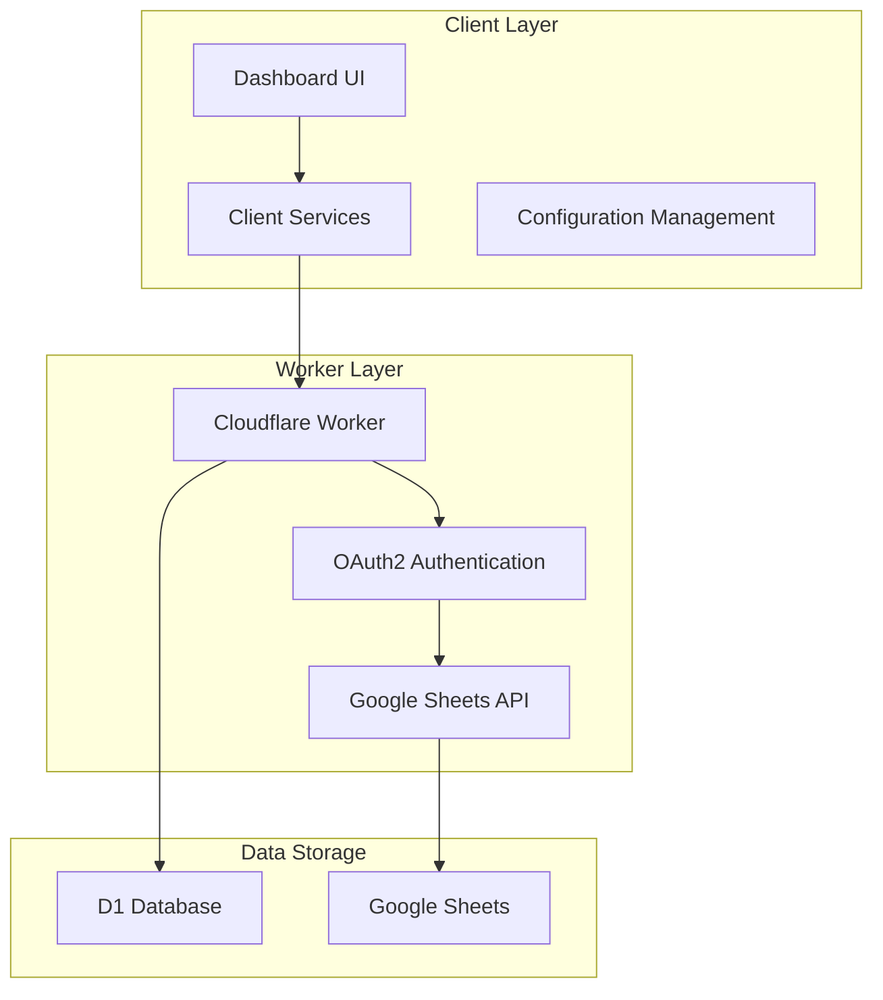
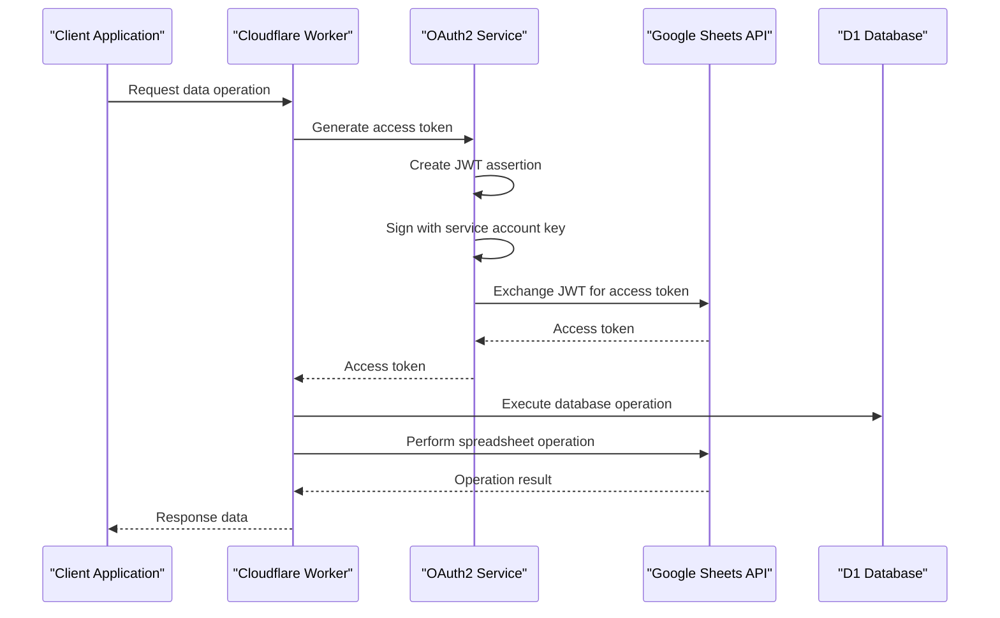
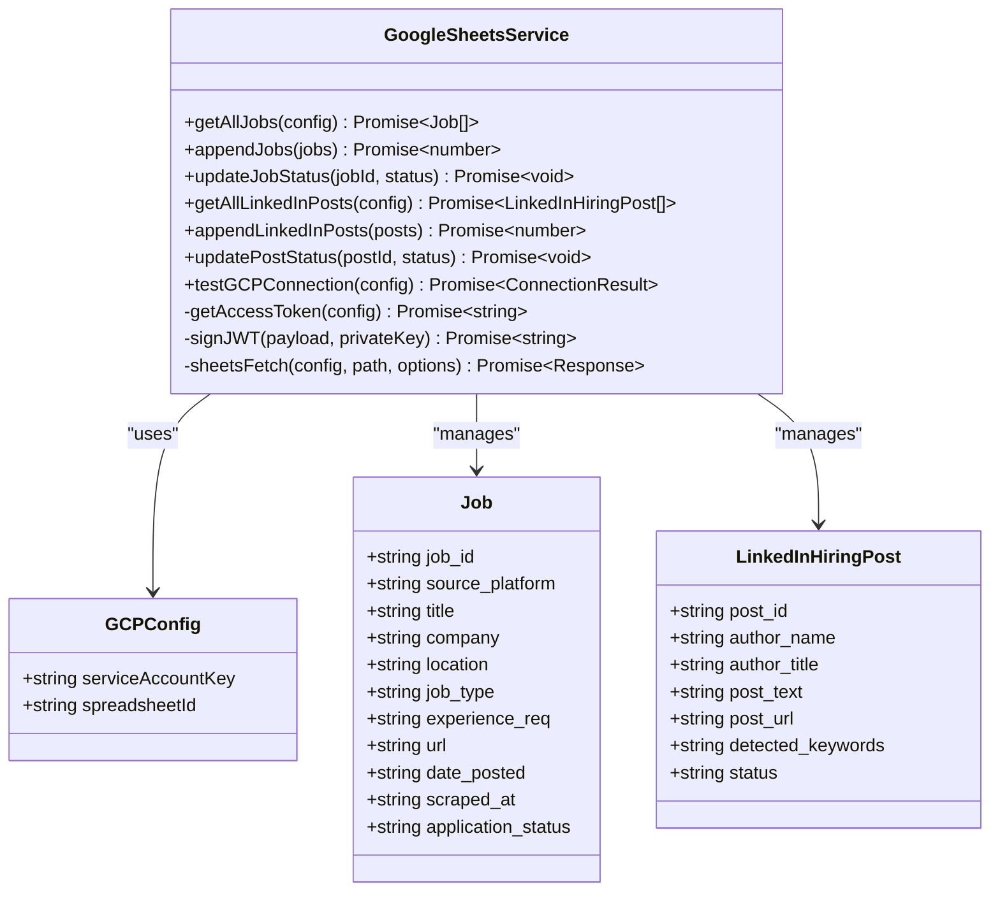
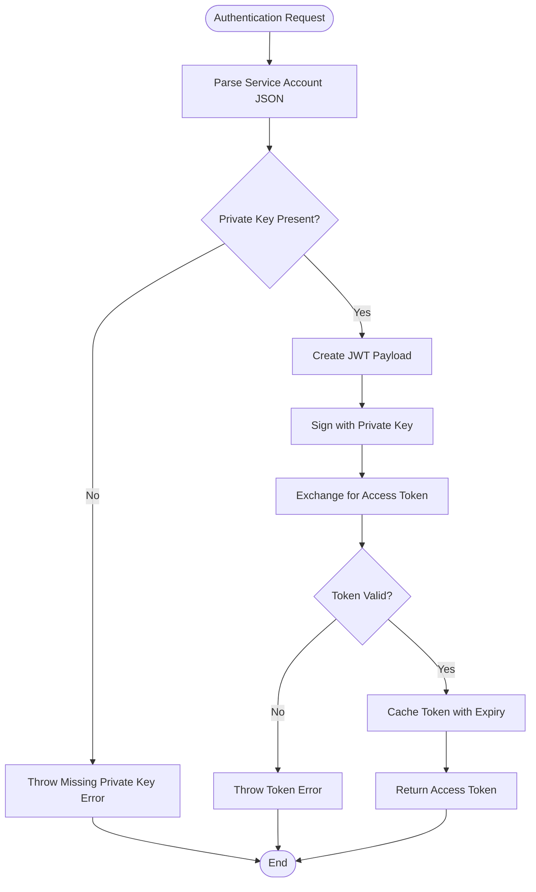
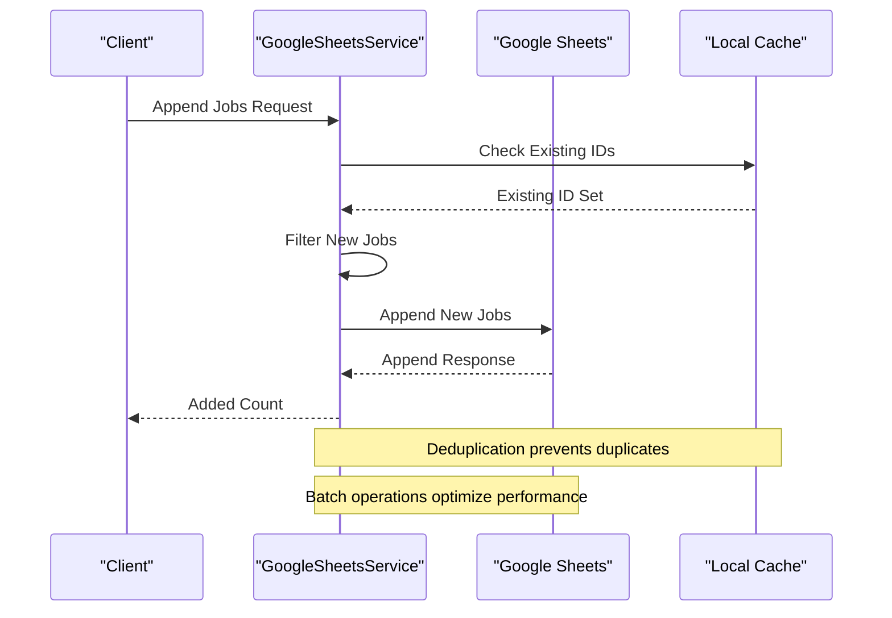
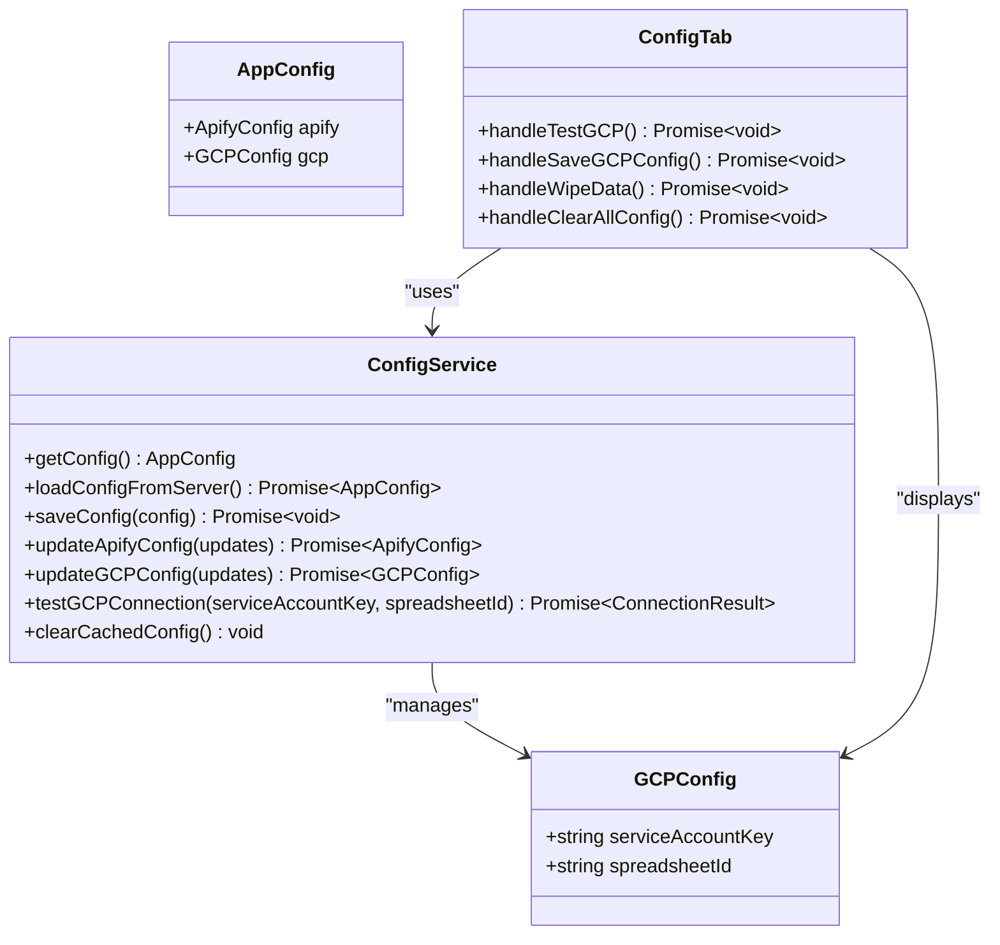
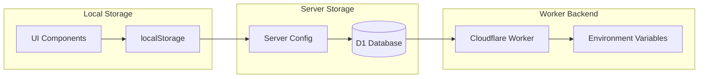
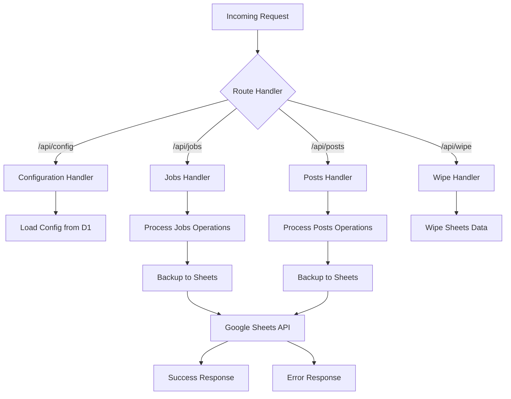
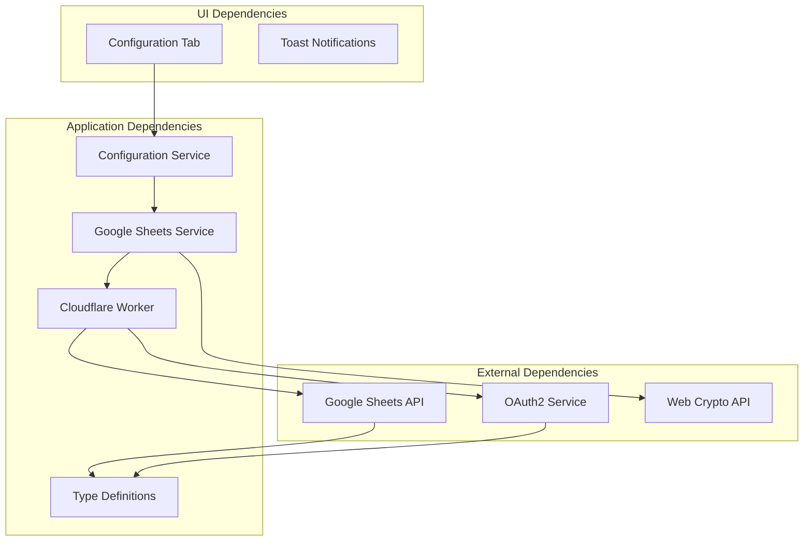
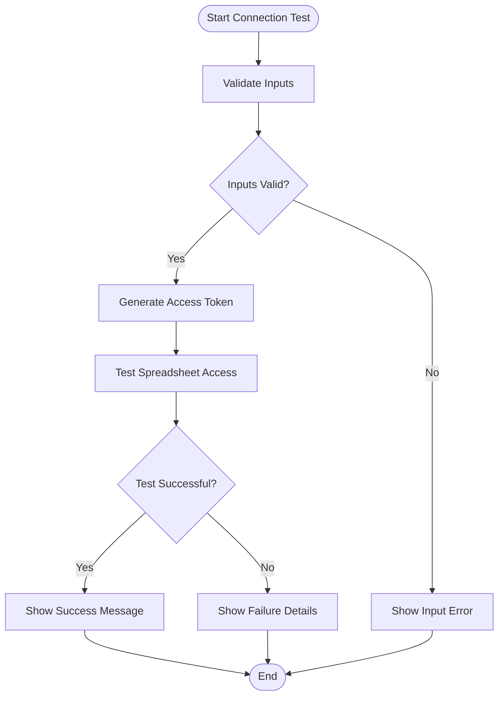

# Google Sheets Integration

<cite>
**Referenced Files in This Document**
- [google-sheets.ts](file://src/services/google-sheets.ts)
- [config.ts](file://src/services/config.ts)
- [config-tab.tsx](file://src/components/dashboard/config-tab.tsx)
- [index.ts](file://worker/index.ts)
- [index.ts](file://src/types/index.ts)
</cite>

## Table of Contents
1. [Introduction](#introduction)
2. [Project Structure](#project-structure)
3. [Core Components](#core-components)
4. [Architecture Overview](#architecture-overview)
5. [Detailed Component Analysis](#detailed-component-analysis)
6. [Dependency Analysis](#dependency-analysis)
7. [Performance Considerations](#performance-considerations)
8. [Troubleshooting Guide](#troubleshooting-guide)
9. [Security Best Practices](#security-best-practices)
10. [Conclusion](#conclusion)

## Introduction
This document provides comprehensive documentation for the Google Sheets integration system used by the job search dashboard application. The integration enables real-time data synchronization between the application's database and Google Sheets, providing a robust backup mechanism and human-readable data storage. The system supports two primary data domains: job listings and LinkedIn hiring posts, each stored in dedicated spreadsheet sheets.

The integration follows a dual-layer architecture where client-side operations primarily interact with a Cloudflare Worker backend, while the worker handles the actual Google Sheets API authentication and data operations. This design ensures secure credential management and efficient API usage.

## Project Structure
The Google Sheets integration spans multiple architectural layers within the application:

**Diagram sources**
- [config-tab.tsx:118-501](file://src/components/dashboard/config-tab.tsx#L118-L501)
- [google-sheets.ts:93-446](file://src/services/google-sheets.ts#L93-L446)
- [index.ts:175-466](file://worker/index.ts#L175-L466)

**Section sources**
- [config-tab.tsx:118-501](file://src/components/dashboard/config-tab.tsx#L118-L501)
- [google-sheets.ts:93-446](file://src/services/google-sheets.ts#L93-L446)
- [index.ts:175-466](file://worker/index.ts#L175-L466)

## Core Components

### Service Account Authentication System
The integration implements a sophisticated OAuth2 authentication flow using Google Cloud Platform service accounts. The system generates temporary access tokens using RS256-signed JWT assertions, eliminating the need for long-term credential storage in the client application.

### Spreadsheet Configuration Management
The system manages two primary spreadsheet sheets with predefined column structures:
- **All_Jobs_Master**: Stores job listings with comprehensive metadata
- **LinkedIn_Hiring_Posts**: Stores LinkedIn hiring post information

### Data Synchronization Operations
The integration supports bidirectional data synchronization with deduplication mechanisms and status tracking capabilities.

**Section sources**
- [google-sheets.ts:104-152](file://src/services/google-sheets.ts#L104-L152)
- [google-sheets.ts:254-328](file://src/services/google-sheets.ts#L254-L328)
- [index.ts:104-139](file://worker/index.ts#L104-L139)

## Architecture Overview

**Diagram sources**
- [google-sheets.ts:104-152](file://src/services/google-sheets.ts#L104-L152)
- [index.ts:46-90](file://worker/index.ts#L46-L90)
- [google-sheets.ts:213-231](file://src/services/google-sheets.ts#L213-L231)

The architecture implements a layered approach where the client interacts with the Cloudflare Worker, which handles all sensitive authentication operations and maintains the actual Google Sheets connections. This design provides several security benefits including credential isolation and reduced attack surface.

**Section sources**
- [google-sheets.ts:93-446](file://src/services/google-sheets.ts#L93-L446)
- [index.ts:175-466](file://worker/index.ts#L175-L466)

## Detailed Component Analysis

### Google Sheets Service Implementation

The core Google Sheets service provides comprehensive CRUD operations with built-in error handling and data validation:

**Diagram sources**
- [google-sheets.ts:95-446](file://src/services/google-sheets.ts#L95-L446)
- [index.ts:11-39](file://src/types/index.ts#L11-L39)

#### Authentication Flow
The authentication system implements a sophisticated JWT-based OAuth2 flow:

**Diagram sources**
- [google-sheets.ts:104-152](file://src/services/google-sheets.ts#L104-L152)
- [google-sheets.ts:154-194](file://src/services/google-sheets.ts#L154-L194)

#### Data Operations Flow
The system implements intelligent deduplication and batch processing:

**Diagram sources**
- [google-sheets.ts:254-292](file://src/services/google-sheets.ts#L254-L292)
- [google-sheets.ts:294-328](file://src/services/google-sheets.ts#L294-L328)

**Section sources**
- [google-sheets.ts:93-446](file://src/services/google-sheets.ts#L93-L446)
- [index.ts:104-139](file://worker/index.ts#L104-L139)

### Configuration Management System

The configuration system provides a comprehensive interface for managing Google Sheets integration settings:

**Diagram sources**
- [config.ts:27-100](file://src/services/config.ts#L27-L100)
- [config-tab.tsx:28-116](file://src/components/dashboard/config-tab.tsx#L28-L116)

#### Configuration Storage Architecture
The system implements a dual-storage approach combining local browser storage with server-side configuration:

**Diagram sources**
- [config.ts:126-166](file://src/services/config.ts#L126-L166)
- [index.ts:337-390](file://worker/index.ts#L337-L390)

**Section sources**
- [config.ts:19-83](file://src/services/config.ts#L19-L83)
- [config-tab.tsx:28-116](file://src/components/dashboard/config-tab.tsx#L28-L116)

### Worker Backend Implementation

The Cloudflare Worker serves as the central orchestrator for all Google Sheets operations:

**Diagram sources**
- [index.ts:175-466](file://worker/index.ts#L175-L466)
- [index.ts:104-139](file://worker/index.ts#L104-L139)

**Section sources**
- [index.ts:175-466](file://worker/index.ts#L175-L466)
- [index.ts:42-90](file://worker/index.ts#L42-L90)

## Dependency Analysis

The Google Sheets integration system exhibits a well-structured dependency hierarchy with clear separation of concerns:

**Diagram sources**
- [google-sheets.ts:4-95](file://src/services/google-sheets.ts#L4-L95)
- [config.ts:3-4](file://src/services/config.ts#L3-L4)
- [index.ts:4-10](file://worker/index.ts#L4-L10)

The dependency analysis reveals several key characteristics:

- **Low Coupling**: The client service layer is decoupled from Google Sheets operations through the worker backend
- **High Cohesion**: Related Google Sheets operations are grouped within dedicated service functions
- **Secure Isolation**: Authentication logic is isolated within the worker environment
- **Error Resilience**: Operations are designed to fail gracefully without affecting core application functionality

**Section sources**
- [google-sheets.ts:1-12](file://src/services/google-sheets.ts#L1-L12)
- [config.ts:1-3](file://src/services/config.ts#L1-L3)
- [index.ts:1-3](file://worker/index.ts#L1-L3)

## Performance Considerations

### Token Caching Strategy
The system implements intelligent token caching to minimize authentication overhead:

- **Cache Duration**: Tokens are cached for 59 minutes (expires_in - 60 seconds buffer)
- **Validation**: Cache validation checks against current timestamp
- **Fallback**: Automatic token regeneration when cache expires

### Batch Operations
The integration optimizes network usage through strategic batching:

- **Batch Inserts**: Multiple job and post entries are processed in single API calls
- **Deduplication**: Prevents redundant operations and reduces API calls
- **Conditional Updates**: Only updates changed records

### Memory Management
The system employs careful memory management for large datasets:

- **Streaming Responses**: Large dataset responses are processed incrementally
- **Set-Based Lookups**: Efficient duplicate detection using Set data structures
- **Lazy Loading**: Data is loaded on-demand rather than preloading entire datasets

## Troubleshooting Guide

### Common Authentication Issues

#### Service Account Key Validation
**Issue**: "Invalid service account JSON" error during authentication
**Causes**:
- Malformed JSON structure
- Missing required fields (client_email, private_key)
- Incorrect JSON formatting

**Solutions**:
1. Verify JSON structure matches Google Cloud Platform format
2. Ensure all required fields are present
3. Validate JSON syntax using online validators
4. Remove any extra whitespace or comments

#### Private Key Requirements
**Issue**: "Service account missing private_key" error
**Causes**:
- Private key field missing from JSON
- Incorrect key format
- Base64 encoding issues

**Solutions**:
1. Download fresh service account key from Google Cloud Console
2. Verify private key format includes proper BEGIN/END markers
3. Ensure no extra characters or formatting issues

#### Token Generation Failures
**Issue**: OAuth2 token exchange failures
**Causes**:
- Expired service account key
- Network connectivity issues
- Invalid scope configuration

**Solutions**:
1. Regenerate service account key in Google Cloud Console
2. Verify network connectivity to Google APIs
3. Check OAuth2 endpoint accessibility

### Spreadsheet Access Problems

#### Permission Denied Errors
**Issue**: "Failed to access spreadsheet" or 403 Forbidden responses
**Causes**:
- Insufficient permissions on spreadsheet
- Service account not shared with spreadsheet
- Wrong spreadsheet ID configured

**Solutions**:
1. Share spreadsheet with service account email (editor role)
2. Verify spreadsheet ID matches actual spreadsheet
3. Check Google Sheets API is enabled for project
4. Verify service account has proper IAM permissions

#### API Quota Limitations
**Issue**: Rate limit exceeded or quota exceeded errors
**Causes**:
- Excessive API calls within short time periods
- Daily quota limits reached
- Concurrent operation conflicts

**Solutions**:
1. Implement exponential backoff for retry logic
2. Batch operations to reduce API calls
3. Monitor API usage and adjust operation frequency
4. Consider upgrading Google Cloud Platform quotas

#### Data Format Issues
**Issue**: "Failed to append jobs/posts" or data validation errors
**Causes**:
- Column count mismatch
- Data type validation failures
- Special character encoding issues

**Solutions**:
1. Verify column structure matches sheet definitions
2. Escape special characters in data
3. Check data type compatibility
4. Validate UTF-8 encoding for international characters

### Connection Testing Workflow

The system provides comprehensive connection testing capabilities:

**Diagram sources**
- [config-tab.tsx:67-89](file://src/components/dashboard/config-tab.tsx#L67-L89)
- [google-sheets.ts:196-211](file://src/services/google-sheets.ts#L196-L211)

**Section sources**
- [google-sheets.ts:196-211](file://src/services/google-sheets.ts#L196-L211)
- [config-tab.tsx:67-89](file://src/components/dashboard/config-tab.tsx#L67-L89)

## Security Best Practices

### Service Account Credential Management

#### Secure Storage
- **Environment Variables**: Store service account keys in Cloudflare Worker environment variables
- **Encrypted Storage**: Consider encrypting sensitive configuration data at rest
- **Access Controls**: Restrict access to service account keys to authorized personnel only

#### Least Privilege Principle
- **Minimal Permissions**: Grant only necessary Google Sheets API permissions
- **Role-Based Access**: Use editor role for service account access
- **Scope Limitation**: Limit OAuth2 scope to required spreadsheet operations

#### Rotation and Monitoring
- **Regular Rotation**: Rotate service account keys periodically
- **Audit Logging**: Monitor access patterns and API usage
- **Revocation**: Implement immediate revocation capability for compromised keys

### Data Protection Measures

#### Client-Side Security
- **Input Validation**: Validate all user inputs before processing
- **Output Encoding**: Properly encode data for display contexts
- **Error Handling**: Avoid exposing sensitive error details to clients

#### Network Security
- **HTTPS Enforcement**: Ensure all communications use HTTPS
- **Certificate Validation**: Verify SSL/TLS certificates for external APIs
- **Rate Limiting**: Implement client-side rate limiting to prevent abuse

#### Data Integrity
- **Input Sanitization**: Clean and validate all incoming data
- **Output Escaping**: Escape special characters in spreadsheet data
- **Transaction Safety**: Use database transactions for atomic operations

### Operational Security

#### Environment Separation
- **Development vs Production**: Separate service account keys for different environments
- **Feature Flags**: Use configuration flags for enabling/disabling integrations
- **Staging Verification**: Test integrations in staging before production deployment

#### Monitoring and Alerting
- **Health Checks**: Implement automated health monitoring for integrations
- **Error Tracking**: Log and monitor integration errors systematically
- **Performance Metrics**: Track API response times and success rates

**Section sources**
- [config.ts:126-166](file://src/services/config.ts#L126-L166)
- [index.ts:4-10](file://worker/index.ts#L4-L10)

## Conclusion

The Google Sheets integration system provides a robust, secure, and scalable solution for data persistence and backup in the job search dashboard application. The implementation demonstrates excellent architectural principles with clear separation of concerns, comprehensive error handling, and strong security practices.

Key strengths of the implementation include:

- **Secure Authentication**: RS256 JWT-based OAuth2 flow with proper credential isolation
- **Efficient Operations**: Intelligent caching, deduplication, and batch processing
- **Comprehensive Error Handling**: Graceful degradation and meaningful error reporting
- **Flexible Configuration**: Dual-storage approach supporting both local and server configurations
- **Production-Ready Design**: Cloudflare Worker backend ensures scalability and reliability

The system successfully balances functionality with security, providing enterprise-grade features while maintaining simplicity for end users. The modular architecture allows for easy maintenance and future enhancements while preserving backward compatibility.

Future improvements could include enhanced monitoring capabilities, additional data validation layers, and expanded support for advanced Google Sheets features. However, the current implementation provides a solid foundation for reliable data management and backup operations.