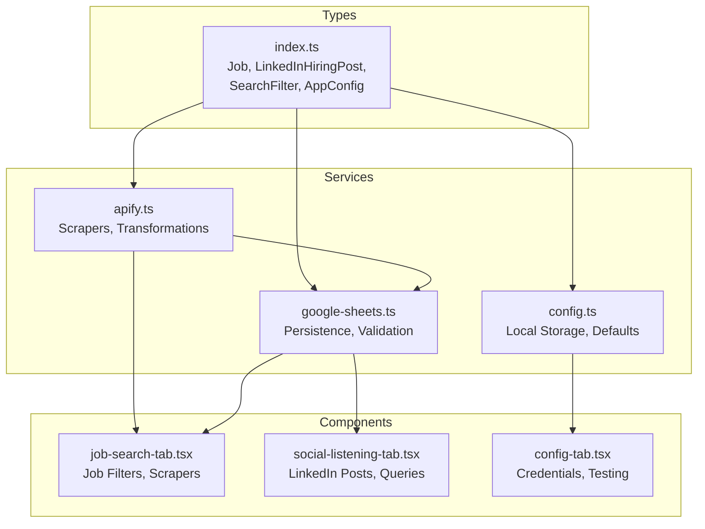
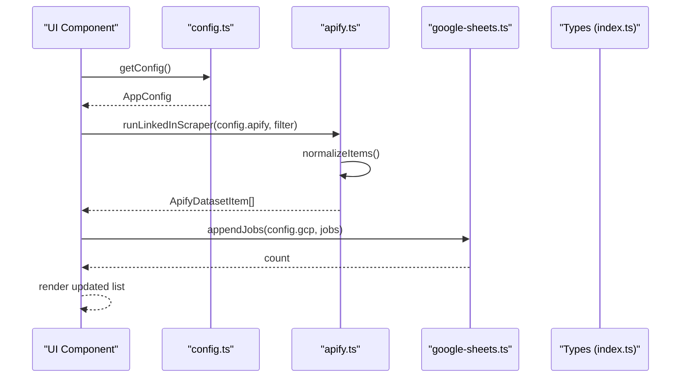
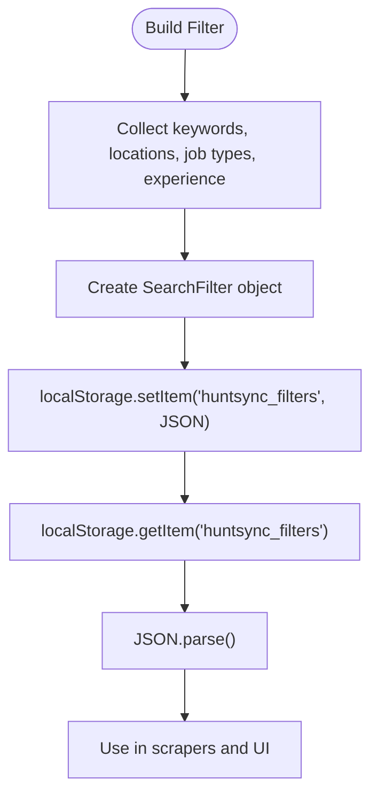
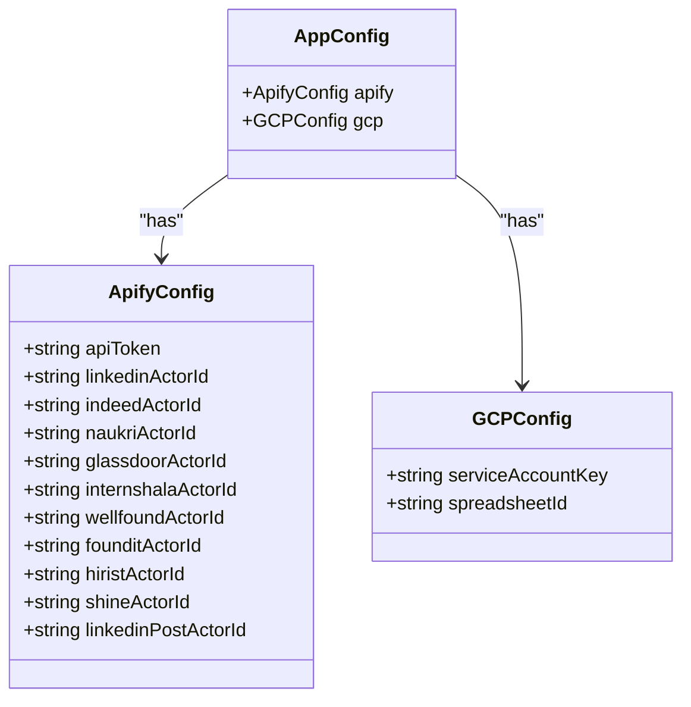
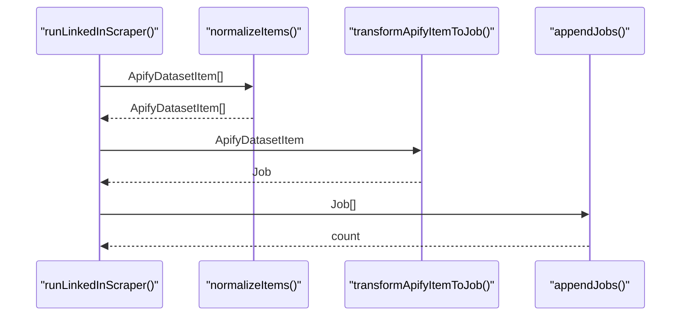
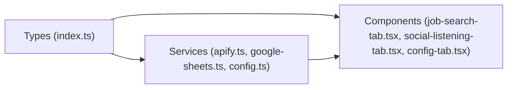

# Data Models and Types

<cite>
**Referenced Files in This Document**
- [index.ts](file://src/types/index.ts)
- [apify.ts](file://src/services/apify.ts)
- [google-sheets.ts](file://src/services/google-sheets.ts)
- [config.ts](file://src/services/config.ts)
- [job-search-tab.tsx](file://src/components/dashboard/job-search-tab.tsx)
- [social-listening-tab.tsx](file://src/components/dashboard/social-listening-tab.tsx)
- [config-tab.tsx](file://src/components/dashboard/config-tab.tsx)
- [package.json](file://package.json)
</cite>

## Table of Contents
1. [Introduction](#introduction)
2. [Project Structure](#project-structure)
3. [Core Components](#core-components)
4. [Architecture Overview](#architecture-overview)
5. [Detailed Component Analysis](#detailed-component-analysis)
6. [Dependency Analysis](#dependency-analysis)
7. [Performance Considerations](#performance-considerations)
8. [Troubleshooting Guide](#troubleshooting-guide)
9. [Conclusion](#conclusion)

## Introduction
This document provides comprehensive data model documentation for HuntSync AI’s TypeScript interfaces and type definitions. It focuses on:
- Job interface for structured job data, platform-specific properties, status management, and filtering criteria
- LinkedInHiringPost interface for social listening data structure, engagement tracking fields, and keyword analysis properties
- AppConfig interface for configuration data, Apify configuration models, Google Cloud configuration structures, and user preference types
- SearchFilter interface for filter templates, saved search criteria, and template management
- Data validation rules, type constraints, and entity relationship mappings
- Examples of data transformation, serialization patterns, and type safety practices used throughout the application

## Project Structure
The data models are centralized in a dedicated types module and consumed by services and UI components:
- Types are defined in a single source-of-truth file
- Services orchestrate scraping, normalization, and persistence
- UI components consume typed data for rendering and user interactions
- Configuration is persisted locally and validated before use



**Diagram sources**
- [index.ts:11-91](file://src/types/index.ts#L11-L91)
- [apify.ts:1-348](file://src/services/apify.ts#L1-L348)
- [google-sheets.ts:1-354](file://src/services/google-sheets.ts#L1-L354)
- [config.ts:1-66](file://src/services/config.ts#L1-L66)
- [job-search-tab.tsx:1-523](file://src/components/dashboard/job-search-tab.tsx#L1-L523)
- [social-listening-tab.tsx:1-276](file://src/components/dashboard/social-listening-tab.tsx#L1-L276)
- [config-tab.tsx:1-502](file://src/components/dashboard/config-tab.tsx#L1-L502)

**Section sources**
- [index.ts:1-159](file://src/types/index.ts#L1-L159)
- [apify.ts:1-348](file://src/services/apify.ts#L1-L348)
- [google-sheets.ts:1-354](file://src/services/google-sheets.ts#L1-L354)
- [config.ts:1-66](file://src/services/config.ts#L1-L66)
- [job-search-tab.tsx:1-523](file://src/components/dashboard/job-search-tab.tsx#L1-L523)
- [social-listening-tab.tsx:1-276](file://src/components/dashboard/social-listening-tab.tsx#L1-L276)
- [config-tab.tsx:1-502](file://src/components/dashboard/config-tab.tsx#L1-L502)

## Core Components
This section documents the primary data models and their roles in the system.

### Job Interface
- Purpose: Represents a job posting record scraped from job boards
- Fields:
  - job_id: Unique identifier generated from normalized data
  - source_platform: Enumerated platform (LinkedIn, Indeed, Naukri, etc.)
  - title, company, location: Basic job metadata
  - job_type: Enumerated type (Remote, WFO, WFH)
  - experience_req: Free-text experience requirement
  - url: Direct job link
  - date_posted: Original posting date
  - scraped_at: Timestamp when the record was ingested
  - application_status: Enumerated status (To Apply, Applied, Interviewing, Rejected)
- Platform-specific properties: Derived during normalization from platform-specific fields
- Status management: Controlled via UI and persisted to Google Sheets
- Filtering criteria: Used by SearchFilter to define saved templates

**Section sources**
- [index.ts:11-23](file://src/types/index.ts#L11-L23)
- [apify.ts:301-318](file://src/services/apify.ts#L301-L318)
- [google-sheets.ts:238-259](file://src/services/google-sheets.ts#L238-L259)

### LinkedInHiringPost Interface
- Purpose: Represents social listening data for LinkedIn hiring posts
- Fields:
  - post_id: Unique identifier derived from normalized data
  - author_name, author_title: Recruiter or founder identity
  - post_text: Content of the post
  - post_url: Direct link to the post
  - detected_keywords: Comma-separated keywords extracted from post_text
  - status: Enumerated status (Unread, Contacted, Ignored)
- Engagement tracking: Status updates are persisted to Google Sheets
- Keyword analysis: Keywords are extracted from post_text during transformation

**Section sources**
- [index.ts:31-39](file://src/types/index.ts#L31-L39)
- [apify.ts:320-330](file://src/services/apify.ts#L320-L330)
- [google-sheets.ts:261-278](file://src/services/google-sheets.ts#L261-L278)

### SearchFilter Interface
- Purpose: Defines saved search templates for job scraping
- Fields:
  - id: Unique identifier
  - name: Human-readable template name
  - keywords: Array of search terms
  - experience: Enumerated experience level
  - locations: Array of location filters
  - job_types: Array of job type filters
  - created_at, updated_at: Timestamps for lifecycle tracking
- Template management: Stored in localStorage and serialized to JSON

**Section sources**
- [index.ts:45-54](file://src/types/index.ts#L45-L54)
- [job-search-tab.tsx:38-52](file://src/components/dashboard/job-search-tab.tsx#L38-L52)
- [job-search-tab.tsx:136-151](file://src/components/dashboard/job-search-tab.tsx#L136-L151)

### AppConfig Interface
- Purpose: Central configuration container combining Apify and Google Cloud settings
- Substructures:
  - ApifyConfig: API token and actor IDs for 10 platforms plus LinkedIn posts
  - GCPConfig: Service account key and spreadsheet ID
- User preferences: Stored in localStorage with defaults applied

**Section sources**
- [index.ts:88-91](file://src/types/index.ts#L88-L91)
- [index.ts:69-81](file://src/types/index.ts#L69-L81)
- [index.ts:83-86](file://src/types/index.ts#L83-L86)
- [config.ts:26-61](file://src/services/config.ts#L26-L61)

## Architecture Overview
The data model architecture follows a clean separation of concerns:
- Types define immutable contracts for data shapes
- Services encapsulate scraping, normalization, and persistence logic
- UI components consume typed data and trigger actions
- Local storage persists configuration and filters



**Diagram sources**
- [config.ts:26-47](file://src/services/config.ts#L26-L47)
- [apify.ts:84-113](file://src/services/apify.ts#L84-L113)
- [google-sheets.ts:162-200](file://src/services/google-sheets.ts#L162-L200)
- [index.ts:11-91](file://src/types/index.ts#L11-L91)

## Detailed Component Analysis

### Job Data Model
- Structured fields: Strongly typed primitives and enumerations
- Platform-specific properties: Extracted and normalized during scraping
- Status management: Enumerated statuses mapped to UI badges and persisted to Google Sheets
- Filtering criteria: Used to construct search URLs and payloads for scrapers

```mermaid
classDiagram
class Job {
+string job_id
+SourcePlatform source_platform
+string title
+string company
+string location
+JobType job_type
+string experience_req
+string url
+string date_posted
+string scraped_at
+ApplicationStatus application_status
}
class SourcePlatform {
<<enumeration>>
"LinkedIn"
"Indeed"
"Naukri"
"Glassdoor"
"Internshala"
"Wellfound"
"Foundit"
"Hirist"
"Shine"
}
class JobType {
<<enumeration>>
"Remote"
"WFO"
"WFH"
}
class ApplicationStatus {
<<enumeration>>
"To Apply"
"Applied"
"Interviewing"
"Rejected"
}
Job --> SourcePlatform : "uses"
Job --> JobType : "uses"
Job --> ApplicationStatus : "uses"
```

**Diagram sources**
- [index.ts:7](file://src/types/index.ts#L7)
- [index.ts:8](file://src/types/index.ts#L8)
- [index.ts:9](file://src/types/index.ts#L9)
- [index.ts:11-23](file://src/types/index.ts#L11-L23)

**Section sources**
- [index.ts:11-23](file://src/types/index.ts#L11-L23)
- [apify.ts:301-318](file://src/services/apify.ts#L301-L318)
- [google-sheets.ts:238-259](file://src/services/google-sheets.ts#L238-L259)

### LinkedInHiringPost Data Model
- Social listening focus: Captures recruiter posts and engagement signals
- Keyword extraction: Automated detection of technology-related keywords
- Status tracking: Unread, Contacted, Ignored with UI affordances

```mermaid
classDiagram
class LinkedInHiringPost {
+string post_id
+string author_name
+string author_title
+string post_text
+string post_url
+string detected_keywords
+PostStatus status
}
class PostStatus {
<<enumeration>>
"Unread"
"Contacted"
"Ignored"
}
LinkedInHiringPost --> PostStatus : "uses"
```

**Diagram sources**
- [index.ts:29](file://src/types/index.ts#L29)
- [index.ts:31-39](file://src/types/index.ts#L31-L39)

**Section sources**
- [index.ts:31-39](file://src/types/index.ts#L31-L39)
- [apify.ts:320-330](file://src/services/apify.ts#L320-L330)
- [social-listening-tab.tsx:30-34](file://src/components/dashboard/social-listening-tab.tsx#L30-L34)

### SearchFilter Data Model
- Template management: Saved filters persist as JSON in localStorage
- Dynamic construction: UI composes filters from user selections
- Lifecycle timestamps: Created and updated timestamps maintained



**Diagram sources**
- [job-search-tab.tsx:38-52](file://src/components/dashboard/job-search-tab.tsx#L38-L52)
- [job-search-tab.tsx:136-151](file://src/components/dashboard/job-search-tab.tsx#L136-L151)
- [index.ts:45-54](file://src/types/index.ts#L45-L54)

**Section sources**
- [job-search-tab.tsx:38-52](file://src/components/dashboard/job-search-tab.tsx#L38-L52)
- [job-search-tab.tsx:136-151](file://src/components/dashboard/job-search-tab.tsx#L136-L151)
- [index.ts:45-54](file://src/types/index.ts#L45-L54)

### AppConfig and Configuration Models
- Centralized configuration: AppConfig aggregates ApifyConfig and GCPConfig
- Defaults and merging: Local storage values are merged with defaults
- Connection testing: Separate endpoints validate Apify and Google Sheets connectivity



**Diagram sources**
- [index.ts:69-91](file://src/types/index.ts#L69-L91)
- [config.ts:7-24](file://src/services/config.ts#L7-L24)

**Section sources**
- [index.ts:69-91](file://src/types/index.ts#L69-L91)
- [config.ts:26-61](file://src/services/config.ts#L26-L61)
- [config-tab.tsx:28-89](file://src/components/dashboard/config-tab.tsx#L28-L89)

### Data Transformation and Serialization Patterns
- Scrapers normalize platform-specific fields into a common ApifyDatasetItem shape
- Transform functions convert normalized items into Job or LinkedInHiringPost
- Local storage serializes filters and configuration as JSON
- Google Sheets API writes rows with explicit column ordering



**Diagram sources**
- [apify.ts:84-113](file://src/services/apify.ts#L84-L113)
- [apify.ts:275-286](file://src/services/apify.ts#L275-L286)
- [apify.ts:301-318](file://src/services/apify.ts#L301-L318)
- [google-sheets.ts:162-200](file://src/services/google-sheets.ts#L162-L200)

**Section sources**
- [apify.ts:84-113](file://src/services/apify.ts#L84-L113)
- [apify.ts:275-286](file://src/services/apify.ts#L275-L286)
- [apify.ts:301-318](file://src/services/apify.ts#L301-L318)
- [google-sheets.ts:162-200](file://src/services/google-sheets.ts#L162-L200)

## Dependency Analysis
- Types module is the single source of truth for all data contracts
- Services depend on types for input/output shapes
- UI components depend on types for props and state
- Configuration service depends on types for defaults and updates



**Diagram sources**
- [index.ts:1-159](file://src/types/index.ts#L1-L159)
- [apify.ts:1-348](file://src/services/apify.ts#L1-L348)
- [google-sheets.ts:1-354](file://src/services/google-sheets.ts#L1-L354)
- [config.ts:1-66](file://src/services/config.ts#L1-L66)
- [job-search-tab.tsx:1-523](file://src/components/dashboard/job-search-tab.tsx#L1-L523)
- [social-listening-tab.tsx:1-276](file://src/components/dashboard/social-listening-tab.tsx#L1-L276)
- [config-tab.tsx:1-502](file://src/components/dashboard/config-tab.tsx#L1-L502)

**Section sources**
- [index.ts:1-159](file://src/types/index.ts#L1-L159)
- [apify.ts:1-348](file://src/services/apify.ts#L1-L348)
- [google-sheets.ts:1-354](file://src/services/google-sheets.ts#L1-L354)
- [config.ts:1-66](file://src/services/config.ts#L1-L66)
- [job-search-tab.tsx:1-523](file://src/components/dashboard/job-search-tab.tsx#L1-L523)
- [social-listening-tab.tsx:1-276](file://src/components/dashboard/social-listening-tab.tsx#L1-L276)
- [config-tab.tsx:1-502](file://src/components/dashboard/config-tab.tsx#L1-L502)

## Performance Considerations
- Deduplication: Existing IDs are fetched from Google Sheets before appending new records
- Batch operations: Jobs and posts are appended in bulk to minimize API calls
- Token caching: Access tokens for Google Sheets are cached until expiry
- Normalization cost: Scrapers normalize diverse outputs to a common shape to reduce downstream branching

[No sources needed since this section provides general guidance]

## Troubleshooting Guide
- Configuration validation:
  - Ensure Apify API token and actor IDs are present before scraping
  - Verify Google Sheets service account key and spreadsheet ID
- Connection testing:
  - Use built-in test endpoints to validate connectivity
  - Inspect error messages returned by test functions
- Data integrity:
  - Confirm that job IDs and post IDs are unique before insertion
  - Check that enums match expected values (e.g., job_type, application_status, post_status)

**Section sources**
- [config-tab.tsx:43-89](file://src/components/dashboard/config-tab.tsx#L43-L89)
- [google-sheets.ts:104-119](file://src/services/google-sheets.ts#L104-L119)
- [google-sheets.ts:141-160](file://src/services/google-sheets.ts#L141-L160)

## Conclusion
HuntSync AI’s data model architecture emphasizes strong typing, clear separation of concerns, and robust transformation/persistence patterns. The Job, LinkedInHiringPost, SearchFilter, and AppConfig interfaces provide a solid foundation for scraping, normalization, and data persistence. Type-safe practices and validation rules ensure reliable operation across UI components, services, and external APIs.