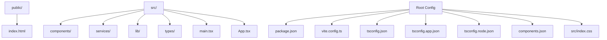
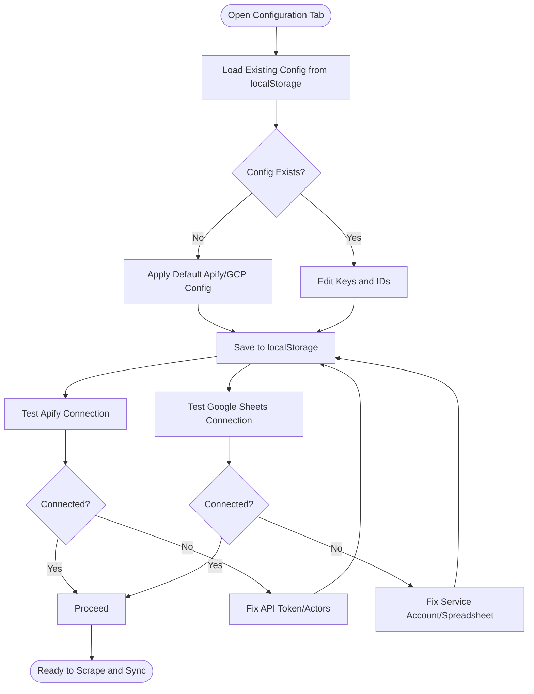
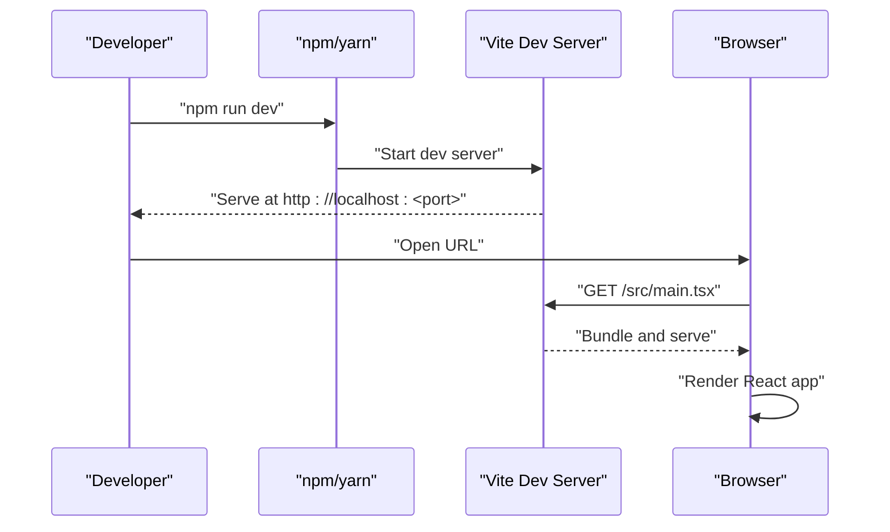
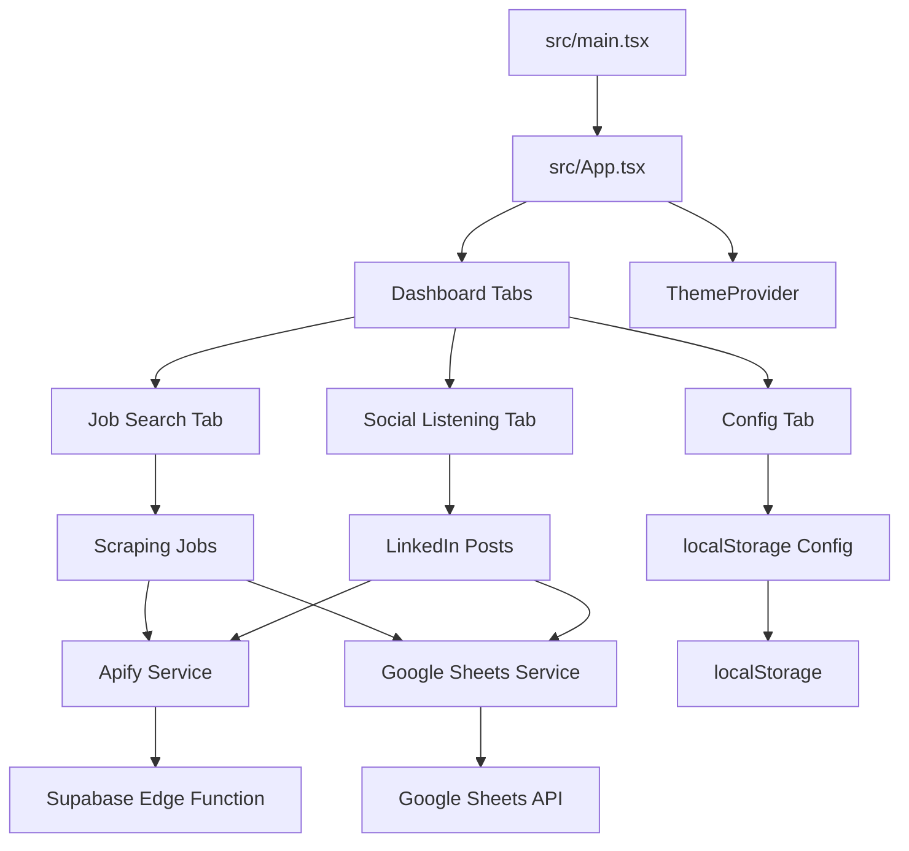
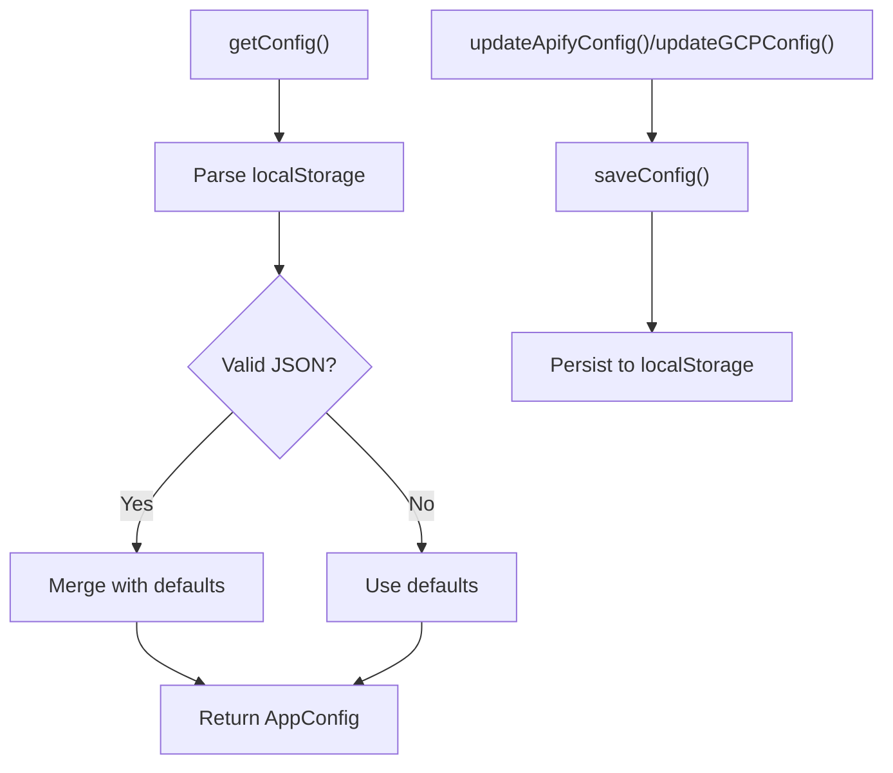
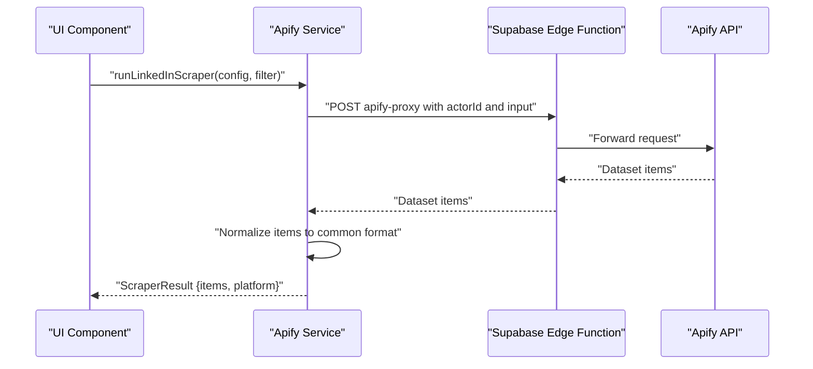
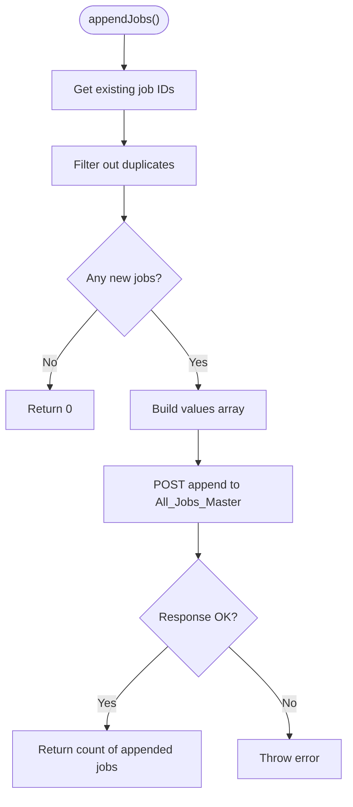
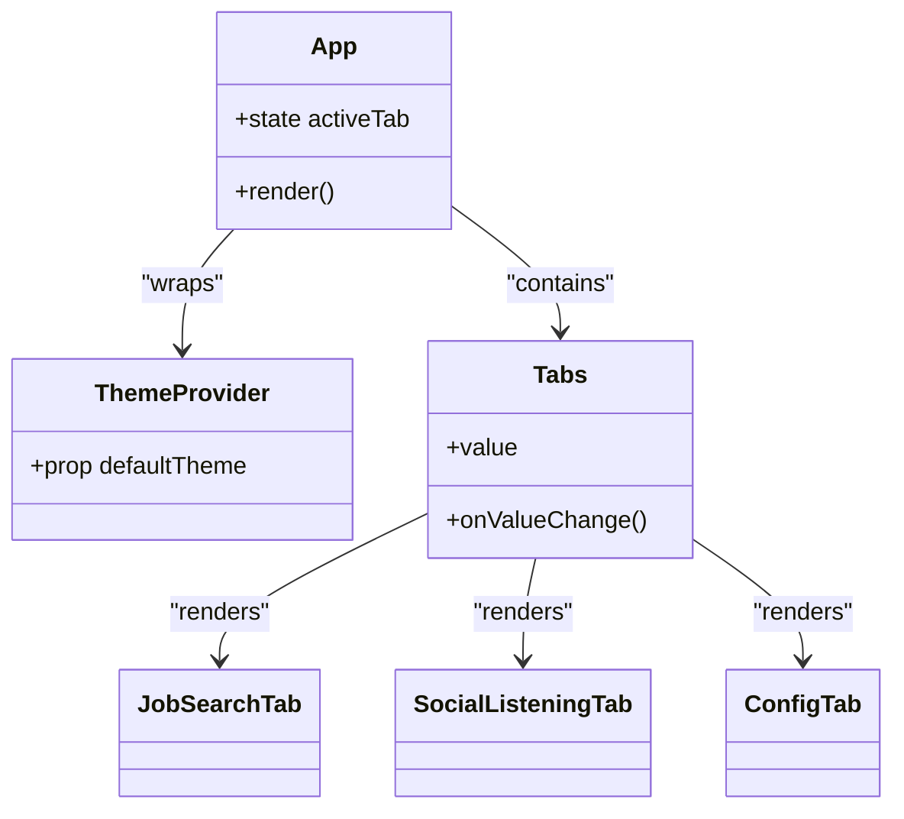
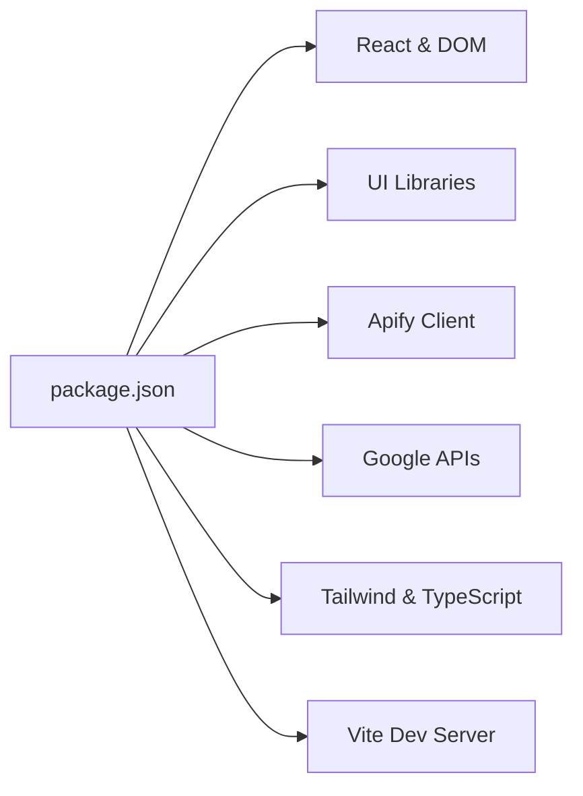

# Getting Started

<cite>
**Referenced Files in This Document**
- [package.json](file://package.json)
- [vite.config.ts](file://vite.config.ts)
- [index.html](file://index.html)
- [src/main.tsx](file://src/main.tsx)
- [src/App.tsx](file://src/App.tsx)
- [tsconfig.json](file://tsconfig.json)
- [tsconfig.app.json](file://tsconfig.app.json)
- [tsconfig.node.json](file://tsconfig.node.json)
- [components.json](file://components.json)
- [src/index.css](file://src/index.css)
- [src/services/config.ts](file://src/services/config.ts)
- [src/services/apify.ts](file://src/services/apify.ts)
- [src/services/google-sheets.ts](file://src/services/google-sheets.ts)
- [src/types/index.ts](file://src/types/index.ts)
- [src/lib/utils.ts](file://src/lib/utils.ts)
</cite>

## Table of Contents
1. [Introduction](#introduction)
2. [Prerequisites](#prerequisites)
3. [Installation](#installation)
4. [Initial Project Structure](#initial-project-structure)
5. [Environment Variables and First-Time Setup](#environment-variables-and-first-time-setup)
6. [Local Development Server](#local-development-server)
7. [Browser Compatibility](#browser-compatibility)
8. [Recommended Development Tools](#recommended-development-tools)
9. [Architecture Overview](#architecture-overview)
10. [Detailed Component Analysis](#detailed-component-analysis)
11. [Dependency Analysis](#dependency-analysis)
12. [Troubleshooting Guide](#troubleshooting-guide)
13. [Verification Checklist](#verification-checklist)
14. [Conclusion](#conclusion)

## Introduction
HuntSync AI is a React-based job search dashboard that aggregates job listings and social listening insights, storing data in Google Sheets via Apify scrapers. It uses Vite for fast development builds, Tailwind CSS for styling, and shadcn/ui components for UI primitives. This guide helps you set up the development environment, configure integrations, and run the application locally.

## Prerequisites
- Operating System: Windows, macOS, or Linux
- Node.js: Version matching the project's TypeScript and toolchain requirements
  - The project specifies TypeScript ~5.9.3 and Vite ^7.3.1. Install a compatible Node.js version (e.g., LTS).
- Package Manager: npm or yarn
  - The scripts in package.json use npm-style commands. yarn can also work if configured.
- Git: For cloning the repository
- Optional: A modern code editor (VS Code recommended) with TypeScript and ESLint extensions

**Section sources**
- [package.json:6-11](file://package.json#L6-L11)
- [tsconfig.app.json:1-33](file://tsconfig.app.json#L1-L33)
- [tsconfig.node.json:1-27](file://tsconfig.node.json#L1-L27)

## Installation
Follow these steps to install and run HuntSync AI locally:

1. Clone the repository
   - Use git to clone the repository to your local machine.
2. Navigate to the project directory
   - Open a terminal in the project folder.
3. Install dependencies
   - Run your package manager to install dependencies defined in package.json.
   - Example: npm install or yarn install
4. Verify TypeScript configuration
   - The project uses split tsconfig files. Ensure TypeScript recognizes the workspace configuration.
5. Start the development server
   - Run the dev script to launch Vite’s development server.
   - Example: npm run dev or yarn dev

At this point, the app should be accessible in your browser at the port indicated by Vite.

**Section sources**
- [package.json:6-11](file://package.json#L6-L11)
- [tsconfig.json:1-14](file://tsconfig.json#L1-L14)

## Initial Project Structure
This section explains the major directories and files and their roles in the application.

- public/
  - Static assets served as-is by Vite (e.g., favicon, static images).
- src/
  - Application source code.
  - Components and UI primitives under src/components.
  - Services for Apify and Google Sheets integrations under src/services.
  - Shared utilities under src/lib.
  - Type definitions under src/types.
  - Entry points: src/main.tsx (React root) and src/App.tsx (top-level component).
- Root configuration files:
  - package.json: Scripts, dependencies, and metadata.
  - vite.config.ts: Vite configuration, plugins, and path aliases.
  - tsconfig.json and related tsconfig.*.json: TypeScript project references and compiler options.
  - components.json: shadcn/ui configuration and aliases.
  - index.html: HTML shell with a root div and module script tag.
  - src/index.css: Tailwind and theme CSS.

**Diagram sources**
- [index.html:1-14](file://index.html#L1-L14)
- [src/main.tsx:1-15](file://src/main.tsx#L1-L15)
- [src/App.tsx:1-67](file://src/App.tsx#L1-L67)
- [package.json:1-48](file://package.json#L1-L48)
- [vite.config.ts:1-15](file://vite.config.ts#L1-L15)
- [tsconfig.json:1-14](file://tsconfig.json#L1-L14)
- [tsconfig.app.json:1-33](file://tsconfig.app.json#L1-L33)
- [tsconfig.node.json:1-27](file://tsconfig.node.json#L1-L27)
- [components.json:1-22](file://components.json#L1-L22)
- [src/index.css:1-153](file://src/index.css#L1-L153)

**Section sources**
- [index.html:1-14](file://index.html#L1-L14)
- [src/main.tsx:1-15](file://src/main.tsx#L1-L15)
- [src/App.tsx:1-67](file://src/App.tsx#L1-L67)
- [package.json:1-48](file://package.json#L1-L48)
- [vite.config.ts:1-15](file://vite.config.ts#L1-L15)
- [tsconfig.json:1-14](file://tsconfig.json#L1-L14)
- [tsconfig.app.json:1-33](file://tsconfig.app.json#L1-L33)
- [tsconfig.node.json:1-27](file://tsconfig.node.json#L1-L27)
- [components.json:1-22](file://components.json#L1-L22)
- [src/index.css:1-153](file://src/index.css#L1-L153)

## Environment Variables and First-Time Setup
HuntSync AI integrates with external services requiring configuration. The configuration is persisted in the browser’s localStorage and managed by a dedicated service.

- Configuration storage
  - The configuration store persists Apify and Google Cloud Platform settings in localStorage under a specific key.
  - Defaults are provided for Apify actors and Google Sheets identifiers.
- Apify integration
  - The Apify service communicates with a Supabase Edge Function to proxy requests to Apify.
  - A connection test endpoint is available to validate API token and actor configuration.
  - Scrapers for multiple platforms are supported and return normalized job data.
- Google Sheets integration
  - Uses a service account JSON and spreadsheet ID to authenticate and manage two sheets:
    - All_Jobs_Master (jobs)
    - LinkedIn_Hiring_Posts (posts)
  - Includes helpers to check connections, deduplicate entries, and update statuses.

First-time setup steps:
1. Configure Apify
   - Obtain an Apify API token and actor IDs for the desired platforms.
   - Save the configuration in the app’s configuration UI or programmatically via the configuration service.
2. Configure Google Sheets
   - Create a Google Cloud project, enable the Google Sheets API, and create a service account.
   - Download the service account JSON and note the spreadsheet ID.
   - Save the GCP configuration in the app’s configuration UI.
3. Verify connections
   - Use the built-in connection tests to validate both Apify and Google Sheets configurations.

**Diagram sources**
- [src/services/config.ts:1-66](file://src/services/config.ts#L1-L66)
- [src/services/apify.ts:1-348](file://src/services/apify.ts#L1-L348)
- [src/services/google-sheets.ts:1-354](file://src/services/google-sheets.ts#L1-L354)

**Section sources**
- [src/services/config.ts:1-66](file://src/services/config.ts#L1-L66)
- [src/services/apify.ts:13-42](file://src/services/apify.ts#L13-L42)
- [src/services/google-sheets.ts:104-119](file://src/services/google-sheets.ts#L104-L119)
- [src/types/index.ts:69-91](file://src/types/index.ts#L69-L91)

## Local Development Server
To start the development server:

1. Ensure dependencies are installed.
2. Run the dev script.
3. Open the URL shown by Vite in your browser.

The development server leverages Vite with React and Tailwind plugins. Path aliases are configured to simplify imports from src.

**Diagram sources**
- [package.json:6-11](file://package.json#L6-L11)
- [vite.config.ts:1-15](file://vite.config.ts#L1-L15)
- [index.html:11](file://index.html#L11)
- [src/main.tsx:1-15](file://src/main.tsx#L1-L15)

**Section sources**
- [package.json:6-11](file://package.json#L6-L11)
- [vite.config.ts:1-15](file://vite.config.ts#L1-L15)
- [index.html:11](file://index.html#L11)
- [src/main.tsx:1-15](file://src/main.tsx#L1-L15)

## Browser Compatibility
- The project targets modern browsers with ES2022/ES2023 features for the frontend and Node toolchain respectively.
- Ensure your browser supports:
  - ES modules (import/export)
  - Fetch API
  - Web Crypto API (used for JWT signing in Google Sheets service)
- For development, use a recent version of Chrome, Firefox, Safari, or Edge.

**Section sources**
- [tsconfig.app.json:4-6](file://tsconfig.app.json#L4-L6)
- [tsconfig.node.json:4-5](file://tsconfig.node.json#L4-L5)
- [src/services/google-sheets.ts:62-102](file://src/services/google-sheets.ts#L62-L102)

## Recommended Development Tools
- IDE/Editor: VS Code with extensions for TypeScript, Tailwind CSS, and React.
- Browser Developer Tools: Inspect network requests to Apify and Google Sheets.
- Node.js Inspector: Use for debugging Vite and TypeScript builds.
- Git: Track changes and collaborate.

## Architecture Overview
HuntSync AI follows a modular React architecture with clear separation of concerns:

- Entry point: src/main.tsx renders the root and wraps the app with theme provider.
- Top-level component: src/App.tsx orchestrates tabs for Job Search, Social Listening, and Configuration.
- Services:
  - src/services/apify.ts: Scrapes job listings via Apify through a proxy.
  - src/services/google-sheets.ts: Persists and retrieves data from Google Sheets.
  - src/services/config.ts: Manages configuration in localStorage.
- Styling and UI:
  - Tailwind CSS and shadcn/ui components via components.json aliases.
  - Global styles in src/index.css with theme variables and dark mode support.
- Tooling:
  - Vite for fast builds and HMR.
  - TypeScript configuration split across tsconfig files.

**Diagram sources**
- [src/main.tsx:1-15](file://src/main.tsx#L1-L15)
- [src/App.tsx:1-67](file://src/App.tsx#L1-L67)
- [src/services/apify.ts:1-348](file://src/services/apify.ts#L1-L348)
- [src/services/google-sheets.ts:1-354](file://src/services/google-sheets.ts#L1-L354)
- [src/services/config.ts:1-66](file://src/services/config.ts#L1-L66)
- [src/index.css:1-153](file://src/index.css#L1-L153)
- [components.json:13-19](file://components.json#L13-L19)

**Section sources**
- [src/main.tsx:1-15](file://src/main.tsx#L1-L15)
- [src/App.tsx:1-67](file://src/App.tsx#L1-L67)
- [src/services/apify.ts:1-348](file://src/services/apify.ts#L1-L348)
- [src/services/google-sheets.ts:1-354](file://src/services/google-sheets.ts#L1-L354)
- [src/services/config.ts:1-66](file://src/services/config.ts#L1-L66)
- [src/index.css:1-153](file://src/index.css#L1-L153)
- [components.json:13-19](file://components.json#L13-L19)

## Detailed Component Analysis

### Configuration Management
- Purpose: Centralized configuration store for Apify and Google Cloud Platform settings.
- Key behaviors:
  - Loads saved configuration from localStorage with fallback defaults.
  - Updates partial configurations and persists them.
  - Clears configuration when needed.

**Diagram sources**
- [src/services/config.ts:26-47](file://src/services/config.ts#L26-L47)

**Section sources**
- [src/services/config.ts:1-66](file://src/services/config.ts#L1-L66)

### Apify Integration
- Purpose: Orchestrates scraping jobs via Apify through a proxy endpoint.
- Key behaviors:
  - Tests connectivity using a known actor endpoint.
  - Normalizes diverse scraper outputs into a unified format.
  - Provides platform-specific scrapers (LinkedIn, Indeed, Naukri, etc.) and LinkedIn post scraping.

**Diagram sources**
- [src/services/apify.ts:84-113](file://src/services/apify.ts#L84-L113)
- [src/services/apify.ts:58-81](file://src/services/apify.ts#L58-L81)

**Section sources**
- [src/services/apify.ts:1-348](file://src/services/apify.ts#L1-L348)

### Google Sheets Integration
- Purpose: Manages data persistence and retrieval for jobs and LinkedIn posts.
- Key behaviors:
  - Generates access tokens using a service account JWT.
  - Deduplicates entries by checking existing IDs.
  - Supports appending new rows and updating statuses.

**Diagram sources**
- [src/services/google-sheets.ts:162-200](file://src/services/google-sheets.ts#L162-L200)

**Section sources**
- [src/services/google-sheets.ts:1-354](file://src/services/google-sheets.ts#L1-L354)

### UI and Styling
- Entry point: src/main.tsx mounts the app and applies ThemeProvider.
- App shell: src/App.tsx defines the header, tabs, and global toast notifications.
- Styling: Tailwind directives and theme variables in src/index.css with dark mode variants.
- Utilities: src/lib/utils.ts provides a class merging utility.

**Diagram sources**
- [src/main.tsx:6](file://src/main.tsx#L6)
- [src/App.tsx:12-62](file://src/App.tsx#L12-L62)

**Section sources**
- [src/main.tsx:1-15](file://src/main.tsx#L1-L15)
- [src/App.tsx:1-67](file://src/App.tsx#L1-L67)
- [src/index.css:1-153](file://src/index.css#L1-L153)
- [src/lib/utils.ts:1-7](file://src/lib/utils.ts#L1-L7)

## Dependency Analysis
- Runtime dependencies include React, Radix UI, Lucide icons, Recharts, Tailwind utilities, and integration libraries for Apify and Google APIs.
- Development dependencies include TypeScript, Vite, and React plugin.
- Aliases and path mapping are configured to simplify imports from src.

**Diagram sources**
- [package.json:12-46](file://package.json#L12-L46)

**Section sources**
- [package.json:12-46](file://package.json#L12-L46)

## Troubleshooting Guide
Common issues and resolutions:

- Node.js version mismatch
  - Symptom: Build errors or incompatible toolchain.
  - Resolution: Install a Node.js version compatible with TypeScript ~5.9.3 and Vite ^7.3.1.
- Missing dependencies after clone
  - Symptom: Module resolution errors or missing packages.
  - Resolution: Run npm install or yarn install to install dependencies from package.json.
- Vite fails to start
  - Symptom: Port already in use or plugin errors.
  - Resolution: Change port in Vite config if needed; ensure plugins are installed.
- Apify connection failures
  - Symptom: Network errors or invalid actor responses.
  - Resolution: Verify API token and actor IDs; use the connection test utility.
- Google Sheets authentication errors
  - Symptom: 401/403 errors when accessing spreadsheets.
  - Resolution: Confirm service account JSON validity, required scopes, and spreadsheet ID; ensure private key is present.
- Dark mode not applying
  - Symptom: Theme not switching.
  - Resolution: Check ThemeProvider defaultTheme prop and CSS variables in src/index.css.

**Section sources**
- [src/services/apify.ts:25-42](file://src/services/apify.ts#L25-L42)
- [src/services/google-sheets.ts:104-119](file://src/services/google-sheets.ts#L104-L119)
- [src/index.css:50-72](file://src/index.css#L50-L72)

## Verification Checklist
- Dependencies installed
  - npm install or yarn install completed successfully.
- Development server runs
  - npm run dev starts without errors; app loads in the browser.
- Configuration saved
  - Apify and Google Sheets configuration saved in localStorage.
- Connections verified
  - Apify connection test passes.
  - Google Sheets connection test passes.
- UI renders
  - Header, tabs, and placeholder content visible.
- Scraping and sync work
  - Trigger a scrape and confirm data appears in Google Sheets.

**Section sources**
- [package.json:6-11](file://package.json#L6-L11)
- [src/services/config.ts:45-61](file://src/services/config.ts#L45-L61)
- [src/services/apify.ts:25-42](file://src/services/apify.ts#L25-L42)
- [src/services/google-sheets.ts:104-119](file://src/services/google-sheets.ts#L104-L119)

## Conclusion
You are now ready to develop and run HuntSync AI locally. Use the configuration UI to set up Apify and Google Sheets, verify connections, and explore the dashboard tabs. For deeper customization, adjust Vite and TypeScript settings, extend the UI with shadcn/ui components, and integrate additional scrapers or data sources.