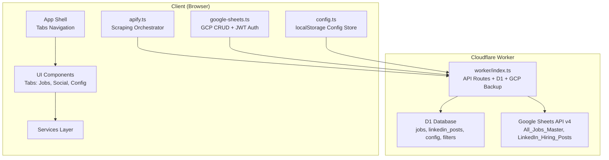
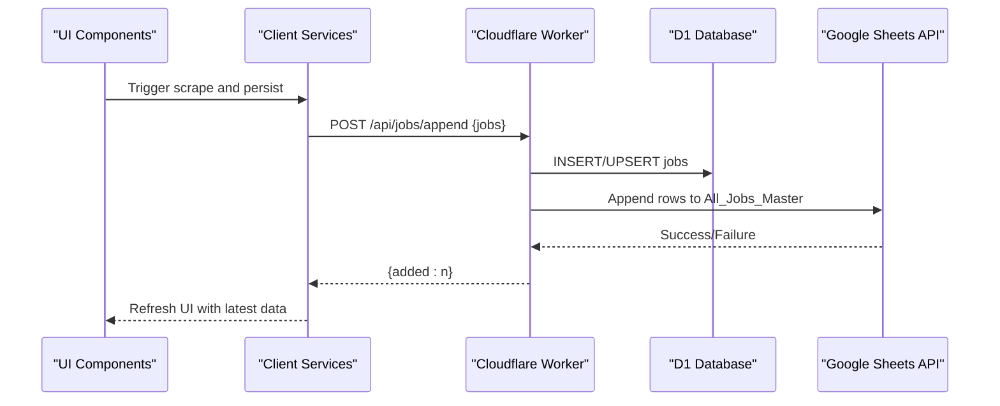
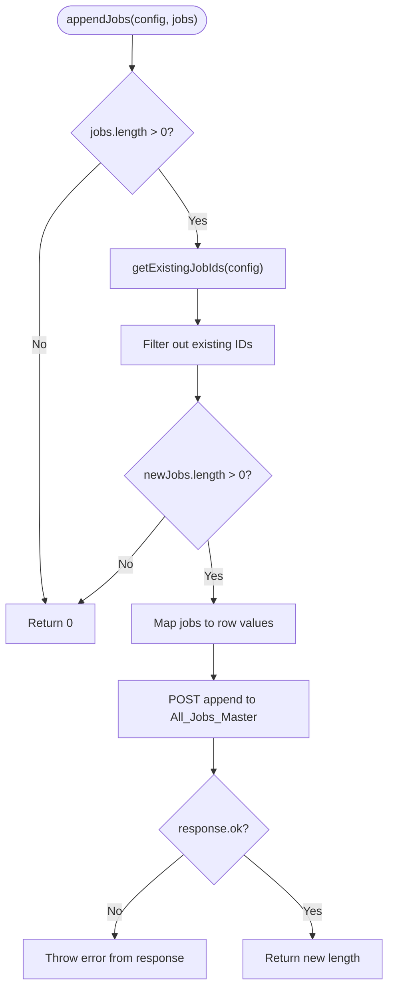
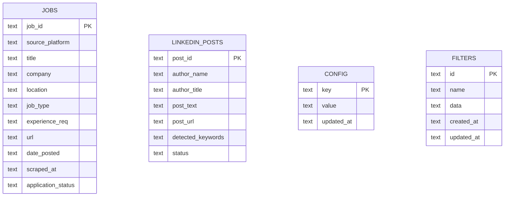
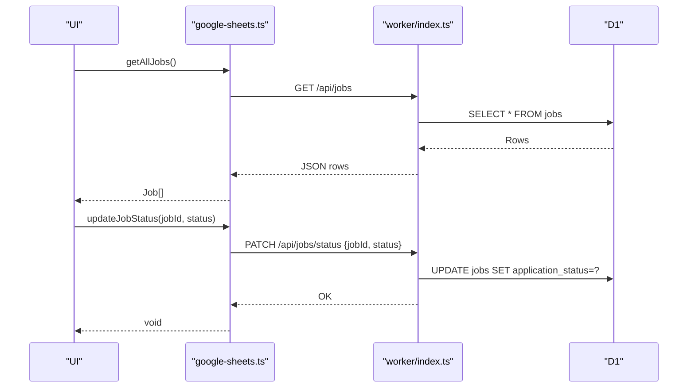
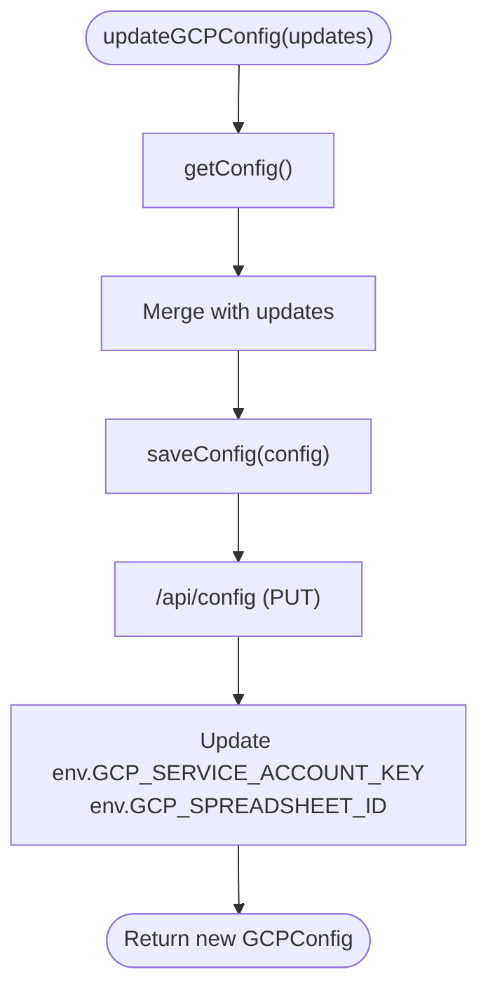
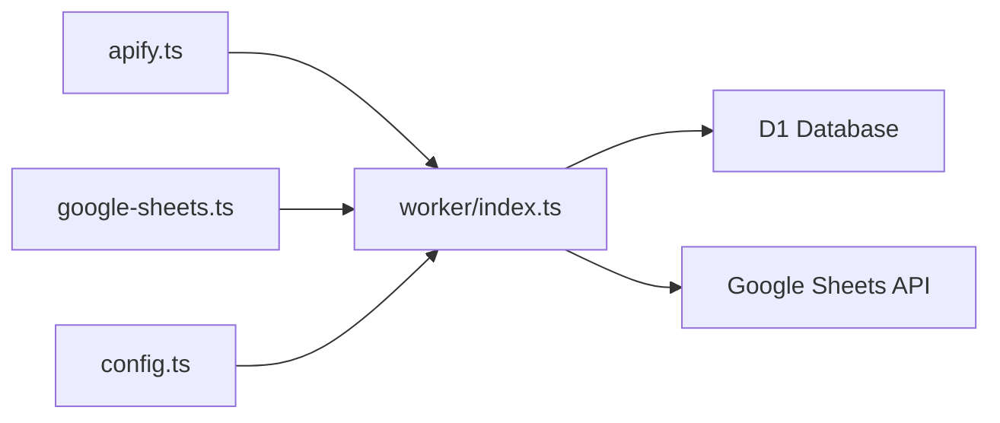

# Data Persistence

<cite>
**Referenced Files in This Document**
- [google-sheets.ts](file://src/services/google-sheets.ts)
- [config.ts](file://src/services/config.ts)
- [apify.ts](file://src/services/apify.ts)
- [index.ts](file://src/types/index.ts)
- [index.ts](file://worker/index.ts)
- [schema.sql](file://schema.sql)
- [WIKI.md](file://WIKI.md)
</cite>

## Table of Contents
1. [Introduction](#introduction)
2. [Project Structure](#project-structure)
3. [Core Components](#core-components)
4. [Architecture Overview](#architecture-overview)
5. [Detailed Component Analysis](#detailed-component-analysis)
6. [Dependency Analysis](#dependency-analysis)
7. [Performance Considerations](#performance-considerations)
8. [Troubleshooting Guide](#troubleshooting-guide)
9. [Conclusion](#conclusion)
10. [Appendices](#appendices)

## Introduction
This document explains the data persistence layer of the job search dashboard, focusing on:
- Google Sheets integration via browser-based JWT authentication and Cloudflare Worker-backed backup
- Job and LinkedIn post data models, field mappings, and schema design
- CRUD operations for job records and status updates
- Data synchronization between local state and Google Sheets
- Configuration management for GCP credentials and spreadsheet identifiers
- Error handling strategies and operational guidance for backup, export, and migration

## Project Structure
The data persistence layer spans three main areas:
- Client-side services for Apify scraping, Google Sheets CRUD, and configuration storage
- Cloudflare Worker that serves the SPA and exposes API endpoints backed by D1 and Google Sheets
- Database schema for Cloudflare D1 and Google Sheets schema for backup

**Diagram sources**
- [index.ts](file://src/App.tsx)
- [apify.ts](file://src/services/apify.ts)
- [google-sheets.ts](file://src/services/google-sheets.ts)
- [config.ts](file://src/services/config.ts)
- [index.ts](file://worker/index.ts)
- [schema.sql](file://schema.sql)

**Section sources**
- [WIKI.md](file://WIKI.md)

## Core Components
- Apify service orchestrates scraping via a proxy and normalizes outputs to common types.
- Google Sheets service performs CRUD operations against two sheets using browser-signed JWTs for OAuth2 access.
- Config service manages application configuration in localStorage and provides server-side testing endpoints.
- Cloudflare Worker exposes API routes for jobs/posts CRUD, wipes, and configuration management, backed by D1 and Google Sheets.

**Section sources**
- [apify.ts](file://src/services/apify.ts)
- [google-sheets.ts](file://src/services/google-sheets.ts)
- [config.ts](file://src/services/config.ts)
- [index.ts](file://worker/index.ts)
- [schema.sql](file://schema.sql)

## Architecture Overview
The system uses a dual-storage model:
- Primary storage: Cloudflare D1 (SQL tables for jobs, posts, config, filters)
- Backup storage: Google Sheets (sheets for jobs and posts)

**Diagram sources**
- [google-sheets.ts](file://src/services/google-sheets.ts)
- [index.ts](file://worker/index.ts)
- [schema.sql](file://schema.sql)

## Detailed Component Analysis

### Google Sheets Integration
- Authentication: Browser-based RS256 JWT signing using Web Crypto API, exchanged for an OAuth2 access token scoped to Google Sheets.
- Token caching: Access tokens are cached and reused until expiry minus a safety buffer.
- Sheets used:
  - All_Jobs_Master (columns A:K for job records)
  - LinkedIn_Hiring_Posts (columns A:G for posts)
- Deduplication: Before appending, existing IDs are fetched from column A to skip duplicates.
- Status updates: Locate rows by ID and update the appropriate status column.

**Diagram sources**
- [google-sheets.ts](file://src/services/google-sheets.ts)

**Section sources**
- [google-sheets.ts](file://src/services/google-sheets.ts)

### Job Data Storage and Schema
- Data model: Job interface defines 11 fields mapped to All_Jobs_Master columns.
- Indexes: D1 tables include indexes on platform and status for efficient filtering.
- Default values: Many fields have sensible defaults to maintain data integrity.

**Diagram sources**
- [schema.sql](file://schema.sql)

**Section sources**
- [index.ts](file://src/types/index.ts)
- [schema.sql](file://schema.sql)

### LinkedIn Posts Storage and Schema
- Data model: LinkedInHiringPost interface defines 7 fields mapped to LinkedIn_Hiring_Posts columns.
- Keyword extraction: Keywords are auto-detected from post text for quick triage.

**Section sources**
- [index.ts](file://src/types/index.ts)
- [schema.sql](file://schema.sql)

### CRUD Operations for Jobs
- Retrieve: Fetch all rows from All_Jobs_Master and map to Job array.
- Insert: Deduplicate by existing IDs, then append rows to the sheet.
- Update status: Find row by job_id and update the status column.
- Wipe: Clear all data rows while preserving headers.

**Diagram sources**
- [google-sheets.ts](file://src/services/google-sheets.ts)
- [index.ts](file://worker/index.ts)
- [schema.sql](file://schema.sql)

**Section sources**
- [google-sheets.ts](file://src/services/google-sheets.ts)
- [index.ts](file://worker/index.ts)
- [schema.sql](file://schema.sql)

### Configuration Management (GCP Credentials and Spreadsheet IDs)
- Client-side config store persists Apify and GCP settings in localStorage.
- Server-side endpoints:
  - Load/save combined configuration
  - Test GCP connection using provided credentials
  - Save partial updates for Apify and GCP sections
- Secret storage: GCP service account key and spreadsheet ID are stored as secrets in the Workers environment.

**Diagram sources**
- [config.ts](file://src/services/config.ts)
- [index.ts](file://worker/index.ts)

**Section sources**
- [config.ts](file://src/services/config.ts)
- [index.ts](file://worker/index.ts)

### Data Synchronization Between Local State and Google Sheets
- Primary source of truth: Cloudflare D1 tables
- Backup: Google Sheets appended rows with deduplication
- Conflict resolution: ID-based deduplication prevents duplicate entries; explicit status updates target specific rows by ID
- Offline capability: Client can continue to operate with localStorage-based configuration; network failures surface as thrown errors from API calls

**Section sources**
- [google-sheets.ts](file://src/services/google-sheets.ts)
- [config.ts](file://src/services/config.ts)

## Dependency Analysis
- Client services depend on:
  - Apify service for normalized job/post datasets
  - Google Sheets service for backup persistence
  - Config service for credentials and settings
- Worker depends on:
  - D1 for primary storage
  - Google Sheets API for backup
  - Environment secrets for GCP credentials

**Diagram sources**
- [apify.ts](file://src/services/apify.ts)
- [google-sheets.ts](file://src/services/google-sheets.ts)
- [config.ts](file://src/services/config.ts)
- [index.ts](file://worker/index.ts)
- [schema.sql](file://schema.sql)

**Section sources**
- [apify.ts](file://src/services/apify.ts)
- [google-sheets.ts](file://src/services/google-sheets.ts)
- [config.ts](file://src/services/config.ts)
- [index.ts](file://worker/index.ts)
- [schema.sql](file://schema.sql)

## Performance Considerations
- Token caching: Access tokens are cached to minimize repeated OAuth2 exchanges.
- Batch operations: Append operations send arrays of rows to reduce round trips.
- Deduplication cost: Fetching existing IDs is O(n) but avoids redundant writes.
- Network resilience: API calls throw on non-OK responses; callers should debounce retries and present user-friendly messages.

[No sources needed since this section provides general guidance]

## Troubleshooting Guide
Common issues and resolutions:
- Authentication failures:
  - Verify service account JSON validity and presence of private key
  - Confirm spreadsheet sharing with the service account email
  - Use the GCP connection tester to validate credentials
- API failures:
  - Inspect thrown errors from append/update calls
  - Check network connectivity and CORS handling in the Worker
- Data consistency:
  - Ensure job_id uniqueness and correct mapping to All_Jobs_Master columns
  - Use status update by ID to avoid ambiguous row targeting
- Backup verification:
  - Confirm rows appear in Google Sheets after successful D1 inserts
  - Validate deduplication by checking for repeated IDs

**Section sources**
- [google-sheets.ts](file://src/services/google-sheets.ts)
- [config.ts](file://src/services/config.ts)

## Conclusion
The data persistence layer combines a robust client-side services architecture with a Cloudflare Worker backend to provide reliable job and post data management. D1 serves as the primary datastore, while Google Sheets acts as a durable backup with straightforward CRUD operations and deduplication. Proper configuration of GCP credentials and spreadsheet setup ensures seamless synchronization and operational continuity.

[No sources needed since this section summarizes without analyzing specific files]

## Appendices

### Data Export and Migration Procedures
- Export:
  - Download Google Sheets data directly from All_Jobs_Master and LinkedIn_Hiring_Posts
  - Alternatively, query D1 tables via the Worker API for programmatic access
- Migration:
  - Back up current D1 data and Google Sheets
  - Deploy new schema changes to D1
  - Re-run ingestion to populate updated schema
  - Validate data integrity and re-share Google Sheets as needed

**Section sources**
- [schema.sql](file://schema.sql)
- [WIKI.md](file://WIKI.md)