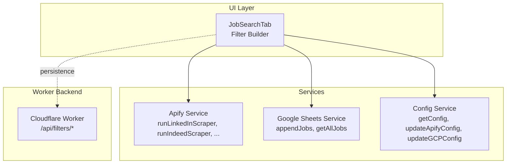
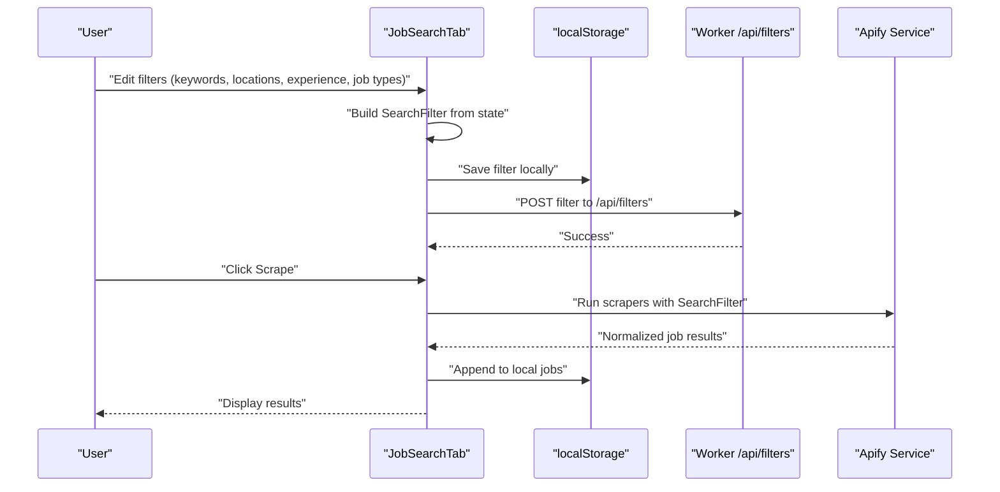
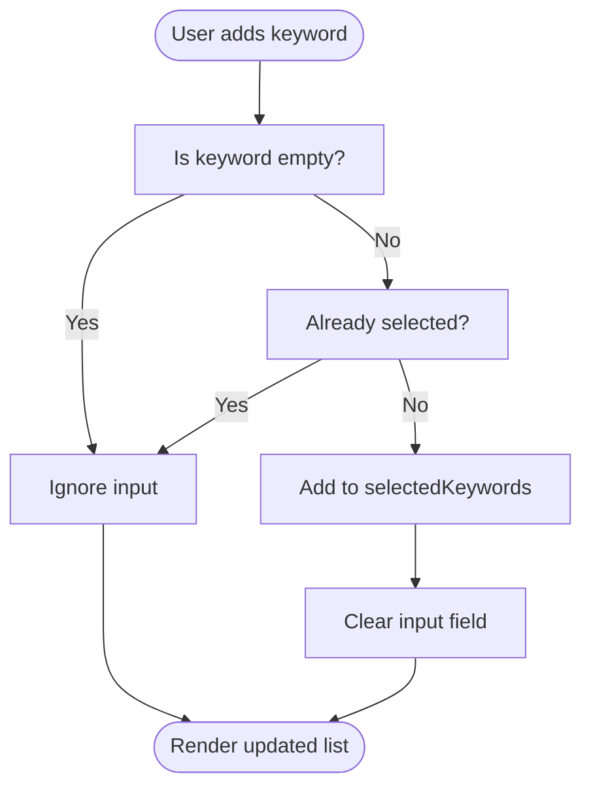
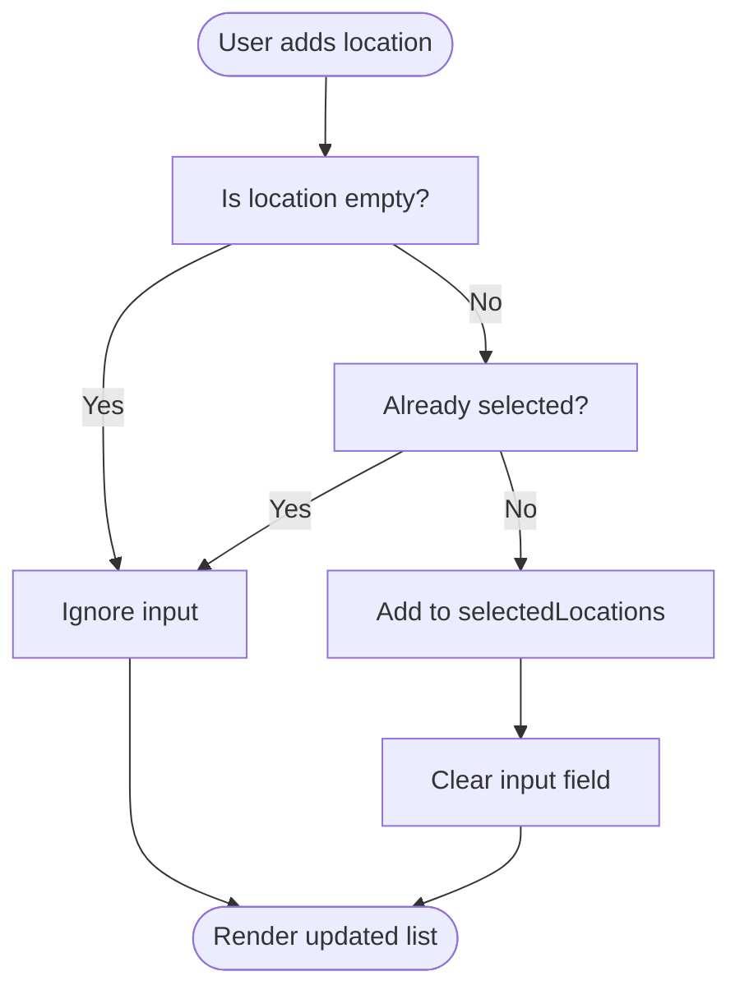
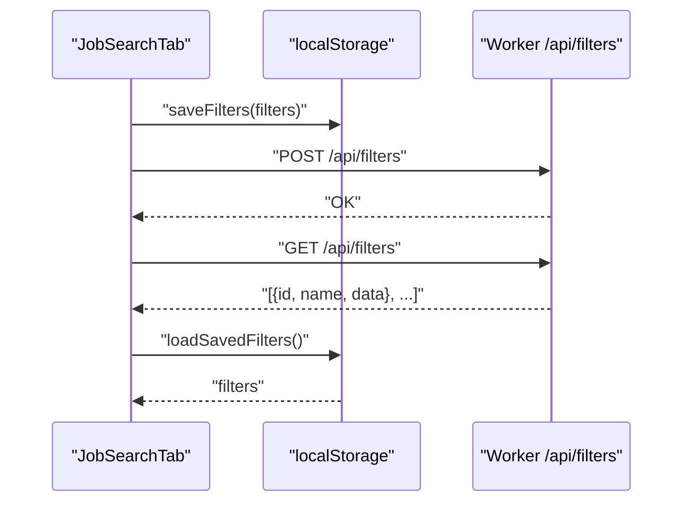
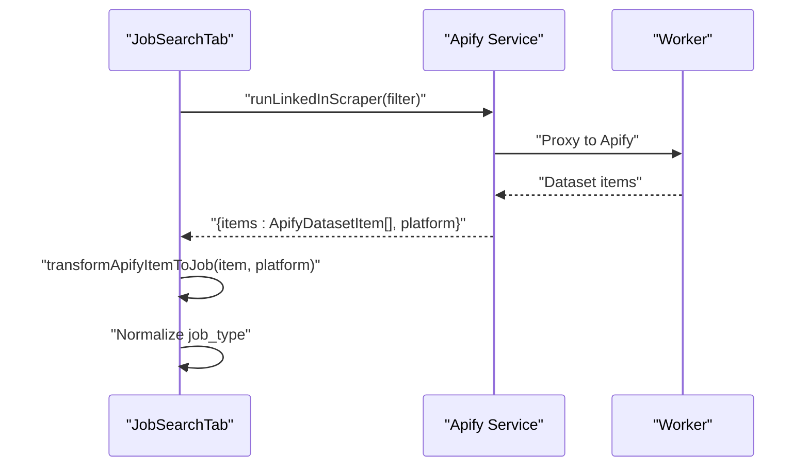
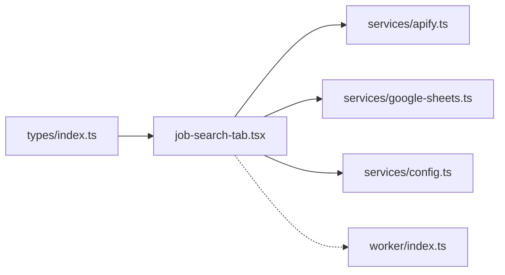

# Filter Builder

<cite>
**Referenced Files in This Document**
- [job-search-tab.tsx](file://src/components/dashboard/job-search-tab.tsx)
- [types/index.ts](file://src/types/index.ts)
- [apify.ts](file://src/services/apify.ts)
- [google-sheets.ts](file://src/services/google-sheets.ts)
- [config.ts](file://src/services/config.ts)
- [index.ts](file://worker/index.ts)
</cite>

## Table of Contents
1. [Introduction](#introduction)
2. [Project Structure](#project-structure)
3. [Core Components](#core-components)
4. [Architecture Overview](#architecture-overview)
5. [Detailed Component Analysis](#detailed-component-analysis)
6. [Dependency Analysis](#dependency-analysis)
7. [Performance Considerations](#performance-considerations)
8. [Troubleshooting Guide](#troubleshooting-guide)
9. [Conclusion](#conclusion)
10. [Appendices](#appendices)

## Introduction
This document explains the Filter Builder component used to configure job search parameters and manage saved search templates. It covers:
- Keyword management: default suggestions, adding/removing custom keywords, and validation
- Location selection: presets, custom input, and filtering behavior
- Experience level selector with predefined ranges and career stages
- Job type filtering for Remote, Work From Office (WFO), and Work From Home (WFH)
- Saved filters: templates, persistence, and lifecycle operations
- Configuration options for creating, editing, deleting, and loading filters
- Practical examples and best practices for effective job searching

## Project Structure
The Filter Builder lives in the Job Search tab and integrates with services for scraping, transforming results, and persisting filters. The worker backend exposes APIs for filter CRUD operations.



**Diagram sources**
- [job-search-tab.tsx:73-522](file://src/components/dashboard/job-search-tab.tsx#L73-L522)
- [apify.ts:84-272](file://src/services/apify.ts#L84-L272)
- [google-sheets.ts:162-259](file://src/services/google-sheets.ts#L162-L259)
- [config.ts:26-65](file://src/services/config.ts#L26-L65)
- [index.ts:407-447](file://worker/index.ts#L407-L447)

**Section sources**
- [job-search-tab.tsx:73-522](file://src/components/dashboard/job-search-tab.tsx#L73-L522)

## Core Components
- Filter Builder UI: renders keyword/location/experience/job type controls and saved filters badges
- Keyword manager: maintains selected keywords, supports default suggestions and custom entries
- Location manager: manages selected locations with defaults and custom input
- Experience selector: predefined ranges and career stages
- Job type toggles: Remote/WFO/WFH
- Saved filters: templates persisted via localStorage and exposed via worker APIs

**Section sources**
- [job-search-tab.tsx:33-84](file://src/components/dashboard/job-search-tab.tsx#L33-L84)
- [job-search-tab.tsx:258-397](file://src/components/dashboard/job-search-tab.tsx#L258-L397)
- [types/index.ts:45-56](file://src/types/index.ts#L45-L56)

## Architecture Overview
The Filter Builder composes a SearchFilter object from current selections and persists it. Scrapers consume this filter to query external platforms.



**Diagram sources**
- [job-search-tab.tsx:136-151](file://src/components/dashboard/job-search-tab.tsx#L136-L151)
- [job-search-tab.tsx:160-230](file://src/components/dashboard/job-search-tab.tsx#L160-L230)
- [apify.ts:84-146](file://src/services/apify.ts#L84-L146)
- [index.ts:425-437](file://worker/index.ts#L425-L437)

## Detailed Component Analysis

### Keyword Management System
- Default keyword suggestions: a curated list is shown and can be added with a single click
- Custom keyword addition: typed keywords are appended after Enter or button click
- Validation: duplicates are prevented; empty or whitespace-only keywords are ignored
- Removal: individual keywords can be removed via badge actions



**Diagram sources**
- [job-search-tab.tsx:106-115](file://src/components/dashboard/job-search-tab.tsx#L106-L115)
- [job-search-tab.tsx:282-293](file://src/components/dashboard/job-search-tab.tsx#L282-L293)

**Section sources**
- [job-search-tab.tsx:33-34](file://src/components/dashboard/job-search-tab.tsx#L33-L34)
- [job-search-tab.tsx:106-115](file://src/components/dashboard/job-search-tab.tsx#L106-L115)
- [job-search-tab.tsx:282-293](file://src/components/dashboard/job-search-tab.tsx#L282-L293)

### Location Selection Interface
- Default locations: a curated list is offered for quick selection
- Custom location input: users can type and add new locations
- Filtering logic: selected locations are used to construct search URLs/queries for scrapers



**Diagram sources**
- [job-search-tab.tsx:117-126](file://src/components/dashboard/job-search-tab.tsx#L117-L126)
- [job-search-tab.tsx:320-331](file://src/components/dashboard/job-search-tab.tsx#L320-L331)

**Section sources**
- [job-search-tab.tsx:34-35](file://src/components/dashboard/job-search-tab.tsx#L34-L35)
- [job-search-tab.tsx:117-126](file://src/components/dashboard/job-search-tab.tsx#L117-L126)
- [job-search-tab.tsx:320-331](file://src/components/dashboard/job-search-tab.tsx#L320-L331)

### Experience Level Selector
- Options: 0-1 years, 1-3 years, Internship, 3-5 years, 5+ years
- Behavior: single selection updates the current filter’s experience level

**Section sources**
- [job-search-tab.tsx:334-349](file://src/components/dashboard/job-search-tab.tsx#L334-L349)
- [types/index.ts:56-56](file://src/types/index.ts#L56-L56)

### Job Type Filtering
- Options: Remote, WFO, WFH
- Behavior: multi-select toggles inclusion in the filter
- Scrapers interpret job type from normalized results; Remote/WFH mapped from raw type text

```mermaid
classDiagram
class JobType {
<<enum>>
"Remote"
"WFO"
"WFH"
}
class SearchFilter {
+string[] keywords
+string[] locations
+JobType[] job_types
+string experience
}
SearchFilter --> JobType : "contains"
```

**Diagram sources**
- [types/index.ts:8-8](file://src/types/index.ts#L8-L8)
- [types/index.ts:45-56](file://src/types/index.ts#L45-L56)
- [apify.ts:332-337](file://src/services/apify.ts#L332-L337)

**Section sources**
- [job-search-tab.tsx:351-366](file://src/components/dashboard/job-search-tab.tsx#L351-L366)
- [apify.ts:332-337](file://src/services/apify.ts#L332-L337)

### Saved Filters Functionality
- Templates: each saved filter stores keywords, experience, locations, and job types
- Persistence: filters are stored in localStorage and also synced to the worker backend
- Lifecycle:
  - Save: captures current selections into a new template
  - Delete: removes a template by id
  - Load: templates are fetched from the backend and rendered as selectable badges



**Diagram sources**
- [job-search-tab.tsx:38-52](file://src/components/dashboard/job-search-tab.tsx#L38-L52)
- [job-search-tab.tsx:136-151](file://src/components/dashboard/job-search-tab.tsx#L136-L151)
- [job-search-tab.tsx:409-426](file://src/components/dashboard/job-search-tab.tsx#L409-L426)
- [index.ts:407-447](file://worker/index.ts#L407-L447)

**Section sources**
- [job-search-tab.tsx:36-52](file://src/components/dashboard/job-search-tab.tsx#L36-L52)
- [job-search-tab.tsx:136-158](file://src/components/dashboard/job-search-tab.tsx#L136-L158)
- [job-search-tab.tsx:401-426](file://src/components/dashboard/job-search-tab.tsx#L401-L426)
- [index.ts:407-447](file://worker/index.ts#L407-L447)

### Scraping Integration
- The current filter is serialized into a SearchFilter and passed to scrapers
- Scrapers normalize results to a common Job model, including job type inference



**Diagram sources**
- [job-search-tab.tsx:160-230](file://src/components/dashboard/job-search-tab.tsx#L160-L230)
- [apify.ts:84-146](file://src/services/apify.ts#L84-L146)
- [apify.ts:301-318](file://src/services/apify.ts#L301-L318)

**Section sources**
- [job-search-tab.tsx:160-230](file://src/components/dashboard/job-search-tab.tsx#L160-L230)
- [apify.ts:301-318](file://src/services/apify.ts#L301-L318)

## Dependency Analysis
- UI depends on types for SearchFilter and enums for JobType and ExperienceLevel
- Scrapers depend on Apify service and normalize results
- Persistence uses localStorage for UI state and worker APIs for backend storage
- Google Sheets service supports data ingestion and status updates



**Diagram sources**
- [types/index.ts:45-56](file://src/types/index.ts#L45-L56)
- [job-search-tab.tsx:28-31](file://src/components/dashboard/job-search-tab.tsx#L28-L31)
- [apify.ts:1-11](file://src/services/apify.ts#L1-L11)
- [google-sheets.ts:1-8](file://src/services/google-sheets.ts#L1-L8)
- [config.ts:1-6](file://src/services/config.ts#L1-L6)
- [index.ts:1-10](file://worker/index.ts#L1-L10)

**Section sources**
- [types/index.ts:45-56](file://src/types/index.ts#L45-L56)
- [job-search-tab.tsx:28-31](file://src/components/dashboard/job-search-tab.tsx#L28-L31)

## Performance Considerations
- Debounce or batch UI updates when adding/removing many keywords/locations
- Limit default suggestion lists to avoid overwhelming the UI
- Avoid frequent localStorage writes; coalesce saves when possible
- Normalize job types early to reduce downstream processing overhead

## Troubleshooting Guide
- Missing Apify token: scraping buttons warn and abort if not configured
- GCP configuration: if not set, data is not appended to Google Sheets but remains in local state
- Filter persistence: ensure worker APIs are reachable; otherwise, filters are only stored in localStorage

**Section sources**
- [job-search-tab.tsx:160-165](file://src/components/dashboard/job-search-tab.tsx#L160-L165)
- [job-search-tab.tsx:208-217](file://src/components/dashboard/job-search-tab.tsx#L208-L217)
- [config.ts:26-43](file://src/services/config.ts#L26-L43)

## Conclusion
The Filter Builder provides a flexible, persistent way to define and reuse job search criteria. Its keyword/location managers, experience selector, and job type toggles combine to form a robust SearchFilter. Saved filters are persisted both locally and via the worker backend, enabling reliable reuse across sessions.

## Appendices

### Configuration Options
- Create: Save current filter from the UI
- Edit: Modify selections and save again to update the template
- Delete: Remove a saved filter from both localStorage and the backend
- Load: Fetch templates from the backend and render as selectable badges

**Section sources**
- [job-search-tab.tsx:136-158](file://src/components/dashboard/job-search-tab.tsx#L136-L158)
- [job-search-tab.tsx:409-426](file://src/components/dashboard/job-search-tab.tsx#L409-L426)
- [index.ts:407-447](file://worker/index.ts#L407-L447)

### Examples and Best Practices
- Narrow down keywords to high-signal terms (e.g., “DevOps”, “Cloud Engineer”) to improve relevance
- Combine Remote with technology keywords for remote-first roles
- Use locations strategically—include Remote and major hubs if targeting hybrid/remote
- Start with broad experience ranges and refine as you discover market fit
- Save multiple filters for different career stages (e.g., Internship vs. 3-5 years)

[No sources needed since this section provides general guidance]