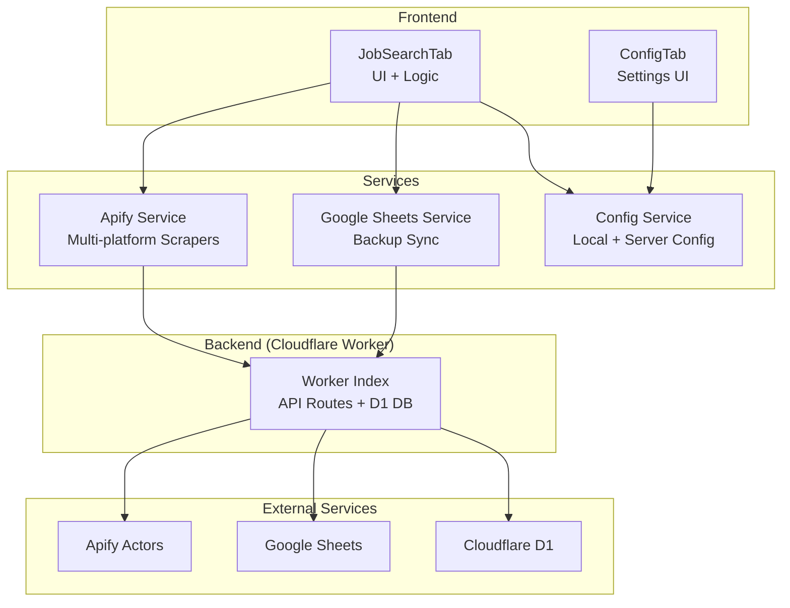
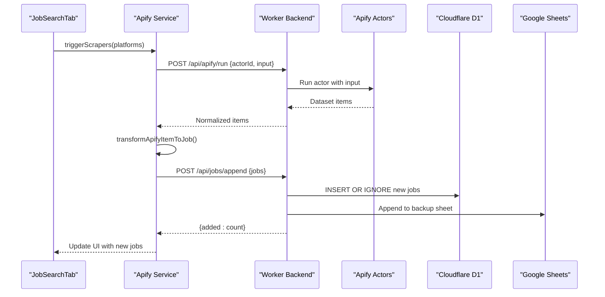
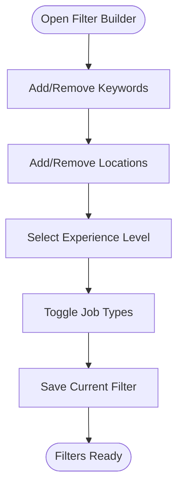
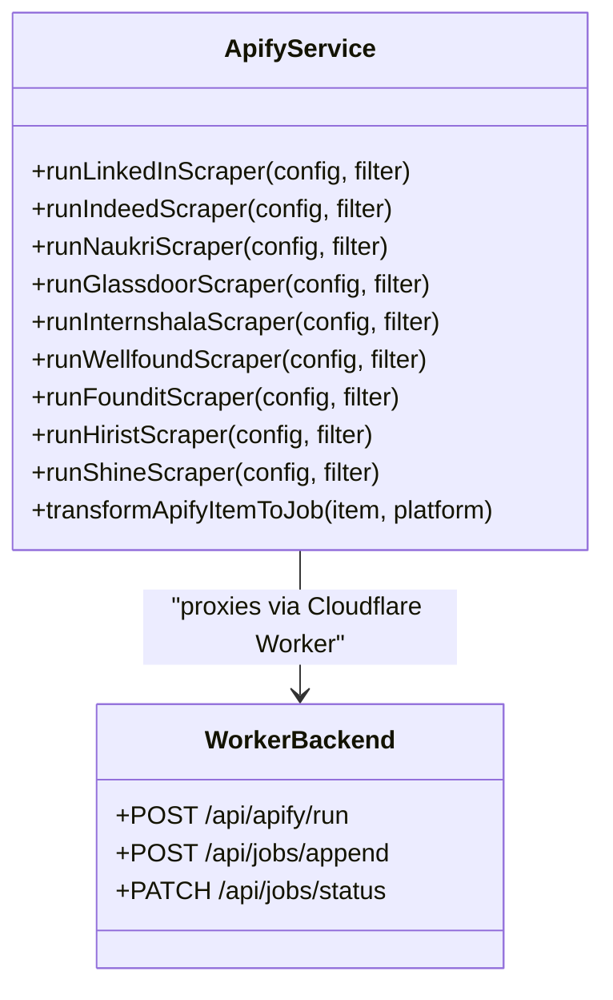
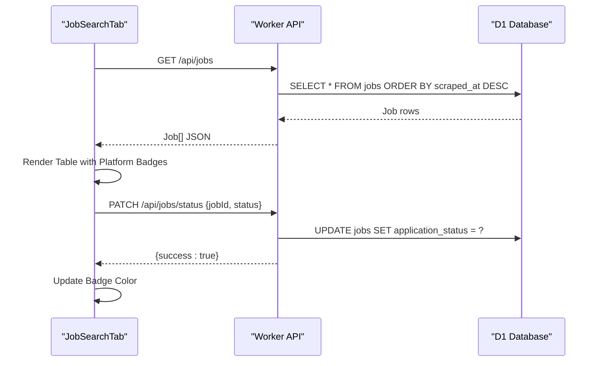
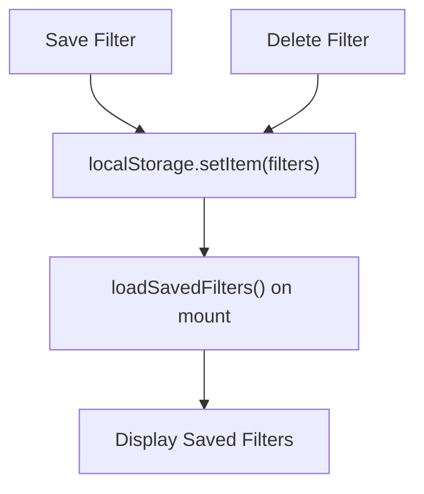
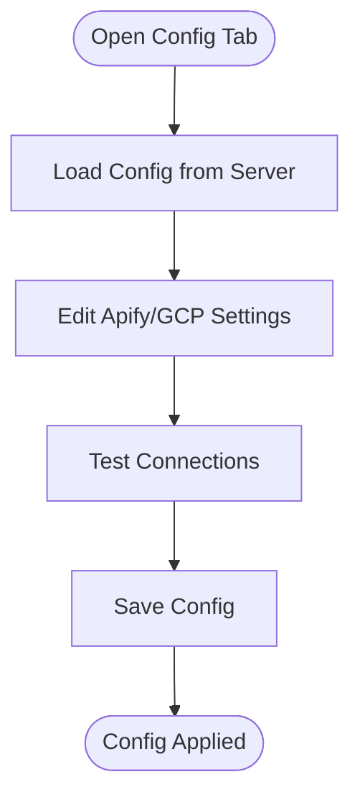
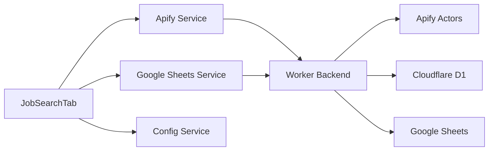

# Job Search Functionality

<cite>
**Referenced Files in This Document**
- [job-search-tab.tsx](file://src/components/dashboard/job-search-tab.tsx)
- [apify.ts](file://src/services/apify.ts)
- [config.ts](file://src/services/config.ts)
- [google-sheets.ts](file://src/services/google-sheets.ts)
- [index.ts](file://worker/index.ts)
- [index.ts](file://src/types/index.ts)
- [config-tab.tsx](file://src/components/dashboard/config-tab.tsx)
</cite>

## Table of Contents
1. [Introduction](#introduction)
2. [Project Structure](#project-structure)
3. [Core Components](#core-components)
4. [Architecture Overview](#architecture-overview)
5. [Detailed Component Analysis](#detailed-component-analysis)
6. [Dependency Analysis](#dependency-analysis)
7. [Performance Considerations](#performance-considerations)
8. [Troubleshooting Guide](#troubleshooting-guide)
9. [Conclusion](#conclusion)

## Introduction
This document provides comprehensive documentation for the job search functionality, covering the multi-platform job scraping system that integrates with LinkedIn, Indeed, Naukri, Glassdoor, Internshala, Wellfound, Foundit, Hirist, and Shine. It explains the filter builder component, saved filters and templates, job results table interface, scraping operations, configuration options, and troubleshooting guidance.

## Project Structure
The job search functionality is organized around a React-based dashboard with a Cloudflare Worker backend. The frontend components manage user interactions, while the backend handles scraping, data persistence, and integrations.

**Diagram sources**
- [job-search-tab.tsx:1-507](file://src/components/dashboard/job-search-tab.tsx#L1-L507)
- [apify.ts:1-677](file://src/services/apify.ts#L1-L677)
- [google-sheets.ts:1-446](file://src/services/google-sheets.ts#L1-L446)
- [index.ts:1-499](file://worker/index.ts#L1-L499)

**Section sources**
- [job-search-tab.tsx:1-507](file://src/components/dashboard/job-search-tab.tsx#L1-L507)
- [index.ts:1-499](file://worker/index.ts#L1-L499)

## Core Components
- **JobSearchTab**: The main dashboard component that manages filters, triggers scrapers, displays results, and tracks application status.
- **Apify Service**: Orchestrates multi-platform scraping via Apify actors, normalizes results, and transforms items to the internal job model.
- **Google Sheets Service**: Provides backup synchronization to Google Sheets and maintains a local cache of existing IDs to prevent duplicates.
- **Config Service**: Manages configuration loading/saving for Apify actor IDs and Google Sheets credentials, with both client-side and server-side persistence.
- **Worker Backend**: Implements API routes for scraping, data operations, configuration, and backup synchronization to Google Sheets.

**Section sources**
- [job-search-tab.tsx:73-507](file://src/components/dashboard/job-search-tab.tsx#L73-L507)
- [apify.ts:46-677](file://src/services/apify.ts#L46-L677)
- [google-sheets.ts:14-446](file://src/services/google-sheets.ts#L14-L446)
- [config.ts:27-166](file://src/services/config.ts#L27-L166)
- [index.ts:176-468](file://worker/index.ts#L176-L468)

## Architecture Overview
The system follows a client-server architecture with a React SPA front-end and a Cloudflare Worker backend. Scraping requests are proxied through the worker to Apify, while job data is persisted in Cloudflare D1 with a backup to Google Sheets.

**Diagram sources**
- [job-search-tab.tsx:156-219](file://src/components/dashboard/job-search-tab.tsx#L156-L219)
- [apify.ts:46-95](file://src/services/apify.ts#L46-L95)
- [index.ts:191-204](file://worker/index.ts#L191-L204)
- [index.ts:216-243](file://worker/index.ts#L216-L243)

## Detailed Component Analysis

### Filter Builder Component
The filter builder enables users to configure search parameters across multiple dimensions:
- **Keywords**: Add/remove custom keywords or select from predefined defaults
- **Locations**: Add/remove locations with support for remote work
- **Experience Level**: Choose from predefined experience tiers
- **Job Types**: Toggle Remote, WFH, and WFO preferences
- **Saved Filters**: Persist filter configurations locally for reuse

**Diagram sources**
- [job-search-tab.tsx:242-350](file://src/components/dashboard/job-search-tab.tsx#L242-L350)

**Section sources**
- [job-search-tab.tsx:73-155](file://src/components/dashboard/job-search-tab.tsx#L73-L155)
- [job-search-tab.tsx:385-410](file://src/components/dashboard/job-search-tab.tsx#L385-L410)

### Multi-Platform Scraping Operations
The system supports scraping from nine job boards through Apify actors:
- LinkedIn Jobs, Indeed, Naukri, Glassdoor, Internshala, Wellfound, Foundit, Hirist, Shine
- Each platform uses platform-specific inputs and normalization to a unified job model
- Scrapers are triggered individually or in batches, with real-time feedback and progress indication

**Diagram sources**
- [apify.ts:66-254](file://src/services/apify.ts#L66-L254)
- [index.ts:191-204](file://worker/index.ts#L191-L204)

**Section sources**
- [job-search-tab.tsx:156-219](file://src/components/dashboard/job-search-tab.tsx#L156-L219)
- [apify.ts:66-254](file://src/services/apify.ts#L66-L254)
- [index.ts:191-204](file://worker/index.ts#L191-L204)

### Job Results Table Interface
The results table presents scraped jobs with:
- Platform tagging with color-coded badges
- Application status tracking with inline selection
- External link integration to job postings
- Real-time refresh capability

**Diagram sources**
- [job-search-tab.tsx:412-503](file://src/components/dashboard/job-search-tab.tsx#L412-L503)
- [index.ts:205-271](file://worker/index.ts#L205-L271)

**Section sources**
- [job-search-tab.tsx:412-503](file://src/components/dashboard/job-search-tab.tsx#L412-L503)
- [index.ts:205-271](file://worker/index.ts#L205-L271)

### Saved Filters and Templates
Saved filters are persisted in local storage with automatic loading on component initialization. Users can save the current filter configuration and delete saved filters as needed.

**Diagram sources**
- [job-search-tab.tsx:132-155](file://src/components/dashboard/job-search-tab.tsx#L132-L155)
- [job-search-tab.tsx:38-52](file://src/components/dashboard/job-search-tab.tsx#L38-L52)

**Section sources**
- [job-search-tab.tsx:38-52](file://src/components/dashboard/job-search-tab.tsx#L38-L52)
- [job-search-tab.tsx:132-155](file://src/components/dashboard/job-search-tab.tsx#L132-L155)

### Configuration Management
Configuration includes Apify actor IDs and Google Sheets credentials. The system supports:
- Server-side secrets for Apify tokens
- Local storage for quick access
- Server-side persistence for actor IDs and GCP credentials
- Connection testing for both services

**Diagram sources**
- [config-tab.tsx:28-134](file://src/components/dashboard/config-tab.tsx#L28-L134)
- [config.ts:35-83](file://src/services/config.ts#L35-L83)

**Section sources**
- [config-tab.tsx:28-134](file://src/components/dashboard/config-tab.tsx#L28-L134)
- [config.ts:27-166](file://src/services/config.ts#L27-L166)

## Dependency Analysis
The job search functionality relies on several key dependencies and relationships:
- Frontend components depend on services for scraping and data operations
- Services communicate with the Cloudflare Worker backend via HTTP APIs
- The worker backend integrates with Apify for scraping and Google Sheets for backup
- Cloudflare D1 serves as the primary data store with Google Sheets as a backup

**Diagram sources**
- [job-search-tab.tsx:28-31](file://src/components/dashboard/job-search-tab.tsx#L28-L31)
- [apify.ts:1-11](file://src/services/apify.ts#L1-L11)
- [google-sheets.ts:1-4](file://src/services/google-sheets.ts#L1-L4)
- [index.ts:6-12](file://worker/index.ts#L6-L12)

**Section sources**
- [job-search-tab.tsx:28-31](file://src/components/dashboard/job-search-tab.tsx#L28-L31)
- [apify.ts:1-11](file://src/services/apify.ts#L1-L11)
- [google-sheets.ts:1-4](file://src/services/google-sheets.ts#L1-L4)
- [index.ts:6-12](file://worker/index.ts#L6-L12)

## Performance Considerations
- **Duplicate Prevention**: Both Cloudflare D1 and Google Sheets implement duplicate detection using job IDs to avoid redundant entries.
- **Batch Inserts**: The worker performs batch inserts for new jobs to optimize database writes.
- **Real-Time Updates**: The UI reflects scraping progress and updates the job table immediately upon completion.
- **Normalization**: Scraped items are normalized to a common format, reducing downstream processing overhead.

[No sources needed since this section provides general guidance]

## Troubleshooting Guide
Common issues and resolutions:
- **Apify Connection Failures**: Verify API token is set in Cloudflare Worker secrets and test the connection from the Configuration tab.
- **Google Sheets Access Issues**: Ensure the service account has editor access to the spreadsheet and the spreadsheet ID is correct.
- **Missing Job Results**: Confirm filters are properly configured and scraping was performed for the selected platforms.
- **Status Update Failures**: Check network connectivity and verify the job exists in the database before attempting status updates.

**Section sources**
- [config-tab.tsx:43-85](file://src/components/dashboard/config-tab.tsx#L43-L85)
- [index.ts:394-407](file://worker/index.ts#L394-L407)
- [google-sheets.ts:32-43](file://src/services/google-sheets.ts#L32-L43)

## Conclusion
The job search functionality provides a robust, multi-platform scraping solution integrated with LinkedIn, Indeed, Naukri, Glassdoor, Internshala, Wellfound, Foundit, Hirist, and Shine. The system offers flexible filtering, persistent templates, real-time results, and reliable backup synchronization to Google Sheets. Configuration management ensures secure handling of sensitive credentials, while the worker backend optimizes performance through batch operations and duplicate prevention.