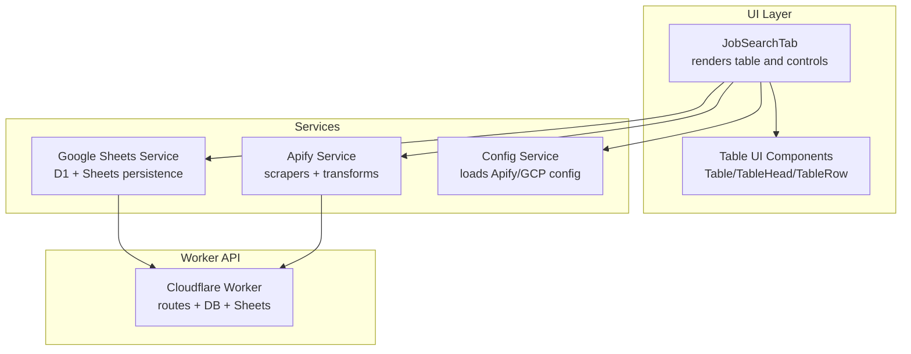
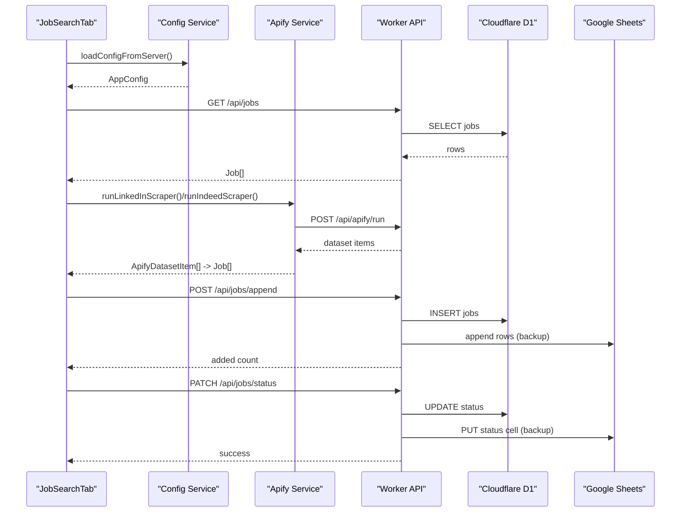
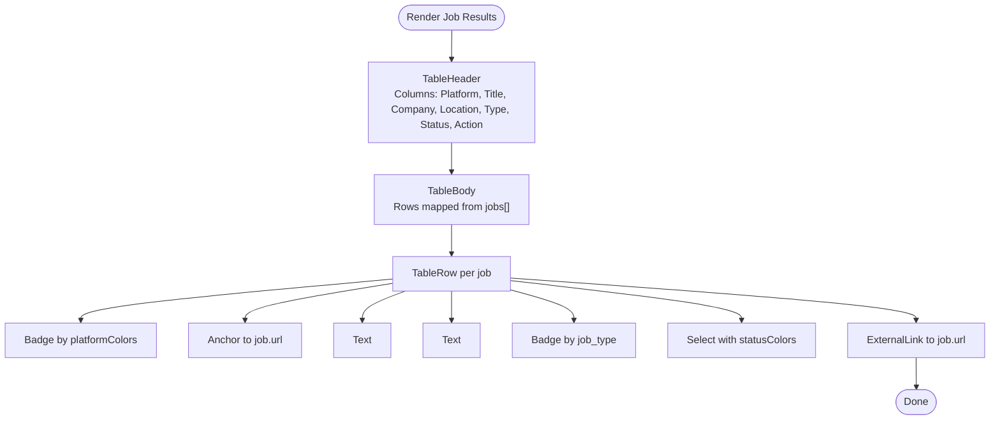
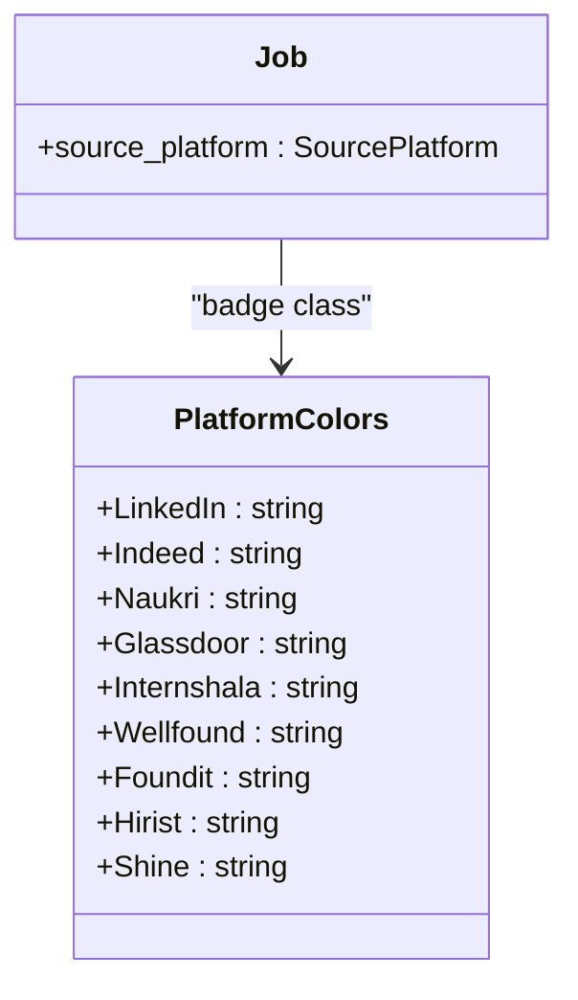
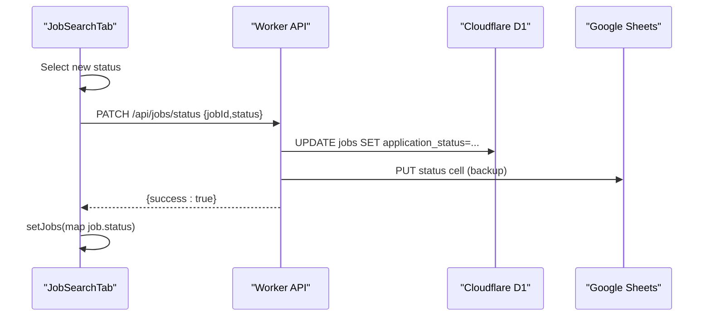
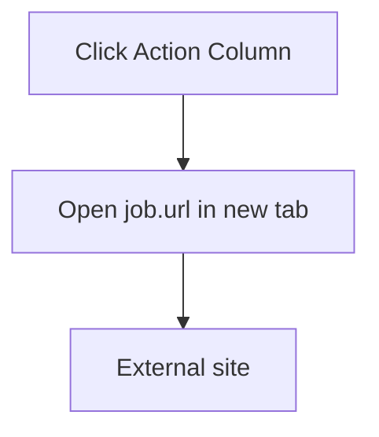
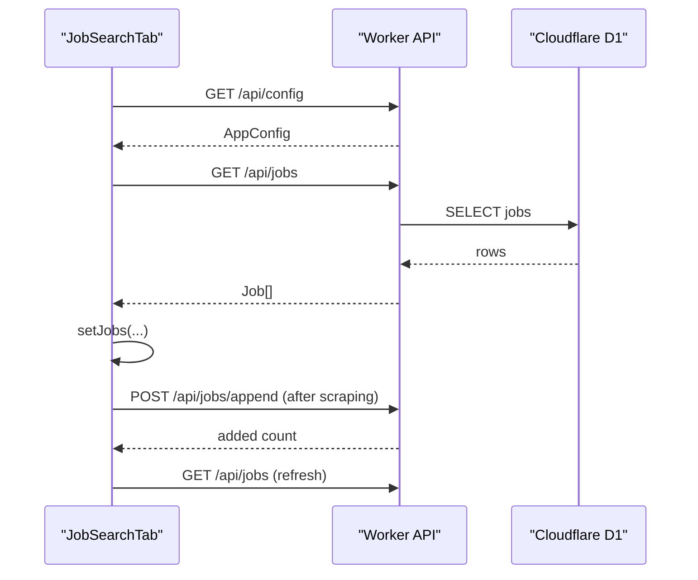
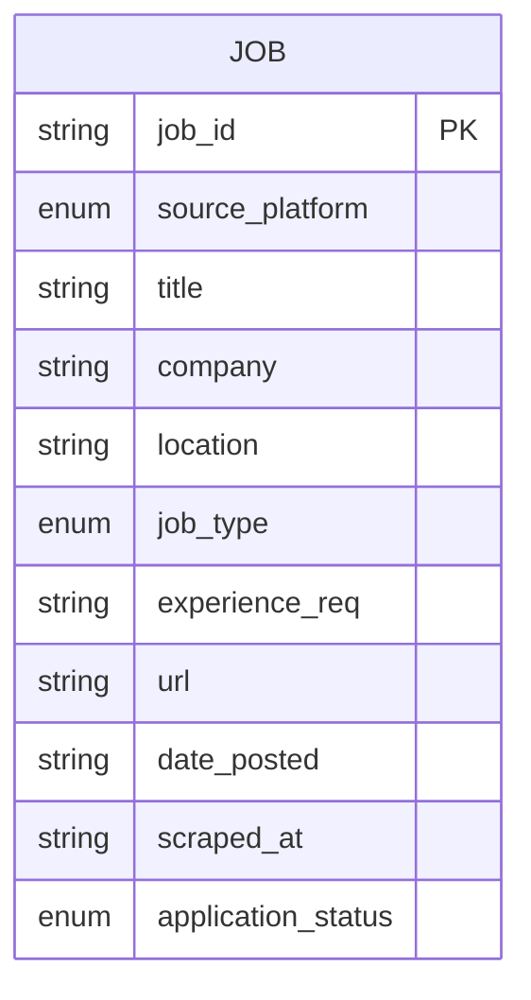
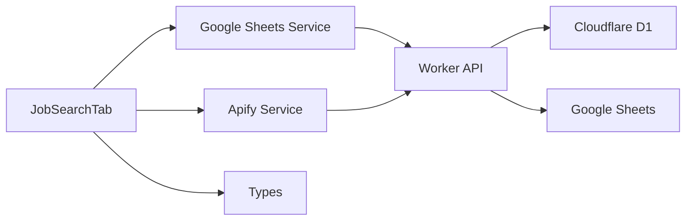

# Results Management

<cite>
**Referenced Files in This Document**
- [job-search-tab.tsx](file://src/components/dashboard/job-search-tab.tsx)
- [table.tsx](file://src/components/ui/table.tsx)
- [apify.ts](file://src/services/apify.ts)
- [google-sheets.ts](file://src/services/google-sheets.ts)
- [index.ts](file://src/types/index.ts)
- [config.ts](file://src/services/config.ts)
- [index.ts](file://worker/index.ts)
</cite>

## Table of Contents
1. [Introduction](#introduction)
2. [Project Structure](#project-structure)
3. [Core Components](#core-components)
4. [Architecture Overview](#architecture-overview)
5. [Detailed Component Analysis](#detailed-component-analysis)
6. [Dependency Analysis](#dependency-analysis)
7. [Performance Considerations](#performance-considerations)
8. [Troubleshooting Guide](#troubleshooting-guide)
9. [Conclusion](#conclusion)

## Introduction
This document explains the job results management system that powers the “Job Results” table. It covers the table interface, column organization, sorting capabilities, responsive design, platform tagging with color-coded badges, application status tracking, external link integration for direct job access, data loading mechanisms, job data structure and transformations, and performance considerations for large datasets.

## Project Structure
The job results management spans UI components, services, and worker APIs:
- UI: A dashboard tab renders the live job table with filtering, status updates, and external links.
- Services: Scrapers normalize job data from multiple platforms; persistence services write/read jobs to/from Cloudflare D1 and Google Sheets.
- Types: Strongly typed job and filter models define the data contract.
- Worker: Backend routes handle data operations, including status updates and backups to Google Sheets.

**Diagram sources**
- [job-search-tab.tsx:73-506](file://src/components/dashboard/job-search-tab.tsx#L73-L506)
- [table.tsx:7-116](file://src/components/ui/table.tsx#L7-L116)
- [apify.ts:283-300](file://src/services/apify.ts#L283-L300)
- [google-sheets.ts:8-43](file://src/services/google-sheets.ts#L8-L43)
- [config.ts:35-55](file://src/services/config.ts#L35-L55)
- [index.ts:245-271](file://worker/index.ts#L245-L271)

**Section sources**
- [job-search-tab.tsx:73-506](file://src/components/dashboard/job-search-tab.tsx#L73-L506)
- [table.tsx:7-116](file://src/components/ui/table.tsx#L7-L116)
- [apify.ts:283-300](file://src/services/apify.ts#L283-L300)
- [google-sheets.ts:8-43](file://src/services/google-sheets.ts#L8-L43)
- [config.ts:35-55](file://src/services/config.ts#L35-L55)
- [index.ts:245-271](file://worker/index.ts#L245-L271)

## Core Components
- JobSearchTab: Orchestrates filters, scrapers, job loading, status updates, and table rendering.
- Table UI: Provides responsive table layout and scroll area for long lists.
- Apify Service: Runs platform-specific scrapers and normalizes results to a unified Job model.
- Google Sheets Service: Persists jobs to Cloudflare D1 and backs up to Google Sheets; updates statuses.
- Types: Defines Job, SearchFilter, ApplicationStatus, SourcePlatform, and related enums.
- Worker: Implements backend routes for jobs, including status updates and backups.

**Section sources**
- [job-search-tab.tsx:73-506](file://src/components/dashboard/job-search-tab.tsx#L73-L506)
- [table.tsx:7-116](file://src/components/ui/table.tsx#L7-L116)
- [apify.ts:283-300](file://src/services/apify.ts#L283-L300)
- [google-sheets.ts:8-43](file://src/services/google-sheets.ts#L8-L43)
- [index.ts:11-23](file://src/types/index.ts#L11-L23)
- [index.ts:245-271](file://worker/index.ts#L245-L271)

## Architecture Overview
The system follows a client-driven UI with server-side persistence:
- UI loads configuration and jobs on mount.
- Scrapers normalize platform-specific data into a unified Job model.
- Jobs are appended to Cloudflare D1 and backed up to Google Sheets.
- Users can update application status directly from the table; updates persist to D1 and Sheets.

**Diagram sources**
- [job-search-tab.tsx:86-100](file://src/components/dashboard/job-search-tab.tsx#L86-L100)
- [apify.ts:66-95](file://src/services/apify.ts#L66-L95)
- [google-sheets.ts:14-30](file://src/services/google-sheets.ts#L14-L30)
- [index.ts:245-271](file://worker/index.ts#L245-L271)

## Detailed Component Analysis

### Job Results Table Interface
- Columns: Platform, Title, Company, Location, Type, Status, Action.
- Sorting: Not implemented in the UI; table rows reflect the order returned by the backend.
- Responsive design: The table container enables horizontal scrolling on small screens; a fixed-height scroll area ensures consistent viewport.

**Diagram sources**
- [job-search-tab.tsx:429-501](file://src/components/dashboard/job-search-tab.tsx#L429-L501)
- [table.tsx:68-92](file://src/components/ui/table.tsx#L68-L92)

**Section sources**
- [job-search-tab.tsx:429-501](file://src/components/dashboard/job-search-tab.tsx#L429-L501)
- [table.tsx:68-92](file://src/components/ui/table.tsx#L68-L92)

### Platform Tagging System
- Color-coded badges identify the source platform for each job.
- Mapping: A record maps each SourcePlatform to a Tailwind color class.

**Diagram sources**
- [job-search-tab.tsx:61-71](file://src/components/dashboard/job-search-tab.tsx#L61-L71)
- [index.ts:7-8](file://src/types/index.ts#L7-L8)

**Section sources**
- [job-search-tab.tsx:61-71](file://src/components/dashboard/job-search-tab.tsx#L61-L71)
- [index.ts:7-8](file://src/types/index.ts#L7-L8)

### Application Status Tracking
- Status options: To Apply, Applied, Interviewing, Rejected.
- Visualization: A colored badge reflects the current status.
- Operations:
  - UI: Select component triggers handleStatusChange.
  - Persistence: PATCH /api/jobs/status updates D1 and backs up to Sheets.
  - Real-time: UI updates the in-memory jobs immediately upon success.

**Diagram sources**
- [job-search-tab.tsx:221-229](file://src/components/dashboard/job-search-tab.tsx#L221-L229)
- [index.ts:245-271](file://worker/index.ts#L245-L271)

**Section sources**
- [job-search-tab.tsx:221-229](file://src/components/dashboard/job-search-tab.tsx#L221-L229)
- [index.ts:245-271](file://worker/index.ts#L245-L271)

### External Link Integration
- Each job row includes a link to the original job posting.
- The link opens in a new tab with safe attributes to prevent referrer leakage.

**Diagram sources**
- [job-search-tab.tsx:489-495](file://src/components/dashboard/job-search-tab.tsx#L489-L495)

**Section sources**
- [job-search-tab.tsx:489-495](file://src/components/dashboard/job-search-tab.tsx#L489-L495)

### Data Loading Mechanisms
- Initial load: On mount, configuration is loaded, then jobs are fetched from /api/jobs.
- Refresh: Manual refresh via the refresh button triggers another load.
- Real-time updates: After scraping, the UI reloads jobs to reflect newly appended entries.

**Diagram sources**
- [job-search-tab.tsx:86-100](file://src/components/dashboard/job-search-tab.tsx#L86-L100)
- [config.ts:35-55](file://src/services/config.ts#L35-L55)
- [google-sheets.ts:8-12](file://src/services/google-sheets.ts#L8-L12)
- [index.ts:245-271](file://worker/index.ts#L245-L271)

**Section sources**
- [job-search-tab.tsx:86-100](file://src/components/dashboard/job-search-tab.tsx#L86-L100)
- [config.ts:35-55](file://src/services/config.ts#L35-L55)
- [google-sheets.ts:8-12](file://src/services/google-sheets.ts#L8-L12)
- [index.ts:245-271](file://worker/index.ts#L245-L271)

### Job Data Structure and Transformations
- Job model: Contains identifiers, metadata, and status.
- Transformation pipeline:
  - Apify scrapers return platform-specific items.
  - transformApifyItemToJob normalizes items to the unified Job model.
  - determineJobType infers Remote/WFO/WFH from raw type strings.

**Diagram sources**
- [index.ts:11-23](file://src/types/index.ts#L11-L23)
- [apify.ts:283-300](file://src/services/apify.ts#L283-L300)
- [apify.ts:314-319](file://src/services/apify.ts#L314-L319)

**Section sources**
- [index.ts:11-23](file://src/types/index.ts#L11-L23)
- [apify.ts:283-300](file://src/services/apify.ts#L283-L300)
- [apify.ts:314-319](file://src/services/apify.ts#L314-L319)

## Dependency Analysis
- UI depends on:
  - Apify service for scraping and transforming job items.
  - Google Sheets service for CRUD operations against Cloudflare D1 and Sheets.
  - Types for strongly typed models.
- Worker routes depend on:
  - Cloudflare D1 for primary storage.
  - Google Sheets API for backup writes and reads.

**Diagram sources**
- [job-search-tab.tsx:28-31](file://src/components/dashboard/job-search-tab.tsx#L28-L31)
- [apify.ts:283-300](file://src/services/apify.ts#L283-L300)
- [google-sheets.ts:8-43](file://src/services/google-sheets.ts#L8-L43)
- [index.ts:11-23](file://src/types/index.ts#L11-L23)
- [index.ts:245-271](file://worker/index.ts#L245-L271)

**Section sources**
- [job-search-tab.tsx:28-31](file://src/components/dashboard/job-search-tab.tsx#L28-L31)
- [apify.ts:283-300](file://src/services/apify.ts#L283-L300)
- [google-sheets.ts:8-43](file://src/services/google-sheets.ts#L8-L43)
- [index.ts:11-23](file://src/types/index.ts#L11-L23)
- [index.ts:245-271](file://worker/index.ts#L245-L271)

## Performance Considerations
- Rendering large tables:
  - The table uses a fixed-height scroll area to keep the viewport stable.
  - Consider virtualization for very large datasets to reduce DOM nodes and improve scroll performance.
- Network and latency:
  - Scrapers run via Cloudflare Worker; batch operations minimize round-trips.
  - Deduplication on the server-side reduces redundant writes to Sheets.
- Status updates:
  - Immediate UI updates reduce perceived latency; errors are surfaced via toast notifications.
- Storage:
  - D1 is the primary store; Sheets acts as a backup. This reduces write contention and improves reliability.

[No sources needed since this section provides general guidance]

## Troubleshooting Guide
- Status update failures:
  - Verify backend route /api/jobs/status responds successfully.
  - Confirm D1 update succeeded and Sheets backup executed.
- Scraping failures:
  - Ensure Apify actors are configured and accessible.
  - Check network connectivity and rate limits.
- Data not appearing:
  - Confirm /api/jobs returns data after scraping.
  - Verify deduplication logic does not filter out legitimate new jobs.

**Section sources**
- [index.ts:245-271](file://worker/index.ts#L245-L271)
- [config.ts:35-55](file://src/services/config.ts#L35-L55)
- [google-sheets.ts:14-30](file://src/services/google-sheets.ts#L14-L30)

## Conclusion
The job results management system integrates UI, scraping, and persistence to deliver a responsive, color-coded, and status-managed job table. While sorting is not present in the UI, the system’s modular design supports future enhancements such as virtualized rendering and column sorting. The dual persistence strategy (D1 + Sheets) ensures robustness and auditability.