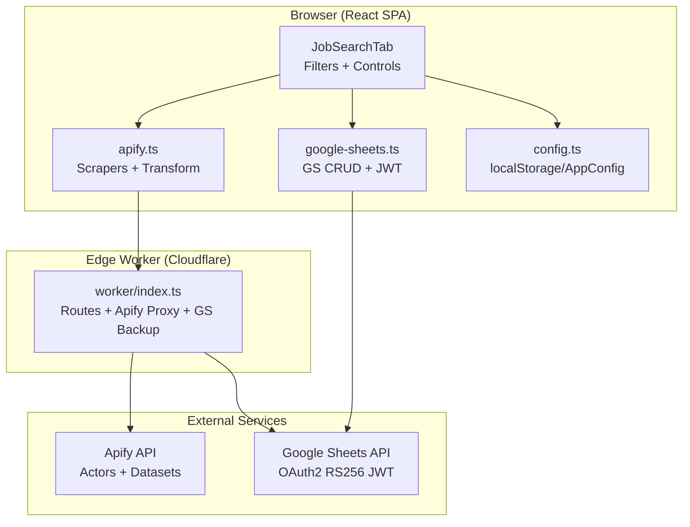
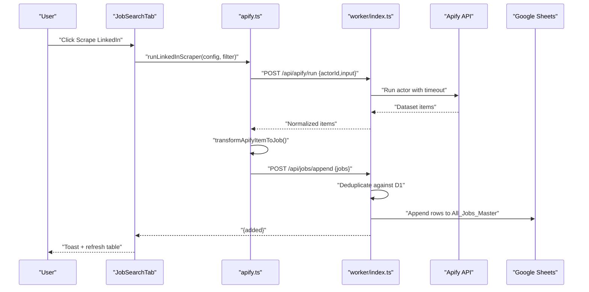
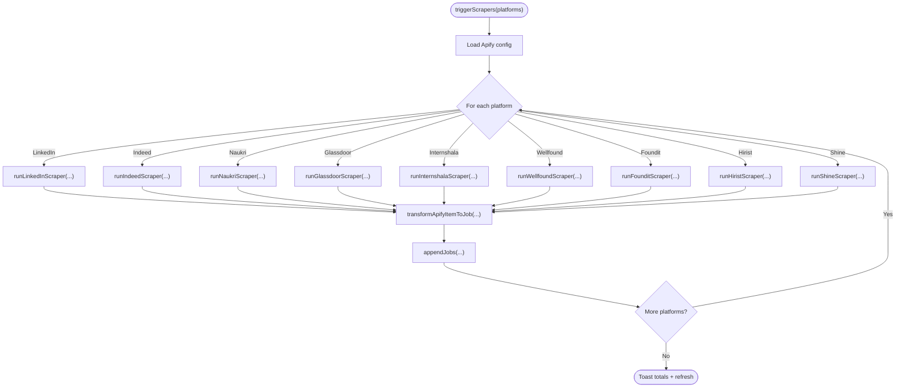
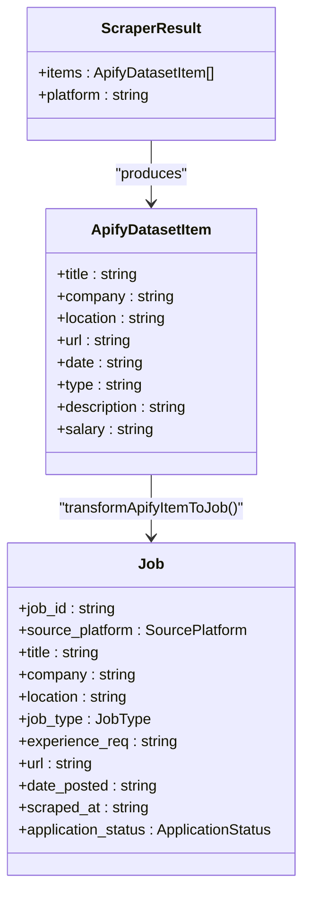
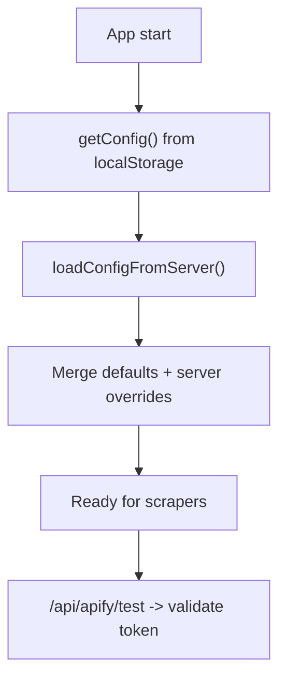
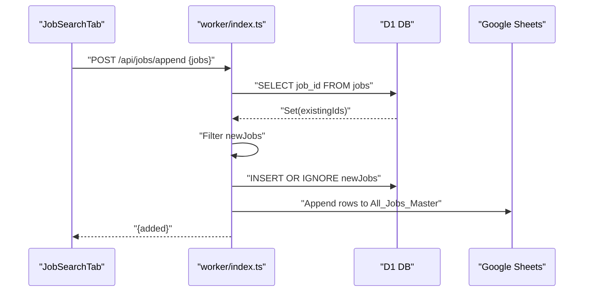
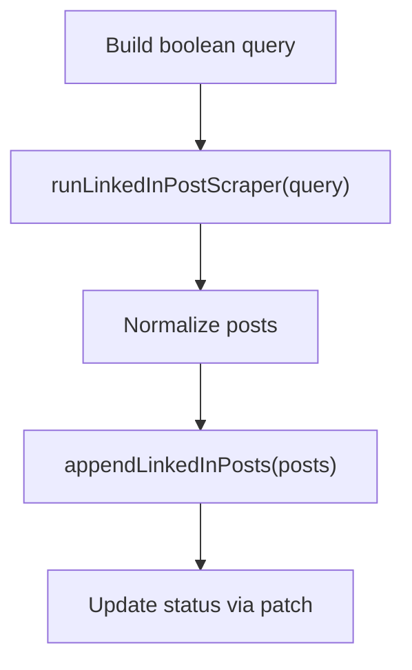
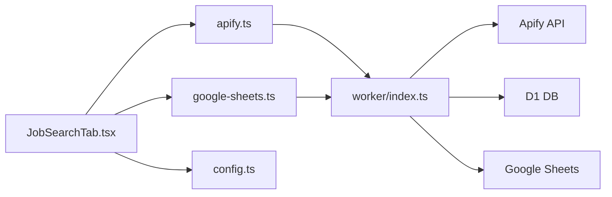

# Scraping Operations

<cite>
**Referenced Files in This Document**
- [apify.ts](file://src/services/apify.ts)
- [job-search-tab.tsx](file://src/components/dashboard/job-search-tab.tsx)
- [config.ts](file://src/services/config.ts)
- [google-sheets.ts](file://src/services/google-sheets.ts)
- [index.ts](file://worker/index.ts)
- [index.ts](file://src/types/index.ts)
- [WIKI.md](file://WIKI.md)
</cite>

## Table of Contents
1. [Introduction](#introduction)
2. [Project Structure](#project-structure)
3. [Core Components](#core-components)
4. [Architecture Overview](#architecture-overview)
5. [Detailed Component Analysis](#detailed-component-analysis)
6. [Dependency Analysis](#dependency-analysis)
7. [Performance Considerations](#performance-considerations)
8. [Troubleshooting Guide](#troubleshooting-guide)
9. [Conclusion](#conclusion)
10. [Appendices](#appendices)

## Introduction
This document explains the multi-platform scraping operations system that powers job discovery across LinkedIn, Indeed, Naukri, Glassdoor, Internshala, Wellfound, Foundit, Hirist, and Shine. It covers the orchestration model, configuration, filtering, normalization, transformation, deduplication, real-time ingestion, performance tuning, and operational observability. The system is designed as a browser-first React SPA that proxies scraping requests through a Cloudflare Worker (Edge Function) to Apify, then persists normalized results to Google Sheets with robust duplicate prevention.

## Project Structure
The scraping pipeline spans three layers:
- Frontend services: orchestrates filters, triggers scrapers, transforms results, and persists to Google Sheets.
- Edge worker: validates secrets, proxies Apify runs, and performs server-side backups to Google Sheets.
- Apify: executes platform-specific actors and returns datasets.

**Diagram sources**
- [job-search-tab.tsx:156-219](file://src/components/dashboard/job-search-tab.tsx#L156-L219)
- [apify.ts:47-63](file://src/services/apify.ts#L47-L63)
- [index.ts:191-202](file://worker/index.ts#L191-L202)
- [index.ts:152-172](file://worker/index.ts#L152-L172)
- [google-sheets.ts:14-30](file://src/services/google-sheets.ts#L14-L30)

**Section sources**
- [WIKI.md:45-84](file://WIKI.md#L45-L84)
- [job-search-tab.tsx:156-219](file://src/components/dashboard/job-search-tab.tsx#L156-L219)
- [apify.ts:47-63](file://src/services/apify.ts#L47-L63)
- [index.ts:191-202](file://worker/index.ts#L191-L202)
- [google-sheets.ts:14-30](file://src/services/google-sheets.ts#L14-L30)

## Core Components
- Scraper orchestration: sequential execution across platforms with per-platform error handling and user feedback.
- Platform scrapers: unified inputs per platform, normalized outputs, and standardized transformation to internal job records.
- Deduplication: client-side and server-side checks to prevent duplicate entries.
- Real-time ingestion: immediate write-through to Google Sheets with backup and status updates.
- Configuration: Apify actor IDs and GCP credentials persisted in localStorage with runtime overrides.

**Section sources**
- [job-search-tab.tsx:156-219](file://src/components/dashboard/job-search-tab.tsx#L156-L219)
- [apify.ts:66-254](file://src/services/apify.ts#L66-L254)
- [apify.ts:283-325](file://src/services/apify.ts#L283-L325)
- [index.ts:214-241](file://worker/index.ts#L214-L241)
- [config.ts:27-55](file://src/services/config.ts#L27-L55)

## Architecture Overview
The system follows a proxy-first design:
- Frontend triggers scrapers with a constructed filter.
- Scrapers call the Edge Worker route that invokes Apify with a 300s timeout.
- Results are normalized and transformed into a common job record.
- New items are inserted into D1 and appended to Google Sheets (backup).
- UI refreshes to reflect the latest data.

**Diagram sources**
- [job-search-tab.tsx:156-219](file://src/components/dashboard/job-search-tab.tsx#L156-L219)
- [apify.ts:66-95](file://src/services/apify.ts#L66-L95)
- [index.ts:191-202](file://worker/index.ts#L191-L202)
- [index.ts:152-172](file://worker/index.ts#L152-L172)
- [index.ts:214-241](file://worker/index.ts#L214-L241)

## Detailed Component Analysis

### Scraper Orchestration (Sequential Execution)
- The UI builds a temporary filter from selected keywords, locations, experience, and job types.
- Orchestrator iterates platforms sequentially, invoking the corresponding scraper function.
- Per-platform results are transformed into internal job records and appended to storage.
- Errors are caught and surfaced to the user; successful runs update the UI table.

**Diagram sources**
- [job-search-tab.tsx:156-219](file://src/components/dashboard/job-search-tab.tsx#L156-L219)
- [apify.ts:283-300](file://src/services/apify.ts#L283-L300)
- [google-sheets.ts:14-30](file://src/services/google-sheets.ts#L14-L30)

**Section sources**
- [job-search-tab.tsx:156-219](file://src/components/dashboard/job-search-tab.tsx#L156-L219)

### Platform Scrapers and Inputs
- LinkedIn Jobs: constructs a search URL with keywords and location, passes to actor with company details.
- Indeed: uses position and location with country and max items.
- Naukri, Glassdoor, Internshala, Wellfound, Foundit, Hirist, Shine: use query + location with max pages per query.
- All outputs are normalized to a common shape and transformed into internal job records.

**Diagram sources**
- [apify.ts:41-44](file://src/services/apify.ts#L41-L44)
- [apify.ts:119-145](file://src/services/apify.ts#L119-L145)
- [apify.ts:283-300](file://src/services/apify.ts#L283-L300)
- [index.ts:11-23](file://src/types/index.ts#L11-L23)

**Section sources**
- [apify.ts:66-254](file://src/services/apify.ts#L66-L254)
- [apify.ts:257-268](file://src/services/apify.ts#L257-L268)
- [apify.ts:283-325](file://src/services/apify.ts#L283-L325)

### Configuration and Secrets
- Apify actor IDs and tokens are stored in localStorage/AppConfig with defaults.
- On first load, the UI fetches server-side config and merges with defaults.
- The Edge Worker validates Apify token availability and proxies actor runs.

**Diagram sources**
- [config.ts:27-55](file://src/services/config.ts#L27-L55)
- [config.ts:126-143](file://src/services/config.ts#L126-L143)
- [index.ts:180-189](file://worker/index.ts#L180-L189)

**Section sources**
- [config.ts:27-55](file://src/services/config.ts#L27-L55)
- [config.ts:126-143](file://src/services/config.ts#L126-L143)
- [index.ts:180-189](file://worker/index.ts#L180-L189)

### Real-Time Ingestion and Deduplication
- After transformation, jobs are sent to the Edge Worker’s append endpoint.
- The worker deduplicates by checking existing job IDs in D1, then inserts new rows and backs up to Google Sheets.
- UI refreshes to reflect the newly added jobs.

**Diagram sources**
- [index.ts:214-241](file://worker/index.ts#L214-L241)
- [google-sheets.ts:254-292](file://src/services/google-sheets.ts#L254-L292)

**Section sources**
- [index.ts:214-241](file://worker/index.ts#L214-L241)
- [google-sheets.ts:14-30](file://src/services/google-sheets.ts#L14-L30)

### Social Listening (LinkedIn Posts)
- Boolean search queries are constructed and passed to the LinkedIn post actor.
- Posts are normalized and stored with detected keywords and status tracking.

**Diagram sources**
- [apify.ts:271-281](file://src/services/apify.ts#L271-L281)
- [apify.ts:302-312](file://src/services/apify.ts#L302-L312)
- [index.ts:281-307](file://worker/index.ts#L281-L307)

**Section sources**
- [apify.ts:271-312](file://src/services/apify.ts#L271-L312)
- [index.ts:281-307](file://worker/index.ts#L281-L307)

## Dependency Analysis
- Frontend depends on:
  - apify.ts for scraper orchestration and normalization.
  - google-sheets.ts for persistence and deduplication.
  - config.ts for configuration loading/saving.
- Edge Worker depends on:
  - Apify API for actor runs and dataset retrieval.
  - Google Sheets API for backup operations.
  - D1 for durable storage and dedup checks.

**Diagram sources**
- [job-search-tab.tsx:29-31](file://src/components/dashboard/job-search-tab.tsx#L29-L31)
- [apify.ts:1-11](file://src/services/apify.ts#L1-L11)
- [google-sheets.ts:1-6](file://src/services/google-sheets.ts#L1-L6)
- [config.ts:1-4](file://src/services/config.ts#L1-L4)
- [index.ts:4-10](file://worker/index.ts#L4-L10)

**Section sources**
- [job-search-tab.tsx:29-31](file://src/components/dashboard/job-search-tab.tsx#L29-L31)
- [apify.ts:1-11](file://src/services/apify.ts#L1-L11)
- [google-sheets.ts:1-6](file://src/services/google-sheets.ts#L1-L6)
- [config.ts:1-4](file://src/services/config.ts#L1-L4)
- [index.ts:4-10](file://worker/index.ts#L4-L10)

## Performance Considerations
- Sequential execution: scrapers run one after another to avoid resource contention and reduce risk of throttling.
- Rate limiting: Apify actors enforce limits; the Edge Worker sets a 300s timeout to prevent long-running runs.
- Batch processing: D1 batch inserts minimize round-trips during deduplication and insertion.
- Memory management: Frontend transforms items incrementally; large datasets are handled by Apify and returned as paginated datasets.
- Network resilience: Frontend catches errors per platform and continues with remaining platforms.

[No sources needed since this section provides general guidance]

## Troubleshooting Guide
Common issues and resolutions:
- Apify token missing or invalid:
  - Verify token in configuration; test connection via the Edge Worker route.
  - Ensure actor IDs are present and reachable.
- Google Sheets access denied:
  - Confirm service account JSON and spreadsheet ID are correct.
  - Ensure the spreadsheet exists and the service account email has Editor access.
- Network failures:
  - Retry after a short delay; inspect browser network logs for timeouts.
- Platform-specific restrictions:
  - Some sites may require additional headers or cookies; adjust actor inputs accordingly.
- CAPTCHA handling:
  - Use Apify’s built-in anti-detection features; consider rotating proxies if supported by the actor.
- Duplicate entries:
  - Deduplication occurs in D1; if duplicates appear, check job IDs and re-run ingestion.

**Section sources**
- [index.ts:180-189](file://worker/index.ts#L180-L189)
- [index.ts:337-405](file://worker/index.ts#L337-L405)
- [google-sheets.ts:233-242](file://src/services/google-sheets.ts#L233-L242)

## Conclusion
The scraping system provides a robust, browser-first solution for multi-platform job discovery. It emphasizes reliability through sequential orchestration, strong deduplication, and dual persistence (D1 + Google Sheets). The Edge Worker centralizes sensitive operations and ensures consistent behavior across platforms while maintaining simplicity for end-users.

[No sources needed since this section summarizes without analyzing specific files]

## Appendices

### Supported Platforms and Inputs
- LinkedIn Jobs: search URLs with company details.
- Indeed: position + location + country + max items.
- Naukri, Glassdoor, Internshala, Wellfound, Foundit, Hirist, Shine: query + location + max pages.

**Section sources**
- [apify.ts:66-254](file://src/services/apify.ts#L66-L254)
- [WIKI.md:383-404](file://WIKI.md#L383-L404)

### Monitoring and Logging
- UI toasts provide per-platform status and errors.
- Edge Worker routes expose health checks and error responses.
- Google Sheets serves as a secondary audit trail for ingested data.

**Section sources**
- [job-search-tab.tsx:177-211](file://src/components/dashboard/job-search-tab.tsx#L177-L211)
- [index.ts:180-189](file://worker/index.ts#L180-L189)
- [index.ts:205-241](file://worker/index.ts#L205-L241)