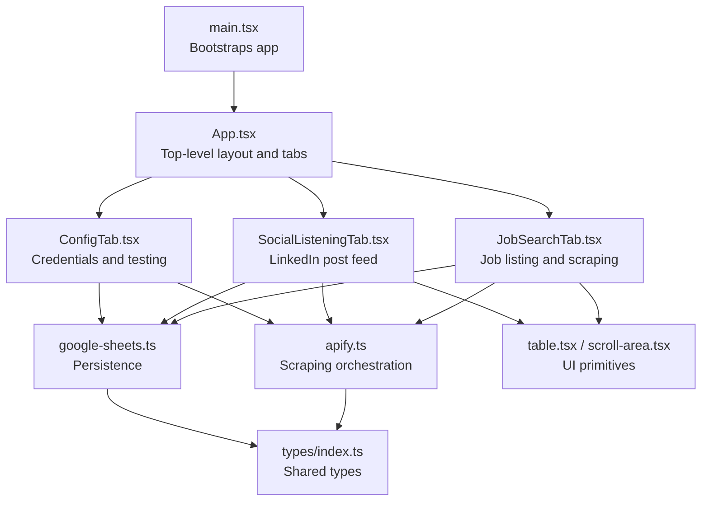
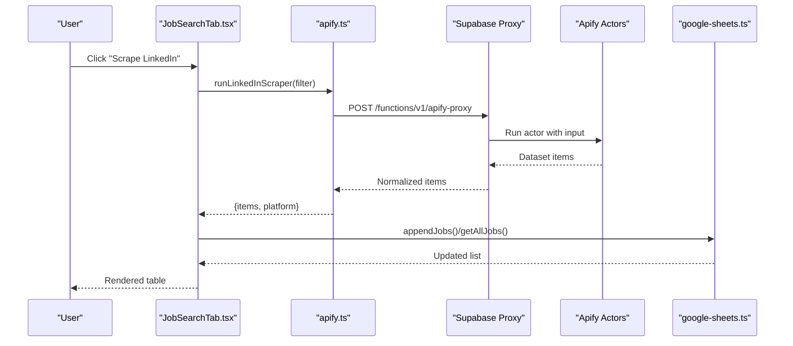
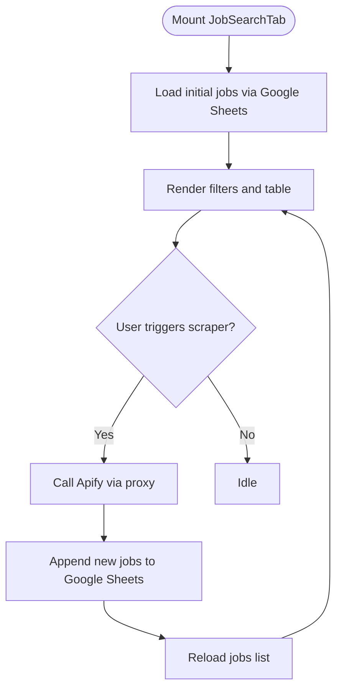
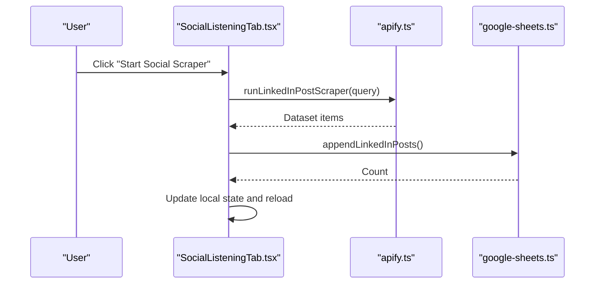
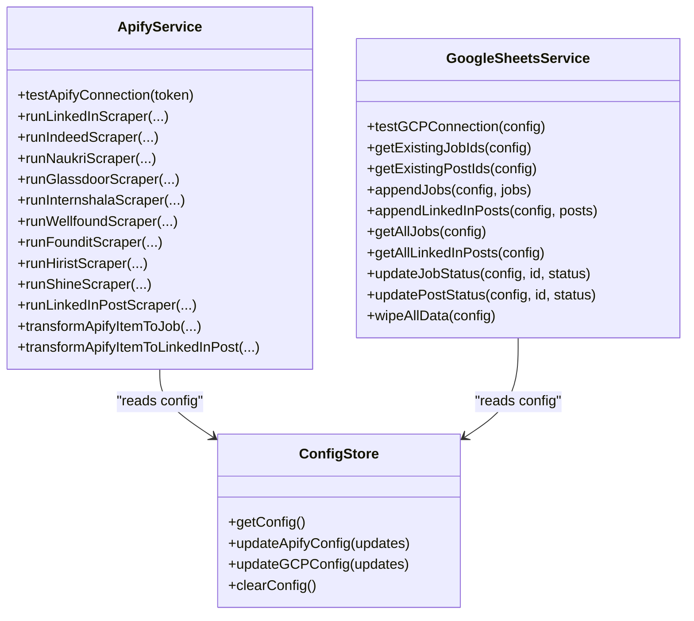
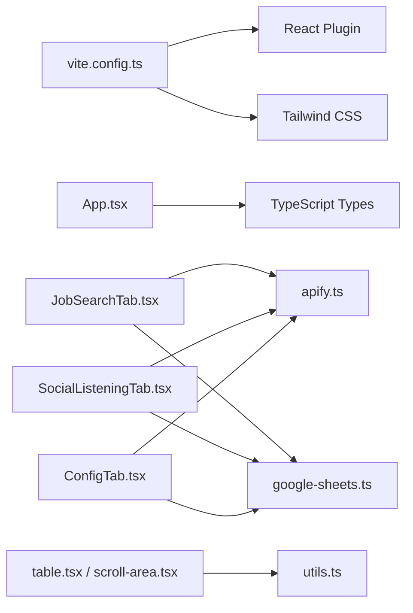

# Performance Optimization

<cite>
**Referenced Files in This Document**
- [App.tsx](file://src/App.tsx)
- [main.tsx](file://src/main.tsx)
- [vite.config.ts](file://vite.config.ts)
- [package.json](file://package.json)
- [job-search-tab.tsx](file://src/components/dashboard/job-search-tab.tsx)
- [social-listening-tab.tsx](file://src/components/dashboard/social-listening-tab.tsx)
- [config-tab.tsx](file://src/components/dashboard/config-tab.tsx)
- [apify.ts](file://src/services/apify.ts)
- [google-sheets.ts](file://src/services/google-sheets.ts)
- [config.ts](file://src/services/config.ts)
- [table.tsx](file://src/components/ui/table.tsx)
- [scroll-area.tsx](file://src/components/ui/scroll-area.tsx)
- [index.ts](file://src/types/index.ts)
- [use-mobile.ts](file://src/hooks/use-mobile.ts)
- [utils.ts](file://src/lib/utils.ts)
</cite>

## Table of Contents
1. [Introduction](#introduction)
2. [Project Structure](#project-structure)
3. [Core Components](#core-components)
4. [Architecture Overview](#architecture-overview)
5. [Detailed Component Analysis](#detailed-component-analysis)
6. [Dependency Analysis](#dependency-analysis)
7. [Performance Considerations](#performance-considerations)
8. [Troubleshooting Guide](#troubleshooting-guide)
9. [Conclusion](#conclusion)
10. [Appendices](#appendices)

## Introduction
This document provides a comprehensive performance optimization guide for HuntSync AI. It focuses on optimizing loading strategies, data handling, component rendering, memory management, and runtime performance across the job board and social listening dashboards. It also covers network optimization, caching, and scalability practices tailored to the current codebase.

## Project Structure
HuntSync AI is a Vite + React application with TypeScript. The app is organized around three primary dashboard tabs:
- Job Search Tab: Loads, displays, and updates job listings.
- Social Listening Tab: Scrapes and manages LinkedIn hiring posts.
- Configuration Tab: Stores and validates API credentials and spreadsheet configuration.

Build-time bundling is handled by Vite with React plugin and Tailwind CSS integration. The UI primitives are thin wrappers around Radix UI and shared utilities.

**Diagram sources**
- [main.tsx:1-15](file://src/main.tsx#L1-L15)
- [App.tsx:1-67](file://src/App.tsx#L1-L67)
- [job-search-tab.tsx:1-523](file://src/components/dashboard/job-search-tab.tsx#L1-L523)
- [social-listening-tab.tsx:1-276](file://src/components/dashboard/social-listening-tab.tsx#L1-L276)
- [config-tab.tsx:1-502](file://src/components/dashboard/config-tab.tsx#L1-L502)
- [apify.ts:1-348](file://src/services/apify.ts#L1-L348)
- [google-sheets.ts:1-354](file://src/services/google-sheets.ts#L1-L354)
- [table.tsx:1-117](file://src/components/ui/table.tsx#L1-L117)
- [scroll-area.tsx:1-59](file://src/components/ui/scroll-area.tsx#L1-L59)
- [index.ts:1-159](file://src/types/index.ts#L1-L159)

**Section sources**
- [main.tsx:1-15](file://src/main.tsx#L1-L15)
- [App.tsx:1-67](file://src/App.tsx#L1-L67)
- [vite.config.ts:1-15](file://vite.config.ts#L1-L15)
- [package.json:1-48](file://package.json#L1-L48)

## Core Components
- App container orchestrates tab switching and global UI elements.
- JobSearchTab renders filters, live job table, and triggers scrapers.
- SocialListeningTab renders a scrollable feed of posts and controls scraping.
- ConfigTab stores credentials and tests connectivity.
- Services encapsulate scraping and persistence logic.
- UI primitives wrap Radix UI and Tailwind for consistent rendering.

Key performance-relevant observations:
- Large lists are rendered inside scroll areas; consider virtualization for very large datasets.
- Network calls are centralized; ensure throttling and caching.
- State updates are frequent; optimize render paths and avoid unnecessary re-renders.

**Section sources**
- [App.tsx:1-67](file://src/App.tsx#L1-L67)
- [job-search-tab.tsx:1-523](file://src/components/dashboard/job-search-tab.tsx#L1-L523)
- [social-listening-tab.tsx:1-276](file://src/components/dashboard/social-listening-tab.tsx#L1-L276)
- [config-tab.tsx:1-502](file://src/components/dashboard/config-tab.tsx#L1-L502)
- [apify.ts:1-348](file://src/services/apify.ts#L1-L348)
- [google-sheets.ts:1-354](file://src/services/google-sheets.ts#L1-L354)
- [table.tsx:1-117](file://src/components/ui/table.tsx#L1-L117)
- [scroll-area.tsx:1-59](file://src/components/ui/scroll-area.tsx#L1-L59)

## Architecture Overview
The runtime architecture connects UI tabs to services that communicate with external APIs and persist data to Google Sheets. Scrapers are invoked via a proxy endpoint and return normalized datasets.

**Diagram sources**
- [job-search-tab.tsx:160-230](file://src/components/dashboard/job-search-tab.tsx#L160-L230)
- [apify.ts:59-81](file://src/services/apify.ts#L59-L81)
- [google-sheets.ts:162-200](file://src/services/google-sheets.ts#L162-L200)

## Detailed Component Analysis

### JobSearchTab: Rendering, Data Loading, and Interaction Patterns
- Renders filters, saved filters, and a scrollable job table.
- Loads initial data on mount and refreshes after scraping.
- Uses a scroll area to constrain table height; consider virtualization for large datasets.
- Updates application status via Google Sheets when configured.

Optimization opportunities:
- Virtualize the job table rows to reduce DOM nodes and improve scrolling performance.
- Memoize derived data (e.g., filtered/sorted lists) to prevent re-computation.
- Debounce or batch frequent state updates during bulk actions.
- Use stable keys and avoid inline object/array creation in render props.

**Diagram sources**
- [job-search-tab.tsx:86-104](file://src/components/dashboard/job-search-tab.tsx#L86-L104)
- [job-search-tab.tsx:160-230](file://src/components/dashboard/job-search-tab.tsx#L160-L230)
- [google-sheets.ts:238-259](file://src/services/google-sheets.ts#L238-L259)

**Section sources**
- [job-search-tab.tsx:1-523](file://src/components/dashboard/job-search-tab.tsx#L1-L523)
- [table.tsx:1-117](file://src/components/ui/table.tsx#L1-L117)
- [scroll-area.tsx:1-59](file://src/components/ui/scroll-area.tsx#L1-L59)
- [google-sheets.ts:1-354](file://src/services/google-sheets.ts#L1-L354)

### SocialListeningTab: Feed Rendering and Pagination
- Renders a scrollable feed of LinkedIn posts.
- Supports fetching posts via Apify and updating statuses.
- Highlights detected keywords in post text.

Optimization opportunities:
- Implement pagination or infinite scrolling to limit DOM nodes.
- Cache post metadata and deduplicate rendering.
- Debounce status updates to avoid frequent network calls.

**Diagram sources**
- [social-listening-tab.tsx:62-95](file://src/components/dashboard/social-listening-tab.tsx#L62-L95)
- [apify.ts:289-299](file://src/services/apify.ts#L289-L299)
- [google-sheets.ts:202-236](file://src/services/google-sheets.ts#L202-L236)

**Section sources**
- [social-listening-tab.tsx:1-276](file://src/components/dashboard/social-listening-tab.tsx#L1-L276)
- [apify.ts:289-348](file://src/services/apify.ts#L289-L348)
- [google-sheets.ts:202-354](file://src/services/google-sheets.ts#L202-L354)

### ConfigTab: Credential Management and Connectivity Testing
- Stores credentials in localStorage with typed configuration.
- Tests Apify and Google Sheets connectivity and surfaces errors.

Optimization opportunities:
- Persist only minimal sensitive data and avoid logging secrets.
- Cache connection test results per session to reduce repeated checks.

**Section sources**
- [config-tab.tsx:1-502](file://src/components/dashboard/config-tab.tsx#L1-L502)
- [config.ts:1-66](file://src/services/config.ts#L1-L66)

### Services Layer: Scraping and Persistence
- Centralizes Apify scraping via a proxy endpoint and normalizes outputs.
- Implements Google Sheets CRUD with token caching and deduplication.

Optimization opportunities:
- Add request de-duplication for concurrent scrapers.
- Implement exponential backoff and retry policies for transient failures.
- Cache normalized job sets locally to reduce repeated network calls.

**Diagram sources**
- [apify.ts:1-348](file://src/services/apify.ts#L1-L348)
- [google-sheets.ts:1-354](file://src/services/google-sheets.ts#L1-L354)
- [config.ts:1-66](file://src/services/config.ts#L1-L66)

**Section sources**
- [apify.ts:1-348](file://src/services/apify.ts#L1-L348)
- [google-sheets.ts:1-354](file://src/services/google-sheets.ts#L1-L354)
- [config.ts:1-66](file://src/services/config.ts#L1-L66)

## Dependency Analysis
- Build toolchain: Vite with React plugin and Tailwind CSS.
- Runtime dependencies include UI libraries (Radix UI, Lucide icons), charting (Recharts), and form/validation helpers.
- UI primitives depend on shared utility functions for class merging.

**Diagram sources**
- [vite.config.ts:1-15](file://vite.config.ts#L1-L15)
- [package.json:1-48](file://package.json#L1-L48)
- [App.tsx:1-67](file://src/App.tsx#L1-L67)
- [job-search-tab.tsx:1-523](file://src/components/dashboard/job-search-tab.tsx#L1-L523)
- [social-listening-tab.tsx:1-276](file://src/components/dashboard/social-listening-tab.tsx#L1-L276)
- [config-tab.tsx:1-502](file://src/components/dashboard/config-tab.tsx#L1-L502)
- [apify.ts:1-348](file://src/services/apify.ts#L1-L348)
- [google-sheets.ts:1-354](file://src/services/google-sheets.ts#L1-L354)
- [table.tsx:1-117](file://src/components/ui/table.tsx#L1-L117)
- [scroll-area.tsx:1-59](file://src/components/ui/scroll-area.tsx#L1-L59)
- [utils.ts:1-7](file://src/lib/utils.ts#L1-L7)

**Section sources**
- [vite.config.ts:1-15](file://vite.config.ts#L1-L15)
- [package.json:1-48](file://package.json#L1-L48)
- [utils.ts:1-7](file://src/lib/utils.ts#L1-L7)

## Performance Considerations

### Loading Strategies
- Current state: Components are imported statically and mounted on tab change. There is no explicit code splitting or lazy loading.
- Recommendations:
  - Lazy-load tab components using dynamic imports to reduce initial bundle size.
  - Split vendor and application chunks via Vite configuration if needed.
  - Defer heavy initialization until after first paint (defer scraping until user interacts).

**Section sources**
- [App.tsx:8-10](file://src/App.tsx#L8-L10)
- [vite.config.ts:1-15](file://vite.config.ts#L1-L15)

### Data Caching Mechanisms
- Local storage cache for filters and configuration.
- Google Sheets token caching with expiry.
- Recommendation: Add in-memory caches for normalized job sets and post feeds to minimize repeated network calls.

**Section sources**
- [job-search-tab.tsx:36-52](file://src/components/dashboard/job-search-tab.tsx#L36-L52)
- [config.ts:1-66](file://src/services/config.ts#L1-L66)
- [google-sheets.ts:9-60](file://src/services/google-sheets.ts#L9-L60)

### Result Pagination and Virtual Scrolling
- Current state: Large lists are rendered in scroll areas; no pagination or virtualization.
- Recommendations:
  - Implement pagination for job and post lists with server-side or client-side slicing.
  - Introduce virtualized lists (windowing) for thousands of rows to keep DOM small and rendering fast.

**Section sources**
- [job-search-tab.tsx:444-519](file://src/components/dashboard/job-search-tab.tsx#L444-L519)
- [social-listening-tab.tsx:195-271](file://src/components/dashboard/social-listening-tab.tsx#L195-L271)

### Component Optimization Techniques
- Current state: No explicit memoization or callback optimization.
- Recommendations:
  - Wrap frequently re-rendered child components with memoization to prevent unnecessary re-renders.
  - Use callback memoization for handlers passed down to children.
  - Prefer stable keys for list items and avoid inline object creation in render.

**Section sources**
- [job-search-tab.tsx:465-513](file://src/components/dashboard/job-search-tab.tsx#L465-L513)
- [social-listening-tab.tsx:202-267](file://src/components/dashboard/social-listening-tab.tsx#L202-L267)

### Memory Management and Cleanup
- Current state: Long-running scraping loops and frequent state updates.
- Recommendations:
  - Cancel in-flight network requests when components unmount or when new requests supersede old ones.
  - Clear timers and subscriptions in cleanup functions.
  - Avoid retaining large arrays in state; prefer paginated views or immutable updates with batching.

**Section sources**
- [job-search-tab.tsx:160-230](file://src/components/dashboard/job-search-tab.tsx#L160-L230)
- [social-listening-tab.tsx:62-95](file://src/components/dashboard/social-listening-tab.tsx#L62-L95)

### Performance Monitoring and Profiling
- Use React DevTools Profiler to identify expensive renders and long tasks.
- Measure First Contentful Paint (FCP), Largest Contentful Paint (LCP), and Cumulative Layout Shift (CLS).
- Monitor network latency and retry counts for scraping and Sheets operations.

**Section sources**
- [apify.ts:25-42](file://src/services/apify.ts#L25-L42)
- [google-sheets.ts:104-119](file://src/services/google-sheets.ts#L104-L119)

### Network Optimization
- Current state: Direct fetch calls to Apify proxy and Google Sheets API.
- Recommendations:
  - Add request de-duplication and in-flight request cancellation.
  - Implement exponential backoff and retry for transient failures.
  - Compress payloads and limit returned fields where possible.
  - Cache normalized datasets locally to reduce repeated network calls.

**Section sources**
- [apify.ts:59-81](file://src/services/apify.ts#L59-L81)
- [google-sheets.ts:121-139](file://src/services/google-sheets.ts#L121-L139)

### Maintaining Performance at Scale
- Keep state flat and normalized; avoid deep merges.
- Batch UI updates during bulk operations.
- Use lightweight UI primitives and defer heavy widgets until needed.
- Monitor bundle size growth and enable tree-shaking and code splitting.

**Section sources**
- [table.tsx:1-117](file://src/components/ui/table.tsx#L1-L117)
- [scroll-area.tsx:1-59](file://src/components/ui/scroll-area.tsx#L1-L59)
- [vite.config.ts:1-15](file://vite.config.ts#L1-L15)

## Troubleshooting Guide
Common performance issues and remedies:
- Slow initial load:
  - Lazy-load tab components and defer scraping until user interaction.
- Stutters during scrolling:
  - Implement virtualization or pagination for large lists.
- Frequent network calls:
  - Add caching and request de-duplication.
- Excessive re-renders:
  - Memoize components and callbacks; stabilize props.

**Section sources**
- [job-search-tab.tsx:444-519](file://src/components/dashboard/job-search-tab.tsx#L444-L519)
- [social-listening-tab.tsx:195-271](file://src/components/dashboard/social-listening-tab.tsx#L195-L271)
- [apify.ts:59-81](file://src/services/apify.ts#L59-L81)
- [google-sheets.ts:162-200](file://src/services/google-sheets.ts#L162-L200)

## Conclusion
By adopting lazy loading, code splitting, virtualization, and robust caching strategies—combined with careful state management and network optimization—HuntSync AI can maintain excellent responsiveness as datasets grow. Incremental improvements to rendering, memory hygiene, and profiling practices will ensure smooth operation across job boards and social listening workflows.

## Appendices

### UI Primitive Notes
- Table and ScrollArea components wrap Radix UI and Tailwind utilities; ensure minimal reflows by avoiding frequent prop changes and keeping styles static.

**Section sources**
- [table.tsx:1-117](file://src/components/ui/table.tsx#L1-L117)
- [scroll-area.tsx:1-59](file://src/components/ui/scroll-area.tsx#L1-L59)

### Utility Functions
- Shared utility for class merging helps keep components lightweight and avoids unnecessary DOM churn.

**Section sources**
- [utils.ts:1-7](file://src/lib/utils.ts#L1-L7)