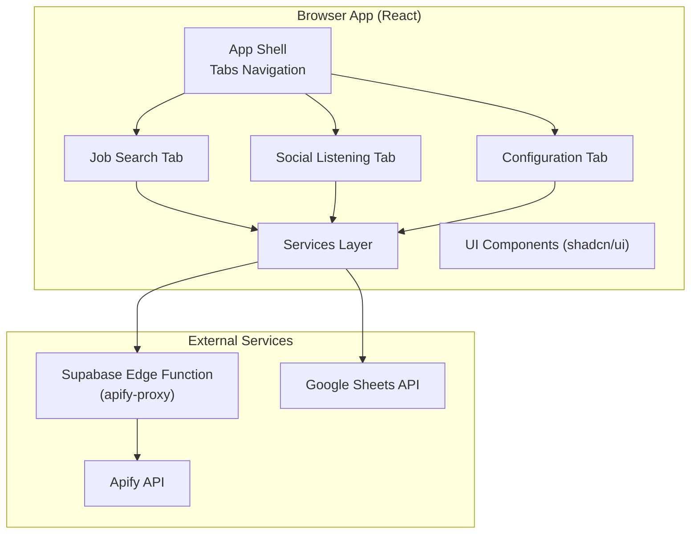
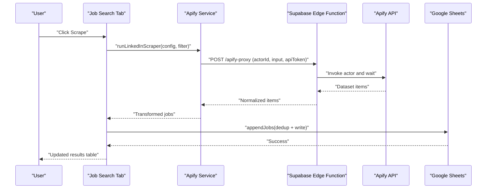
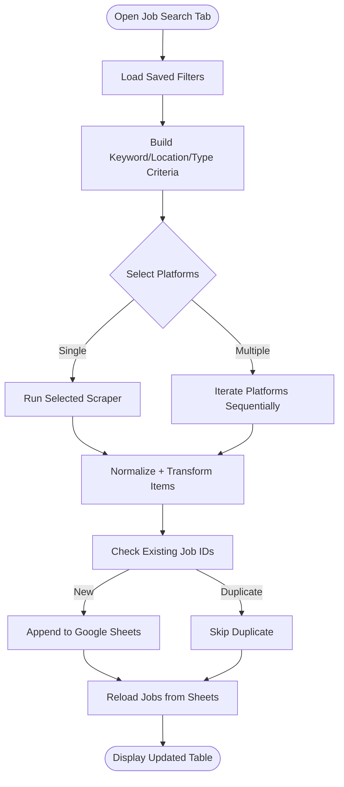
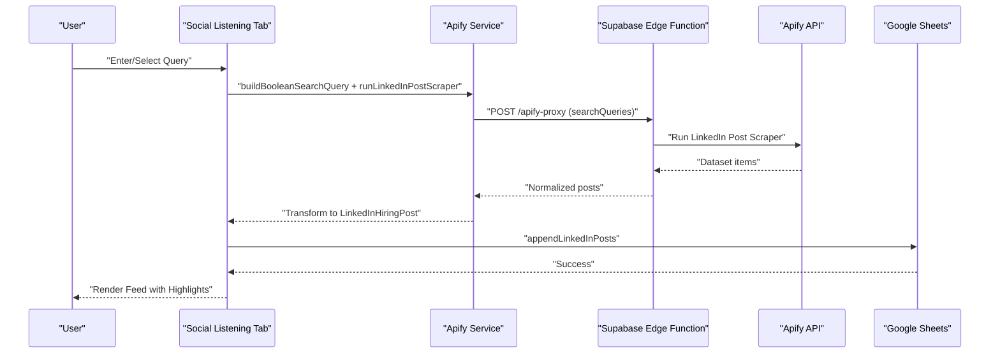
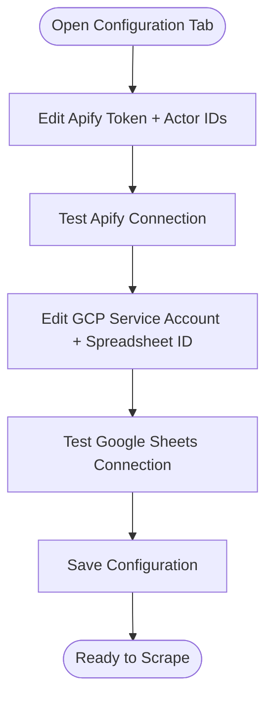
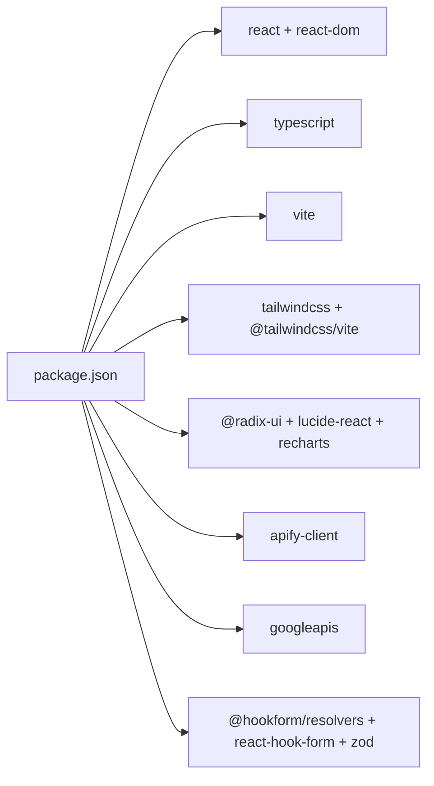

# Project Overview

<cite>
**Referenced Files in This Document**
- [WIKI.md](file://WIKI.md)
- [package.json](file://package.json)
- [vite.config.ts](file://vite.config.ts)
- [src\App.tsx](file://src\App.tsx)
- [src\main.tsx](file://src\main.tsx)
- [src\components\dashboard\job-search-tab.tsx](file://src\components\dashboard\job-search-tab.tsx)
- [src\components\dashboard\social-listening-tab.tsx](file://src\components\dashboard\social-listening-tab.tsx)
- [src\components\dashboard\config-tab.tsx](file://src\components\dashboard\config-tab.tsx)
- [src\services\apify.ts](file://src\services\apify.ts)
- [src\services\google-sheets.ts](file://src\services\google-sheets.ts)
- [src\services\config.ts](file://src\services\config.ts)
- [src\types\index.ts](file://src\types\index.ts)
</cite>

## Table of Contents
1. [Introduction](#introduction)
2. [Project Structure](#project-structure)
3. [Core Components](#core-components)
4. [Architecture Overview](#architecture-overview)
5. [Detailed Component Analysis](#detailed-component-analysis)
6. [Dependency Analysis](#dependency-analysis)
7. [Performance Considerations](#performance-considerations)
8. [Troubleshooting Guide](#troubleshooting-guide)
9. [Conclusion](#conclusion)
10. [Appendices](#appendices)

## Introduction
HuntSync AI is a browser-based job search command center designed to automate discovery across multiple job platforms and monitor social signals for hiring activity. Its core value proposition is to reduce the time and effort job seekers spend manually searching by orchestrating scrapers, normalizing results, and centralizing data for easy tracking and outreach.

Key capabilities:
- Multi-platform job scraping from 9+ job boards via Apify actors
- Social listening for LinkedIn hiring posts using boolean queries
- Centralized data management in Google Sheets for persistent tracking

Who it serves:
- Job seekers who want consolidated views of opportunities and hiring signals
- Recruiters and talent sourcers who track market trends and candidate posts
- Anyone needing a single pane of glass for job market intelligence

Benefits over manual job searching:
- Automated, repeatable discovery across platforms
- De-duplicated, normalized results in one place
- Persistent status tracking and keyword extraction for outreach
- No server-side installation—runs entirely in the browser with secure credential storage

## Project Structure
The application is a React Single Page Application built with Vite, TypeScript, and Tailwind CSS. It organizes functionality into three primary tabs (Job Search, Social Listening, Configuration) backed by a services layer that integrates with Apify and Google Sheets.

**Diagram sources**
- [src\App.tsx:12-64](file://src\App.tsx#L12-L64)
- [src\components\dashboard\job-search-tab.tsx:73-523](file://src\components\dashboard\job-search-tab.tsx#L73-L523)
- [src\components\dashboard\social-listening-tab.tsx:36-276](file://src\components\dashboard\social-listening-tab.tsx#L36-L276)
- [src\components\dashboard\config-tab.tsx:28-502](file://src\components\dashboard\config-tab.tsx#L28-L502)
- [src\services\apify.ts:13-42](file://src\services\apify.ts#L13-L42)
- [src\services\google-sheets.ts:5-11](file://src\services\google-sheets.ts#L5-L11)

**Section sources**
- [WIKI.md:108-141](file://WIKI.md#L108-L141)
- [vite.config.ts:1-15](file://vite.config.ts#L1-L15)
- [src\App.tsx:1-67](file://src\App.tsx#L1-L67)

## Core Components
- App shell and routing: Hosts three tabs for job search, social listening, and configuration.
- Job Search Tab: Builds filters, triggers scrapers per platform, displays results, and manages application statuses.
- Social Listening Tab: Constructs boolean queries, scrapes LinkedIn posts, highlights keywords, and tracks post statuses.
- Configuration Tab: Stores Apify and Google Cloud credentials securely in localStorage, tests connectivity, and exposes destructive controls.
- Services layer:
  - Apify service: Proxies scrapers via a Supabase Edge Function, normalizes outputs, and transforms items to domain models.
  - Google Sheets service: Authenticates via JWT, performs CRUD operations, deduplicates entries, and maintains spreadsheets.
  - Config store: Persists configuration and filters in localStorage with defaults and partial updates.

**Section sources**
- [src\App.tsx:12-64](file://src\App.tsx#L12-L64)
- [src\components\dashboard\job-search-tab.tsx:73-523](file://src\components\dashboard\job-search-tab.tsx#L73-L523)
- [src\components\dashboard\social-listening-tab.tsx:36-276](file://src\components\dashboard\social-listening-tab.tsx#L36-L276)
- [src\components\dashboard\config-tab.tsx:28-502](file://src\components\dashboard\config-tab.tsx#L28-L502)
- [src\services\apify.ts:1-348](file://src\services\apify.ts#L1-L348)
- [src\services\google-sheets.ts:1-354](file://src\services\google-sheets.ts#L1-L354)
- [src\services\config.ts:1-66](file://src\services\config.ts#L1-L66)

## Architecture Overview
HuntSync AI avoids a custom backend by leveraging:
- Supabase Edge Function to proxy Apify requests and keep API tokens secure
- Browser-side Google Sheets authentication using RS256-signed JWTs
- localStorage for configuration and filter persistence

**Diagram sources**
- [src\services\apify.ts:58-81](file://src\services\apify.ts#L58-L81)
- [src\services\apify.ts:84-113](file://src\services\apify.ts#L84-L113)
- [src\services\google-sheets.ts:162-200](file://src\services\google-sheets.ts#L162-L200)
- [src\components\dashboard\job-search-tab.tsx:160-230](file://src\components\dashboard\job-search-tab.tsx#L160-L230)

**Section sources**
- [WIKI.md:45-84](file://WIKI.md#L45-L84)
- [src\services\apify.ts:13-42](file://src\services\apify.ts#L13-L42)
- [src\services\google-sheets.ts:12-60](file://src\services\google-sheets.ts#L12-L60)

## Detailed Component Analysis

### Job Search Tab
Purpose:
- Build and save reusable search filters
- Trigger scrapers for one or multiple platforms
- Display normalized job results with status controls
- Persist and update statuses in Google Sheets

Key behaviors:
- Loads saved filters from localStorage and applies defaults
- Runs platform-specific scrapers sequentially, transforming outputs to a unified model
- Deduplicates new jobs against existing IDs in Google Sheets before appending
- Updates application status live and persists to the spreadsheet

**Diagram sources**
- [src\components\dashboard\job-search-tab.tsx:73-230](file://src\components\dashboard\job-search-tab.tsx#L73-L230)
- [src\services\apify.ts:274-286](file://src\services\apify.ts#L274-L286)
- [src\services\google-sheets.ts:141-200](file://src\services\google-sheets.ts#L141-L200)

**Section sources**
- [src\components\dashboard\job-search-tab.tsx:73-523](file://src\components\dashboard\job-search-tab.tsx#L73-L523)
- [src\types\index.ts:7-23](file://src\types\index.ts#L7-L23)

### Social Listening Tab
Purpose:
- Construct boolean queries to find LinkedIn posts indicating hiring
- Extract detected keywords and track post statuses for outreach
- Display a scrollable feed with author info, post text, and status controls

Key behaviors:
- Provides preset queries for quick start
- Builds a boolean search wrapping user input with common hiring terms
- Scrapes posts, highlights matched keywords, and appends to Google Sheets
- Updates post statuses and refreshes the feed

**Diagram sources**
- [src\components\dashboard\social-listening-tab.tsx:62-95](file://src\components\dashboard\social-listening-tab.tsx#L62-L95)
- [src\services\apify.ts:288-347](file://src\services\apify.ts#L288-L347)
- [src\services\google-sheets.ts:202-236](file://src\services\google-sheets.ts#L202-L236)

**Section sources**
- [src\components\dashboard\social-listening-tab.tsx:36-276](file://src\components\dashboard\social-listening-tab.tsx#L36-L276)
- [src\types\index.ts:29-39](file://src\types\index.ts#L29-L39)

### Configuration Tab
Purpose:
- Securely store Apify and Google Cloud credentials in localStorage
- Test connectivity to both services
- Provide destructive controls (wipe data, clear config)
- Offer guided setup steps

Key behaviors:
- Maintains separate Apify actor ID mappings for each platform plus the LinkedIn post scraper
- Tests Apify connectivity via the Supabase Edge Function
- Tests Google Sheets connectivity using JWT-based OAuth flow
- Allows saving partial updates and clearing all configuration

**Diagram sources**
- [src\components\dashboard\config-tab.tsx:28-116](file://src\components\dashboard\config-tab.tsx#L28-L116)
- [src\services\config.ts:26-65](file://src\services\config.ts#L26-L65)
- [src\services\apify.ts:25-42](file://src\services\apify.ts#L25-L42)
- [src\services\google-sheets.ts:104-119](file://src\services\google-sheets.ts#L104-L119)

**Section sources**
- [src\components\dashboard\config-tab.tsx:28-502](file://src\components\dashboard\config-tab.tsx#L28-L502)
- [src\services\config.ts:1-66](file://src\services\config.ts#L1-L66)

## Dependency Analysis
- Frontend framework and toolchain: React 19, Vite, TypeScript, Tailwind CSS v4
- UI primitives: shadcn/ui (Radix UI) with Lucide icons
- External integrations: Apify (client), Google APIs (Sheets + OAuth2), Supabase Edge Function
- Local persistence: localStorage for configuration and filters

**Diagram sources**
- [package.json:1-48](file://package.json#L1-L48)

**Section sources**
- [package.json:1-48](file://package.json#L1-L48)
- [vite.config.ts:1-15](file://vite.config.ts#L1-L15)

## Performance Considerations
- Scraping timeouts: Apify runs are configured with a 300-second timeout to accommodate larger pages and datasets.
- Deduplication: Pre-fetching existing IDs reduces unnecessary writes and improves throughput when appending to Google Sheets.
- Browser JWT caching: Access tokens are cached to minimize repeated OAuth exchanges.
- UI responsiveness: Sequential scraping across platforms prevents overwhelming external services and keeps the UI interactive.

[No sources needed since this section provides general guidance]

## Troubleshooting Guide
Common issues and resolutions:
- Apify connection failures: Verify API token and actor IDs; test connection from the Configuration tab.
- Google Sheets errors: Confirm spreadsheet ID, service account JSON, and editor permissions; test connection from the Configuration tab.
- Scraping delays: Expect up to several minutes depending on platform volume; the app displays loading states during scraping.
- Status updates not persisting: Ensure Google Sheets credentials are present; without them, updates occur only in UI state.

**Section sources**
- [src\components\dashboard\config-tab.tsx:43-89](file://src\components\dashboard\config-tab.tsx#L43-L89)
- [src\services\apify.ts:25-42](file://src\services\apify.ts#L25-L42)
- [src\services\google-sheets.ts:104-119](file://src\services\google-sheets.ts#L104-L119)

## Conclusion
HuntSync AI streamlines job discovery and social listening by automating multi-platform scraping, normalizing results, and centralizing data in Google Sheets. Its architecture keeps secrets secure, minimizes server dependencies, and delivers a responsive, filter-driven experience tailored to modern job seekers and talent professionals.

[No sources needed since this section summarizes without analyzing specific files]

## Appendices

### Target Audience and Primary Use Cases
- Job seekers: Track opportunities across platforms, manage application statuses, and avoid duplicate applications.
- Talent sourcers/recruiters: Monitor hiring signals on LinkedIn, extract keywords, and maintain a pipeline of relevant posts.
- Power users: Save and reuse complex filters, run batch scrapers, and export insights from Google Sheets.

[No sources needed since this section provides general guidance]

### System Requirements and Supported Browsers
- Node.js 18+ for development
- Modern browsers with JavaScript ES2022 support
- Internet access for Apify and Google APIs
- Permissions to share the Google Spreadsheet with the service account email

[No sources needed since this section provides general guidance]

### Integration Capabilities
- Apify Actors: 9+ job board scrapers and 1 LinkedIn post scraper
- Google Sheets: Two dedicated sheets for jobs and hiring posts with robust CRUD and deduplication
- Supabase Edge Function: Acts as a secure proxy for Apify calls

**Section sources**
- [src\services\apify.ts:84-218](file://src\services\apify.ts#L84-L218)
- [src\services\google-sheets.ts:162-278](file://src\services\google-sheets.ts#L162-L278)
- [src\services\apify.ts:13-42](file://src\services\apify.ts#L13-L42)