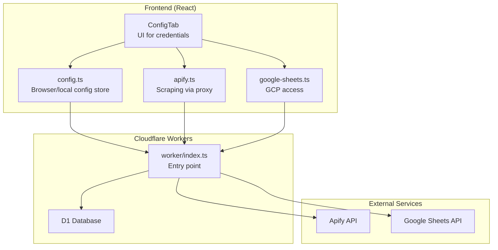
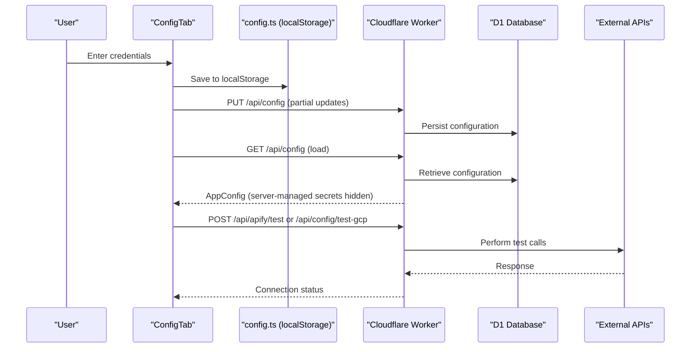
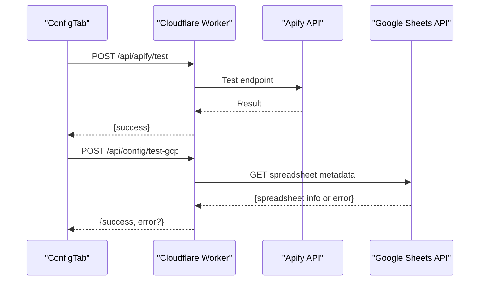
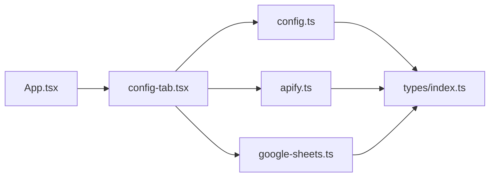

# Security Considerations

<cite>
**Referenced Files in This Document**
- [config.ts](file://src/services/config.ts)
- [apify.ts](file://src/services/apify.ts)
- [google-sheets.ts](file://src/services/google-sheets.ts)
- [config-tab.tsx](file://src/components/dashboard/config-tab.tsx)
- [App.tsx](file://src/App.tsx)
- [types/index.ts](file://src/types/index.ts)
- [wrangler.toml](file://wrangler.toml)
- [package.json](file://package.json)
- [vite.config.ts](file://vite.config.ts)
</cite>

## Table of Contents
1. [Introduction](#introduction)
2. [Project Structure](#project-structure)
3. [Core Components](#core-components)
4. [Architecture Overview](#architecture-overview)
5. [Detailed Component Analysis](#detailed-component-analysis)
6. [Dependency Analysis](#dependency-analysis)
7. [Performance Considerations](#performance-considerations)
8. [Troubleshooting Guide](#troubleshooting-guide)
9. [Conclusion](#conclusion)
10. [Appendices](#appendices)

## Introduction
This document provides comprehensive security guidance for HuntSync AI, focusing on credential management, secure storage, transport security, and protection of user data. It synthesizes the current implementation present in the repository and outlines best practices to mitigate common web application vulnerabilities in the context of a job search dashboard that integrates with external APIs and cloud services.

## Project Structure
HuntSync AI is a React application bundled with Vite and deployed via Cloudflare Workers. The frontend manages configuration and UI, while the backend (Workers) exposes protected endpoints for data operations and external API access. Configuration secrets are intended to be stored in Cloudflare Worker Secrets and accessed server-side.

**Diagram sources**
- [config-tab.tsx](file://src/components/dashboard/config-tab.tsx)
- [config.ts](file://src/services/config.ts)
- [apify.ts](file://src/services/apify.ts)
- [google-sheets.ts](file://src/services/google-sheets.ts)
- [wrangler.toml](file://wrangler.toml)

**Section sources**
- [vite.config.ts](file://vite.config.ts)
- [wrangler.toml](file://wrangler.toml)

## Core Components
- Configuration Management:
  - Browser-side config store persists credentials in localStorage for quick UI updates and offline-like behavior.
  - Server-side config loader retrieves merged configuration from the backend, enabling server-managed secrets.
- External API Integrations:
  - Scraping requests are proxied through Cloudflare Workers to keep secrets out of the browser.
  - Google Sheets access is performed server-side using a service account JWT flow.
- Data Persistence:
  - Primary storage is Cloudflare D1; Google Sheets acts as a backup synchronization target.

Security-relevant implications:
- Browser-based storage of credentials increases risk exposure; sensitive tokens should remain server-side.
- Transport security depends on HTTPS deployment and secure headers.
- Input validation and sanitization are essential to prevent injection and misuse of external APIs.

**Section sources**
- [config.ts](file://src/services/config.ts)
- [apify.ts](file://src/services/apify.ts)
- [google-sheets.ts](file://src/services/google-sheets.ts)
- [config-tab.tsx](file://src/components/dashboard/config-tab.tsx)

## Architecture Overview
The system separates concerns between client and server:
- Frontend handles UI and local caching of non-sensitive configuration.
- Backend (Workers) performs privileged operations, validates requests, and interacts with external services.

**Diagram sources**
- [config-tab.tsx](file://src/components/dashboard/config-tab.tsx)
- [config.ts](file://src/services/config.ts)
- [apify.ts](file://src/services/apify.ts)
- [google-sheets.ts](file://src/services/google-sheets.ts)
- [wrangler.toml](file://wrangler.toml)

## Detailed Component Analysis

### Credential Management and Storage
Current implementation highlights:
- Browser-side localStorage usage for storing Apify and GCP configuration, including sensitive fields.
- Server-side configuration retrieval and saving via dedicated endpoints.
- Intended separation: server-side secrets via Cloudflare Worker Secrets, client-side UI convenience.

Security risks:
- Sensitive tokens in localStorage are vulnerable to XSS and local theft.
- Client-side parsing and manipulation of service account keys increase attack surface.

Recommended mitigations:
- Move all secrets to server-side only. Remove sensitive fields from localStorage.
- Enforce Content Security Policy (CSP) to limit inline scripts and eval usage.
- Prefer HttpOnly cookies for session tokens if authentication is introduced.
- Encrypt sensitive data at rest using platform-provided encryption where applicable.

**Section sources**
- [config.ts](file://src/services/config.ts)
- [config-tab.tsx](file://src/components/dashboard/config-tab.tsx)
- [wrangler.toml](file://wrangler.toml)

### External API Integrations (Apify and Google Sheets)
- Apify:
  - Requests are proxied through Cloudflare Workers to avoid exposing tokens in the browser.
  - Connection testing is supported via a dedicated endpoint.
- Google Sheets:
  - Access token acquisition uses a JWT assertion flow with a service account key.
  - Token caching reduces repeated token exchanges.
  - Operations are executed server-side to protect credentials.

Security considerations:
- Validate and sanitize all inputs passed to external APIs to prevent abuse.
- Implement rate limiting and timeouts on the server to avoid resource exhaustion.
- Avoid logging sensitive payloads or tokens.
- Use HTTPS-only for all external API calls.

**Diagram sources**
- [apify.ts](file://src/services/apify.ts)
- [google-sheets.ts](file://src/services/google-sheets.ts)
- [config-tab.tsx](file://src/components/dashboard/config-tab.tsx)

**Section sources**
- [apify.ts](file://src/services/apify.ts)
- [google-sheets.ts](file://src/services/google-sheets.ts)

### Data Transmission Security
- Deployment via Cloudflare Workers implies HTTPS termination at the edge; ensure TLS is enforced.
- Avoid sending secrets in query parameters or logs.
- Use secure headers (e.g., CSP, HSTS) via Workers middleware if not configured globally.

Recommendations:
- Enforce HTTPS and redirect HTTP to HTTPS.
- Implement strict CSP to prevent XSS and unauthorized script execution.
- Sanitize and validate all user inputs before forwarding to external APIs.

**Section sources**
- [wrangler.toml](file://wrangler.toml)
- [package.json](file://package.json)

### User Authentication Tokens
- No explicit authentication mechanism is present in the current codebase.
- If introducing authentication, store tokens securely (HttpOnly cookies), enforce CSRF protections, and apply short-lived tokens with refresh mechanisms.

[No sources needed since this section provides general guidance]

### Browser-Based Storage Risks and Mitigations
- Risk: localStorage is accessible to JavaScript; XSS can steal tokens.
- Mitigation: Remove sensitive fields from localStorage; rely on server-side secrets only.

**Section sources**
- [config.ts](file://src/services/config.ts)

### Local Storage Encryption Considerations
- Current code does not implement encryption for localStorage entries.
- Recommendation: If sensitive data must persist locally (e.g., non-secret UI preferences), consider encryption libraries and secure key derivation. However, for production-grade secrets, avoid local storage entirely.

[No sources needed since this section provides general guidance]

### Input Validation and XSS Prevention
- Validate and sanitize all user inputs before constructing external API requests.
- Use a strict CSP policy and disable inline scripts.
- Avoid innerHTML; use safe DOM APIs or templating libraries.

**Section sources**
- [apify.ts](file://src/services/apify.ts)
- [google-sheets.ts](file://src/services/google-sheets.ts)

### Protecting User Data and Preventing Information Leakage
- Avoid returning raw external API errors containing secrets or internal details.
- Mask or redact sensitive fields in logs and error messages.
- Limit the amount of data exposed to the client; fetch only necessary fields.

**Section sources**
- [apify.ts](file://src/services/apify.ts)
- [google-sheets.ts](file://src/services/google-sheets.ts)

### Access Controls and Audit Trails
- Implement RBAC or ABAC if user accounts are introduced.
- Log administrative actions (e.g., wiping data) with timestamps and user identifiers.
- Restrict destructive operations behind confirmation dialogs and role checks.

**Section sources**
- [config-tab.tsx](file://src/components/dashboard/config-tab.tsx)

### Handling Sensitive Configuration Data
- Store secrets in Cloudflare Worker Secrets; do not commit to version control.
- Use environment-specific bindings and restrict access to deployment pipelines.

**Section sources**
- [wrangler.toml](file://wrangler.toml)

### Rate Limiting and Error Handling
- Enforce per-endpoint rate limits in Workers to prevent abuse.
- Return generic error messages to clients; log detailed errors server-side only.
- Implement circuit breakers for external service failures.

**Section sources**
- [apify.ts](file://src/services/apify.ts)
- [google-sheets.ts](file://src/services/google-sheets.ts)

## Dependency Analysis
The frontend depends on:
- React and UI libraries for rendering.
- Service modules for configuration, scraping, and data operations.
- Cloudflare Workers runtime for backend logic.

**Diagram sources**
- [App.tsx](file://src/App.tsx)
- [config-tab.tsx](file://src/components/dashboard/config-tab.tsx)
- [config.ts](file://src/services/config.ts)
- [apify.ts](file://src/services/apify.ts)
- [google-sheets.ts](file://src/services/google-sheets.ts)
- [types/index.ts](file://src/types/index.ts)

**Section sources**
- [package.json](file://package.json)

## Performance Considerations
- Token caching for Google Sheets reduces repeated OAuth exchanges.
- Local memory cache in server-side config avoids frequent reads.
- Minimize payload sizes and enable compression at the edge.

[No sources needed since this section provides general guidance]

## Troubleshooting Guide
Common issues and mitigations:
- Connection failures to Apify or Google Sheets:
  - Verify server-side secrets and bindings.
  - Check network policies and CORS settings.
- Unexpected errors from external APIs:
  - Inspect Worker logs for sanitized error messages.
  - Confirm actor IDs and scopes are correct.
- Data sync inconsistencies:
  - Review deduplication logic and batch sizes.
  - Validate spreadsheet permissions and IDs.

**Section sources**
- [apify.ts](file://src/services/apify.ts)
- [google-sheets.ts](file://src/services/google-sheets.ts)
- [config-tab.tsx](file://src/components/dashboard/config-tab.tsx)

## Conclusion
HuntSync AI’s current architecture proxies sensitive operations through Cloudflare Workers, which is a strong foundation. To harden security:
- Eliminate sensitive data from localStorage.
- Enforce strict CSP and secure headers.
- Implement robust input validation and rate limiting.
- Adopt encryption for any locally persisted sensitive data.
- Establish audit logs for administrative actions.

[No sources needed since this section summarizes without analyzing specific files]

## Appendices

### Security Checklist for HuntSync AI
- [ ] Remove sensitive fields from localStorage.
- [ ] Store all secrets in Cloudflare Worker Secrets.
- [ ] Enforce HTTPS and strict CSP.
- [ ] Validate and sanitize all external API inputs.
- [ ] Implement rate limiting and circuit breakers.
- [ ] Log administrative actions with audit trails.
- [ ] Use encrypted backups and secure offloading to Google Sheets.

[No sources needed since this section provides general guidance]