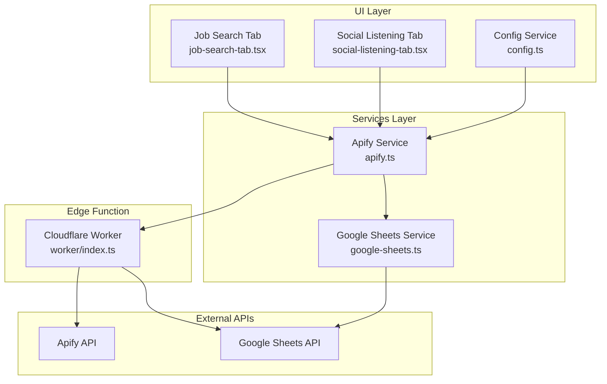
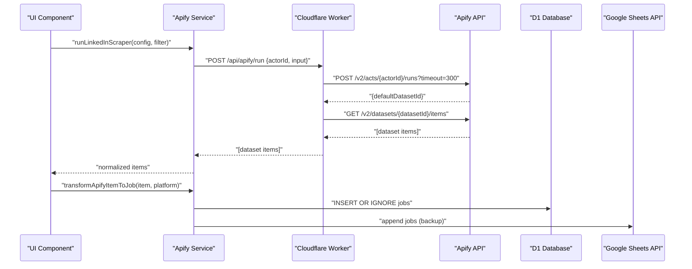
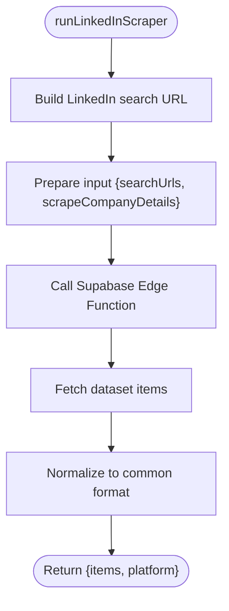
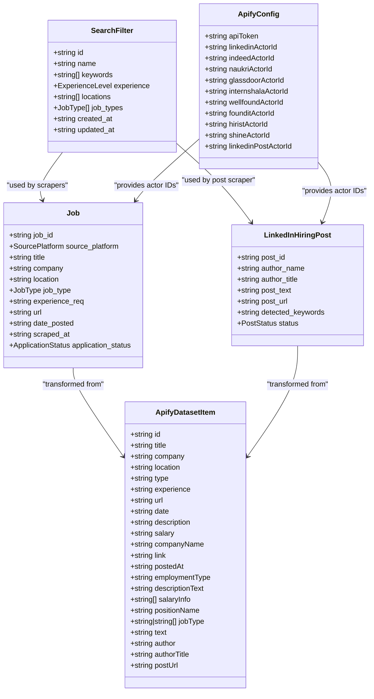
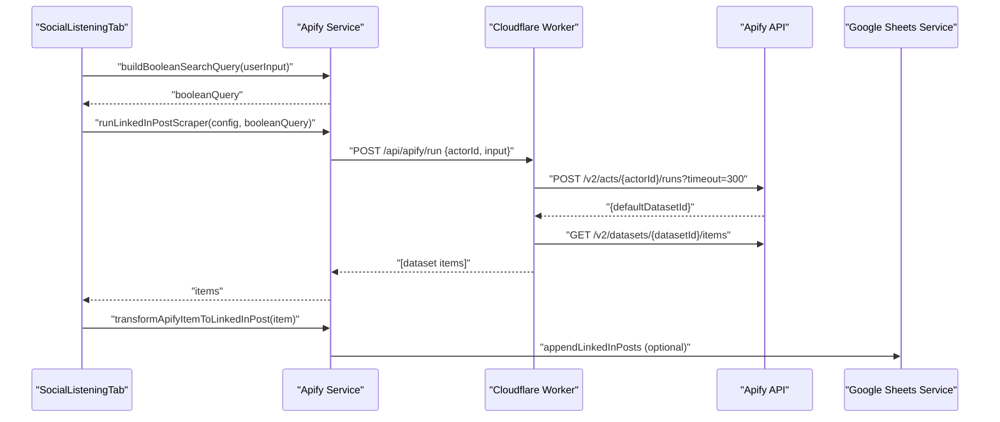
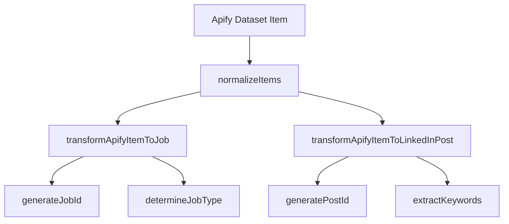
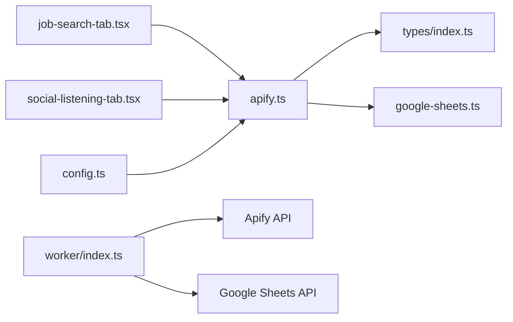

# Apify Service

<cite>
**Referenced Files in This Document**
- [apify.ts](file://src/services/apify.ts)
- [index.ts](file://src/types/index.ts)
- [job-search-tab.tsx](file://src/components/dashboard/job-search-tab.tsx)
- [social-listening-tab.tsx](file://src/components/dashboard/social-listening-tab.tsx)
- [config.ts](file://src/services/config.ts)
- [google-sheets.ts](file://src/services/google-sheets.ts)
- [index.ts](file://worker/index.ts)
- [WIKI.md](file://WIKI.md)
</cite>

## Table of Contents
1. [Introduction](#introduction)
2. [Project Structure](#project-structure)
3. [Core Components](#core-components)
4. [Architecture Overview](#architecture-overview)
5. [Detailed Component Analysis](#detailed-component-analysis)
6. [Dependency Analysis](#dependency-analysis)
7. [Performance Considerations](#performance-considerations)
8. [Troubleshooting Guide](#troubleshooting-guide)
9. [Conclusion](#conclusion)
10. [Appendices](#appendices)

## Introduction
This document describes the Apify service that powers web scraping operations for job listings and social listening. It covers connection testing, proxy implementation via Supabase Edge Function, multi-platform scrapers for LinkedIn Jobs, Indeed, Naukri, Glassdoor, Internshala, Wellfound, Foundit, Hirist, and Shine. It also documents data normalization, ID generation algorithms, transformation functions for Apify dataset items to Job and LinkedInHiringPost entities, boolean search query builder for social listening, error handling strategies, timeout configurations, rate limiting considerations, and integration patterns with the UI layer.

## Project Structure
The Apify service is implemented in the frontend service layer and backed by a Cloudflare Worker that acts as a proxy to Apify and Google Sheets. The UI integrates with these services to orchestrate scraping and display results.

**Diagram sources**
- [apify.ts:1-677](file://src/services/apify.ts#L1-L677)
- [job-search-tab.tsx:1-204](file://src/components/dashboard/job-search-tab.tsx#L1-L204)
- [social-listening-tab.tsx:1-276](file://src/components/dashboard/social-listening-tab.tsx#L1-L276)
- [config.ts:1-66](file://src/services/config.ts#L1-L66)
- [google-sheets.ts:1-446](file://src/services/google-sheets.ts#L1-L446)
- [index.ts:1-497](file://worker/index.ts#L1-L497)

**Section sources**
- [apify.ts:1-677](file://src/services/apify.ts#L1-L677)
- [index.ts:1-497](file://worker/index.ts#L1-L497)

## Core Components
- Apify Service: Orchestrates scraping via Supabase Edge Function, normalizes outputs, transforms to domain entities, and builds boolean queries for social listening.
- Types: Defines Job, LinkedInHiringPost, SearchFilter, ApifyDatasetItem, and configuration interfaces.
- UI Tabs: Job Search Tab triggers multi-platform scrapers; Social Listening Tab runs LinkedIn Post scraper with boolean queries.
- Configuration Service: Manages Apify and Google Sheets configuration in localStorage and merges defaults.
- Google Sheets Service: Provides CRUD operations and deduplication for Jobs and LinkedIn Hiring Posts.
- Cloudflare Worker: Implements the Supabase Edge Function proxy to Apify and Google Sheets, with D1 database as primary storage and Sheets as backup.

**Section sources**
- [apify.ts:1-677](file://src/services/apify.ts#L1-L677)
- [index.ts:1-159](file://src/types/index.ts#L1-L159)
- [job-search-tab.tsx:1-204](file://src/components/dashboard/job-search-tab.tsx#L1-L204)
- [social-listening-tab.tsx:1-276](file://src/components/dashboard/social-listening-tab.tsx#L1-L276)
- [config.ts:1-66](file://src/services/config.ts#L1-L66)
- [google-sheets.ts:1-446](file://src/services/google-sheets.ts#L1-L446)
- [index.ts:1-497](file://worker/index.ts#L1-L497)

## Architecture Overview
The system uses a Supabase Edge Function (implemented as a Cloudflare Worker) to proxy requests to Apify and Google Sheets. The frontend invokes the service layer, which sends requests to the Edge Function. The Edge Function executes Apify Actors, fetches datasets, and persists data to D1 with Google Sheets as a backup.

**Diagram sources**
- [apify.ts:413-442](file://src/services/apify.ts#L413-L442)
- [index.ts:151-172](file://worker/index.ts#L151-L172)
- [google-sheets.ts:254-292](file://src/services/google-sheets.ts#L254-L292)

**Section sources**
- [apify.ts:387-410](file://src/services/apify.ts#L387-L410)
- [index.ts:151-172](file://worker/index.ts#L151-L172)
- [WIKI.md:45-78](file://WIKI.md#L45-L78)

## Detailed Component Analysis

### Apify Service
Responsibilities:
- Connection testing against Apify.
- Proxy invocation to Supabase Edge Function with timeouts.
- Multi-platform scrapers for LinkedIn Jobs, Indeed, Naukri, Glassdoor, Internshala, Wellfound, Foundit, Hirist, and Shine.
- Normalization of dataset items to a common format.
- Transformation functions to Job and LinkedInHiringPost entities.
- Boolean search query builder for social listening.

Key functions and behaviors:
- Connection testing:
  - Frontend test: [testApifyConnection:22-30](file://src/services/apify.ts#L22-L30) uses "/api/apify/test".
  - Backend test: [handleApi /api/apify/test:180-189](file://worker/index.ts#L180-L189) validates APIFY_TOKEN and calls Apify users endpoint.
- Proxy invocation:
  - Supabase Edge Function URL: [SUPABASE_URL constant:343-343](file://src/services/apify.ts#L343-L343).
  - Timeout passed to Edge Function: [timeoutSecs: 300:400-400](file://src/services/apify.ts#L400-L400).
  - Edge Function runs actor and fetches dataset: [runApifyScraper:152-172](file://worker/index.ts#L152-L172).
- Scraper implementations:
  - LinkedIn Jobs: [runLinkedInScraper:413-442](file://src/services/apify.ts#L413-L442) constructs search URL and normalizes fields.
  - Indeed: [runIndeedScraper:445-475](file://src/services/apify.ts#L445-L475) sets position/location/country and normalizes fields.
  - Naukri/Glassdoor/Internshala/Wellfound/Foundit/Hirist/Shine: [runNaukri/.../runShineScraper:478-601](file://src/services/apify.ts#L478-L601) use shared normalization.
- Data normalization:
  - Shared normalization: [normalizeItems:604-615](file://src/services/apify.ts#L604-L615).
- Transformations:
  - Job: [transformApifyItemToJob:630-647](file://src/services/apify.ts#L630-L647) with ID generation and job type determination.
  - LinkedIn Post: [transformApifyItemToLinkedInPost:649-659](file://src/services/apify.ts#L649-L659) with post ID generation and keyword extraction.
- Boolean search builder:
  - [buildBooleanSearchQuery:674-676](file://src/services/apify.ts#L674-L676) wraps user input with "hiring"/"looking for".

**Diagram sources**
- [apify.ts:413-442](file://src/services/apify.ts#L413-L442)

**Section sources**
- [apify.ts:22-677](file://src/services/apify.ts#L22-L677)
- [index.ts:151-172](file://worker/index.ts#L151-L172)

### Types and Data Models
- Job entity: [Job:11-23](file://src/types/index.ts#L11-L23) with fields for ID, platform, title, company, location, job type, experience, URL, dates, scraped timestamp, and application status.
- LinkedInHiringPost entity: [LinkedInHiringPost:31-39](file://src/types/index.ts#L31-L39) with post ID, author, title, text, URL, detected keywords, and status.
- SearchFilter: [SearchFilter:45-54](file://src/types/index.ts#L45-L54) with keywords, locations, job types, and timestamps.
- ApifyDatasetItem: [ApifyDatasetItem:119-145](file://src/types/index.ts#L119-L145) with optional fields for various platforms and common fields.
- ApifyConfig: [ApifyConfig:69-81](file://src/types/index.ts#L69-L81) with actor IDs and tokens.
- ScraperRun: [ScraperRun:99-107](file://src/types/index.ts#L99-L107) for UI state tracking.

**Diagram sources**
- [index.ts:11-145](file://src/types/index.ts#L11-L145)

**Section sources**
- [index.ts:1-159](file://src/types/index.ts#L1-L159)

### UI Integration Patterns
- Job Search Tab:
  - Loads configuration and triggers scrapers for selected platforms.
  - Transforms Apify items to Job entities and appends to storage.
  - Uses toast notifications and loading states.
  - Example integration: [job-search-tab.tsx:169-204](file://src/components/dashboard/job-search-tab.tsx#L169-L204).
- Social Listening Tab:
  - Builds boolean queries and runs LinkedIn Post scraper.
  - Transforms items to LinkedInHiringPost and updates UI or Google Sheets.
  - Example integration: [social-listening-tab.tsx:62-95](file://src/components/dashboard/social-listening-tab.tsx#L62-L95).
- Configuration:
  - Default Apify actor IDs and tokens are merged from localStorage and defaults.
  - Example configuration: [config.ts:7-19](file://src/services/config.ts#L7-L19).

**Diagram sources**
- [social-listening-tab.tsx:62-95](file://src/components/dashboard/social-listening-tab.tsx#L62-L95)
- [apify.ts:618-628](file://src/services/apify.ts#L618-L628)
- [index.ts:151-172](file://worker/index.ts#L151-L172)

**Section sources**
- [job-search-tab.tsx:169-204](file://src/components/dashboard/job-search-tab.tsx#L169-L204)
- [social-listening-tab.tsx:62-95](file://src/components/dashboard/social-listening-tab.tsx#L62-L95)
- [config.ts:26-47](file://src/services/config.ts#L26-L47)

### Data Normalization and Transformation
- Normalization:
  - Ensures consistent fields across platforms: [normalizeItems:604-615](file://src/services/apify.ts#L604-L615).
- ID Generation:
  - Job ID: [generateJobId:13-16](file://src/services/apify.ts#L13-L16) concatenates platform and key fields, base64-encoded to 32 chars.
  - Post ID: [generatePostId:18-20](file://src/services/apify.ts#L18-L20) uses item id or base64 of author/postUrl.
- Transformations:
  - Job: [transformApifyItemToJob:630-647](file://src/services/apify.ts#L630-L647) maps Apify fields to Job and determines job type.
  - LinkedIn Post: [transformApifyItemToLinkedInPost:649-659](file://src/services/apify.ts#L649-L659) maps Apify fields to LinkedInHiringPost and extracts keywords.
- Job Type Determination:
  - Remote/Hybrid/WFO inferred from type string: [determineJobType:661-666](file://src/services/apify.ts#L661-L666).
- Keyword Extraction:
  - Fixed set of keywords extracted from post text: [extractKeywords:668-672](file://src/services/apify.ts#L668-L672).

**Diagram sources**
- [apify.ts:604-672](file://src/services/apify.ts#L604-L672)

**Section sources**
- [apify.ts:13-20](file://src/services/apify.ts#L13-L20)
- [apify.ts:630-672](file://src/services/apify.ts#L630-L672)

### Boolean Search Query Builder
- Purpose: Construct targeted LinkedIn post queries for social listening.
- Implementation: [buildBooleanSearchQuery:674-676](file://src/services/apify.ts#L674-L676) wraps user input with "hiring" or "looking for" conditions.
- Usage: [social-listening-tab.tsx:71-71](file://src/components/dashboard/social-listening-tab.tsx#L71-L71) demonstrates building and passing the query.

**Section sources**
- [apify.ts:674-676](file://src/services/apify.ts#L674-L676)
- [social-listening-tab.tsx:71-71](file://src/components/dashboard/social-listening-tab.tsx#L71-L71)

### Error Handling Strategies
- Apify Service:
  - Proxy errors propagate with HTTP status or error payload: [runScraperViaProxy:388-410](file://src/services/apify.ts#L388-L410).
  - Connection test returns success/error: [testApifyConnection:22-30](file://src/services/apify.ts#L22-L30).
- Cloudflare Worker:
  - Route handlers return structured error responses: [handleApi:175-466](file://worker/index.ts#L175-L466).
  - Apify run/dataset fetch failures are caught and reported: [runApifyScraper:152-172](file://worker/index.ts#L152-L172).
- Google Sheets Service:
  - Access token and JWT signing errors are handled: [getAccessToken:104-152](file://src/services/google-sheets.ts#L104-L152).
  - Append/update operations throw on failure: [appendJobs:254-292](file://src/services/google-sheets.ts#L254-L292), [appendLinkedInPosts:294-328](file://src/services/google-sheets.ts#L294-L328).

**Section sources**
- [apify.ts:22-410](file://src/services/apify.ts#L22-L410)
- [index.ts:152-172](file://worker/index.ts#L152-L172)
- [google-sheets.ts:104-152](file://src/services/google-sheets.ts#L104-L152)

## Dependency Analysis
- Internal dependencies:
  - apify.ts depends on types for Job, LinkedInHiringPost, SearchFilter, and ApifyDatasetItem.
  - UI tabs depend on apify.ts and google-sheets.ts for data operations.
  - config.ts provides Apify actor IDs and tokens merged with defaults.
- External dependencies:
  - Apify API for running actors and fetching datasets.
  - Google Sheets API for backup persistence and OAuth2 JWT flow.
  - Cloudflare Worker runtime for Edge Function hosting.

**Diagram sources**
- [apify.ts:1-677](file://src/services/apify.ts#L1-L677)
- [index.ts:1-159](file://src/types/index.ts#L1-L159)
- [job-search-tab.tsx:1-204](file://src/components/dashboard/job-search-tab.tsx#L1-L204)
- [social-listening-tab.tsx:1-276](file://src/components/dashboard/social-listening-tab.tsx#L1-L276)
- [config.ts:1-66](file://src/services/config.ts#L1-L66)
- [google-sheets.ts:1-446](file://src/services/google-sheets.ts#L1-L446)
- [index.ts:1-497](file://worker/index.ts#L1-L497)

**Section sources**
- [apify.ts:1-677](file://src/services/apify.ts#L1-L677)
- [index.ts:1-159](file://src/types/index.ts#L1-L159)
- [job-search-tab.tsx:1-204](file://src/components/dashboard/job-search-tab.tsx#L1-L204)
- [social-listening-tab.tsx:1-276](file://src/components/dashboard/social-listening-tab.tsx#L1-L276)
- [config.ts:1-66](file://src/services/config.ts#L1-L66)
- [google-sheets.ts:1-446](file://src/services/google-sheets.ts#L1-L446)
- [index.ts:1-497](file://worker/index.ts#L1-L497)

## Performance Considerations
- Timeouts:
  - Supabase Edge Function passes timeoutSecs: 300 to Apify runs: [runScraperViaProxy:400-400](file://src/services/apify.ts#L400-L400), [runApifyScraper:154-154](file://worker/index.ts#L154-L154).
- Rate limiting:
  - No explicit client-side rate limiting is implemented in the service layer. Consider adding retry/backoff and concurrency limits around scraper invocations.
- Deduplication:
  - Google Sheets service checks existing IDs before appending to avoid duplicates: [getExistingJobIds:233-242](file://src/services/google-sheets.ts#L233-L242), [getExistingPostIds:244-252](file://src/services/google-sheets.ts#L244-L252).
- Storage strategy:
  - D1 is primary; Google Sheets is backup. This reduces latency for reads and provides disaster recovery.

[No sources needed since this section provides general guidance]

## Troubleshooting Guide
Common issues and resolutions:
- Apify token missing:
  - Frontend test returns error if APIFY_TOKEN is not set: [handleApi /api/apify/test:180-189](file://worker/index.ts#L180-L189).
  - UI prompts to configure token: [social-listening-tab.tsx:64-67](file://src/components/dashboard/social-listening-tab.tsx#L64-L67).
- Proxy failures:
  - Proxy returns structured error messages: [runScraperViaProxy:404-406](file://src/services/apify.ts#L404-L406).
  - Edge Function logs and returns error responses: [handleApi:191-202](file://worker/index.ts#L191-L202).
- Google Sheets authentication:
  - JWT signing and token refresh errors are surfaced: [getAccessToken:104-152](file://src/services/google-sheets.ts#L104-L152).
  - UI shows error toast on failures: [social-listening-tab.tsx:89-94](file://src/components/dashboard/social-listening-tab.tsx#L89-L94).

**Section sources**
- [index.ts:180-202](file://worker/index.ts#L180-L202)
- [apify.ts:404-406](file://src/services/apify.ts#L404-L406)
- [google-sheets.ts:104-152](file://src/services/google-sheets.ts#L104-L152)
- [social-listening-tab.tsx:64-94](file://src/components/dashboard/social-listening-tab.tsx#L64-L94)

## Conclusion
The Apify service provides a robust, extensible foundation for multi-platform job and social listening scraping. It centralizes normalization, ID generation, and transformations while leveraging a Supabase Edge Function proxy for reliability and scalability. The UI integrates seamlessly with these services, enabling efficient job discovery and targeted social listening workflows.

[No sources needed since this section summarizes without analyzing specific files]

## Appendices

### Scraper Configurations and Input Parameters
- LinkedIn Jobs:
  - Input: searchUrls, scrapeCompanyDetails.
  - Example: [runLinkedInScraper:413-442](file://src/services/apify.ts#L413-L442).
- Indeed:
  - Input: position, location, country, maxItemsPerSearch, saveOnlyUniqueItems.
  - Example: [runIndeedScraper:445-475](file://src/services/apify.ts#L445-L475).
- Naukri/Glassdoor/Internshala/Wellfound/Foundit/Hirist/Shine:
  - Input: queries, location, maxPagesPerQuery.
  - Example: [runNaukri/.../runShineScraper:478-601](file://src/services/apify.ts#L478-L601).

**Section sources**
- [apify.ts:413-601](file://src/services/apify.ts#L413-L601)

### Output Data Structures
- ApifyDatasetItem: [ApifyDatasetItem:119-145](file://src/types/index.ts#L119-L145).
- Job: [Job:11-23](file://src/types/index.ts#L11-L23).
- LinkedInHiringPost: [LinkedInHiringPost:31-39](file://src/types/index.ts#L31-L39).

**Section sources**
- [index.ts:119-145](file://src/types/index.ts#L119-L145)
- [index.ts:11-39](file://src/types/index.ts#L11-L39)

### Integration Patterns with UI Layer
- Job Search Tab:
  - Triggers scrapers for selected platforms and displays results: [job-search-tab.tsx:169-204](file://src/components/dashboard/job-search-tab.tsx#L169-L204).
- Social Listening Tab:
  - Builds boolean queries and runs LinkedIn Post scraper: [social-listening-tab.tsx:62-95](file://src/components/dashboard/social-listening-tab.tsx#L62-L95).

**Section sources**
- [job-search-tab.tsx:169-204](file://src/components/dashboard/job-search-tab.tsx#L169-L204)
- [social-listening-tab.tsx:62-95](file://src/components/dashboard/social-listening-tab.tsx#L62-L95)