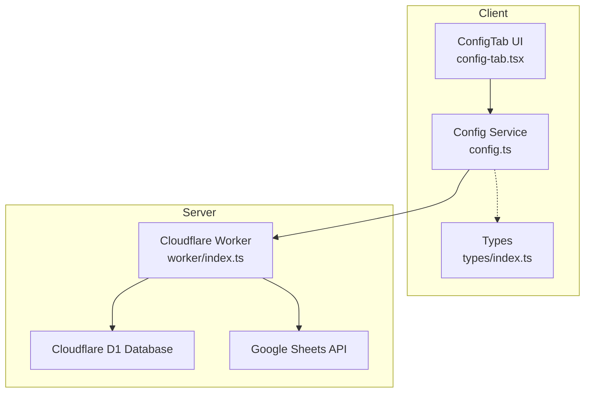
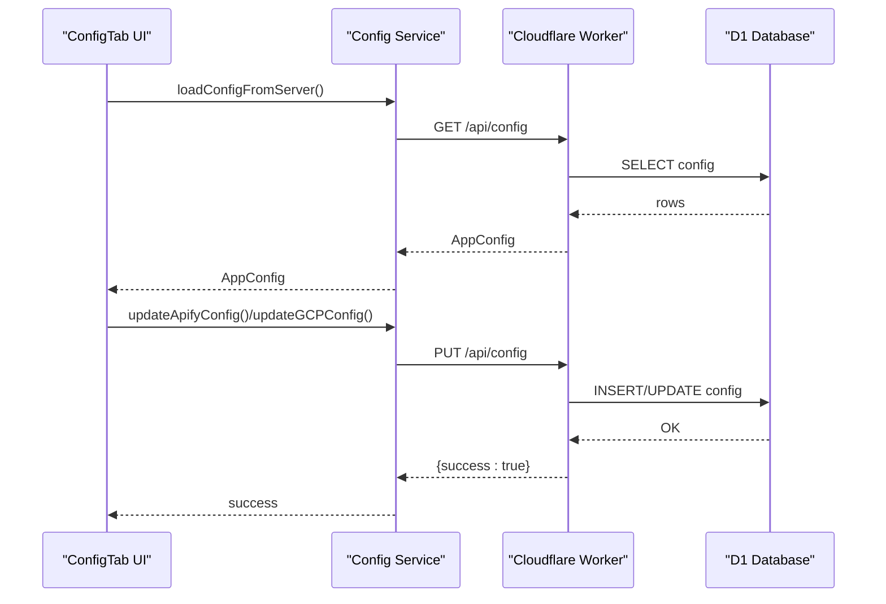
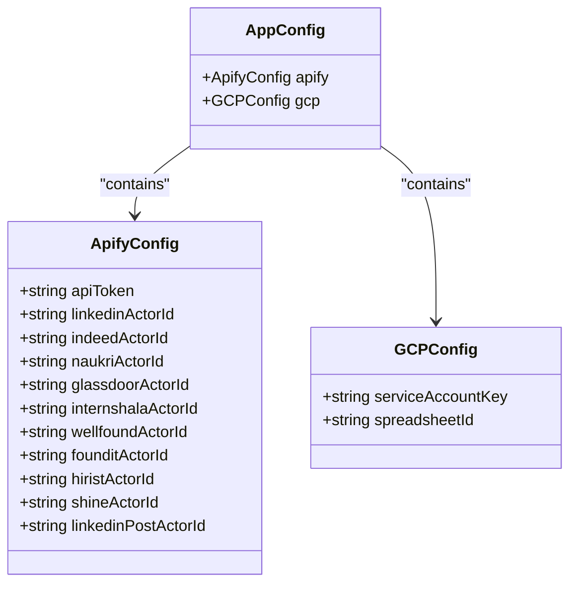
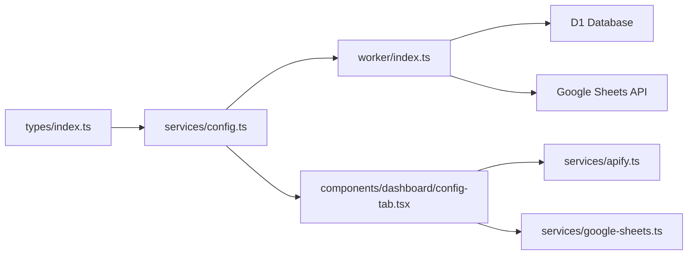

# Configuration Service

<cite>
**Referenced Files in This Document**
- [config.ts](file://src/services/config.ts)
- [config-tab.tsx](file://src/components/dashboard/config-tab.tsx)
- [index.ts](file://src/types/index.ts)
- [index.ts](file://worker/index.ts)
- [google-sheets.ts](file://src/services/google-sheets.ts)
- [apify.ts](file://src/services/apify.ts)
- [schema.sql](file://schema.sql)
- [vite.config.ts](file://vite.config.ts)
- [package.json](file://package.json)
</cite>

## Table of Contents
1. [Introduction](#introduction)
2. [Project Structure](#project-structure)
3. [Core Components](#core-components)
4. [Architecture Overview](#architecture-overview)
5. [Detailed Component Analysis](#detailed-component-analysis)
6. [Dependency Analysis](#dependency-analysis)
7. [Performance Considerations](#performance-considerations)
8. [Troubleshooting Guide](#troubleshooting-guide)
9. [Conclusion](#conclusion)

## Introduction
This document describes the configuration service that manages application settings and credentials for the job search dashboard. It covers local storage integration, configuration schema validation, default configuration handling, credential security measures, encryption patterns, sensitive data management, configuration loading and saving mechanisms, migration support, backup/restore procedures, UI integration, and environment-specific settings.

## Project Structure
The configuration service spans client-side and server-side components:
- Client-side configuration management in the dashboard UI
- Local storage-backed configuration persistence
- Server-side Cloudflare Worker API for centralized configuration storage and sensitive secrets
- Google Sheets backup integration for disaster recovery

**Diagram sources**
- [config-tab.tsx:28-507](file://src/components/dashboard/config-tab.tsx#L28-L507)
- [config.ts:27-166](file://src/services/config.ts#L27-L166)
- [index.ts:339-468](file://worker/index.ts#L339-L468)

**Section sources**
- [config-tab.tsx:28-507](file://src/components/dashboard/config-tab.tsx#L28-L507)
- [config.ts:27-166](file://src/services/config.ts#L27-L166)
- [index.ts:339-468](file://worker/index.ts#L339-L468)

## Core Components
- Configuration types define the shape of Apify and GCP settings
- Client-side configuration service provides CRUD operations and caching
- Server-side worker exposes API endpoints for configuration retrieval and updates
- UI component renders configuration forms and connection testing

Key responsibilities:
- Define configuration schema and defaults
- Load/save configuration from/to server
- Validate and merge partial updates
- Test external connections (Apify, Google Sheets)
- Manage sensitive credentials securely

**Section sources**
- [index.ts:69-91](file://src/types/index.ts#L69-L91)
- [config.ts:5-23](file://src/services/config.ts#L5-L23)
- [config.ts:27-100](file://src/services/config.ts#L27-L100)
- [config-tab.tsx:28-507](file://src/components/dashboard/config-tab.tsx#L28-L507)

## Architecture Overview
The configuration service follows a hybrid model:
- Defaults are defined in code
- Partial updates are merged with defaults
- Server stores Apify token and GCP credentials as secrets
- Client persists non-sensitive settings locally

**Diagram sources**
- [config.ts:35-69](file://src/services/config.ts#L35-L69)
- [index.ts:339-392](file://worker/index.ts#L339-L392)

## Detailed Component Analysis

### Configuration Types and Schema
The configuration schema defines two primary sections:
- Apify configuration: actor IDs and API token (server-side secret)
- Google Cloud Platform configuration: service account key and spreadsheet ID

**Diagram sources**
- [index.ts:69-91](file://src/types/index.ts#L69-L91)

**Section sources**
- [index.ts:69-91](file://src/types/index.ts#L69-L91)

### Default Configuration Handling
Defaults are defined in both client and server code:
- Client-side defaults for Apify actor IDs and GCP fields
- Server-side defaults for Apify actor IDs merged with stored values
- API token is managed server-side via Cloudflare Worker Secrets

Behavior:
- On first load, client merges stored values with defaults
- On server load, stored values are merged with default actor IDs
- API token is masked in server responses

**Section sources**
- [config.ts:5-23](file://src/services/config.ts#L5-L23)
- [config.ts:107-124](file://src/services/config.ts#L107-L124)
- [index.ts:14-26](file://worker/index.ts#L14-L26)
- [index.ts:348-354](file://worker/index.ts#L348-L354)

### Local Storage Integration
The client-side configuration service provides:
- Persistent storage using localStorage
- JSON serialization/deserialization
- Graceful fallback to defaults on parse errors
- Update helpers for partial modifications

Security considerations:
- Non-sensitive settings are stored locally
- Sensitive fields (API tokens, service account keys) are not persisted locally
- UI provides visibility toggles for sensitive fields

**Section sources**
- [config.ts:126-166](file://src/services/config.ts#L126-L166)
- [config-tab.tsx:300-324](file://src/components/dashboard/config-tab.tsx#L300-L324)

### Server-Side Configuration Management
The Cloudflare Worker API:
- Exposes GET/PUT endpoints for configuration
- Stores Apify actor IDs and GCP credentials in D1
- Masks API token in responses
- Supports GCP connection testing endpoint
- Provides CORS handling

Storage schema:
- config table with key/value pairs and timestamps
- Upsert semantics preserve existing values while updating changed fields

**Section sources**
- [index.ts:339-392](file://worker/index.ts#L339-L392)
- [schema.sql:33-37](file://schema.sql#L33-L37)

### Credential Security Measures and Encryption Patterns
Security posture:
- API token is stored as a Cloudflare Worker Secret, not in D1
- Service account key is stored in D1 but handled server-side for token exchange
- UI blurs sensitive fields and allows manual reveal
- Google Sheets access uses RS256 JWT signed with private key

Encryption patterns:
- Private key used to sign JWT assertions for Google OAuth2 token exchange
- Access tokens cached with expiry handling
- No client-side decryption of stored secrets

**Section sources**
- [index.ts:9-11](file://worker/index.ts#L9-L11)
- [config-tab.tsx:300-324](file://src/components/dashboard/config-tab.tsx#L300-L324)
- [google-sheets.ts:104-152](file://src/services/google-sheets.ts#L104-L152)

### Configuration Loading and Saving Mechanisms
Loading:
- Client loads from server on mount
- Falls back to defaults if server load fails
- Maintains in-memory cache

Saving:
- PUT /api/config accepts partial updates
- Server merges with defaults and upserts into D1
- Client updates its cache upon success

Validation:
- Client merges partial updates with defaults
- Server validates presence of required fields before saving
- UI prevents saving GCP settings without required fields

**Section sources**
- [config.ts:35-69](file://src/services/config.ts#L35-L69)
- [config.ts:71-83](file://src/services/config.ts#L71-L83)
- [config-tab.tsx:63-85](file://src/components/dashboard/config-tab.tsx#L63-L85)

### Migration Support for Configuration Updates
Migration strategy:
- New fields are added to defaults
- Existing stored values are merged with new defaults
- Server merges stored actor IDs with default actor IDs
- Backward compatibility maintained by ignoring unknown keys

Future-proofing:
- Stored values are treated as partial overrides
- Unknown keys are ignored during merge
- Default actor IDs provide sensible fallbacks

**Section sources**
- [config.ts:44-47](file://src/services/config.ts#L44-L47)
- [index.ts:346-354](file://worker/index.ts#L346-L354)

### Backup and Restore Procedures
Backup:
- D1 serves as primary storage
- Google Sheets acts as secondary backup
- On write operations, new records are appended to Sheets (when configured)

Restore:
- Database wipe removes all records
- Sheets wipe clears both job and post sheets
- No built-in restore from Sheets to D1

Operational controls:
- UI provides destructive actions with confirmation dialogs
- Worker implements wipe endpoints for both databases and Sheets

**Section sources**
- [index.ts:234-236](file://worker/index.ts#L234-L236)
- [index.ts:143-151](file://worker/index.ts#L143-L151)
- [config-tab.tsx:400-442](file://src/components/dashboard/config-tab.tsx#L400-L442)

### Integration with UI Components
The ConfigTab component:
- Renders separate sections for Apify and GCP configuration
- Provides live connection testing with visual feedback
- Implements save operations with error handling
- Offers destructive operations with confirmation dialogs
- Uses field components for consistent UX

Integration points:
- Uses configuration service for loading/saving
- Calls Apify/GCP connection testing endpoints
- Integrates with toast notifications for user feedback

**Section sources**
- [config-tab.tsx:28-507](file://src/components/dashboard/config-tab.tsx#L28-L507)

### Environment-Specific Settings
Environment handling:
- API token is loaded from Cloudflare Worker Secrets
- GCP credentials are environment variables in the Worker
- Client-side environment is configured via Vite aliases

Deployment:
- Wrangler CLI deploys the Worker and static assets
- Static assets served via Cloudflare Assets

**Section sources**
- [index.ts:9-11](file://worker/index.ts#L9-L11)
- [vite.config.ts:8-14](file://vite.config.ts#L8-L14)
- [package.json:11-12](file://package.json#L11-L12)

## Dependency Analysis
The configuration service has clear separation of concerns:
- Client depends on types and configuration service
- Worker depends on D1 and Google APIs
- UI depends on configuration service and types

**Diagram sources**
- [index.ts:69-91](file://src/types/index.ts#L69-L91)
- [config.ts:27-166](file://src/services/config.ts#L27-L166)
- [config-tab.tsx:23-26](file://src/components/dashboard/config-tab.tsx#L23-L26)
- [index.ts:339-468](file://worker/index.ts#L339-L468)

**Section sources**
- [index.ts:69-91](file://src/types/index.ts#L69-L91)
- [config.ts:27-166](file://src/services/config.ts#L27-L166)
- [config-tab.tsx:23-26](file://src/components/dashboard/config-tab.tsx#L23-L26)
- [index.ts:339-468](file://worker/index.ts#L339-L468)

## Performance Considerations
- Client-side caching reduces network calls
- Server-side token caching minimizes Google OAuth2 overhead
- Batch inserts reduce database round trips
- UI debounces connection tests to avoid excessive API calls

## Troubleshooting Guide
Common issues and resolutions:
- Configuration load failures: Client falls back to defaults automatically
- Invalid GCP credentials: UI shows error messages with details
- Apify token not set: Worker returns explicit error indicating missing secret
- Network connectivity: UI displays connection status badges with error details

Diagnostic steps:
- Verify API token secret is set in Cloudflare Workers
- Test GCP connection using the UI's test button
- Check browser console for JavaScript errors
- Review Worker logs for API errors

**Section sources**
- [config.ts:51-54](file://src/services/config.ts#L51-L54)
- [config-tab.tsx:43-61](file://src/components/dashboard/config-tab.tsx#L43-L61)
- [index.ts:182-191](file://worker/index.ts#L182-L191)

## Conclusion
The configuration service provides a robust, secure, and user-friendly mechanism for managing application settings. It balances local convenience with server-side security, offers clear validation and fallback behavior, and integrates seamlessly with the UI for operational tasks. The architecture supports future enhancements while maintaining backward compatibility and operational safety.