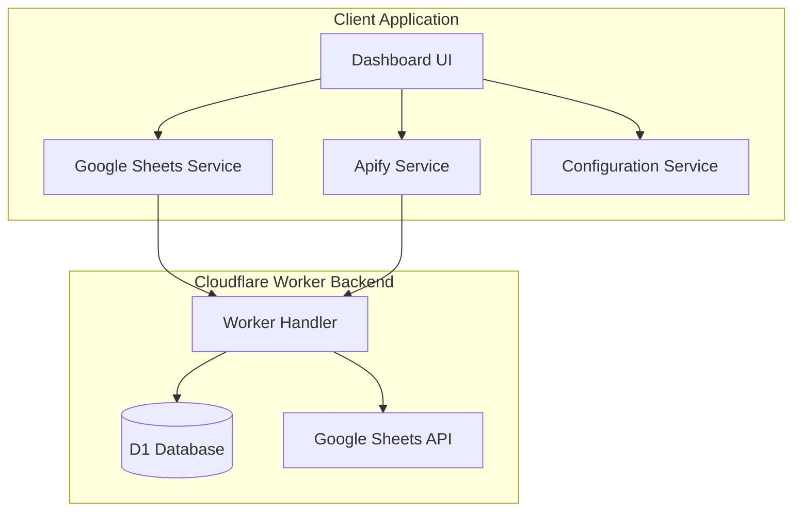
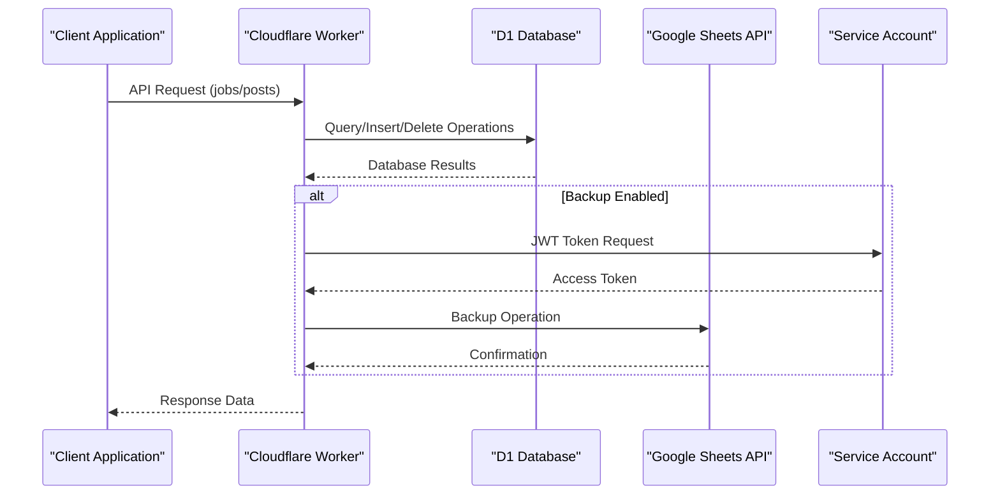
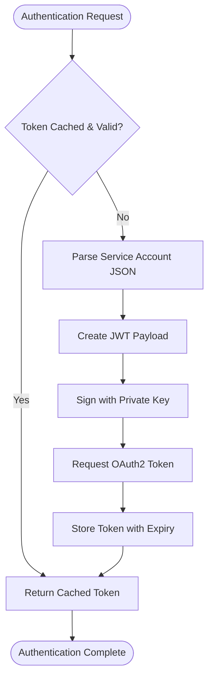
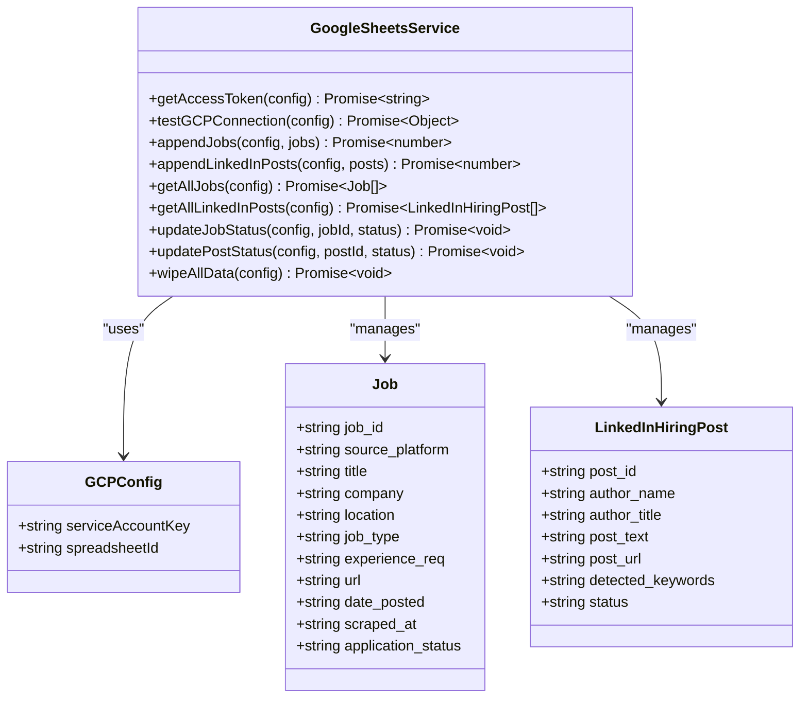
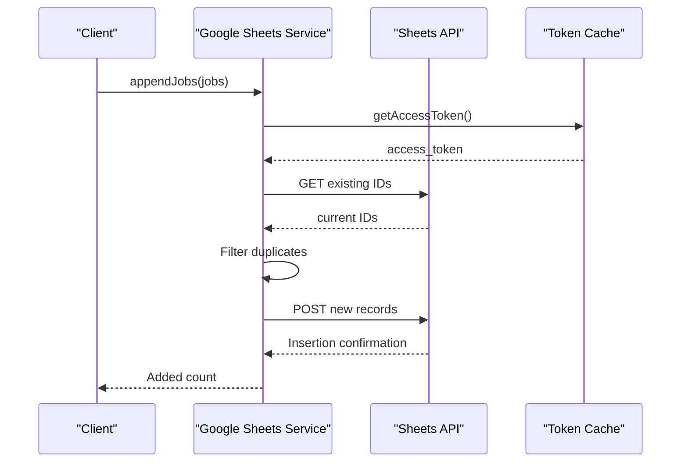
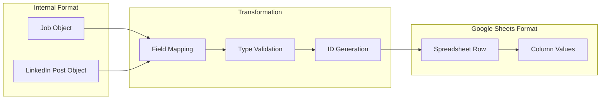
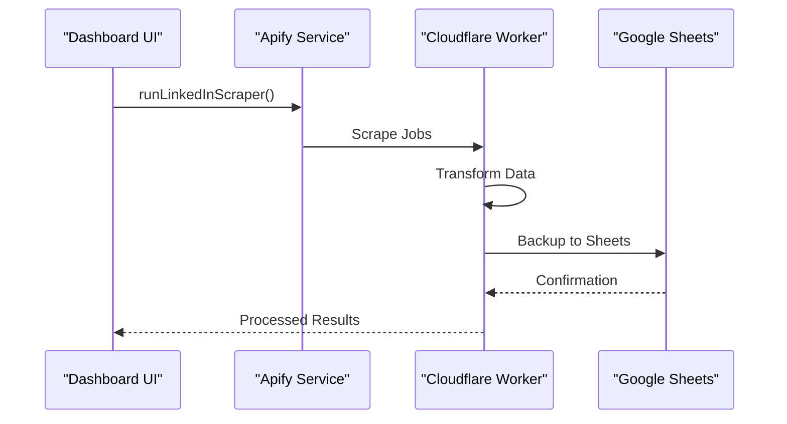
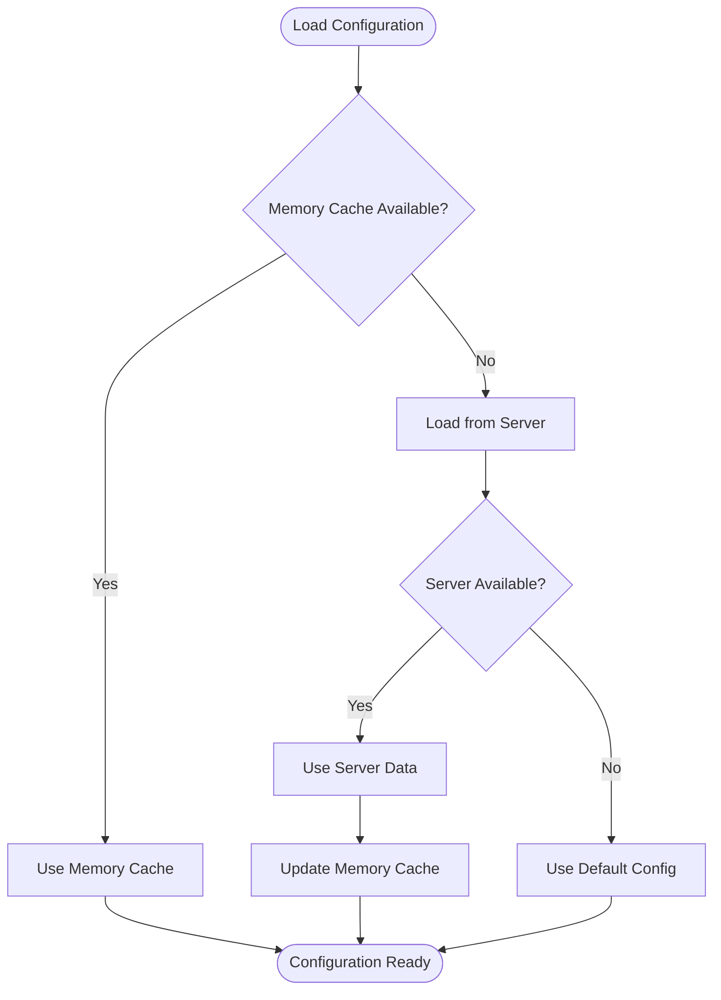
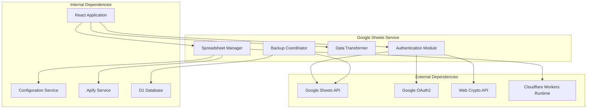

# Google Sheets Service

<cite>
**Referenced Files in This Document**
- [google-sheets.ts](file://src/services/google-sheets.ts)
- [apify.ts](file://src/services/apify.ts)
- [config.ts](file://src/services/config.ts)
- [index.ts](file://src/App.tsx)
- [main.tsx](file://src/main.tsx)
- [index.ts](file://worker/index.ts)
- [index.ts](file://src/components/dashboard/config-tab.tsx)
- [index.ts](file://src/types/index.ts)
</cite>

## Table of Contents
1. [Introduction](#introduction)
2. [Project Structure](#project-structure)
3. [Core Components](#core-components)
4. [Architecture Overview](#architecture-overview)
5. [Detailed Component Analysis](#detailed-component-analysis)
6. [Dependency Analysis](#dependency-analysis)
7. [Performance Considerations](#performance-considerations)
8. [Troubleshooting Guide](#troubleshooting-guide)
9. [Conclusion](#conclusion)

## Introduction
This document provides comprehensive technical documentation for the Google Sheets service responsible for data persistence and synchronization in the job search dashboard. It covers authentication using service accounts, spreadsheet management operations, data CRUD operations, transformation pipeline from internal formats to Google Sheets structure, conflict resolution strategies, batch operation handling, integration with the Apify service for data ingestion, local storage caching, performance optimization techniques, and error handling for API failures. It also documents service initialization, connection management, and cleanup procedures.

## Project Structure
The Google Sheets service is implemented as a client-side module that communicates with a Cloudflare Worker backend. The client module handles authentication, token caching, and Google Sheets API interactions, while the worker manages primary data storage in D1 and acts as a backup to Google Sheets.

**Diagram sources**
- [google-sheets.ts:93-446](file://src/services/google-sheets.ts#L93-L446)
- [apify.ts:1-677](file://src/services/apify.ts#L1-L677)
- [config.ts:1-166](file://src/services/config.ts#L1-L166)
- [index.ts:1-499](file://worker/index.ts#L1-L499)

**Section sources**
- [google-sheets.ts:1-446](file://src/services/google-sheets.ts#L1-L446)
- [index.ts:1-499](file://worker/index.ts#L1-L499)

## Core Components
The Google Sheets service consists of several key components:

### Authentication Module
Handles OAuth2 token acquisition using JWT assertions with service account credentials. Implements token caching with automatic refresh.

### Spreadsheet Management
Provides functions for:
- Testing spreadsheet connections
- Managing duplicate detection
- Performing CRUD operations
- Batch operations for efficient data transfer

### Data Transformation Pipeline
Converts internal data structures to Google Sheets format and vice versa, ensuring compatibility between the application and spreadsheet storage.

### Integration Layer
Coordinates with Apify services for data ingestion and maintains synchronization with the primary D1 database.

**Section sources**
- [google-sheets.ts:104-152](file://src/services/google-sheets.ts#L104-L152)
- [google-sheets.ts:213-231](file://src/services/google-sheets.ts#L213-L231)
- [google-sheets.ts:254-328](file://src/services/google-sheets.ts#L254-L328)

## Architecture Overview
The system follows a dual-storage architecture with Google Sheets as a backup to the primary D1 database. The Cloudflare Worker serves as the central coordinator, handling API requests, managing data flow between storage systems, and providing a unified interface to the client application.

**Diagram sources**
- [index.ts:206-243](file://worker/index.ts#L206-L243)
- [index.ts:283-309](file://worker/index.ts#L283-L309)
- [google-sheets.ts:104-152](file://src/services/google-sheets.ts#L104-L152)

## Detailed Component Analysis

### Authentication Workflow
The service authenticates using Google Cloud service accounts through JWT assertion flow:

**Diagram sources**
- [google-sheets.ts:104-152](file://src/services/google-sheets.ts#L104-L152)
- [index.ts:48-92](file://worker/index.ts#L48-L92)

The authentication process includes:
- Service account JSON parsing and validation
- JWT payload construction with proper claims
- RS256 signature generation using Web Crypto API
- OAuth2 token exchange with Google OAuth endpoint
- Token caching with automatic refresh logic

**Section sources**
- [google-sheets.ts:104-152](file://src/services/google-sheets.ts#L104-L152)
- [index.ts:48-92](file://worker/index.ts#L48-L92)

### Spreadsheet Management Operations
The service manages two primary spreadsheets with dedicated sheets:

#### Jobs Management (`All_Jobs_Master` sheet)
- **Columns**: job_id, source_platform, title, company, location, job_type, experience_req, url, date_posted, scraped_at, application_status
- **Operations**: Append, Read, Update Status, Bulk Clear
- **Conflict Resolution**: Duplicate detection using job_id lookup

#### LinkedIn Posts Management (`LinkedIn_Hiring_Posts` sheet)
- **Columns**: post_id, author_name, author_title, post_text, post_url, detected_keywords, status
- **Operations**: Append, Read, Update Status, Bulk Clear
- **Conflict Resolution**: Duplicate detection using post_id lookup

**Diagram sources**
- [google-sheets.ts:95-446](file://src/services/google-sheets.ts#L95-L446)
- [index.ts:11-39](file://src/types/index.ts#L11-L39)

**Section sources**
- [google-sheets.ts:233-252](file://src/services/google-sheets.ts#L233-L252)
- [google-sheets.ts:254-328](file://src/services/google-sheets.ts#L254-L328)
- [google-sheets.ts:330-439](file://src/services/google-sheets.ts#L330-L439)

### Data CRUD Operations
The service implements comprehensive CRUD operations with conflict resolution:

#### Create Operations (Append)
- **Duplicate Detection**: Queries existing IDs before insertion
- **Batch Processing**: Groups new records for efficient insertion
- **Validation**: Ensures non-empty arrays before processing

#### Read Operations
- **Structured Retrieval**: Maps spreadsheet rows to typed objects
- **Default Values**: Provides fallback values for missing data
- **Range Specification**: Uses specific cell ranges for optimal performance

#### Update Operations
- **Row Location**: Finds target row by ID lookup
- **Column Updates**: Updates specific columns without affecting others
- **Error Handling**: Throws descriptive errors for missing records

**Diagram sources**
- [google-sheets.ts:254-292](file://src/services/google-sheets.ts#L254-L292)
- [google-sheets.ts:233-242](file://src/services/google-sheets.ts#L233-L242)

**Section sources**
- [google-sheets.ts:254-292](file://src/services/google-sheets.ts#L254-L292)
- [google-sheets.ts:330-370](file://src/services/google-sheets.ts#L330-L370)
- [google-sheets.ts:372-405](file://src/services/google-sheets.ts#L372-L405)

### Data Transformation Pipeline
The service transforms data between internal formats and Google Sheets structure:

#### Internal to Google Sheets Transformation
- **Job Objects**: Maps to 11-column format with proper typing
- **LinkedIn Posts**: Maps to 7-column format with keyword extraction
- **ID Generation**: Creates unique identifiers for deduplication

#### Google Sheets to Internal Transformation
- **Row Mapping**: Converts spreadsheet rows to typed objects
- **Type Coercion**: Ensures proper data types for each field
- **Default Fallbacks**: Provides sensible defaults for missing values

**Diagram sources**
- [google-sheets.ts:263-275](file://src/services/google-sheets.ts#L263-L275)
- [google-sheets.ts:303-311](file://src/services/google-sheets.ts#L303-L311)

**Section sources**
- [google-sheets.ts:263-275](file://src/services/google-sheets.ts#L263-L275)
- [google-sheets.ts:303-311](file://src/services/google-sheets.ts#L303-L311)
- [google-sheets.ts:338-350](file://src/services/google-sheets.ts#L338-L350)
- [google-sheets.ts:361-369](file://src/services/google-sheets.ts#L361-L369)

### Integration with Apify Service
The Google Sheets service integrates with Apify for automated data ingestion:

#### Scraping Coordination
- **Actor Execution**: Triggers Apify actors for job and post collection
- **Data Normalization**: Transforms diverse scraper outputs to unified format
- **Error Propagation**: Maintains error context from scraping operations

#### Data Export Process
- **Transformation**: Converts Apify items to internal job/post objects
- **Batch Insertion**: Efficiently inserts transformed data into storage
- **Backup Synchronization**: Ensures Google Sheets reflects latest data

**Diagram sources**
- [apify.ts:66-95](file://src/services/apify.ts#L66-L95)
- [apify.ts:283-300](file://src/services/apify.ts#L283-L300)
- [index.ts:233-236](file://worker/index.ts#L233-L236)

**Section sources**
- [apify.ts:66-95](file://src/services/apify.ts#L66-L95)
- [apify.ts:283-300](file://src/services/apify.ts#L283-L300)
- [index.ts:233-236](file://worker/index.ts#L233-L236)

### Local Storage Caching
The configuration service implements multi-layer caching:

#### Memory Cache
- **Application Scope**: Keeps configuration in memory during session
- **Automatic Refresh**: Clears cache on configuration changes
- **Fallback Mechanism**: Returns defaults when server unavailable

#### Browser Storage
- **Persistence**: Stores configuration in localStorage
- **Security**: Masks sensitive API tokens in UI
- **Recovery**: Restores configuration after page reload

**Diagram sources**
- [config.ts:24-55](file://src/services/config.ts#L24-L55)
- [config.ts:126-147](file://src/services/config.ts#L126-L147)

**Section sources**
- [config.ts:24-55](file://src/services/config.ts#L24-L55)
- [config.ts:126-147](file://src/services/config.ts#L126-L147)

## Dependency Analysis
The Google Sheets service has the following key dependencies:

**Diagram sources**
- [google-sheets.ts:95-99](file://src/services/google-sheets.ts#L95-L99)
- [index.ts:6-12](file://worker/index.ts#L6-L12)

**Section sources**
- [google-sheets.ts:95-99](file://src/services/google-sheets.ts#L95-L99)
- [index.ts:6-12](file://worker/index.ts#L6-L12)

## Performance Considerations
The service implements several optimization strategies:

### Token Management
- **Caching Strategy**: Prevents frequent OAuth2 token requests
- **Expiry Handling**: Refreshes tokens before expiration
- **Concurrent Requests**: Handles simultaneous authentication requests

### Data Operations
- **Batch Processing**: Groups multiple operations for efficiency
- **Duplicate Prevention**: Reduces unnecessary write operations
- **Selective Updates**: Updates only changed columns

### Network Optimization
- **Connection Reuse**: Reuses HTTP connections where possible
- **Error Recovery**: Implements retry logic for transient failures
- **Timeout Management**: Sets appropriate timeouts for API calls

## Troubleshooting Guide

### Common Authentication Issues
- **Invalid Service Account JSON**: Verify JSON structure and completeness
- **Missing Private Key**: Ensure private_key field exists in service account
- **Token Expiration**: Check token expiry and refresh mechanism
- **Scope Permissions**: Verify spreadsheet access permissions

### Spreadsheet Access Problems
- **Invalid Spreadsheet ID**: Confirm spreadsheet URL contains valid ID
- **Sheet Not Found**: Verify sheet names match expected values
- **Permission Denied**: Check user has edit access to spreadsheet
- **Rate Limiting**: Implement exponential backoff for API limits

### Data Synchronization Issues
- **Duplicate Records**: Verify ID generation and lookup mechanisms
- **Schema Mismatch**: Ensure column order matches expected format
- **Data Type Errors**: Validate data types before insertion
- **Backup Failures**: Monitor backup operations separately from primary storage

**Section sources**
- [google-sheets.ts:110-114](file://src/services/google-sheets.ts#L110-L114)
- [google-sheets.ts:128-131](file://src/services/google-sheets.ts#L128-L131)
- [google-sheets.ts:196-211](file://src/services/google-sheets.ts#L196-L211)

## Conclusion
The Google Sheets service provides a robust, production-ready solution for data persistence and synchronization in the job search dashboard. Its architecture balances reliability with performance through intelligent caching, efficient batch operations, and comprehensive error handling. The dual-storage approach ensures data redundancy while maintaining optimal performance characteristics. The service's modular design facilitates maintenance and extension, making it suitable for continued evolution as requirements change.