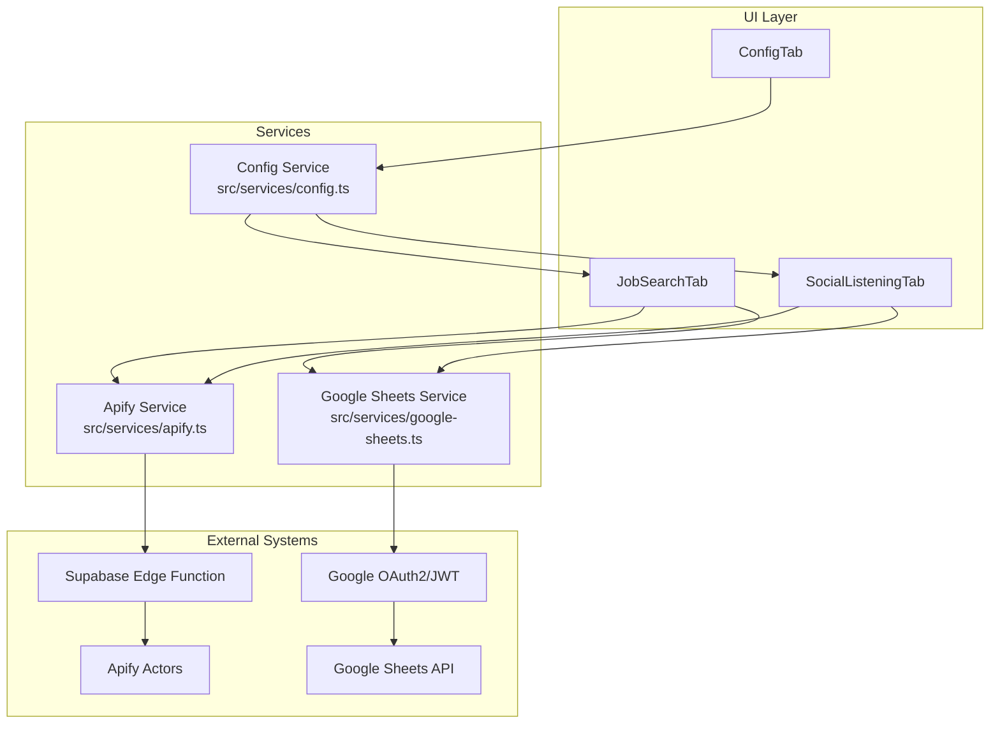
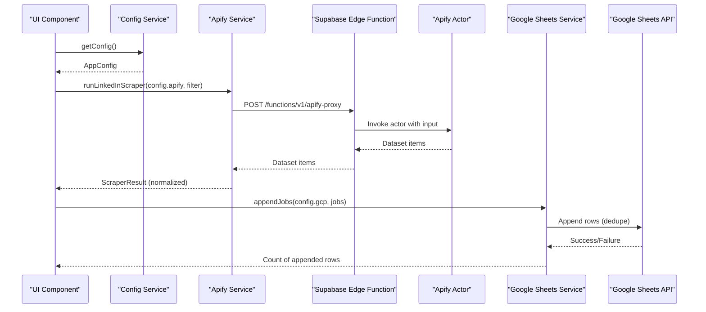
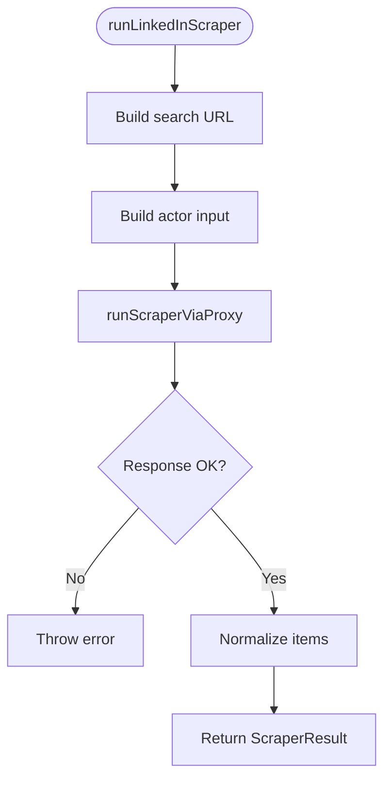
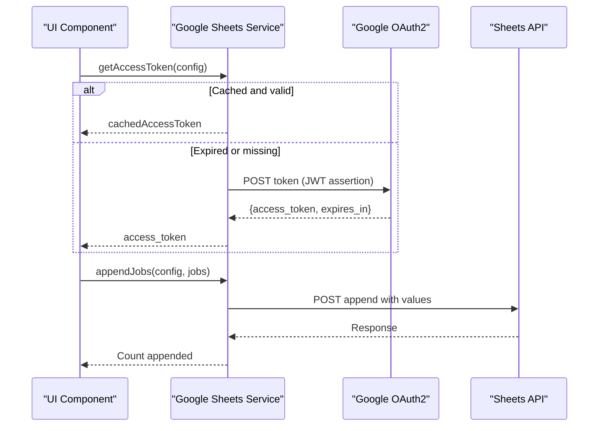
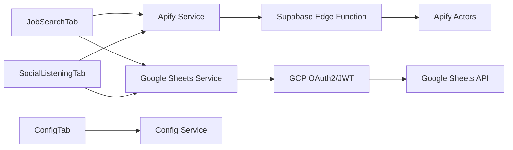

# Service Layer

<cite>
**Referenced Files in This Document**
- [apify.ts](file://src/services/apify.ts)
- [google-sheets.ts](file://src/services/google-sheets.ts)
- [config.ts](file://src/services/config.ts)
- [index.ts](file://src/types/index.ts)
- [job-search-tab.tsx](file://src/components/dashboard/job-search-tab.tsx)
- [social-listening-tab.tsx](file://src/components/dashboard/social-listening-tab.tsx)
- [config-tab.tsx](file://src/components/dashboard/config-tab.tsx)
- [App.tsx](file://src/App.tsx)
</cite>

## Table of Contents
1. [Introduction](#introduction)
2. [Project Structure](#project-structure)
3. [Core Components](#core-components)
4. [Architecture Overview](#architecture-overview)
5. [Detailed Component Analysis](#detailed-component-analysis)
6. [Dependency Analysis](#dependency-analysis)
7. [Performance Considerations](#performance-considerations)
8. [Troubleshooting Guide](#troubleshooting-guide)
9. [Conclusion](#conclusion)
10. [Appendices](#appendices)

## Introduction
This document explains the service layer architecture for the job search dashboard, focusing on three core services:
- Apify service: orchestrates web scraping via Apify actors through a Supabase Edge Function proxy, normalizes results, and transforms them into unified data models.
- Google Sheets service: persists job and LinkedIn hiring post data to Google Sheets using Google Cloud Platform credentials, with deduplication and status updates.
- Configuration service: manages secure local storage of API tokens and credentials, default configurations, and migration support.

It covers service interfaces, method signatures, error handling, rate limiting considerations, integration patterns with the UI, and practical troubleshooting steps.

## Project Structure
The service layer resides under src/services and is consumed by React components under src/components/dashboard. Types are centralized in src/types.

**Diagram sources**
- [apify.ts:1-348](file://src/services/apify.ts#L1-L348)
- [google-sheets.ts:1-354](file://src/services/google-sheets.ts#L1-L354)
- [config.ts:1-66](file://src/services/config.ts#L1-L66)
- [job-search-tab.tsx:1-523](file://src/components/dashboard/job-search-tab.tsx#L1-L523)
- [social-listening-tab.tsx:1-276](file://src/components/dashboard/social-listening-tab.tsx#L1-L276)
- [config-tab.tsx:1-305](file://src/components/dashboard/config-tab.tsx#L1-L305)

**Section sources**
- [apify.ts:1-348](file://src/services/apify.ts#L1-L348)
- [google-sheets.ts:1-354](file://src/services/google-sheets.ts#L1-L354)
- [config.ts:1-66](file://src/services/config.ts#L1-L66)
- [job-search-tab.tsx:1-523](file://src/components/dashboard/job-search-tab.tsx#L1-L523)
- [social-listening-tab.tsx:1-276](file://src/components/dashboard/social-listening-tab.tsx#L1-L276)
- [config-tab.tsx:1-305](file://src/components/dashboard/config-tab.tsx#L1-L305)
- [App.tsx:1-67](file://src/App.tsx#L1-L67)

## Core Components
- Apify Service
  - Exposes connection testing, platform-specific scrapers, normalization, and transformation helpers.
  - Uses a Supabase Edge Function proxy to call Apify actors securely.
  - Normalizes heterogeneous actor outputs into a unified model and generates deterministic IDs.
- Google Sheets Service
  - Authenticates via JWT-based OAuth2 flow using a GCP service account key.
  - Provides CRUD-like operations for jobs and LinkedIn posts, including deduplication and status updates.
  - Implements caching for access tokens and handles token expiration.
- Configuration Service
  - Reads/writes configuration to/from localStorage with defaults and partial updates.
  - Supports clearing configuration and migrating from legacy structures.

**Section sources**
- [apify.ts:25-348](file://src/services/apify.ts#L25-L348)
- [google-sheets.ts:12-354](file://src/services/google-sheets.ts#L12-L354)
- [config.ts:26-66](file://src/services/config.ts#L26-L66)

## Architecture Overview
The services integrate with UI components through straightforward function calls. The Apify service proxies requests to Apify actors via Supabase, while the Google Sheets service authenticates with GCP and interacts with the Sheets API. Configuration is persisted locally and shared across services.

**Diagram sources**
- [apify.ts:59-113](file://src/services/apify.ts#L59-L113)
- [google-sheets.ts:162-200](file://src/services/google-sheets.ts#L162-L200)
- [job-search-tab.tsx:160-230](file://src/components/dashboard/job-search-tab.tsx#L160-L230)

## Detailed Component Analysis

### Apify Service
Responsibilities:
- Proxy calls to Apify actors via Supabase Edge Function.
- Normalize diverse actor outputs into a unified dataset item model.
- Transform dataset items into domain models (Job, LinkedInHiringPost).
- Generate deterministic IDs for jobs and posts.
- Provide connection testing and boolean query building for social listening.

Key methods and interfaces:
- testApifyConnection(apiToken): Promise<{ success: boolean; error?: string }>
- runLinkedInScraper(config, filter): Promise<ScraperResult>
- runIndeedScraper(config, filter): Promise<ScraperResult>
- runNaukriScraper(config, filter): Promise<ScraperResult>
- runGlassdoorScraper(config, filter): Promise<ScraperResult>
- runInternshalaScraper(config, filter): Promise<ScraperResult>
- runWellfoundScraper(config, filter): Promise<ScraperResult>
- runFounditScraper(config, filter): Promise<ScraperResult>
- runHiristScraper(config, filter): Promise<ScraperResult>
- runShineScraper(config, filter): Promise<ScraperResult>
- runLinkedInPostScraper(config, searchQuery): Promise<ApifyDatasetItem[]>
- transformApifyItemToJob(item, platform): Job
- transformApifyItemToLinkedInPost(item): LinkedInHiringPost
- buildBooleanSearchQuery(userInput): string

Processing logic highlights:
- runScraperViaProxy encapsulates the Supabase proxy call, throws on non-OK responses.
- normalizeItems and platform-specific mappers ensure consistent fields across actors.
- generateJobId and generatePostId create stable identifiers from normalized fields.
- buildBooleanSearchQuery constructs a boolean query for LinkedIn post scraping.

Error handling:
- Methods return structured errors or throw exceptions with messages extracted from HTTP responses or caught exceptions.

Rate limiting and timeouts:
- The proxy call sets a 300-second timeout to accommodate long-running scrapers.

Integration examples:
- JobSearchTab triggers scrapers per platform and appends results to Google Sheets when configured.
- SocialListeningTab builds a boolean query and scrapes LinkedIn posts.

**Diagram sources**
- [apify.ts:84-113](file://src/services/apify.ts#L84-L113)

**Section sources**
- [apify.ts:25-348](file://src/services/apify.ts#L25-L348)
- [job-search-tab.tsx:160-230](file://src/components/dashboard/job-search-tab.tsx#L160-L230)
- [social-listening-tab.tsx:62-95](file://src/components/dashboard/social-listening-tab.tsx#L62-L95)

### Google Sheets Service
Responsibilities:
- Authenticate via JWT assertion against Google OAuth2 token endpoint using a GCP service account key.
- Cache access tokens with expiry and reuse until near-expiry.
- Deduplicate writes by checking existing IDs in target sheets.
- Append rows to sheets and read back data for display.
- Update statuses for jobs and posts by locating rows by ID.

Key methods and interfaces:
- testGCPConnection(config): Promise<{ success: boolean; error?: string }>
- getExistingJobIds(config): Promise<Set<string>>
- getExistingPostIds(config): Promise<Set<string>>
- appendJobs(config, jobs): Promise<number>
- appendLinkedInPosts(config, posts): Promise<number>
- getAllJobs(config): Promise<Job[]>
- getAllLinkedInPosts(config): Promise<LinkedInHiringPost[]>
- updateJobStatus(config, jobId, status): Promise<void>
- updatePostStatus(config, postId, status): Promise<void>
- wipeAllData(config): Promise<void>

Processing logic highlights:
- getAccessToken parses the service account JSON, signs a JWT, exchanges it for an access token, caches it, and returns it.
- sheetsFetch centralizes request construction with bearer token and JSON headers.
- Deduplication checks existing IDs before appending new rows.
- Status updates locate rows by ID and PUT updates to the appropriate column.

Error handling:
- Methods throw descriptive errors when responses are not OK, parsing JSON error bodies when available.

Performance optimization:
- Token caching reduces repeated OAuth exchanges.
- Deduplication prevents redundant writes.
- Batched append operations minimize round-trips.

**Diagram sources**
- [google-sheets.ts:12-60](file://src/services/google-sheets.ts#L12-L60)
- [google-sheets.ts:162-200](file://src/services/google-sheets.ts#L162-L200)

**Section sources**
- [google-sheets.ts:104-354](file://src/services/google-sheets.ts#L104-L354)
- [job-search-tab.tsx:90-104](file://src/components/dashboard/job-search-tab.tsx#L90-L104)
- [social-listening-tab.tsx:46-60](file://src/components/dashboard/social-listening-tab.tsx#L46-L60)

### Configuration Service
Responsibilities:
- Load and merge default configurations with user-provided values from localStorage.
- Save and update Apify and GCP configurations atomically.
- Clear stored configuration.

Key methods and interfaces:
- getConfig(): AppConfig
- saveConfig(config): void
- updateApifyConfig(updates): ApifyConfig
- updateGCPConfig(updates): GCPConfig
- clearConfig(): void

Processing logic highlights:
- getConfig merges defaults with stored values, falling back to defaults on parse failure.
- updateApifyConfig/updateGCPConfig compute new configs and persist them.
- clearConfig removes the stored key.

Security considerations:
- Credentials are stored in localStorage; treat as sensitive. Prefer server-side storage or encrypted vaults in production.

Migration support:
- Defaults ensure new fields are populated automatically when upgrading.

**Section sources**
- [config.ts:26-66](file://src/services/config.ts#L26-L66)
- [config-tab.tsx:28-100](file://src/components/dashboard/config-tab.tsx#L28-L100)

## Dependency Analysis
- UI components depend on services for orchestration and persistence.
- Apify service depends on Supabase Edge Function and Apify actors.
- Google Sheets service depends on GCP OAuth and Sheets API.
- Configuration service is a pure localStorage abstraction used by all services.

**Diagram sources**
- [job-search-tab.tsx:29-31](file://src/components/dashboard/job-search-tab.tsx#L29-L31)
- [social-listening-tab.tsx:20-22](file://src/components/dashboard/social-listening-tab.tsx#L20-L22)
- [config-tab.tsx:23-26](file://src/components/dashboard/config-tab.tsx#L23-L26)
- [apify.ts:13-14](file://src/services/apify.ts#L13-L14)
- [google-sheets.ts:5-10](file://src/services/google-sheets.ts#L5-L10)

**Section sources**
- [job-search-tab.tsx:1-523](file://src/components/dashboard/job-search-tab.tsx#L1-L523)
- [social-listening-tab.tsx:1-276](file://src/components/dashboard/social-listening-tab.tsx#L1-L276)
- [config-tab.tsx:1-305](file://src/components/dashboard/config-tab.tsx#L1-L305)
- [apify.ts:1-348](file://src/services/apify.ts#L1-L348)
- [google-sheets.ts:1-354](file://src/services/google-sheets.ts#L1-L354)
- [config.ts:1-66](file://src/services/config.ts#L1-L66)

## Performance Considerations
- Token caching: The Google Sheets service caches access tokens and reuses them until close to expiry, reducing OAuth overhead.
- Deduplication: Both job and post append operations check existing IDs to avoid redundant writes.
- Batch appends: Using append operations minimizes multiple write calls.
- Timeout tuning: The Apify proxy call sets a generous timeout to handle long-running scrapers.
- UI responsiveness: Scraping loops in the UI disable buttons and show loading states to prevent concurrent operations.

[No sources needed since this section provides general guidance]

## Troubleshooting Guide
Common issues and resolutions:
- Apify connection failures
  - Verify API token and actor IDs in configuration.
  - Use testApifyConnection to validate connectivity.
  - Check network access to Supabase Edge Function.
- Google Sheets authentication failures
  - Ensure service account JSON is valid and contains private_key.
  - Confirm spreadsheetId is correct and the service account has editor access.
  - Use testGCPConnection to validate access.
- Duplicate entries in Google Sheets
  - Deduplication relies on IDs; ensure IDs are stable and unique.
  - If duplicates appear, inspect the ID generation logic and dataset normalization.
- Status updates fail
  - Ensure the target sheet and column indices match expectations.
  - Verify the job/post exists by ID before attempting updates.
- UI not reflecting data
  - Confirm GCP configuration is present before loading data.
  - Trigger refresh actions in the UI to reload from Sheets.

**Section sources**
- [apify.ts:25-42](file://src/services/apify.ts#L25-L42)
- [google-sheets.ts:104-119](file://src/services/google-sheets.ts#L104-L119)
- [job-search-tab.tsx:90-104](file://src/components/dashboard/job-search-tab.tsx#L90-L104)
- [social-listening-tab.tsx:46-60](file://src/components/dashboard/social-listening-tab.tsx#L46-L60)

## Conclusion
The service layer cleanly separates concerns:
- Apify service encapsulates scraping orchestration and data normalization.
- Google Sheets service handles secure authentication and efficient persistence with deduplication.
- Configuration service provides a simple, resilient way to manage credentials and defaults.

The UI integrates these services through straightforward function calls, enabling robust job and social listening workflows.

[No sources needed since this section summarizes without analyzing specific files]

## Appendices

### Service Interfaces and Method Signatures
- Apify Service
  - testApifyConnection(apiToken): Promise<{ success: boolean; error?: string }>
  - runLinkedInScraper(config, filter): Promise<ScraperResult>
  - runIndeedScraper(config, filter): Promise<ScraperResult>
  - runNaukriScraper(config, filter): Promise<ScraperResult>
  - runGlassdoorScraper(config, filter): Promise<ScraperResult>
  - runInternshalaScraper(config, filter): Promise<ScraperResult>
  - runWellfoundScraper(config, filter): Promise<ScraperResult>
  - runFounditScraper(config, filter): Promise<ScraperResult>
  - runHiristScraper(config, filter): Promise<ScraperResult>
  - runShineScraper(config, filter): Promise<ScraperResult>
  - runLinkedInPostScraper(config, searchQuery): Promise<ApifyDatasetItem[]>
  - transformApifyItemToJob(item, platform): Job
  - transformApifyItemToLinkedInPost(item): LinkedInHiringPost
  - buildBooleanSearchQuery(userInput): string

- Google Sheets Service
  - testGCPConnection(config): Promise<{ success: boolean; error?: string }>
  - getExistingJobIds(config): Promise<Set<string>>
  - getExistingPostIds(config): Promise<Set<string>>
  - appendJobs(config, jobs): Promise<number>
  - appendLinkedInPosts(config, posts): Promise<number>
  - getAllJobs(config): Promise<Job[]>
  - getAllLinkedInPosts(config): Promise<LinkedInHiringPost[]>
  - updateJobStatus(config, jobId, status): Promise<void>
  - updatePostStatus(config, postId, status): Promise<void>
  - wipeAllData(config): Promise<void>

- Configuration Service
  - getConfig(): AppConfig
  - saveConfig(config): void
  - updateApifyConfig(updates): ApifyConfig
  - updateGCPConfig(updates): GCPConfig
  - clearConfig(): void

**Section sources**
- [apify.ts:25-348](file://src/services/apify.ts#L25-L348)
- [google-sheets.ts:104-354](file://src/services/google-sheets.ts#L104-L354)
- [config.ts:26-66](file://src/services/config.ts#L26-L66)

### Data Models
- Job: job_id, source_platform, title, company, location, job_type, experience_req, url, date_posted, scraped_at, application_status
- LinkedInHiringPost: post_id, author_name, author_title, post_text, post_url, detected_keywords, status
- ApifyDatasetItem: flexible fields normalized to common shape
- AppConfig: apify (ApifyConfig), gcp (GCPConfig)

**Section sources**
- [index.ts:11-39](file://src/types/index.ts#L11-L39)
- [index.ts:69-91](file://src/types/index.ts#L69-L91)
- [index.ts:119-145](file://src/types/index.ts#L119-L145)

### Integration Examples
- Job Search Tab
  - Builds filters, triggers platform scrapers, transforms results, and appends to Google Sheets when configured.
- Social Listening Tab
  - Builds boolean queries, scrapes LinkedIn posts, and appends to Google Sheets.
- Configuration Tab
  - Tests connections, saves credentials, and wipes data.

**Section sources**
- [job-search-tab.tsx:160-230](file://src/components/dashboard/job-search-tab.tsx#L160-L230)
- [social-listening-tab.tsx:62-95](file://src/components/dashboard/social-listening-tab.tsx#L62-L95)
- [config-tab.tsx:43-89](file://src/components/dashboard/config-tab.tsx#L43-L89)

### Testing Strategies
- Unit-level
  - Mock fetch responses for Apify proxy and Google Sheets endpoints.
  - Validate normalization and ID generation logic.
- Integration-level
  - Use testApifyConnection and testGCPConnection to verify external connectivity.
  - End-to-end flows: scrape -> transform -> append -> read back.
- UI-level
  - Simulate user interactions to trigger scrapers and status updates.
  - Observe toast notifications and UI state transitions.

[No sources needed since this section provides general guidance]

### Service Lifecycle and Dependency Injection Patterns
- Services are pure functions/modules with no constructor/state.
- UI components import and call services directly.
- Configuration is injected via getConfig() and passed into service calls.
- No explicit DI container is used; services are imported and used as needed.

**Section sources**
- [apify.ts:1-348](file://src/services/apify.ts#L1-L348)
- [google-sheets.ts:1-354](file://src/services/google-sheets.ts#L1-L354)
- [config.ts:1-66](file://src/services/config.ts#L1-L66)
- [job-search-tab.tsx:160-230](file://src/components/dashboard/job-search-tab.tsx#L160-L230)
- [social-listening-tab.tsx:62-95](file://src/components/dashboard/social-listening-tab.tsx#L62-L95)
- [config-tab.tsx:28-100](file://src/components/dashboard/config-tab.tsx#L28-L100)