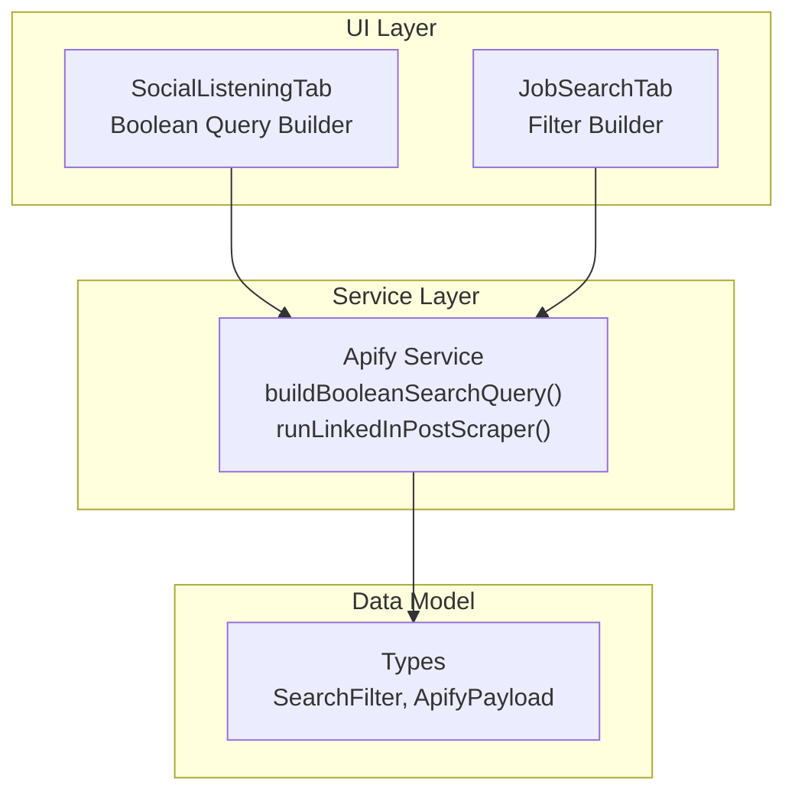
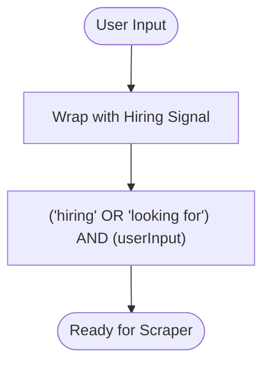
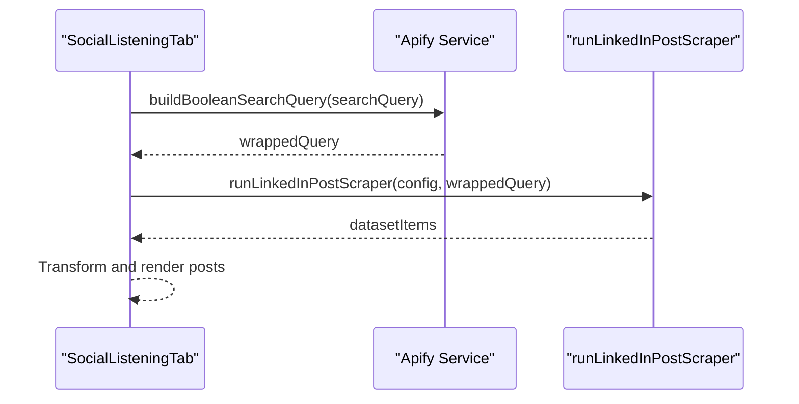
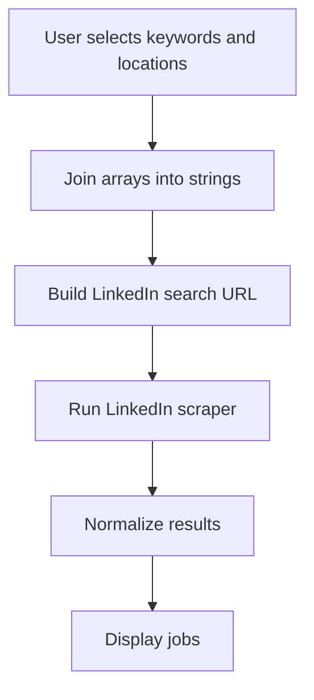
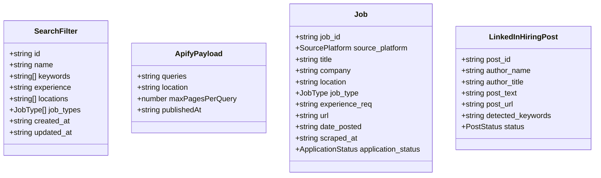
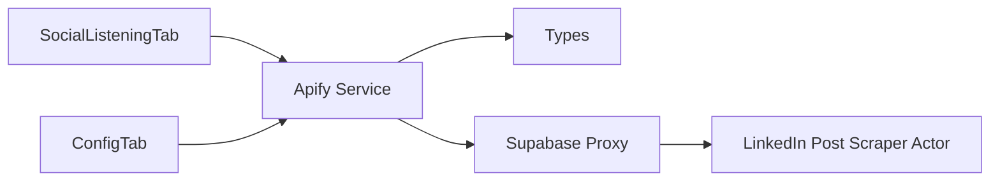

# Boolean Query Builder

<cite>
**Referenced Files in This Document**
- [apify.ts](file://src/services/apify.ts)
- [social-listening-tab.tsx](file://src/components/dashboard/social-listening-tab.tsx)
- [job-search-tab.tsx](file://src/components/dashboard/job-search-tab.tsx)
- [config-tab.tsx](file://src/components/dashboard/config-tab.tsx)
- [index.ts](file://src/types/index.ts)
</cite>

## Table of Contents
1. [Introduction](#introduction)
2. [Project Structure](#project-structure)
3. [Core Components](#core-components)
4. [Architecture Overview](#architecture-overview)
5. [Detailed Component Analysis](#detailed-component-analysis)
6. [Dependency Analysis](#dependency-analysis)
7. [Performance Considerations](#performance-considerations)
8. [Troubleshooting Guide](#troubleshooting-guide)
9. [Conclusion](#conclusion)

## Introduction
This document explains the boolean query builder interface used to construct LinkedIn search queries within the job search dashboard. It covers the syntax and operators (AND, OR, NOT, parentheses), how to combine keywords, job titles, locations, and company names effectively, the preset query system, common search patterns, best practices for query optimization, and troubleshooting guidance. It also describes how the boolean query is processed and executed against LinkedIn’s search algorithm.

## Project Structure
The boolean query builder spans several components:
- A shared service that constructs and executes boolean queries for LinkedIn posts
- A social listening tab that exposes a UI for building and testing boolean queries
- A job search tab that demonstrates how filters are combined into search parameters
- Type definitions that standardize the data model for queries and results



**Diagram sources**
- [social-listening-tab.tsx:1-276](file://src/components/dashboard/social-listening-tab.tsx#L1-L276)
- [job-search-tab.tsx:1-523](file://src/components/dashboard/job-search-tab.tsx#L1-L523)
- [apify.ts:288-347](file://src/services/apify.ts#L288-L347)
- [index.ts:45-63](file://src/types/index.ts#L45-L63)

**Section sources**
- [social-listening-tab.tsx:1-276](file://src/components/dashboard/social-listening-tab.tsx#L1-L276)
- [job-search-tab.tsx:1-523](file://src/components/dashboard/job-search-tab.tsx#L1-L523)
- [apify.ts:288-347](file://src/services/apify.ts#L288-L347)
- [index.ts:45-63](file://src/types/index.ts#L45-L63)

## Core Components
- Boolean query builder: A function that wraps user-provided boolean logic with a mandatory hiring signal to improve relevance.
- Social listening tab: Provides a UI to compose, preview, and execute boolean queries for LinkedIn posts.
- Job search tab: Demonstrates how keyword and location filters are combined for job board searches.
- Types: Defines the shape of filters and payloads used across the system.

Key responsibilities:
- Constructing a robust base query that prioritizes hiring-related signals
- Exposing presets for common scenarios
- Normalizing and transforming scraped results into a unified format

**Section sources**
- [apify.ts:345-347](file://src/services/apify.ts#L345-L347)
- [social-listening-tab.tsx:24-28](file://src/components/dashboard/social-listening-tab.tsx#L24-L28)
- [job-search-tab.tsx:79-84](file://src/components/dashboard/job-search-tab.tsx#L79-L84)
- [index.ts:45-63](file://src/types/index.ts#L45-L63)

## Architecture Overview
The boolean query builder integrates with the Apify scraping pipeline to target LinkedIn posts. The process:
1. The user composes a boolean query in the Social Listening tab.
2. The query is wrapped with a hiring signal using the service function.
3. The wrapped query is sent to the LinkedIn post scraper actor via the proxy endpoint.
4. Scraped results are normalized and displayed in the feed.

```mermaid
sequenceDiagram
participant User as "User"
participant SLT as "SocialListeningTab"
participant Service as "Apify Service"
participant Proxy as "Supabase Proxy"
participant Actor as "LinkedIn Post Scraper Actor"
participant Sheet as "Google Sheets"
User->>SLT : Compose boolean query
SLT->>Service : buildBooleanSearchQuery(query)
Service-->>SLT : Wrapped query
SLT->>Service : runLinkedInPostScraper(wrappedQuery)
Service->>Proxy : POST /apify-proxy
Proxy->>Actor : Execute searchQueries
Actor-->>Proxy : Dataset items
Proxy-->>Service : Dataset items
Service-->>SLT : Normalized posts
SLT->>Sheet : Append posts (optional)
SLT-->>User : Display posts
```

**Diagram sources**
- [social-listening-tab.tsx:62-95](file://src/components/dashboard/social-listening-tab.tsx#L62-L95)
- [apify.ts:288-299](file://src/services/apify.ts#L288-L299)
- [apify.ts:59-81](file://src/services/apify.ts#L59-L81)
- [apify.ts:345-347](file://src/services/apify.ts#L345-L347)

## Detailed Component Analysis

### Boolean Query Builder
The service provides a single function that wraps user input with a hiring signal to bias results toward active hiring conversations.

- Purpose: Ensure queries focus on posts that explicitly mention hiring or looking for talent.
- Behavior: Takes a user-provided boolean expression and prepends a mandatory clause that requires “hiring” or “looking for”.



**Diagram sources**
- [apify.ts:345-347](file://src/services/apify.ts#L345-L347)

**Section sources**
- [apify.ts:345-347](file://src/services/apify.ts#L345-L347)

### Social Listening Tab (Boolean Query Builder UI)
The UI enables composing, previewing, and executing boolean queries for LinkedIn posts.

- Query input: A monospace textarea where users write boolean expressions using AND, OR, NOT, and parentheses.
- Presets: Quick badges pre-populate common patterns for DevOps, tech remote roles, and platform engineering.
- Execution: Wraps the query with the service function and triggers the LinkedIn post scraper actor.



**Diagram sources**
- [social-listening-tab.tsx:62-95](file://src/components/dashboard/social-listening-tab.tsx#L62-L95)
- [apify.ts:288-299](file://src/services/apify.ts#L288-L299)
- [apify.ts:345-347](file://src/services/apify.ts#L345-L347)

**Section sources**
- [social-listening-tab.tsx:138-182](file://src/components/dashboard/social-listening-tab.tsx#L138-L182)
- [social-listening-tab.tsx:24-28](file://src/components/dashboard/social-listening-tab.tsx#L24-L28)
- [apify.ts:288-299](file://src/services/apify.ts#L288-L299)

### Preset Query System
Common patterns are provided as quick presets to accelerate query creation.

- DevOps Hiring: Targets hiring for DevOps and cloud roles.
- Tech Remote: Targets technology roles with remote availability.
- Platform Engineer: Targets infrastructure and platform engineering roles.

These presets demonstrate how to combine multiple terms with OR and include location qualifiers.

**Section sources**
- [social-listening-tab.tsx:24-28](file://src/components/dashboard/social-listening-tab.tsx#L24-L28)

### Job Search Tab (Filter Combination)
While the job search tab focuses on job board searches, it illustrates how keywords and locations are combined for broader search contexts.

- Keyword and location selection: Users add/remove keywords and locations, then trigger scrapers.
- Execution: Converts selected filters into a search URL for LinkedIn jobs.



**Diagram sources**
- [job-search-tab.tsx:79-91](file://src/components/dashboard/job-search-tab.tsx#L79-L91)
- [apify.ts:44-51](file://src/services/apify.ts#L44-L51)
- [apify.ts:84-113](file://src/services/apify.ts#L84-L113)

**Section sources**
- [job-search-tab.tsx:79-91](file://src/components/dashboard/job-search-tab.tsx#L79-L91)
- [apify.ts:44-51](file://src/services/apify.ts#L44-L51)

### Data Model and Types
The types define the structure of filters and payloads used across the system.

- SearchFilter: Encapsulates keywords, locations, job types, and experience level.
- ApifyPayload: Defines the shape for actor inputs (queries, location, pages, time window).
- Job and LinkedInHiringPost: Unified shapes for normalized results.



**Diagram sources**
- [index.ts:45-63](file://src/types/index.ts#L45-L63)
- [index.ts:11-39](file://src/types/index.ts#L11-L39)

**Section sources**
- [index.ts:45-63](file://src/types/index.ts#L45-L63)
- [index.ts:11-39](file://src/types/index.ts#L11-L39)

## Dependency Analysis
The boolean query builder depends on:
- The Apify service for wrapping queries and invoking the LinkedIn post scraper
- The social listening tab for user input and rendering results
- The configuration tab for validating API tokens and actor IDs



**Diagram sources**
- [social-listening-tab.tsx:21-22](file://src/components/dashboard/social-listening-tab.tsx#L21-L22)
- [apify.ts:288-299](file://src/services/apify.ts#L288-L299)
- [config-tab.tsx:28-277](file://src/components/dashboard/config-tab.tsx#L28-L277)

**Section sources**
- [social-listening-tab.tsx:21-22](file://src/components/dashboard/social-listening-tab.tsx#L21-L22)
- [apify.ts:288-299](file://src/services/apify.ts#L288-L299)
- [config-tab.tsx:28-277](file://src/components/dashboard/config-tab.tsx#L28-L277)

## Performance Considerations
- Keep queries concise: Limit the number of OR branches and parentheses nesting to reduce runtime.
- Prefer specific terms: Use precise job titles and technologies to minimize irrelevant results.
- Use location filters: Narrow by city or remote to reduce noise.
- Leverage presets: Start with proven patterns and iterate incrementally.
- Batch execution: Run the scraper once per composed query rather than multiple times to avoid redundant network calls.

## Troubleshooting Guide
Common issues and resolutions:
- Missing API token: Ensure the Apify API token is configured in the Configuration tab. The UI checks for this before scraping.
- Invalid query syntax: Verify AND, OR, NOT, and parentheses are balanced. Use the placeholder examples as templates.
- No results: Add less specific terms or broaden location filters. Try the presets to validate the system.
- Rate limits: Reduce query complexity or frequency. Consider adding NOT clauses to exclude irrelevant terms.
- Data storage: Confirm Google Sheets configuration is present if appending posts; otherwise, results appear locally only.

Operational checks:
- Connection status indicators in the Configuration tab confirm whether Apify and Google Sheets are reachable.
- The Social Listening tab displays loading states and error messages during scraping.

**Section sources**
- [config-tab.tsx:43-89](file://src/components/dashboard/config-tab.tsx#L43-L89)
- [social-listening-tab.tsx:62-95](file://src/components/dashboard/social-listening-tab.tsx#L62-L95)

## Conclusion
The boolean query builder provides a focused, extensible way to target active hiring conversations on LinkedIn. By combining user-defined logic with a mandatory hiring signal, it improves relevance while preserving flexibility. The presets accelerate common workflows, and the UI offers immediate feedback. Following best practices—keeping queries concise, using specific terms, and leveraging presets—helps optimize results and avoid false positives. When troubleshooting, validate credentials, review query syntax, and confirm data storage configuration.