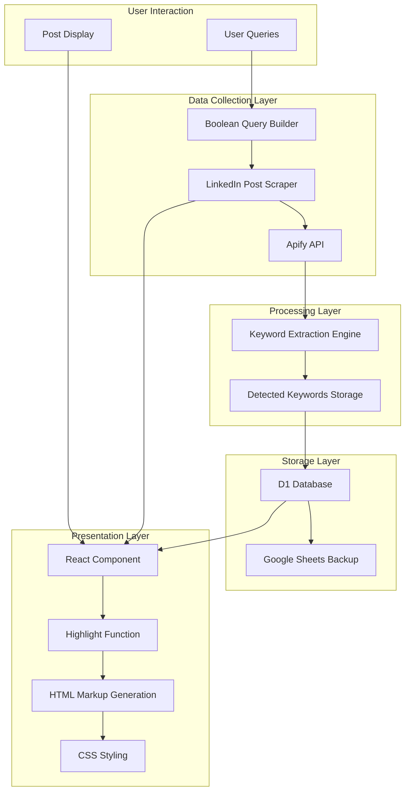
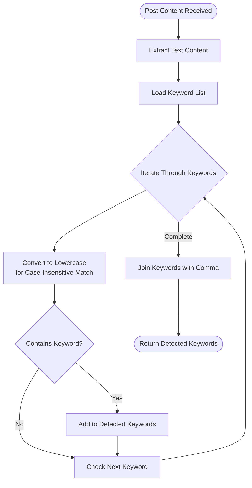
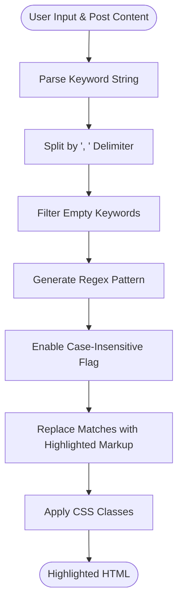
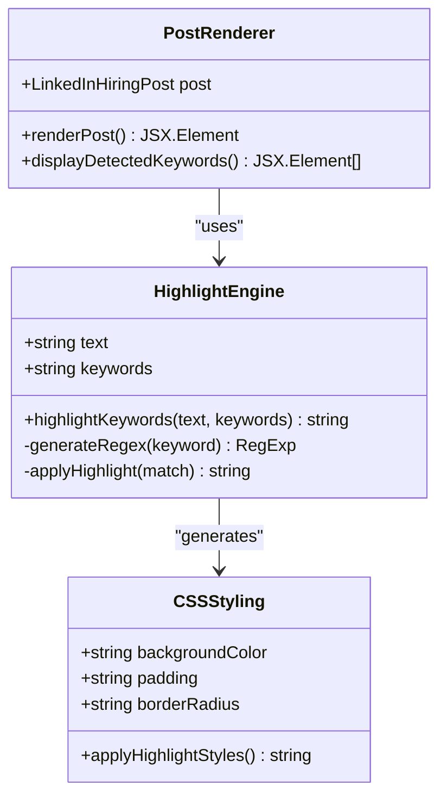
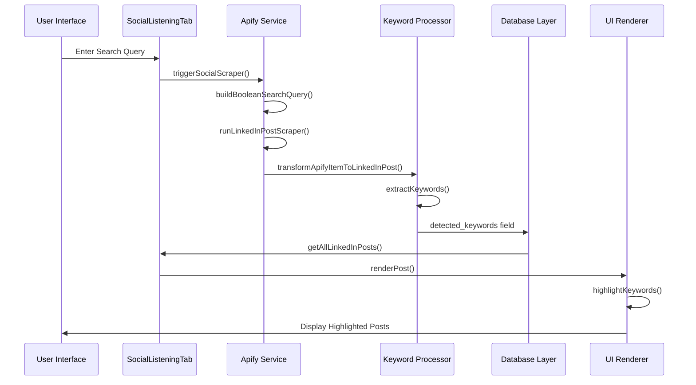
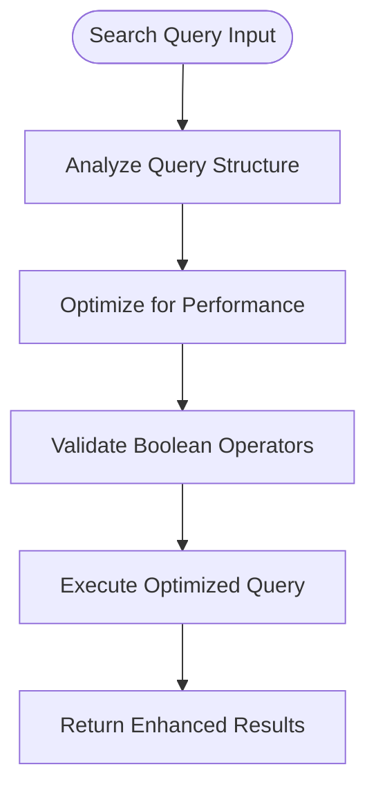

# Keyword Highlighting System

<cite>
**Referenced Files in This Document**
- [social-listening-tab.tsx](file://src/components/dashboard/social-listening-tab.tsx)
- [apify.ts](file://src/services/apify.ts)
- [index.ts](file://src/types/index.ts)
- [google-sheets.ts](file://src/services/google-sheets.ts)
- [index.ts](file://worker/index.ts)
</cite>

## Table of Contents
1. [Introduction](#introduction)
2. [System Architecture](#system-architecture)
3. [Keyword Detection Algorithm](#keyword-detection-algorithm)
4. [UI Rendering and Highlighting](#ui-rendering-and-highlighting)
5. [Integration Flow](#integration-flow)
6. [CSS Styling Implementation](#css-styling-implementation)
7. [Optimization Guidelines](#optimization-guidelines)
8. [Performance Considerations](#performance-considerations)
9. [Troubleshooting Guide](#troubleshooting-guide)
10. [Conclusion](#conclusion)

## Introduction

The Keyword Highlighting System is a core component of the LinkedIn Social Listening dashboard that automatically identifies and emphasizes relevant keywords within job-related posts. This system combines automated keyword extraction with intelligent UI highlighting to help users quickly scan and identify promising job opportunities.

The system operates through three main phases: keyword detection during post ingestion, storage of detected keywords, and dynamic highlighting in the user interface. It leverages a predefined keyword list combined with case-insensitive matching to provide robust keyword recognition across diverse LinkedIn post content.

## System Architecture

The keyword highlighting system follows a distributed architecture with clear separation of concerns across data collection, processing, storage, and presentation layers.

**Diagram sources**
- [social-listening-tab.tsx:58-86](file://src/components/dashboard/social-listening-tab.tsx#L58-L86)
- [apify.ts:271-281](file://src/services/apify.ts#L271-L281)
- [apify.ts:302-312](file://src/services/apify.ts#L302-L312)

## Keyword Detection Algorithm

The keyword detection algorithm employs a two-stage approach combining predefined keyword matching with content analysis.

### Stage 1: Predefined Keyword Matching

The system uses a curated list of technology and job-related keywords that are systematically checked against post content:

**Diagram sources**
- [apify.ts:321-325](file://src/services/apify.ts#L321-L325)
- [apify.ts:668-672](file://src/services/apify.ts#L668-L672)

### Stage 2: Dynamic Highlighting Engine

The highlighting engine processes user-selected keywords and applies visual emphasis to matched terms:

**Diagram sources**
- [social-listening-tab.tsx:102-111](file://src/components/dashboard/social-listening-tab.tsx#L102-L111)

**Section sources**
- [apify.ts:321-325](file://src/services/apify.ts#L321-L325)
- [apify.ts:668-672](file://src/services/apify.ts#L668-L672)
- [social-listening-tab.tsx:102-111](file://src/components/dashboard/social-listening-tab.tsx#L102-L111)

## UI Rendering and Highlighting

The UI rendering system integrates seamlessly with the keyword highlighting algorithm through React's dangerouslySetInnerHTML approach, ensuring efficient DOM manipulation while maintaining security through controlled content injection.

### HTML Markup Generation

The highlighting function generates semantic HTML markup that preserves accessibility and maintains proper document structure:

**Diagram sources**
- [social-listening-tab.tsx:102-111](file://src/components/dashboard/social-listening-tab.tsx#L102-L111)
- [social-listening-tab.tsx:210-215](file://src/components/dashboard/social-listening-tab.tsx#L210-L215)

### Dynamic Content Injection

The system employs React's dangerouslySetInnerHTML for performance optimization while maintaining security through controlled content:

| Property | Value | Purpose |
|----------|--------|---------|
| `__html` | Generated HTML string | Safe content injection |
| `className` | `text-sm leading-relaxed line-clamp-4` | Typography styling |
| `dangerouslySetInnerHTML` | Controlled content only | Performance optimization |

**Section sources**
- [social-listening-tab.tsx:210-215](file://src/components/dashboard/social-listening-tab.tsx#L210-L215)

## Integration Flow

The keyword highlighting system operates through a comprehensive integration flow that spans multiple system components and data persistence layers.

### End-to-End Workflow

**Diagram sources**
- [social-listening-tab.tsx:58-86](file://src/components/dashboard/social-listening-tab.tsx#L58-L86)
- [apify.ts:302-312](file://src/services/apify.ts#L302-L312)
- [apify.ts:649-659](file://src/services/apify.ts#L649-L659)

### Data Flow Architecture

The system maintains a clean data flow from initial query construction through final UI presentation:

1. **Query Construction**: Boolean search queries are built using the `buildBooleanSearchQuery` function
2. **Content Extraction**: LinkedIn posts are scraped and transformed into standardized format
3. **Keyword Processing**: Detected keywords are extracted and stored with each post
4. **UI Integration**: Highlighted content is rendered with appropriate styling

**Section sources**
- [social-listening-tab.tsx:58-86](file://src/components/dashboard/social-listening-tab.tsx#L58-L86)
- [apify.ts:327-329](file://src/services/apify.ts#L327-L329)
- [apify.ts:649-659](file://src/services/apify.ts#L649-L659)

## CSS Styling Implementation

The highlighting system employs Tailwind CSS utility classes to provide consistent, accessible, and visually appealing keyword emphasis across different themes and screen sizes.

### Highlight Styling Strategy

The CSS styling follows modern web accessibility standards with careful consideration for color contrast, readability, and responsive design:

| CSS Class | Purpose | Accessibility Features |
|-----------|---------|----------------------|
| `bg-yellow-200` | Light highlight for light theme | High contrast ratio |
| `dark:bg-yellow-800` | Dark theme equivalent | Maintains visibility |
| `px-0.5` | Horizontal padding | Prevents text overlap |
| `rounded` | Rounded corners | Visual appeal |
| `text-sm` | Reduced font size | Maintains readability |
| `leading-relaxed` | Increased line spacing | Improves scannability |

### Responsive Design Considerations

The highlighting system adapts to different screen sizes and user preferences through Tailwind's responsive utility system, ensuring optimal viewing experience across devices.

**Section sources**
- [social-listening-tab.tsx:107-108](file://src/components/dashboard/social-listening-tab.tsx#L107-L108)

## Optimization Guidelines

### Keyword List Optimization

To maximize the effectiveness of the keyword highlighting system, consider implementing the following optimization strategies:

#### Keyword Selection Criteria
- **Relevance**: Focus on domain-specific terminology relevant to your target job market
- **Frequency**: Include keywords that appear frequently in relevant job postings
- **Specificity**: Balance broad terms with specific role titles and technologies
- **Synonyms**: Account for common variations and industry-specific terminology

#### Performance Optimization Techniques

| Optimization Technique | Implementation | Benefits |
|----------------------|----------------|----------|
| **Precompiled Regex** | Cache compiled regular expressions | Reduces computational overhead |
| **Early Termination** | Stop processing after threshold reached | Improves response time |
| **Keyword Deduplication** | Remove duplicate keywords | Reduces processing overhead |
| **Lazy Loading** | Load keywords on demand | Optimizes initial page load |

### Search Query Enhancement

The boolean search query builder provides powerful filtering capabilities that can be optimized for better results:

**Diagram sources**
- [social-listening-tab.tsx:37](file://src/components/dashboard/social-listening-tab.tsx#L37)
- [apify.ts:327-329](file://src/services/apify.ts#L327-L329)

## Performance Considerations

### Computational Efficiency

The keyword highlighting system is designed with performance optimization in mind, particularly for handling large volumes of LinkedIn posts efficiently.

#### Memory Management
- **String Processing**: Efficient string replacement operations minimize memory allocation
- **Regex Compilation**: Pre-compiled patterns reduce repeated compilation overhead
- **Batch Operations**: Grouped processing reduces function call overhead

#### Scalability Factors
- **Database Indexing**: Proper indexing on `detected_keywords` field improves query performance
- **Pagination**: Implement pagination for large result sets
- **Caching**: Cache frequently accessed keyword lists and processed results

### Network Optimization

The system minimizes network requests through strategic batching and caching mechanisms, reducing latency and improving user experience.

## Troubleshooting Guide

### Common Issues and Solutions

#### Issue: Keywords Not Highlighting
**Symptoms**: Posts display without visual emphasis despite containing relevant keywords

**Root Causes**:
- Empty or malformed `detected_keywords` field
- Incorrect CSS class application
- JavaScript execution errors

**Solutions**:
1. Verify keyword extraction process in `extractKeywords` function
2. Check CSS class availability in Tailwind configuration
3. Inspect browser console for JavaScript errors
4. Validate data format in database layer

#### Issue: Performance Degradation
**Symptoms**: Slow loading times when processing large numbers of posts

**Root Causes**:
- Excessive regex operations
- Unoptimized database queries
- Memory leaks in component lifecycle

**Solutions**:
1. Implement debounced keyword processing
2. Add pagination for post listings
3. Optimize regex patterns for specificity
4. Monitor memory usage with browser developer tools

#### Issue: Highlighting Inconsistencies
**Symptoms**: Inconsistent keyword highlighting across different posts

**Root Causes**:
- Case sensitivity in keyword matching
- Punctuation and whitespace variations
- HTML entity encoding issues

**Solutions**:
1. Standardize text processing with consistent case conversion
2. Implement whitespace normalization
3. Escape HTML entities properly
4. Test with various text formats and encodings

**Section sources**
- [apify.ts:321-325](file://src/services/apify.ts#L321-L325)
- [social-listening-tab.tsx:102-111](file://src/components/dashboard/social-listening-tab.tsx#L102-L111)

## Conclusion

The Keyword Highlighting System represents a sophisticated integration of data processing, storage, and presentation technologies designed to enhance the LinkedIn Social Listening experience. Through its multi-layered architecture, the system provides users with powerful tools for identifying relevant job opportunities while maintaining excellent performance and user experience.

The system's strength lies in its modular design, which allows for easy maintenance, extension, and optimization. The combination of automated keyword extraction, intelligent UI highlighting, and robust data persistence creates a comprehensive solution for modern job seekers navigating the complex landscape of professional networking platforms.

Future enhancements could include machine learning-based keyword suggestion systems, advanced filtering capabilities, and integration with external job board APIs to expand the scope of available opportunities.