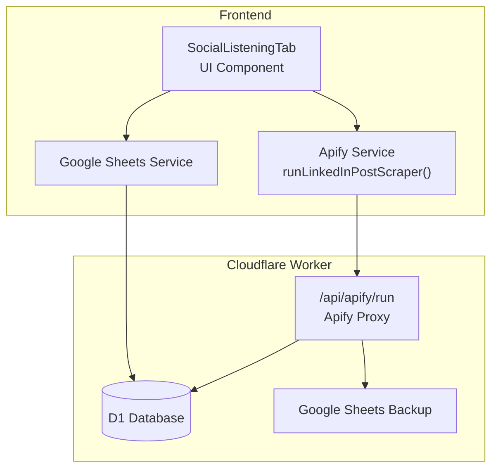
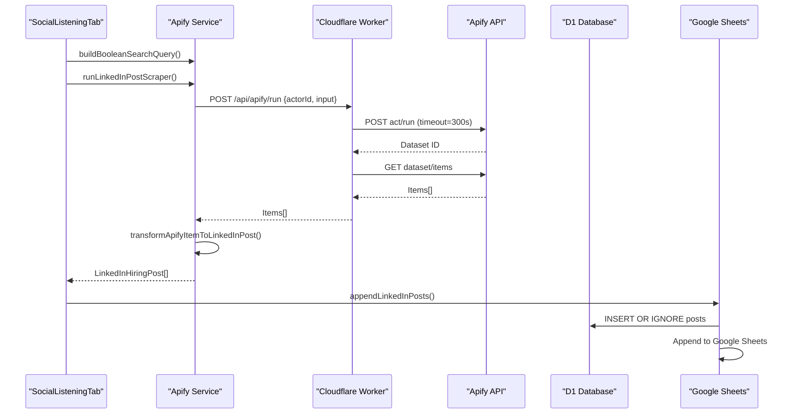
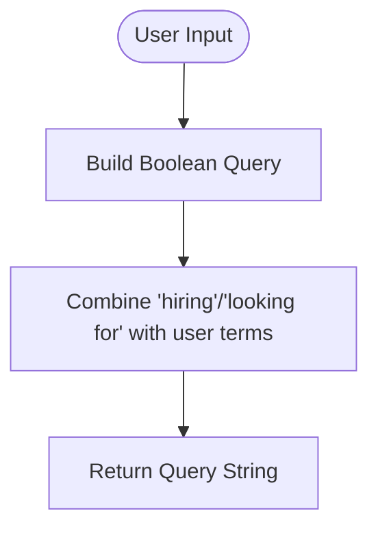
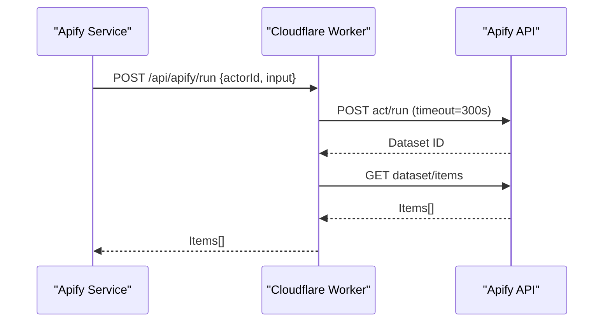
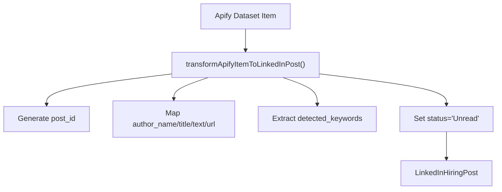
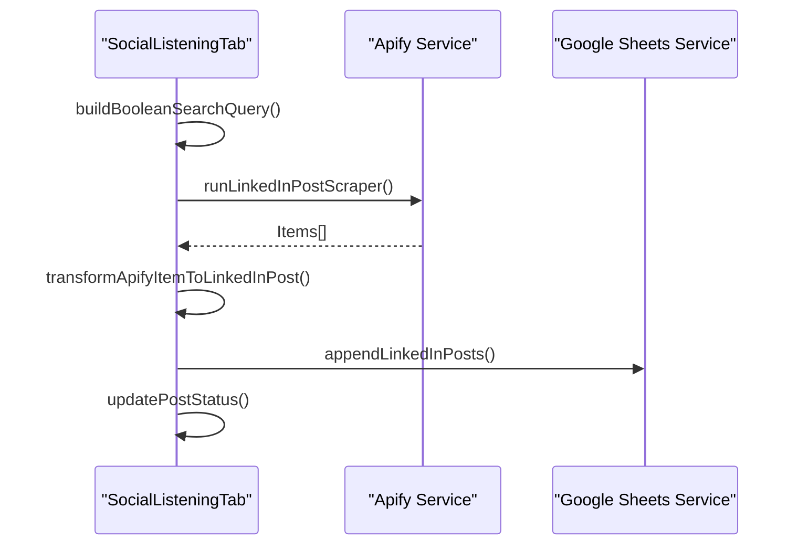
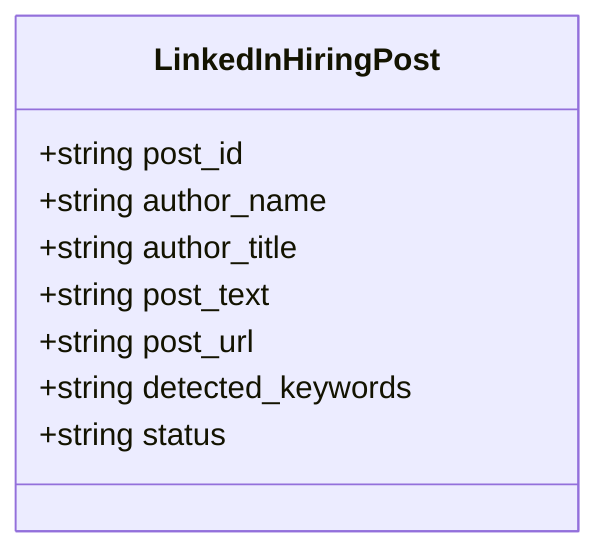
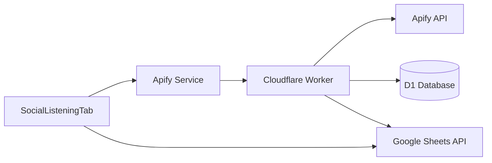

# LinkedIn Post Scraper

<cite>
**Referenced Files in This Document**
- [apify.ts](file://src/services/apify.ts)
- [types/index.ts](file://src/types/index.ts)
- [social-listening-tab.tsx](file://src/components/dashboard/social-listening-tab.tsx)
- [google-sheets.ts](file://src/services/google-sheets.ts)
- [config.ts](file://src/services/config.ts)
- [worker/index.ts](file://worker/index.ts)
- [package.json](file://package.json)
</cite>

## Table of Contents
1. [Introduction](#introduction)
2. [Project Structure](#project-structure)
3. [Core Components](#core-components)
4. [Architecture Overview](#architecture-overview)
5. [Detailed Component Analysis](#detailed-component-analysis)
6. [Dependency Analysis](#dependency-analysis)
7. [Performance Considerations](#performance-considerations)
8. [Troubleshooting Guide](#troubleshooting-guide)
9. [Conclusion](#conclusion)

## Introduction
This document explains the LinkedIn post scraping functionality designed to execute boolean queries and retrieve hiring-related posts. It covers the complete workflow from query construction to data transformation, integration with Apify actors, and the end-to-end data pipeline to structured LinkedInHiringPost objects. It also documents rate limiting considerations, API limitations, anti-scraping workarounds, error handling strategies, retry mechanisms, and performance optimization techniques.

## Project Structure
The LinkedIn post scraping feature spans three primary areas:
- Frontend service layer that orchestrates scraping and transforms results
- Cloudflare Worker backend that proxies Apify runs and persists data
- Google Sheets integration for backup persistence and UI data loading

**Diagram sources**
- [social-listening-tab.tsx:36-86](file://src/components/dashboard/social-listening-tab.tsx#L36-L86)
- [apify.ts:270-281](file://src/services/apify.ts#L270-L281)
- [worker/index.ts:177-204](file://worker/index.ts#L177-L204)
- [google-sheets.ts:47-82](file://src/services/google-sheets.ts#L47-L82)

**Section sources**
- [apify.ts:1-677](file://src/services/apify.ts#L1-L677)
- [social-listening-tab.tsx:1-262](file://src/components/dashboard/social-listening-tab.tsx#L1-L262)
- [worker/index.ts:1-499](file://worker/index.ts#L1-L499)
- [google-sheets.ts:1-446](file://src/services/google-sheets.ts#L1-L446)

## Core Components
- Boolean query builder: constructs LinkedIn-compatible boolean queries for "hiring" or "looking for" combined with user-provided terms.
- LinkedIn post scraper: invokes the Apify LinkedIn Post Scraper actor with a search query and limits results.
- Data transformation: converts Apify dataset items into LinkedInHiringPost objects with extracted keywords.
- UI orchestration: triggers scraping, displays results, and manages status updates.
- Persistence: stores posts in D1 and backs up to Google Sheets.

**Section sources**
- [apify.ts:327-329](file://src/services/apify.ts#L327-L329)
- [apify.ts:270-281](file://src/services/apify.ts#L270-L281)
- [apify.ts:302-312](file://src/services/apify.ts#L302-L312)
- [social-listening-tab.tsx:58-86](file://src/components/dashboard/social-listening-tab.tsx#L58-L86)
- [types/index.ts:29-39](file://src/types/index.ts#L29-L39)

## Architecture Overview
The LinkedIn post scraping workflow integrates the frontend UI, a Cloudflare Worker proxy, Apify actors, and persistent storage.

**Diagram sources**
- [social-listening-tab.tsx:67-71](file://src/components/dashboard/social-listening-tab.tsx#L67-L71)
- [apify.ts:270-281](file://src/services/apify.ts#L270-L281)
- [worker/index.ts:154-174](file://worker/index.ts#L154-L174)
- [google-sheets.ts:53-69](file://src/services/google-sheets.ts#L53-L69)

## Detailed Component Analysis

### Boolean Query Construction
The system builds a boolean search query that prioritizes posts containing "hiring" or "looking for" combined with the user's keywords. This ensures focus on recruitment-related content.

**Diagram sources**
- [apify.ts:327-329](file://src/services/apify.ts#L327-L329)

**Section sources**
- [apify.ts:327-329](file://src/services/apify.ts#L327-L329)

### LinkedIn Post Scraper Execution
The scraper uses the Apify LinkedIn Post Scraper actor with a single search query and caps results to a fixed maximum. The worker proxies the run request and returns the dataset items.

**Diagram sources**
- [apify.ts:270-281](file://src/services/apify.ts#L270-L281)
- [worker/index.ts:154-174](file://worker/index.ts#L154-L174)

**Section sources**
- [apify.ts:270-281](file://src/services/apify.ts#L270-L281)
- [worker/index.ts:193-204](file://worker/index.ts#L193-L204)

### Data Transformation Pipeline
Each Apify dataset item is transformed into a LinkedInHiringPost with standardized fields. Keywords are extracted from the post text for highlighting and filtering.

**Diagram sources**
- [apify.ts:302-312](file://src/services/apify.ts#L302-L312)
- [apify.ts:321-325](file://src/services/apify.ts#L321-L325)

**Section sources**
- [apify.ts:302-312](file://src/services/apify.ts#L302-L312)
- [apify.ts:321-325](file://src/services/apify.ts#L321-L325)
- [types/index.ts:29-39](file://src/types/index.ts#L29-L39)

### UI Orchestration and Status Management
The SocialListeningTab component manages the end-to-end flow: building the query, triggering the scraper, transforming results, appending to storage, and updating statuses.

**Diagram sources**
- [social-listening-tab.tsx:58-86](file://src/components/dashboard/social-listening-tab.tsx#L58-L86)
- [apify.ts:302-312](file://src/services/apify.ts#L302-L312)
- [google-sheets.ts:53-82](file://src/services/google-sheets.ts#L53-L82)

**Section sources**
- [social-listening-tab.tsx:58-86](file://src/components/dashboard/social-listening-tab.tsx#L58-L86)
- [google-sheets.ts:53-82](file://src/services/google-sheets.ts#L53-L82)

### Data Model: LinkedInHiringPost
The LinkedInHiringPost type defines the structure of transformed posts, including author information, content, URL, detected keywords, and status.

**Diagram sources**
- [types/index.ts:29-39](file://src/types/index.ts#L29-L39)

**Section sources**
- [types/index.ts:29-39](file://src/types/index.ts#L29-L39)

## Dependency Analysis
The LinkedIn post scraping feature depends on:
- Apify client library for actor invocation
- Cloudflare Worker for secure proxying and persistence
- Google Sheets API for backup persistence
- Frontend services for UI orchestration and data display

**Diagram sources**
- [package.json:17](file://package.json#L17)
- [worker/index.ts:1-499](file://worker/index.ts#L1-L499)
- [google-sheets.ts:97-102](file://src/services/google-sheets.ts#L97-L102)

**Section sources**
- [package.json:1-53](file://package.json#L1-L53)
- [worker/index.ts:1-499](file://worker/index.ts#L1-L499)
- [google-sheets.ts:97-102](file://src/services/google-sheets.ts#L97-L102)

## Performance Considerations
- Actor timeout: The worker sets a 300-second timeout for Apify runs to accommodate larger datasets.
- Result cap: The scraper limits posts to a fixed maximum to control payload size and processing time.
- Deduplication: Both D1 and Google Sheets enforce deduplication by post_id before insertion.
- Token caching: Google Sheets access tokens are cached to reduce repeated authentication overhead.
- Batch inserts: The worker uses batched database operations to improve throughput.

[No sources needed since this section provides general guidance]

## Troubleshooting Guide
Common issues and resolutions:
- Apify connection failures: Verify API token configuration and network connectivity. The worker tests the Apify token endpoint and surfaces errors.
- Empty or limited results: Adjust the boolean query to broaden keywords or remove restrictive filters. Confirm actor availability and quotas.
- Duplicate posts: The system filters duplicates using post_id before insertion. Check for ID generation collisions.
- Google Sheets backup failures: Non-critical failures are logged; the primary D1 storage remains unaffected.
- UI timeouts: The scraper may take several minutes; avoid rapid retries and monitor toast notifications.

**Section sources**
- [worker/index.ts:182-191](file://worker/index.ts#L182-L191)
- [apify.ts:270-281](file://src/services/apify.ts#L270-L281)
- [google-sheets.ts:294-328](file://src/services/google-sheets.ts#L294-L328)

## Conclusion
The LinkedIn post scraping system provides a robust pipeline from boolean query construction to structured post ingestion. By leveraging Apify actors through a Cloudflare Worker proxy, persisting data in D1 with Google Sheets backup, and offering a responsive UI, it delivers scalable social listening capabilities. Adhering to the documented rate limiting, error handling, and optimization strategies ensures reliable operation under varying loads and constraints.