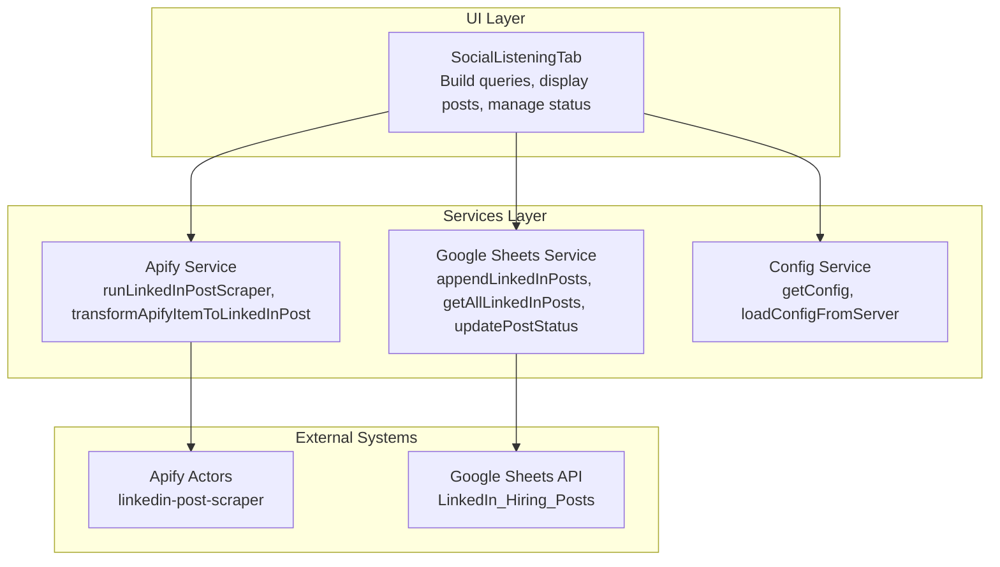
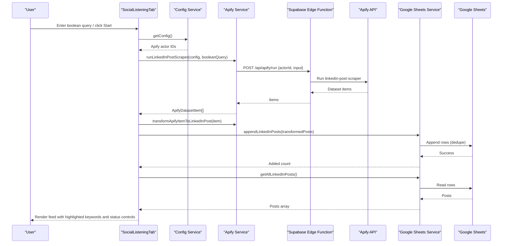
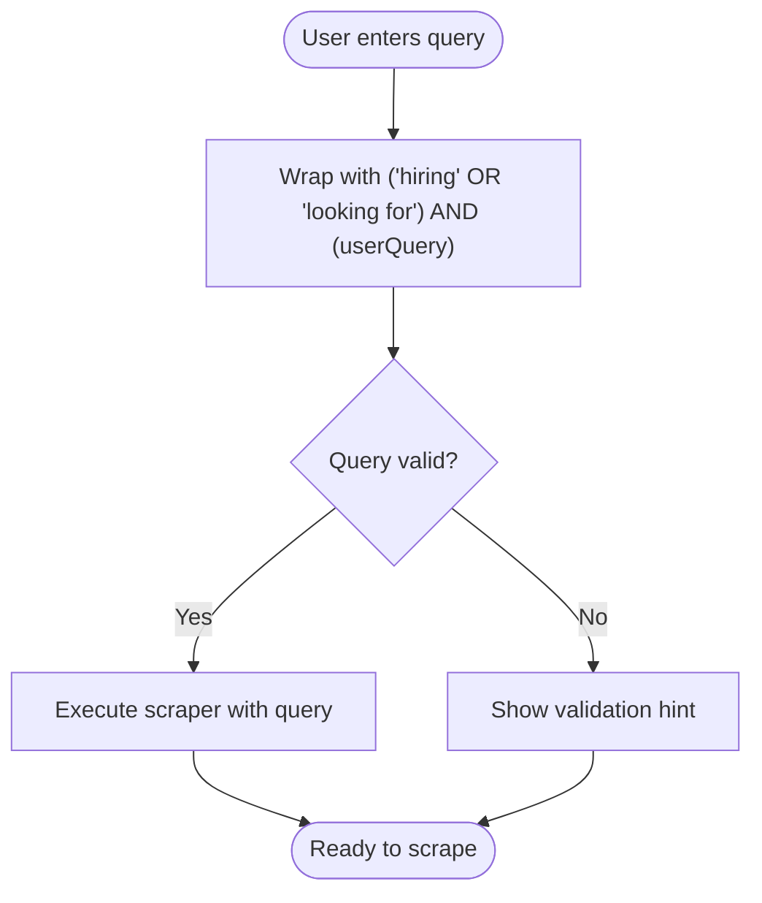
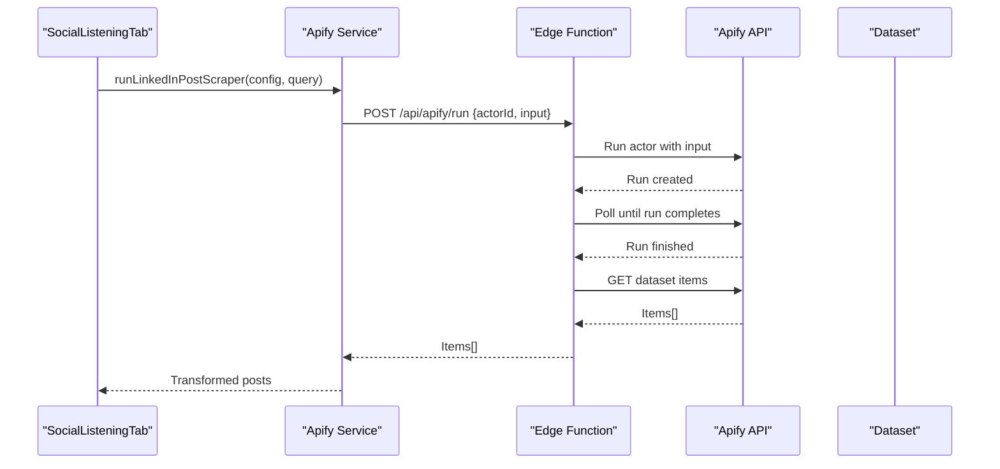
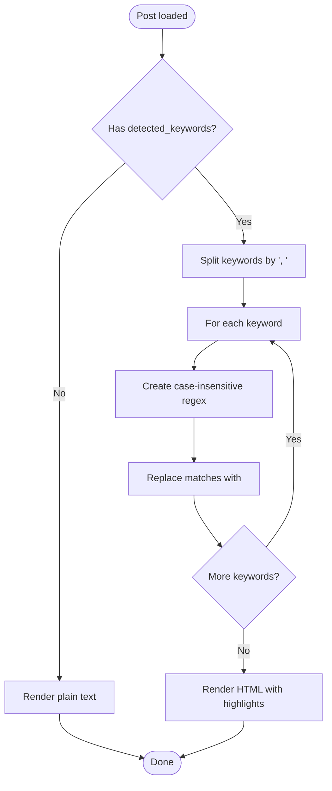
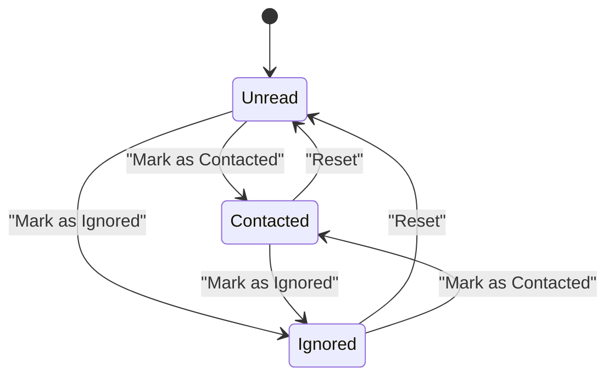
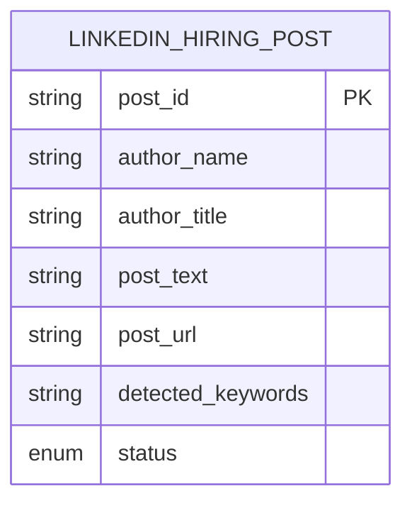
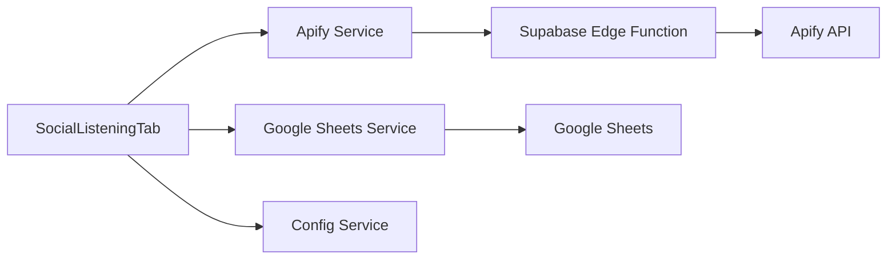

# Social Listening Functionality

<cite>
**Referenced Files in This Document**
- [social-listening-tab.tsx](file://src/components/dashboard/social-listening-tab.tsx)
- [apify.ts](file://src/services/apify.ts)
- [google-sheets.ts](file://src/services/google-sheets.ts)
- [config.ts](file://src/services/config.ts)
- [index.ts](file://src/types/index.ts)
- [WIKI.md](file://WIKI.md)
- [worker/index.ts](file://worker/index.ts)
</cite>

## Table of Contents
1. [Introduction](#introduction)
2. [Project Structure](#project-structure)
3. [Core Components](#core-components)
4. [Architecture Overview](#architecture-overview)
5. [Detailed Component Analysis](#detailed-component-analysis)
6. [Dependency Analysis](#dependency-analysis)
7. [Performance Considerations](#performance-considerations)
8. [Troubleshooting Guide](#troubleshooting-guide)
9. [Conclusion](#conclusion)

## Introduction
This document explains the social listening feature that monitors LinkedIn hiring activity. It covers the boolean query builder interface, the LinkedIn post scraper workflow, keyword highlighting, recruiter engagement tracking, status management, best practices, and integration with Apify and Google Sheets. The system is designed to help users discover relevant hiring posts, track engagement, and maintain focus on high-quality opportunities.

## Project Structure
The social listening feature spans three main areas:
- UI component for building queries, displaying posts, and managing statuses
- Services layer for orchestrating Apify scraping and persisting data to Google Sheets
- Types and configuration for consistent data modeling and runtime settings

**Diagram sources**
- [social-listening-tab.tsx:36-262](file://src/components/dashboard/social-listening-tab.tsx#L36-L262)
- [apify.ts:270-329](file://src/services/apify.ts#L270-L329)
- [google-sheets.ts:47-82](file://src/services/google-sheets.ts#L47-L82)
- [config.ts:35-55](file://src/services/config.ts#L35-L55)

**Section sources**
- [WIKI.md:182-212](file://WIKI.md#L182-L212)
- [social-listening-tab.tsx:1-262](file://src/components/dashboard/social-listening-tab.tsx#L1-L262)
- [apify.ts:1-677](file://src/services/apify.ts#L1-L677)
- [google-sheets.ts:1-446](file://src/services/google-sheets.ts#L1-L446)
- [config.ts:1-166](file://src/services/config.ts#L1-L166)

## Core Components
- Boolean Query Builder: Allows constructing LinkedIn post search queries using AND, OR, NOT operators and preset templates.
- LinkedIn Post Scraper: Executes Apify's LinkedIn post scraper with a boolean query, transforms results, and persists them.
- Keyword Highlighting: Extracts and highlights detected keywords within post content.
- Status Management: Tracks posts as Unread, Contacted, or Ignored with live updates.
- Data Persistence: Stores posts in Google Sheets with deduplication and status updates.

**Section sources**
- [social-listening-tab.tsx:36-111](file://src/components/dashboard/social-listening-tab.tsx#L36-L111)
- [apify.ts:270-329](file://src/services/apify.ts#L270-L329)
- [google-sheets.ts:47-82](file://src/services/google-sheets.ts#L47-L82)
- [index.ts:29-39](file://src/types/index.ts#L29-L39)

## Architecture Overview
The social listening pipeline integrates UI, services, and external systems:

**Diagram sources**
- [social-listening-tab.tsx:58-86](file://src/components/dashboard/social-listening-tab.tsx#L58-L86)
- [apify.ts:270-329](file://src/services/apify.ts#L270-L329)
- [google-sheets.ts:53-82](file://src/services/google-sheets.ts#L53-L82)
- [worker/index.ts:151-172](file://worker/index.ts#L151-L172)

## Detailed Component Analysis

### Boolean Query Builder
The UI exposes a text area for building boolean queries tailored to LinkedIn post scraping. It wraps user input with a hiring-focused clause and supports preset templates for quick application.

Key behaviors:
- Accepts AND, OR, NOT operators and quoted phrases
- Provides preset queries for common hiring patterns
- Builds a single boolean query passed to the scraper

**Diagram sources**
- [apify.ts:327-329](file://src/services/apify.ts#L327-L329)
- [social-listening-tab.tsx:124-135](file://src/components/dashboard/social-listening-tab.tsx#L124-L135)

**Section sources**
- [social-listening-tab.tsx:37-100](file://src/components/dashboard/social-listening-tab.tsx#L37-L100)
- [apify.ts:327-329](file://src/services/apify.ts#L327-L329)
- [WIKI.md:192-197](file://WIKI.md#L192-L197)

### LinkedIn Post Scraper
The scraper executes Apify's LinkedIn post actor with a boolean search query and returns dataset items. The service normalizes and transforms items into the internal LinkedInHiringPost model.

Processing steps:
- Construct input with searchQueries and maxPosts limit
- Proxy request through the Supabase Edge Function
- Fetch dataset items after actor run completes
- Transform items to LinkedInHiringPost with extracted keywords

**Diagram sources**
- [apify.ts:270-281](file://src/services/apify.ts#L270-L281)
- [apify.ts:388-410](file://src/services/apify.ts#L388-L410)
- [worker/index.ts:151-172](file://worker/index.ts#L151-L172)

**Section sources**
- [apify.ts:270-329](file://src/services/apify.ts#L270-L329)
- [apify.ts:618-628](file://src/services/apify.ts#L618-L628)
- [WIKI.md:237-244](file://WIKI.md#L237-L244)

### Keyword Highlighting System
Detected keywords are extracted from post text and rendered as highlighted badges. The UI applies inline highlighting to the post content for quick scanning.

Highlights:
- Extracted keywords are comma-separated in the post record
- UI highlights matches in yellow within the post text
- Keyword badges aid quick scanning of technologies and roles

**Diagram sources**
- [social-listening-tab.tsx:102-111](file://src/components/dashboard/social-listening-tab.tsx#L102-L111)
- [apify.ts:668-672](file://src/services/apify.ts#L668-L672)

**Section sources**
- [social-listening-tab.tsx:210-224](file://src/components/dashboard/social-listening-tab.tsx#L210-L224)
- [apify.ts:668-672](file://src/services/apify.ts#L668-L672)

### Recruiter Engagement Tracking
Each post maintains a status that reflects engagement intent. Users can update status directly from the feed, and changes persist to Google Sheets.

Status lifecycle:
- Unread: Newly discovered posts
- Contacted: Initial outreach attempted
- Ignored: De-prioritized or irrelevant

**Diagram sources**
- [index.ts:29-39](file://src/types/index.ts#L29-L39)
- [social-listening-tab.tsx:88-96](file://src/components/dashboard/social-listening-tab.tsx#L88-L96)
- [google-sheets.ts:71-82](file://src/services/google-sheets.ts#L71-L82)

**Section sources**
- [social-listening-tab.tsx:197-242](file://src/components/dashboard/social-listening-tab.tsx#L197-L242)
- [index.ts:29-39](file://src/types/index.ts#L29-L39)
- [google-sheets.ts:71-82](file://src/services/google-sheets.ts#L71-L82)

### Data Model: LinkedIn Hiring Posts
The internal representation ensures consistent handling of scraped posts across the application.

**Diagram sources**
- [index.ts:31-39](file://src/types/index.ts#L31-L39)

**Section sources**
- [index.ts:29-39](file://src/types/index.ts#L29-L39)
- [apify.ts:302-312](file://src/services/apify.ts#L302-L312)

## Dependency Analysis
The social listening feature depends on:
- Apify actors for scraping LinkedIn posts
- Supabase Edge Function to proxy Apify requests securely
- Google Sheets for persistent storage and deduplication
- Local configuration for actor IDs and credentials

**Diagram sources**
- [social-listening-tab.tsx:21-22](file://src/components/dashboard/social-listening-tab.tsx#L21-L22)
- [apify.ts:47-63](file://src/services/apify.ts#L47-L63)
- [google-sheets.ts:47-82](file://src/services/google-sheets.ts#L47-L82)
- [config.ts:35-55](file://src/services/config.ts#L35-L55)

**Section sources**
- [WIKI.md:45-84](file://WIKI.md#L45-L84)
- [apify.ts:1-677](file://src/services/apify.ts#L1-L677)
- [google-sheets.ts:1-446](file://src/services/google-sheets.ts#L1-L446)
- [config.ts:1-166](file://src/services/config.ts#L1-L166)

## Performance Considerations
- Limit post volume: The scraper caps results to reduce load and cost.
- Deduplication: Existing post IDs are checked before appending to Sheets.
- Efficient rendering: Only visible posts are rendered; scrolling area constrains DOM size.
- Batch operations: Appending multiple rows minimizes API calls.

Recommendations:
- Keep queries specific to reduce irrelevant results.
- Use presets as starting points and refine incrementally.
- Monitor Apify run duration and adjust maxPosts as needed.

**Section sources**
- [apify.ts:275-278](file://src/services/apify.ts#L275-L278)
- [google-sheets.ts:294-328](file://src/services/google-sheets.ts#L294-L328)
- [social-listening-tab.tsx:181-256](file://src/components/dashboard/social-listening-tab.tsx#L181-L256)

## Troubleshooting Guide
Common issues and resolutions:
- Missing Apify actor configuration: Ensure linkedinPostActorId is set in Configuration. The UI prevents scraping without it.
- Apify connection failures: Use the connection tester in Configuration to validate token and actor availability.
- Google Sheets errors: Verify service account key, spreadsheet ID, and permissions. Test connection before scraping.
- Empty results: Refine boolean query; add location or role-specific terms; check preset templates.
- Status updates fail: Confirm post exists and Sheets permissions allow writing to the target column.

Operational tips:
- Use the "Refresh Posts" button to reload from Sheets after external changes.
- Clear local config only if credentials are incorrect; re-enter and test again.
- Review Apify run logs via the Supabase Edge Function route for detailed errors.

**Section sources**
- [social-listening-tab.tsx:59-63](file://src/components/dashboard/social-listening-tab.tsx#L59-L63)
- [config.ts:85-96](file://src/services/config.ts#L85-L96)
- [google-sheets.ts:196-211](file://src/services/google-sheets.ts#L196-L211)
- [WIKI.md:499-502](file://WIKI.md#L499-L502)

## Best Practices for Query Construction
- Start with presets and iterate: Use provided templates as baselines for DevOps, remote roles, and infrastructure positions.
- Focus on hiring signals: Include terms like "hiring" or "looking for" combined with roles and technologies.
- Narrow scope: Add location or remote filters to reduce noise.
- Test incrementally: Validate small result sets before broadening queries.
- Track effectiveness: Use Contacted/Ignored to refine future queries based on quality.

Common patterns:
- Role-centric: ("hiring" OR "looking for") AND ("DevOps" OR "Cloud Engineer")
- Remote-first: ("hiring" OR "looking for") AND ("Tech" OR "Software") AND "Remote"
- Infrastructure: ("hiring" OR "looking for") AND ("Platform Engineer" OR "Infrastructure")

**Section sources**
- [WIKI.md:192-197](file://WIKI.md#L192-L197)
- [social-listening-tab.tsx:24-28](file://src/components/dashboard/social-listening-tab.tsx#L24-L28)
- [apify.ts:327-329](file://src/services/apify.ts#L327-L329)

## Interpreting Results and Managing False Positives
- Keyword relevance: Detected keywords help surface tech matches but may include false positives; review context and remove Ignored.
- Status-driven filtering: Use Contacted/Ignored to prioritize high-signal posts and deprioritize noise.
- Manual refinement: Adjust queries to emphasize desired technologies and exclude irrelevant terms.
- Periodic cleanup: Regularly review older posts and mark as Ignored to maintain signal-to-noise ratio.

**Section sources**
- [social-listening-tab.tsx:197-242](file://src/components/dashboard/social-listening-tab.tsx#L197-L242)
- [apify.ts:668-672](file://src/services/apify.ts#L668-L672)

## Integration with LinkedIn API Limitations and Workarounds
- Direct API restrictions: The solution uses Apify's LinkedIn post actor rather than direct LinkedIn APIs, avoiding rate limits and authentication complexity.
- Proxy layer: Supabase Edge Function securely proxies requests and manages timeouts, reducing client-side constraints.
- Dataset-based retrieval: Results are fetched from Apify datasets, ensuring structured data without violating platform policies.

**Section sources**
- [WIKI.md:214-246](file://WIKI.md#L214-L246)
- [apify.ts:388-410](file://src/services/apify.ts#L388-L410)
- [worker/index.ts:151-172](file://worker/index.ts#L151-L172)

## Conclusion
The social listening feature provides a robust, configurable pipeline to monitor LinkedIn hiring posts. By combining a flexible boolean query builder, Apify-powered scraping, intelligent keyword detection, and status-driven organization, users can efficiently identify and prioritize high-quality opportunities while maintaining operational simplicity and scalability.