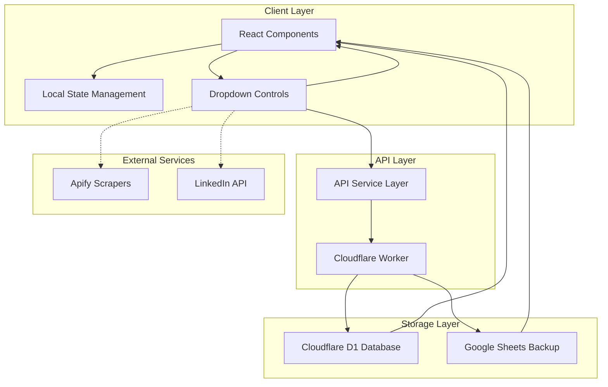
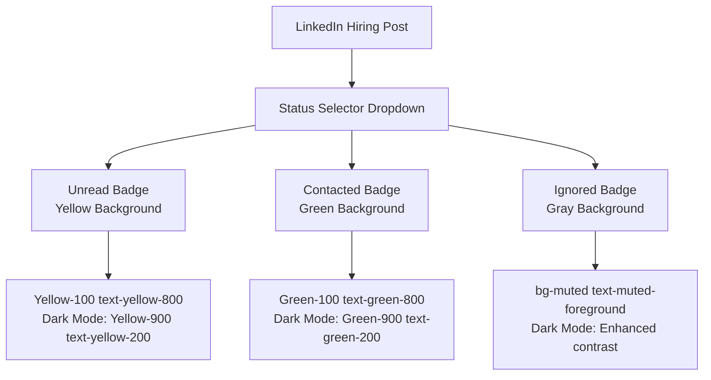
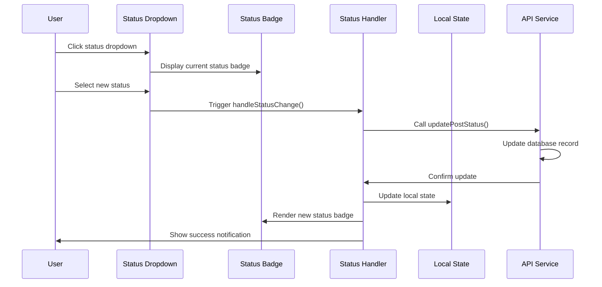
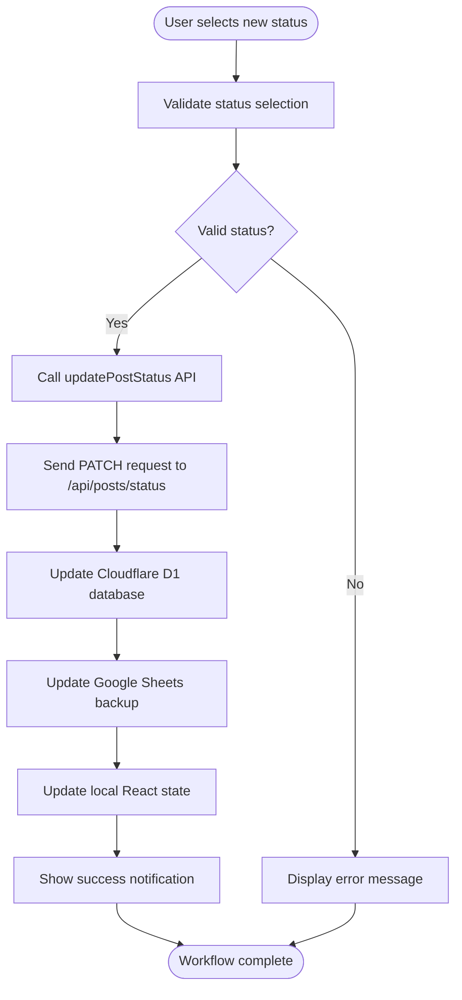
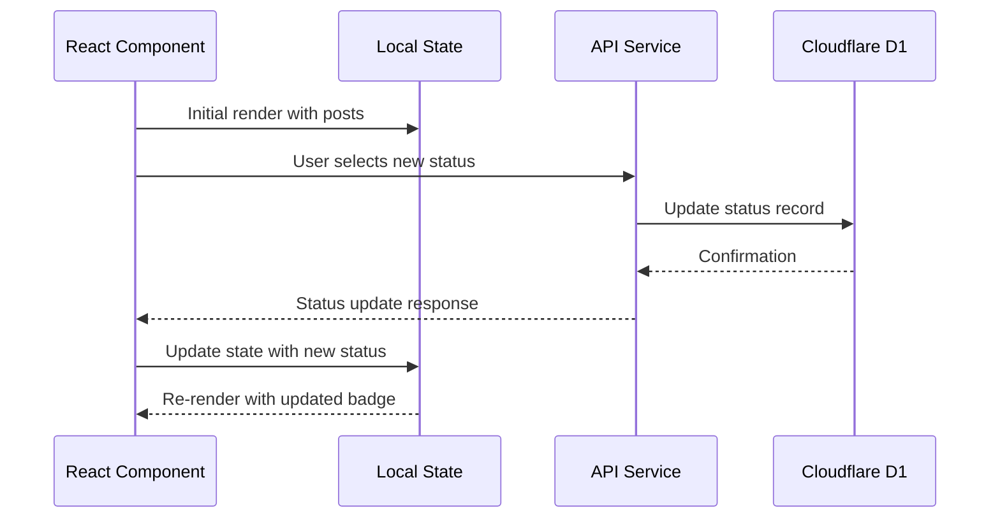
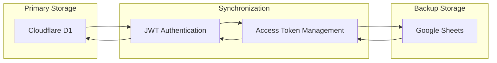
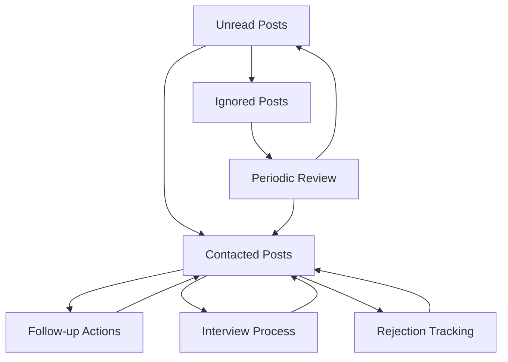

# Status Management System

<cite>
**Referenced Files in This Document**
- [index.ts](file://src/types/index.ts)
- [social-listening-tab.tsx](file://src/components/dashboard/social-listening-tab.tsx)
- [google-sheets.ts](file://src/services/google-sheets.ts)
- [index.ts](file://worker/index.ts)
- [schema.sql](file://schema.sql)
- [badge.tsx](file://src/components/ui/badge.tsx)
</cite>

## Table of Contents
1. [Introduction](#introduction)
2. [System Architecture](#system-architecture)
3. [Status States and Visual Representation](#status-states-and-visual-representation)
4. [UI Controls and User Interface](#ui-controls-and-user-interface)
5. [Status Update Workflow](#status-update-workflow)
6. [Local State Management](#local-state-management)
7. [Persistent Storage Implementation](#persistent-storage-implementation)
8. [Google Sheets Integration](#google-sheets-integration)
9. [Best Practices for Recruitment Workflow](#best-practices-for-recruitment-workflow)
10. [Troubleshooting and Error Handling](#troubleshooting-and-error-handling)
11. [Conclusion](#conclusion)

## Introduction

The Status Management System is a core component of the Job Search Dashboard that enables users to categorize and track LinkedIn hiring posts through a sophisticated three-state status system. This system provides real-time visual feedback, maintains persistent storage, and integrates with Google Sheets for backup and cross-platform accessibility.

The system manages three distinct status states: **Unread**, **Contacted**, and **Ignored**, each represented by color-coded badges that provide immediate visual cues about the current state of each hiring opportunity. This visual approach helps recruiters efficiently organize their workflow and quickly identify posts requiring attention.

## System Architecture

The Status Management System follows a modern client-server architecture with local state synchronization and cloud backup capabilities:



**Diagram sources**
- [social-listening-tab.tsx:88-96](file://src/components/dashboard/social-listening-tab.tsx#L88-L96)
- [google-sheets.ts:71-82](file://src/services/google-sheets.ts#L71-L82)
- [index.ts:311-336](file://worker/index.ts#L311-L336)

## Status States and Visual Representation

The system implements three distinct status states, each with specific visual indicators and behavioral characteristics:

### Status State Definitions

| Status | Color Code | Description | Visual Indicator |
|--------|------------|-------------|------------------|
| **Unread** | `bg-yellow-100 text-yellow-800` | New posts requiring initial review | Yellow badge with dark text |
| **Contacted** | `bg-green-100 text-green-800` | Posts where initial contact has been made | Green badge with dark text |
| **Ignored** | `bg-muted text-muted-foreground` | Posts marked for later review or skipped | Neutral gray badge |

### Visual Implementation Details

The visual representation is implemented through Tailwind CSS utility classes that provide responsive dark mode support:



**Diagram sources**
- [social-listening-tab.tsx:30-34](file://src/components/dashboard/social-listening-tab.tsx#L30-L34)
- [badge.tsx:1-49](file://src/components/ui/badge.tsx#L1-L49)

**Section sources**
- [social-listening-tab.tsx:30-34](file://src/components/dashboard/social-listening-tab.tsx#L30-L34)
- [index.ts:29](file://src/types/index.ts#L29)

## UI Controls and User Interface

The Status Management System provides intuitive user interface controls designed for efficient recruitment workflow management:

### Dropdown Selector Implementation

The primary control mechanism is a sophisticated dropdown selector that combines visual status indication with interactive functionality:



**Diagram sources**
- [social-listening-tab.tsx:229-241](file://src/components/dashboard/social-listening-tab.tsx#L229-L241)
- [social-listening-tab.tsx:88-96](file://src/components/dashboard/social-listening-tab.tsx#L88-L96)

### Immediate Feedback Mechanisms

The system provides comprehensive feedback through multiple channels:

1. **Visual Feedback**: Real-time badge color changes
2. **Toast Notifications**: Success/error messages
3. **State Synchronization**: Immediate UI updates
4. **Error Handling**: Graceful degradation

**Section sources**
- [social-listening-tab.tsx:229-241](file://src/components/dashboard/social-listening-tab.tsx#L229-L241)
- [social-listening-tab.tsx:88-96](file://src/components/dashboard/social-listening-tab.tsx#L88-L96)

## Status Update Workflow

The status update process follows a structured workflow that ensures data consistency and provides immediate user feedback:

### Complete Workflow Process



**Diagram sources**
- [social-listening-tab.tsx:88-96](file://src/components/dashboard/social-listening-tab.tsx#L88-L96)
- [google-sheets.ts:71-82](file://src/services/google-sheets.ts#L71-L82)
- [index.ts:311-336](file://worker/index.ts#L311-L336)

### API Endpoint Implementation

The backend handles status updates through a dedicated endpoint that manages both primary storage and backup synchronization:

**Section sources**
- [social-listening-tab.tsx:88-96](file://src/components/dashboard/social-listening-tab.tsx#L88-L96)
- [google-sheets.ts:71-82](file://src/services/google-sheets.ts#L71-L82)
- [index.ts:311-336](file://worker/index.ts#L311-L336)

## Local State Management

The system maintains synchronized local state to ensure immediate UI responsiveness and offline capability:

### State Synchronization Pattern



**Diagram sources**
- [social-listening-tab.tsx:91](file://src/components/dashboard/social-listening-tab.tsx#L91)
- [social-listening-tab.tsx:229-241](file://src/components/dashboard/social-listening-tab.tsx#L229-L241)

### State Update Implementation

The local state management follows React best practices with immediate UI updates and error handling:

**Section sources**
- [social-listening-tab.tsx:91](file://src/components/dashboard/social-listening-tab.tsx#L91)
- [social-listening-tab.tsx:229-241](file://src/components/dashboard/social-listening-tab.tsx#L229-L241)

## Persistent Storage Implementation

The system utilizes Cloudflare D1 as the primary storage solution, providing reliable data persistence with automatic indexing and query optimization:

### Database Schema Design

The LinkedIn Hiring Posts table is designed with optimal indexing for status-based queries:

| Column | Type | Constraints | Purpose |
|--------|------|-------------|---------|
| `post_id` | TEXT | PRIMARY KEY | Unique identifier |
| `author_name` | TEXT | DEFAULT '' | Recruiter/Author name |
| `author_title` | TEXT | DEFAULT '' | Professional title |
| `post_text` | TEXT | DEFAULT '' | Content text |
| `post_url` | TEXT | DEFAULT '' | LinkedIn post URL |
| `detected_keywords` | TEXT | DEFAULT '' | Keyword extraction |
| `status` | TEXT | DEFAULT 'Unread' | Current status state |

### Indexing Strategy

```sql
CREATE TABLE IF NOT EXISTS linkedin_posts (
  post_id TEXT PRIMARY KEY,
  author_name TEXT DEFAULT '',
  author_title TEXT DEFAULT '',
  post_text TEXT DEFAULT '',
  post_url TEXT DEFAULT '',
  detected_keywords TEXT DEFAULT '',
  status TEXT DEFAULT 'Unread'
);

CREATE INDEX IF NOT EXISTS idx_posts_status ON linkedin_posts(status);
```

**Section sources**
- [schema.sql:21-31](file://schema.sql#L21-L31)

## Google Sheets Integration

The system provides robust backup and cross-platform accessibility through Google Sheets integration:

### Backup Architecture



**Diagram sources**
- [google-sheets.ts:94-152](file://src/services/google-sheets.ts#L94-L152)
- [index.ts:105-141](file://worker/index.ts#L105-L141)

### Authentication and Security

The system implements secure JWT-based authentication for Google Sheets API access:

1. **Service Account Integration**: Uses private key for RS256 signing
2. **Token Caching**: Prevents excessive authentication requests
3. **Automatic Renewal**: Handles token expiration gracefully
4. **Error Handling**: Provides fallback mechanisms for network failures

**Section sources**
- [google-sheets.ts:94-152](file://src/services/google-sheets.ts#L94-L152)
- [index.ts:105-141](file://worker/index.ts#L105-L141)

## Best Practices for Recruitment Workflow

### Organizing Posts by Status

Effective organization strategies for managing multiple recruitment opportunities:

#### Unread Posts Management
- **Immediate Review**: Prioritize Unread posts for initial assessment
- **Keyword Highlighting**: Use detected keywords to identify relevant opportunities
- **Rapid Filtering**: Quickly scan for posts matching your criteria
- **Batch Processing**: Process multiple Unread posts systematically

#### Contacted Posts Organization
- **Follow-up Tracking**: Monitor timeline for follow-up actions
- **Communication Logs**: Maintain records of outreach attempts
- **Response Monitoring**: Track responses and engagement levels
- **Next Steps Planning**: Document immediate action items

#### Ignored Posts Strategy
- **Strategic Neglect**: Use Ignored for posts not currently relevant
- **Periodic Review**: Reassess Ignored posts periodically
- **Archival Approach**: Consider Ignored posts as potential future opportunities
- **Clean Workspace**: Keep Ignored posts separate from active pipeline

### Tracking Follow-up Actions

The system facilitates comprehensive follow-up tracking through integrated workflow management:



### Efficient Workflow Management

Recommended practices for maintaining an efficient recruitment workflow:

1. **Daily Status Reviews**: Establish daily routines for status updates
2. **Bulk Operations**: Use bulk status changes for similar posts
3. **Priority Systems**: Combine status with priority indicators
4. **Analytics Integration**: Track conversion rates and response times
5. **Team Coordination**: Share status updates across team members
6. **Archive Management**: Regularly archive completed opportunities

## Troubleshooting and Error Handling

The system implements comprehensive error handling to ensure reliability and user confidence:

### Common Issues and Solutions

| Issue | Symptoms | Solution |
|-------|----------|----------|
| **Network Failures** | Status updates fail silently | Retry mechanism with exponential backoff |
| **Authentication Errors** | Google Sheets backup fails | Verify service account configuration |
| **Database Connectivity** | Local state sync issues | Check Cloudflare D1 connectivity |
| **API Rate Limiting** | Status update timeouts | Implement request throttling |
| **Browser Compatibility** | Badge rendering issues | Verify Tailwind CSS configuration |

### Error Recovery Strategies

```mermaid
flowchart TD
Error[Error Occurs] --> CheckType{Error Type}
CheckType --> |Network| NetworkRetry[Attempt Network Retry]
CheckType --> |Authentication| AuthFix[Verify Credentials]
CheckType --> |Database| DBRecovery[Database Recovery]
CheckType --> |Other| ManualFix[Manual Intervention]
NetworkRetry --> Success{Operation Success?}
Success --> |Yes| LogSuccess[Log Success]
Success --> |No| Fallback[Fallback to Local State]
AuthFix --> Reconfigure[Reconfigure Service Account]
DBRecovery --> Reset[Reset Database Connection]
ManualFix --> UserAction[User Intervention Required]
Fallback --> NotifyUser[Notify User of Local State]
Reconfigure --> TestAuth[Test Authentication]
Reset --> TestDB[Test Database]
TestAuth --> Success
TestDB --> Success
NotifyUser --> Success
```



**Diagram sources**
- [social-listening-tab.tsx:88-96](file://src/components/dashboard/social-listening-tab.tsx#L88-L96)
- [google-sheets.ts:78-82](file://src/services/google-sheets.ts#L78-L82)

### Monitoring and Diagnostics

The system provides built-in monitoring capabilities:

1. **Connection Status**: Real-time connectivity indicators
2. **Error Logging**: Comprehensive error tracking
3. **Performance Metrics**: Load time and response metrics
4. **Usage Analytics**: Feature adoption and engagement tracking

**Section sources**
- [social-listening-tab.tsx:88-96](file://src/components/dashboard/social-listening-tab.tsx#L88-L96)
- [google-sheets.ts:78-82](file://src/services/google-sheets.ts#L78-L82)

## Conclusion

The Status Management System represents a comprehensive solution for LinkedIn hiring post management, combining intuitive user interface design with robust backend infrastructure. The system's three-state approach provides sufficient granularity for effective recruitment workflow management while maintaining simplicity and ease of use.

Key strengths of the system include:

- **Visual Clarity**: Color-coded badges provide instant status recognition
- **Real-time Updates**: Immediate feedback ensures user confidence
- **Dual Storage**: Local state plus cloud backup ensures reliability
- **Cross-platform Access**: Google Sheets integration enables external access
- **Extensible Design**: Modular architecture supports future enhancements

The system's architecture balances performance, reliability, and user experience, making it an effective tool for managing multiple recruitment opportunities efficiently. The combination of local state management, cloud backup, and visual feedback creates a seamless workflow that adapts to various recruitment scenarios and team structures.

Future enhancements could include advanced filtering capabilities, automated status transitions, integration with external CRM systems, and enhanced analytics for recruitment pipeline optimization.