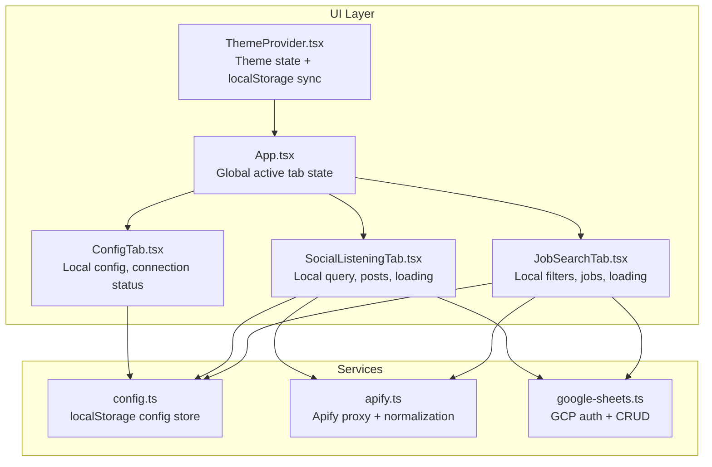
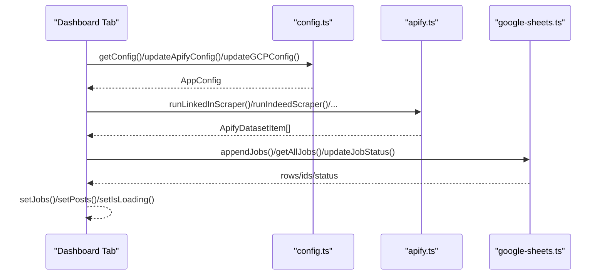
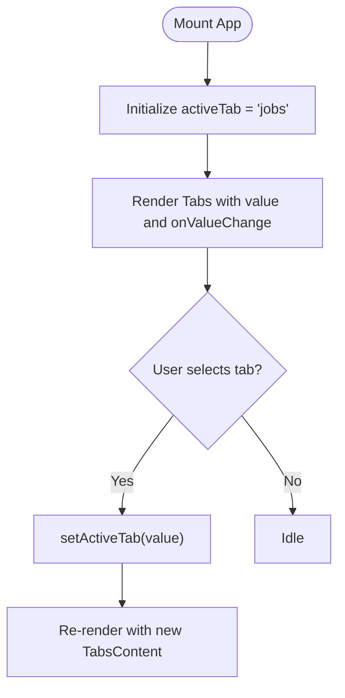
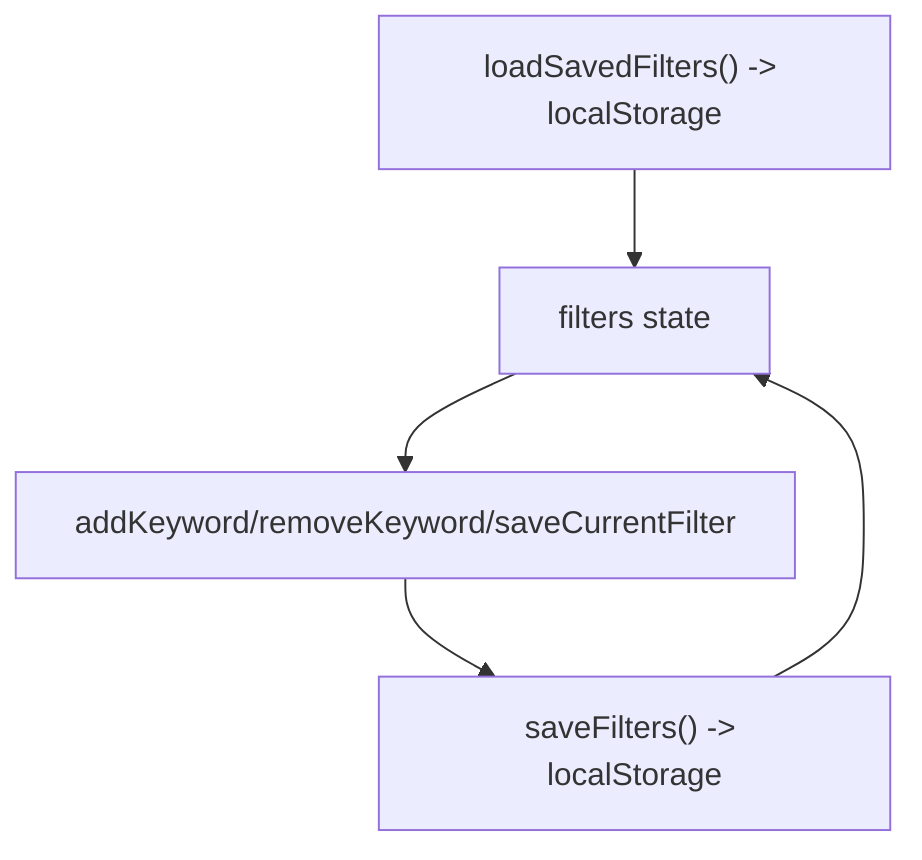
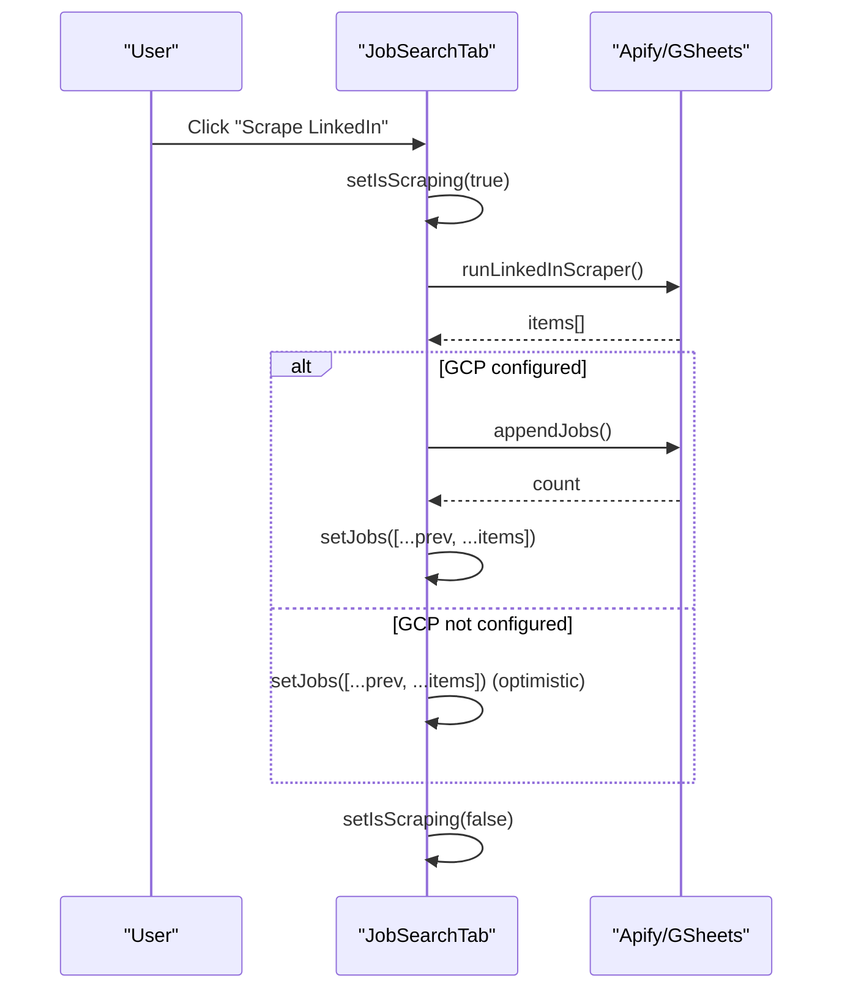
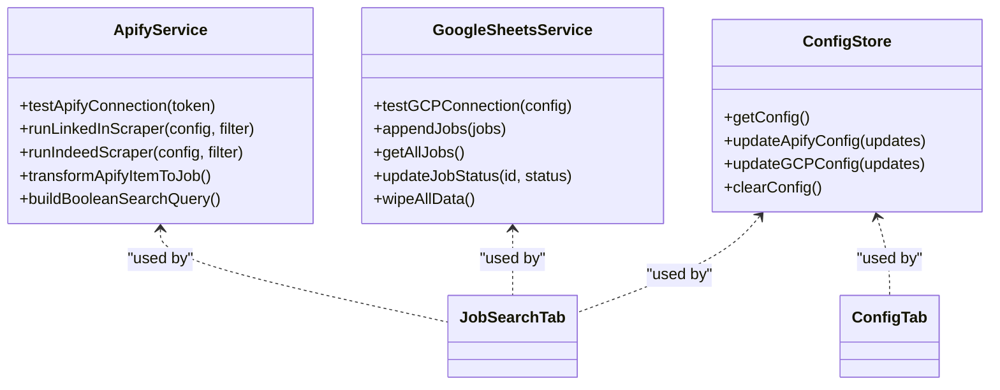
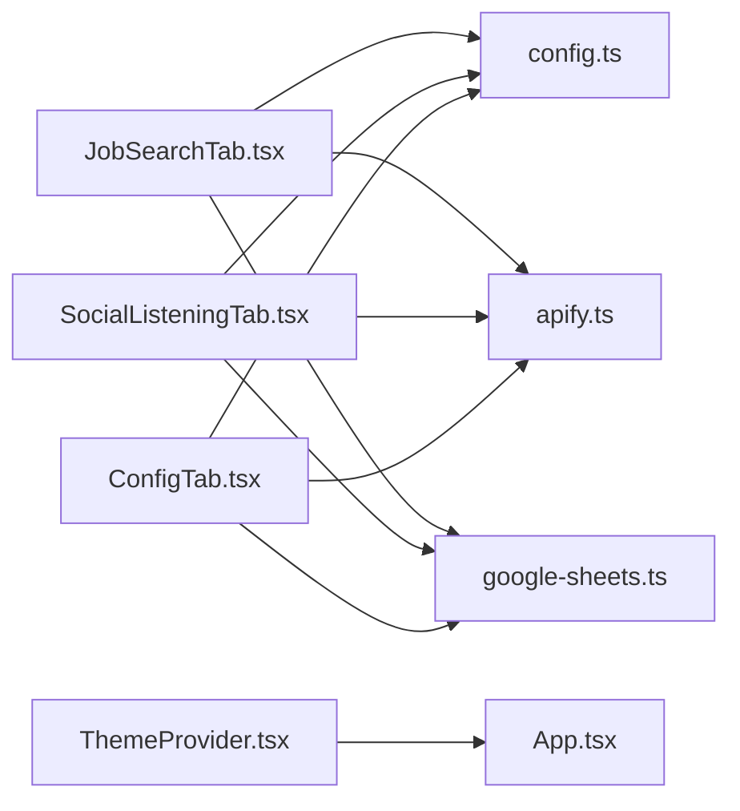

# State Management

<cite>
**Referenced Files in This Document**
- [App.tsx](file://src/App.tsx)
- [main.tsx](file://src/main.tsx)
- [theme-provider.tsx](file://src/components/theme-provider.tsx)
- [config.ts](file://src/services/config.ts)
- [apify.ts](file://src/services/apify.ts)
- [google-sheets.ts](file://src/services/google-sheets.ts)
- [job-search-tab.tsx](file://src/components/dashboard/job-search-tab.tsx)
- [social-listening-tab.tsx](file://src/components/dashboard/social-listening-tab.tsx)
- [config-tab.tsx](file://src/components/dashboard/config-tab.tsx)
- [index.ts](file://src/types/index.ts)
- [use-mobile.ts](file://src/hooks/use-mobile.ts)
- [utils.ts](file://src/lib/utils.ts)
</cite>

## Table of Contents
1. [Introduction](#introduction)
2. [Project Structure](#project-structure)
3. [Core Components](#core-components)
4. [Architecture Overview](#architecture-overview)
5. [Detailed Component Analysis](#detailed-component-analysis)
6. [Dependency Analysis](#dependency-analysis)
7. [Performance Considerations](#performance-considerations)
8. [Troubleshooting Guide](#troubleshooting-guide)
9. [Conclusion](#conclusion)

## Introduction
This document explains the state management architecture in HuntSync AI. The application uses React hooks and local storage to manage UI state and configuration, integrates with external services (Apify and Google Sheets) for data fetching and persistence, and synchronizes UI state with backend APIs. It covers:
- Global and local state patterns
- Controlled vs uncontrolled components
- Local storage integration for configuration and user preferences
- State update mechanisms, event handling, and re-render triggers
- Best practices for normalization, avoiding unnecessary re-renders, and managing complex state relationships
- Integration patterns with external services, including loading states, error handling, and optimistic updates

## Project Structure
HuntSync AI organizes state primarily around:
- Root application state (active tab)
- Dashboard tab components (local state for filters, forms, lists, and loading indicators)
- Services for Apify scraping and Google Sheets persistence
- Configuration store persisted in localStorage
- Theme provider for UI theme state

**Diagram sources**
- [App.tsx:12-64](file://src/App.tsx#L12-L64)
- [job-search-tab.tsx:73-522](file://src/components/dashboard/job-search-tab.tsx#L73-L522)
- [social-listening-tab.tsx:36-275](file://src/components/dashboard/social-listening-tab.tsx#L36-L275)
- [config-tab.tsx:28-501](file://src/components/dashboard/config-tab.tsx#L28-L501)
- [theme-provider.tsx:80-220](file://src/components/theme-provider.tsx#L80-L220)
- [config.ts:26-65](file://src/services/config.ts#L26-L65)
- [apify.ts:25-347](file://src/services/apify.ts#L25-L347)
- [google-sheets.ts:104-353](file://src/services/google-sheets.ts#L104-L353)

**Section sources**
- [App.tsx:12-64](file://src/App.tsx#L12-L64)
- [main.tsx:8-14](file://src/main.tsx#L8-L14)
- [theme-provider.tsx:80-220](file://src/components/theme-provider.tsx#L80-L220)

## Core Components
- Global state
  - Active tab selection in App controls which dashboard tab is visible.
- Local state in dashboard tabs
  - JobSearchTab: manages filters, job list, loading, scraping state, and per-item status updates.
  - SocialListeningTab: manages search query, posts list, loading, and per-post status updates.
  - ConfigTab: manages configuration editing, connection testing, and destructive actions.
- Configuration store
  - Centralized localStorage-backed store for Apify and GCP settings with typed defaults and partial updates.
- Theme provider
  - Theme state synchronized with localStorage and system preference.

**Section sources**
- [App.tsx:13](file://src/App.tsx#L13)
- [job-search-tab.tsx:74-84](file://src/components/dashboard/job-search-tab.tsx#L74-L84)
- [social-listening-tab.tsx:37-41](file://src/components/dashboard/social-listening-tab.tsx#L37-L41)
- [config-tab.tsx:29-37](file://src/components/dashboard/config-tab.tsx#L29-L37)
- [config.ts:26-65](file://src/services/config.ts#L26-L65)
- [theme-provider.tsx:87-140](file://src/components/theme-provider.tsx#L87-L140)

## Architecture Overview
The state lifecycle follows a predictable pattern:
- UI components declare local state with useState and useEffect.
- External services are invoked asynchronously; loading and error states are tracked locally.
- UI state is synchronized with backend services (Apify and Google Sheets) using optimistic updates when appropriate.
- Configuration is persisted to localStorage and rehydrated on mount.

**Diagram sources**
- [job-search-tab.tsx:90-104](file://src/components/dashboard/job-search-tab.tsx#L90-L104)
- [job-search-tab.tsx:160-230](file://src/components/dashboard/job-search-tab.tsx#L160-L230)
- [social-listening-tab.tsx:62-95](file://src/components/dashboard/social-listening-tab.tsx#L62-L95)
- [config.ts:26-65](file://src/services/config.ts#L26-L65)
- [apify.ts:59-81](file://src/services/apify.ts#L59-L81)
- [google-sheets.ts:162-200](file://src/services/google-sheets.ts#L162-L200)

## Detailed Component Analysis

### Global State: Active Tab
- App maintains a single piece of global state: active tab.
- Controlled via Tabs component with onValueChange updating the state.
- Triggers conditional rendering of dashboard tabs.

**Diagram sources**
- [App.tsx:13](file://src/App.tsx#L13)
- [App.tsx:33-58](file://src/App.tsx#L33-L58)

**Section sources**
- [App.tsx:13](file://src/App.tsx#L13)
- [App.tsx:33-58](file://src/App.tsx#L33-L58)

### Local State Patterns: Controlled Components
- JobSearchTab and SocialListeningTab extensively use controlled components:
  - Inputs bound to state via value/onChange handlers.
  - Selects bound to state via onValueChange.
  - Lists rendered from state arrays with per-item state updates.
- Benefits:
  - Predictable UI updates and centralized state.
  - Easy serialization to localStorage for filters and preferences.

**Section sources**
- [job-search-tab.tsx:272-281](file://src/components/dashboard/job-search-tab.tsx#L272-L281)
- [job-search-tab.tsx:337-348](file://src/components/dashboard/job-search-tab.tsx#L337-L348)
- [social-listening-tab.tsx:140-144](file://src/components/dashboard/social-listening-tab.tsx#L140-L144)

### Form State Management and Persistence
- Saved filters in JobSearchTab:
  - Filters array is initialized from localStorage and persisted after each change.
  - Uses a dedicated storage key and JSON serialization.
- Configuration persistence:
  - ConfigTab edits AppConfig and persists via updateApifyConfig/updateGCPConfig.
  - Full reset clears localStorage and resets UI state.

**Diagram sources**
- [job-search-tab.tsx:38-52](file://src/components/dashboard/job-search-tab.tsx#L38-L52)
- [job-search-tab.tsx:136-151](file://src/components/dashboard/job-search-tab.tsx#L136-L151)
- [config.ts:49-61](file://src/services/config.ts#L49-L61)

**Section sources**
- [job-search-tab.tsx:38-52](file://src/components/dashboard/job-search-tab.tsx#L38-L52)
- [job-search-tab.tsx:136-151](file://src/components/dashboard/job-search-tab.tsx#L136-L151)
- [config.ts:49-61](file://src/services/config.ts#L49-L61)

### State Update Mechanisms and Event Handling
- Loading states:
  - Dedicated isLoading/isScraping booleans gate UI feedback and button states.
- Optimistic updates:
  - When GCP is not configured, UI updates immediately upon successful scraping (optimistic).
  - When GCP is configured, UI reflects backend updates after successful write.
- Error handling:
  - Try/catch blocks wrap async operations; errors surfaced via toast notifications.
- Re-render triggers:
  - setState calls trigger re-renders; minimal state updates prevent unnecessary renders.

**Diagram sources**
- [job-search-tab.tsx:160-230](file://src/components/dashboard/job-search-tab.tsx#L160-L230)
- [job-search-tab.tsx:209-217](file://src/components/dashboard/job-search-tab.tsx#L209-L217)
- [google-sheets.ts:162-200](file://src/services/google-sheets.ts#L162-L200)

**Section sources**
- [job-search-tab.tsx:76-78](file://src/components/dashboard/job-search-tab.tsx#L76-L78)
- [job-search-tab.tsx:160-230](file://src/components/dashboard/job-search-tab.tsx#L160-L230)
- [social-listening-tab.tsx:69-95](file://src/components/dashboard/social-listening-tab.tsx#L69-L95)

### Integration Between Local State and External Services
- Apify integration:
  - Proxy calls via Supabase Edge Function with token and actor-specific inputs.
  - Normalization transforms diverse datasets into unified types.
- Google Sheets integration:
  - JWT-based OAuth2 token caching with expiry.
  - CRUD operations for jobs and posts with deduplication and row updates.
- Connection testing:
  - ConfigTab tests Apify and GCP connectivity and updates connectionStatus.

**Diagram sources**
- [apify.ts:25-347](file://src/services/apify.ts#L25-L347)
- [google-sheets.ts:104-353](file://src/services/google-sheets.ts#L104-L353)
- [config.ts:26-65](file://src/services/config.ts#L26-L65)
- [job-search-tab.tsx:29-31](file://src/components/dashboard/job-search-tab.tsx#L29-L31)
- [config-tab.tsx:24-26](file://src/components/dashboard/config-tab.tsx#L24-L26)

**Section sources**
- [apify.ts:25-81](file://src/services/apify.ts#L25-L81)
- [google-sheets.ts:121-139](file://src/services/google-sheets.ts#L121-L139)
- [config-tab.tsx:43-89](file://src/components/dashboard/config-tab.tsx#L43-L89)

### Best Practices Observed
- State normalization
  - Apify outputs are normalized to unified types before being persisted or displayed.
- Avoiding unnecessary re-renders
  - Local state updates are granular; only affected rows are updated in lists.
- Managing complex state relationships
  - Separate concerns: UI state (filters, lists, loading), configuration state (localStorage), and service state (loading/error/connection).
- Controlled vs uncontrolled
  - Controlled components keep inputs synchronized with state; uncontrolled patterns (e.g., temporary filters) are used for ephemeral UI actions.

**Section sources**
- [apify.ts:275-286](file://src/services/apify.ts#L275-L286)
- [job-search-tab.tsx:232-245](file://src/components/dashboard/job-search-tab.tsx#L232-L245)
- [social-listening-tab.tsx:97-110](file://src/components/dashboard/social-listening-tab.tsx#L97-L110)

## Dependency Analysis
- Component-to-service dependencies
  - JobSearchTab depends on config.ts, apify.ts, and google-sheets.ts.
  - SocialListeningTab depends on config.ts, apify.ts, and google-sheets.ts.
  - ConfigTab depends on config.ts and service test functions.
- Theme provider
  - ThemeProvider manages theme state and persists to localStorage, independent of dashboard logic.

**Diagram sources**
- [job-search-tab.tsx:29-31](file://src/components/dashboard/job-search-tab.tsx#L29-L31)
- [social-listening-tab.tsx:20-22](file://src/components/dashboard/social-listening-tab.tsx#L20-L22)
- [config-tab.tsx:24-26](file://src/components/dashboard/config-tab.tsx#L24-L26)
- [theme-provider.tsx:80-220](file://src/components/theme-provider.tsx#L80-L220)

**Section sources**
- [job-search-tab.tsx:29-31](file://src/components/dashboard/job-search-tab.tsx#L29-L31)
- [social-listening-tab.tsx:20-22](file://src/components/dashboard/social-listening-tab.tsx#L20-L22)
- [config-tab.tsx:24-26](file://src/components/dashboard/config-tab.tsx#L24-L26)
- [theme-provider.tsx:80-220](file://src/components/theme-provider.tsx#L80-L220)

## Performance Considerations
- Minimize re-renders
  - Prefer immutable updates (e.g., spreading arrays) and avoid mutating state in place.
  - Batch related state updates to reduce render churn.
- Optimize network calls
  - Cache access tokens and reuse where possible (as seen in Google Sheets service).
  - Debounce or throttle frequent UI-triggered requests.
- UI responsiveness
  - Use loading flags to disable buttons and show spinners during long-running operations.
  - Consider virtualizing large lists to improve scrolling performance.

## Troubleshooting Guide
- Configuration not applied
  - Verify localStorage entries via config.ts functions and ensure keys match expected types.
- Scraping failures
  - Check Apify API token and actor IDs; test connection in ConfigTab.
  - Inspect toast messages and logs for error details.
- Data not syncing to Google Sheets
  - Confirm service account JSON validity and spreadsheet sharing permissions.
  - Validate spreadsheet IDs and sheet names.
- Theme not persisting
  - Ensure ThemeProvider wraps the app root and localStorage keys align with storageKey.

**Section sources**
- [config.ts:26-65](file://src/services/config.ts#L26-L65)
- [config-tab.tsx:43-89](file://src/components/dashboard/config-tab.tsx#L43-L89)
- [google-sheets.ts:104-119](file://src/services/google-sheets.ts#L104-L119)
- [theme-provider.tsx:87-140](file://src/components/theme-provider.tsx#L87-L140)

## Conclusion
HuntSync AI’s state management relies on React hooks for local UI state, localStorage for persistent configuration and filters, and service modules for external integrations. The architecture emphasizes controlled components, optimistic updates, and clear separation of concerns. By following the outlined patterns—normalization, incremental state updates, and robust error handling—the system remains maintainable and responsive across browser sessions.