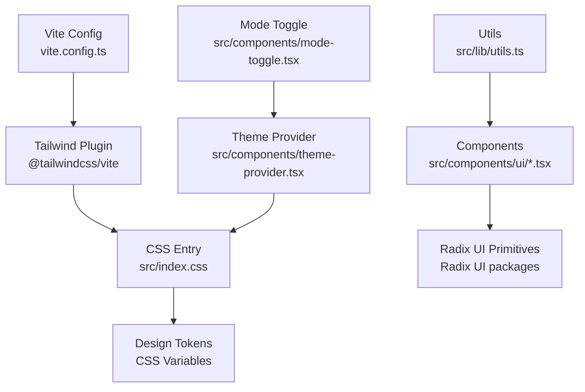
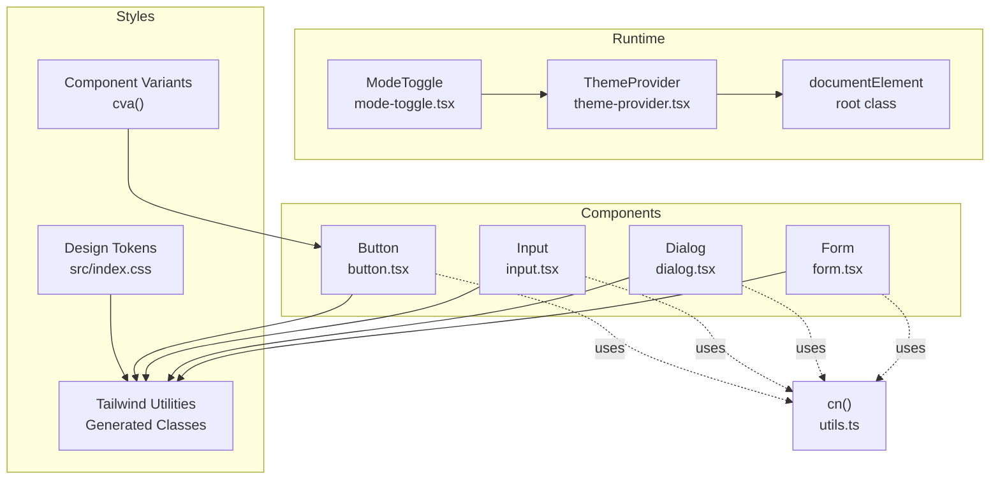
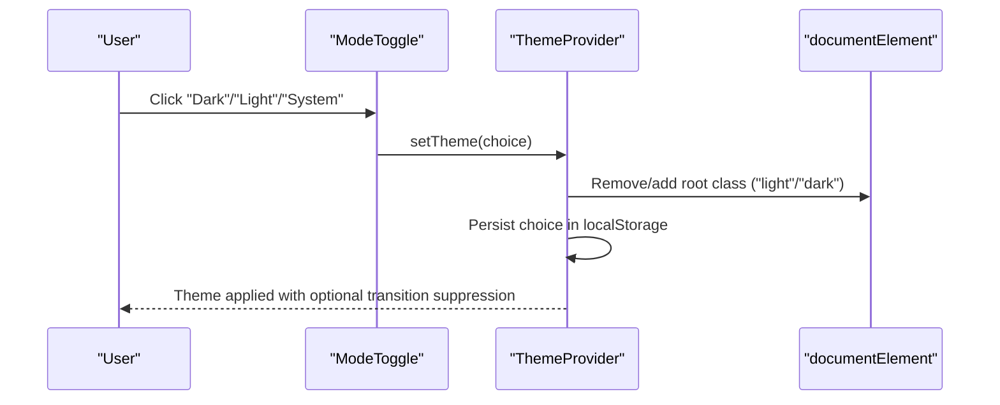
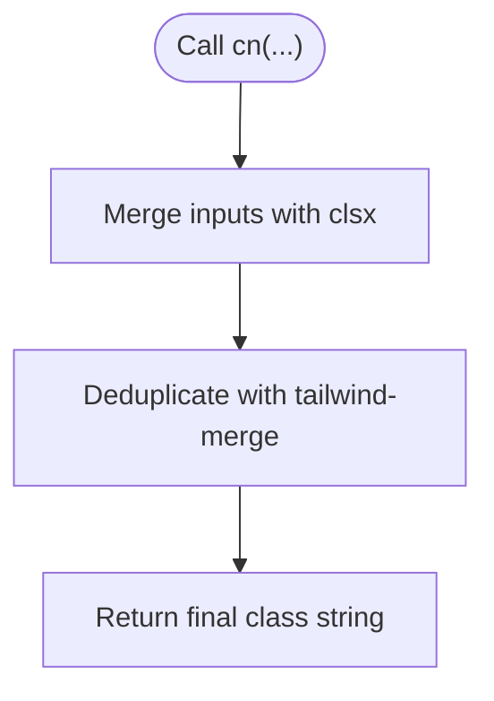
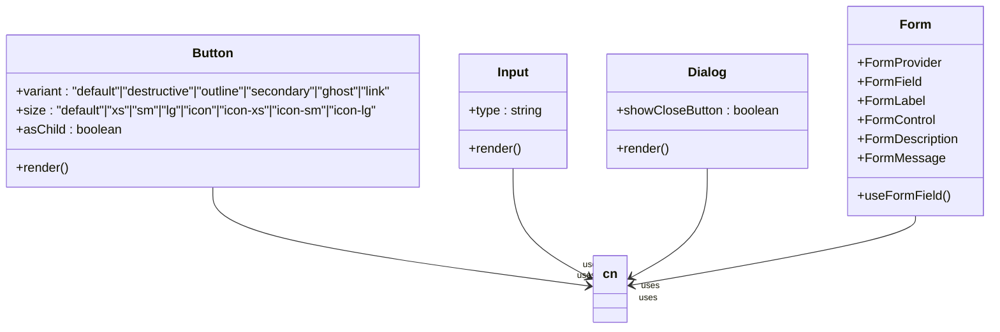
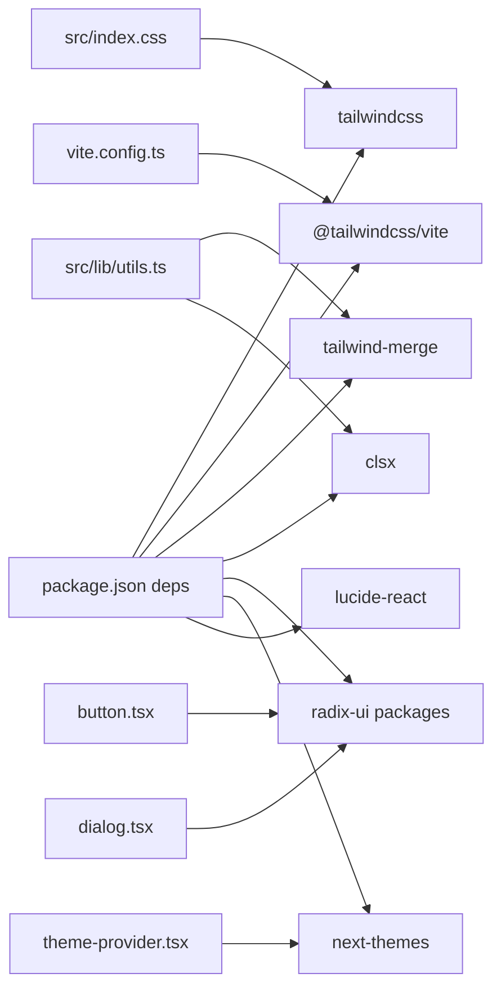

# Styling and Theming

<cite>
**Referenced Files in This Document**
- [index.html](file://index.html)
- [package.json](file://package.json)
- [vite.config.ts](file://vite.config.ts)
- [components.json](file://components.json)
- [src/index.css](file://src/index.css)
- [src/lib/utils.ts](file://src/lib/utils.ts)
- [src/components/theme-provider.tsx](file://src/components/theme-provider.tsx)
- [src/components/mode-toggle.tsx](file://src/components/mode-toggle.tsx)
- [src/components/ui/button.tsx](file://src/components/ui/button.tsx)
- [src/components/ui/input.tsx](file://src/components/ui/input.tsx)
- [src/components/ui/card.tsx](file://src/components/ui/card.tsx)
- [src/components/ui/dialog.tsx](file://src/components/ui/dialog.tsx)
- [src/components/ui/form.tsx](file://src/components/ui/form.tsx)
</cite>

## Table of Contents
1. [Introduction](#introduction)
2. [Project Structure](#project-structure)
3. [Core Components](#core-components)
4. [Architecture Overview](#architecture-overview)
5. [Detailed Component Analysis](#detailed-component-analysis)
6. [Dependency Analysis](#dependency-analysis)
7. [Performance Considerations](#performance-considerations)
8. [Troubleshooting Guide](#troubleshooting-guide)
9. [Conclusion](#conclusion)
10. [Appendices](#appendices)

## Introduction
This document explains the styling and theming system used across the project. It covers Tailwind CSS configuration, design system tokens, dark/light theme implementation via next-themes, theme switching mechanisms, persistent theme preferences, and the utility class patterns used for responsive design and component styling. It also documents the cn function for conditional class merging, component variant systems, and style composition patterns. Finally, it provides guidelines for maintaining design consistency, creating custom components with proper styling, and extending the design system, including integration with Radix UI components.

## Project Structure
The styling system is organized around:
- Tailwind CSS integration via Vite and the Tailwind plugin
- A centralized CSS file defining design tokens and base styles
- A shared utility function for merging classes
- A theme provider and mode toggle for theme switching
- UI components that implement consistent variants and composition patterns

**Diagram sources**
- [vite.config.ts:1-15](file://vite.config.ts#L1-L15)
- [src/index.css:1-153](file://src/index.css#L1-L153)
- [src/lib/utils.ts:1-7](file://src/lib/utils.ts#L1-L7)
- [src/components/theme-provider.tsx:1-231](file://src/components/theme-provider.tsx#L1-L231)
- [src/components/mode-toggle.tsx:1-38](file://src/components/mode-toggle.tsx#L1-L38)

**Section sources**
- [vite.config.ts:1-15](file://vite.config.ts#L1-L15)
- [components.json:1-22](file://components.json#L1-L22)
- [src/index.css:1-153](file://src/index.css#L1-L153)

## Core Components
- Tailwind CSS integration: configured via the Tailwind Vite plugin and aliased module resolution.
- Design tokens: CSS variables defined for light and dark modes, mapped to Tailwind theme tokens.
- Theme provider: manages theme state, persistence, keyboard shortcuts, and system preference updates.
- Mode toggle: exposes a dropdown to switch themes.
- Utility class merging: a cn function built on clsx and tailwind-merge for safe class composition.
- Component variants: standardized variants and sizes using class-variance-authority for buttons and similar controls.
- Radix UI integration: components wrap Radix primitives and apply consistent styling and accessibility attributes.

**Section sources**
- [package.json:12-37](file://package.json#L12-L37)
- [vite.config.ts:1-15](file://vite.config.ts#L1-L15)
- [src/index.css:6-43](file://src/index.css#L6-L43)
- [src/index.css:74-143](file://src/index.css#L74-L143)
- [src/components/theme-provider.tsx:80-220](file://src/components/theme-provider.tsx#L80-L220)
- [src/components/mode-toggle.tsx:12-37](file://src/components/mode-toggle.tsx#L12-L37)
- [src/lib/utils.ts:4-6](file://src/lib/utils.ts#L4-L6)
- [src/components/ui/button.tsx:7-39](file://src/components/ui/button.tsx#L7-L39)

## Architecture Overview
The theming architecture centers on CSS variables and a React provider that toggles a root class. Components consume design tokens via Tailwind utilities and CSS variables. The cn function ensures predictable class merging, while component variants encapsulate style logic.

**Diagram sources**
- [src/components/theme-provider.tsx:80-220](file://src/components/theme-provider.tsx#L80-L220)
- [src/components/mode-toggle.tsx:12-37](file://src/components/mode-toggle.tsx#L12-L37)
- [src/index.css:6-43](file://src/index.css#L6-L43)
- [src/index.css:74-143](file://src/index.css#L74-L143)
- [src/lib/utils.ts:4-6](file://src/lib/utils.ts#L4-L6)
- [src/components/ui/button.tsx:7-39](file://src/components/ui/button.tsx#L7-L39)
- [src/components/ui/input.tsx:5-19](file://src/components/ui/input.tsx#L5-L19)
- [src/components/ui/dialog.tsx:48-80](file://src/components/ui/dialog.tsx#L48-L80)
- [src/components/ui/form.tsx:74-86](file://src/components/ui/form.tsx#L74-L86)

## Detailed Component Analysis

### Theme Provider and Mode Toggle
The ThemeProvider reads and persists the selected theme, applies a root class for dark/light/system, and handles system preference changes and keyboard shortcuts. The ModeToggle offers a dropdown to switch themes and renders icons that animate based on the active theme.

**Diagram sources**
- [src/components/mode-toggle.tsx:12-37](file://src/components/mode-toggle.tsx#L12-L37)
- [src/components/theme-provider.tsx:80-220](file://src/components/theme-provider.tsx#L80-L220)

**Section sources**
- [src/components/theme-provider.tsx:80-220](file://src/components/theme-provider.tsx#L80-L220)
- [src/components/mode-toggle.tsx:12-37](file://src/components/mode-toggle.tsx#L12-L37)

### Design System Tokens and Base Styles
The CSS defines:
- A custom dark variant selector for scoped dark-mode utilities
- Inline theme overrides mapping CSS variables to Tailwind tokens
- Light and dark mode variable sets for backgrounds, foregrounds, borders, inputs, rings, and chart colors
- A base layer applying border and text colors globally

These tokens are consumed by components and Tailwind utilities to maintain consistent visuals across modes.

**Section sources**
- [src/index.css:4](file://src/index.css#L4)
- [src/index.css:6-43](file://src/index.css#L6-L43)
- [src/index.css:74-143](file://src/index.css#L74-L143)
- [src/index.css:145-152](file://src/index.css#L145-L152)

### cn Function for Conditional Class Merging
The cn function merges clsx inputs and deduplicates conflicting Tailwind classes using tailwind-merge. It is used across components to compose base styles with variants and custom overrides safely.

**Diagram sources**
- [src/lib/utils.ts:4-6](file://src/lib/utils.ts#L4-L6)

**Section sources**
- [src/lib/utils.ts:4-6](file://src/lib/utils.ts#L4-L6)

### Component Variant Systems and Style Composition
Buttons use class-variance-authority to define variants and sizes, enabling consistent composition. Inputs and dialogs apply focused, invalid, and dark-mode states via Tailwind utilities and CSS variables. Forms integrate with react-hook-form and expose accessible slots and attributes.

**Diagram sources**
- [src/components/ui/button.tsx:7-39](file://src/components/ui/button.tsx#L7-L39)
- [src/components/ui/input.tsx:5-19](file://src/components/ui/input.tsx#L5-L19)
- [src/components/ui/dialog.tsx:48-80](file://src/components/ui/dialog.tsx#L48-L80)
- [src/components/ui/form.tsx:74-86](file://src/components/ui/form.tsx#L74-L86)

**Section sources**
- [src/components/ui/button.tsx:7-39](file://src/components/ui/button.tsx#L7-L39)
- [src/components/ui/input.tsx:5-19](file://src/components/ui/input.tsx#L5-L19)
- [src/components/ui/dialog.tsx:48-80](file://src/components/ui/dialog.tsx#L48-L80)
- [src/components/ui/form.tsx:74-86](file://src/components/ui/form.tsx#L74-L86)

### Responsive Design Strategies and Utility Patterns
- Responsive utilities: components consistently use responsive prefixes to adjust padding, typography, and spacing across breakpoints.
- Focus and state styles: focus-visible outlines and rings leverage CSS variables for consistent ring colors and opacity.
- Dark mode selectors: dark: variants and aria-invalid states adapt to theme and validation feedback.
- SVG sizing: icons receive consistent sizing and pointer-event handling to avoid layout shifts.

Examples of patterns:
- Focus states with ring color and opacity
- Dark mode variants for borders and backgrounds
- Validation states using aria-invalid with theme-aware ring colors

**Section sources**
- [src/components/ui/button.tsx:8](file://src/components/ui/button.tsx#L8)
- [src/components/ui/input.tsx:10-15](file://src/components/ui/input.tsx#L10-L15)
- [src/index.css:110-143](file://src/index.css#L110-L143)

### Integration with Radix UI Components
Components wrap Radix UI primitives and:
- Apply consistent styling with Tailwind utilities
- Preserve accessibility attributes and roles
- Use data-slot attributes for testability and style targeting
- Compose transitions and animations with utility classes

Examples:
- Dialog wraps Overlay, Content, Title, Description, and Close
- Uses radix-ui primitives for state-driven animations

**Section sources**
- [src/components/ui/dialog.tsx:1-157](file://src/components/ui/dialog.tsx#L1-L157)

## Dependency Analysis
The styling stack relies on:
- Tailwind CSS 4 and the Tailwind Vite plugin for CSS generation
- Tailwind merge and clsx for safe class composition
- Radix UI for accessible component primitives
- next-themes for theme state management and persistence

**Diagram sources**
- [package.json:12-37](file://package.json#L12-L37)
- [vite.config.ts:1-15](file://vite.config.ts#L1-L15)
- [src/index.css:1-153](file://src/index.css#L1-L153)
- [src/lib/utils.ts:1-7](file://src/lib/utils.ts#L1-L7)
- [src/components/theme-provider.tsx:1-231](file://src/components/theme-provider.tsx#L1-L231)
- [src/components/ui/button.tsx:1-65](file://src/components/ui/button.tsx#L1-L65)
- [src/components/ui/dialog.tsx:1-157](file://src/components/ui/dialog.tsx#L1-L157)

**Section sources**
- [package.json:12-37](file://package.json#L12-L37)
- [vite.config.ts:1-15](file://vite.config.ts#L1-L15)
- [src/index.css:1-153](file://src/index.css#L1-L153)
- [src/lib/utils.ts:1-7](file://src/lib/utils.ts#L1-L7)
- [src/components/theme-provider.tsx:1-231](file://src/components/theme-provider.tsx#L1-L231)
- [src/components/ui/button.tsx:1-65](file://src/components/ui/button.tsx#L1-L65)
- [src/components/ui/dialog.tsx:1-157](file://src/components/ui/dialog.tsx#L1-L157)

## Performance Considerations
- Transition suppression during theme switches reduces layout thrash and repaints.
- CSS variables minimize repeated declarations and enable efficient theme toggling.
- tailwind-merge prevents redundant classes, keeping the DOM lean.
- Prefer variant-based composition to avoid ad-hoc class concatenation.

## Troubleshooting Guide
- Theme not persisting: verify the storage key and local storage permissions.
- Theme not updating on system change: ensure media query listeners are attached and not removed prematurely.
- Conflicting classes: use the cn function to merge classes and avoid duplicates.
- Radix animations not smooth: confirm transition suppression is enabled when switching themes.
- Icons not visible: ensure icon components receive consistent size utilities and pointer-event handling.

**Section sources**
- [src/components/theme-provider.tsx:80-220](file://src/components/theme-provider.tsx#L80-L220)
- [src/lib/utils.ts:4-6](file://src/lib/utils.ts#L4-L6)
- [src/components/ui/button.tsx:8](file://src/components/ui/button.tsx#L8)

## Conclusion
The project’s styling and theming system combines Tailwind CSS 4, CSS variables, and a React-based theme provider to deliver a consistent, accessible, and performant design system. The cn function and component variants ensure predictable style composition, while Radix UI integration guarantees robust interactive elements. Following the documented patterns enables teams to extend the system reliably and maintain design consistency across components and themes.

## Appendices

### Tailwind Configuration and Aliases
- Tailwind plugin is registered in Vite.
- Module aliases simplify imports across the app.
- components.json defines Tailwind CSS location, base color, and CSS variables usage.

**Section sources**
- [vite.config.ts:1-15](file://vite.config.ts#L1-L15)
- [components.json:6-12](file://components.json#L6-L12)

### Creating Custom Components with Proper Styling
- Use the cn function to merge base, variant, and custom classes.
- Define variants and sizes with class-variance-authority for reusable patterns.
- Apply focus-visible, dark, and aria-invalid states consistently.
- Wrap Radix UI primitives and preserve accessibility attributes.
- Use data-slot attributes for testability and targeted styling.

**Section sources**
- [src/lib/utils.ts:4-6](file://src/lib/utils.ts#L4-L6)
- [src/components/ui/button.tsx:7-39](file://src/components/ui/button.tsx#L7-L39)
- [src/components/ui/dialog.tsx:48-80](file://src/components/ui/dialog.tsx#L48-L80)