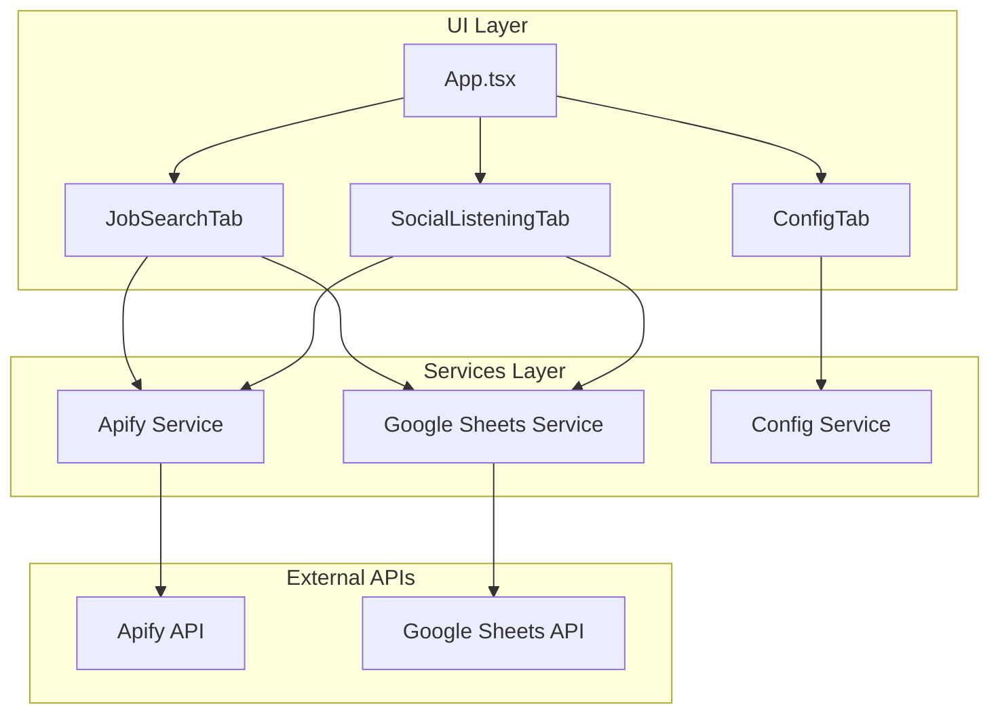
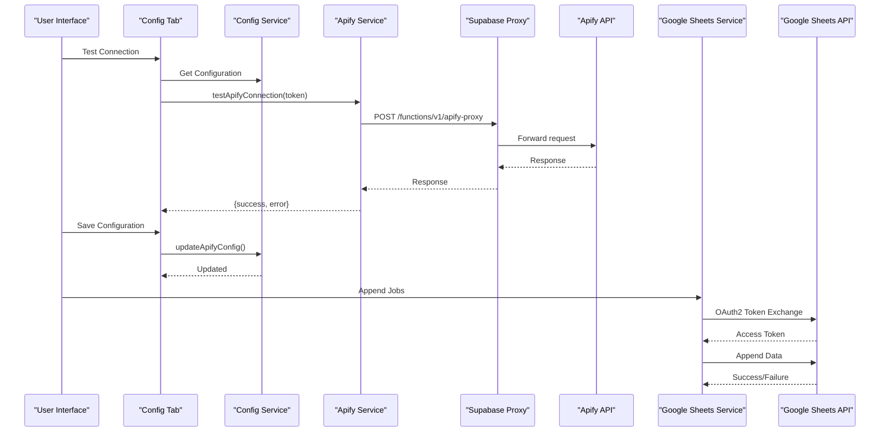
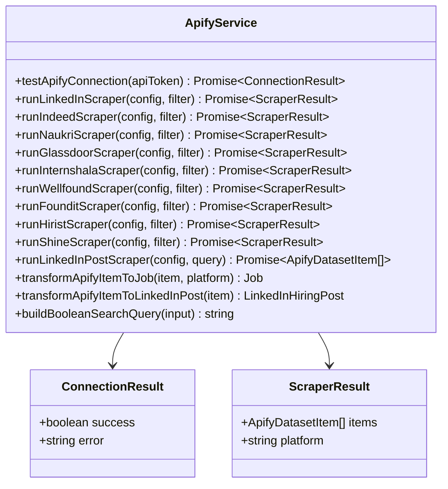
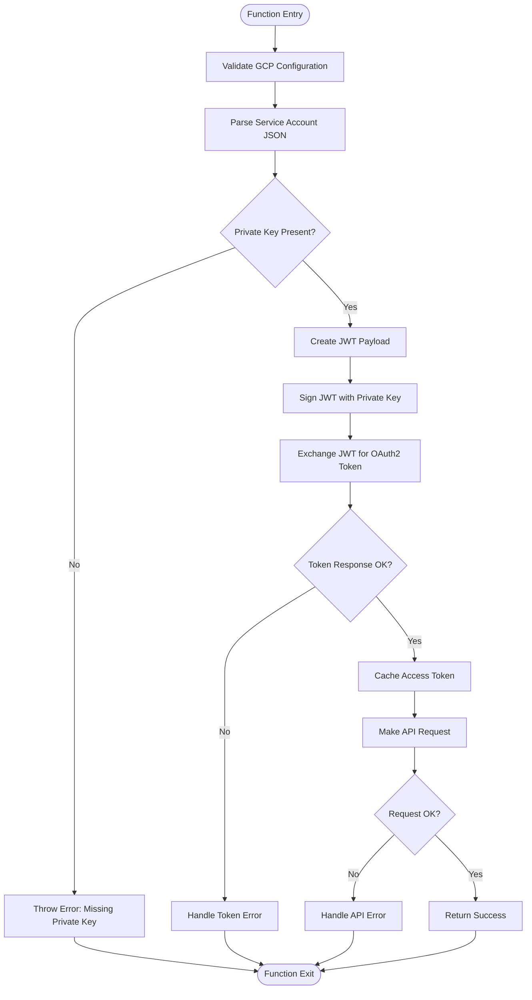
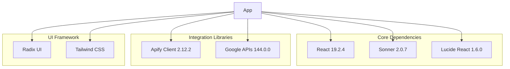

# Troubleshooting Guide

<cite>
**Referenced Files in This Document**
- [apify.ts](file://src/services/apify.ts)
- [google-sheets.ts](file://src/services/google-sheets.ts)
- [config.ts](file://src/services/config.ts)
- [config-tab.tsx](file://src/components/dashboard/config-tab.tsx)
- [job-search-tab.tsx](file://src/components/dashboard/job-search-tab.tsx)
- [social-listening-tab.tsx](file://src/components/dashboard/social-listening-tab.tsx)
- [App.tsx](file://src/App.tsx)
- [index.ts](file://src/types/index.ts)
- [package.json](file://package.json)
</cite>

## Table of Contents
1. [Introduction](#introduction)
2. [Project Structure](#project-structure)
3. [Core Components](#core-components)
4. [Architecture Overview](#architecture-overview)
5. [Detailed Component Analysis](#detailed-component-analysis)
6. [Dependency Analysis](#dependency-analysis)
7. [Performance Considerations](#performance-considerations)
8. [Troubleshooting Guide](#troubleshooting-guide)
9. [Conclusion](#conclusion)

## Introduction
This troubleshooting guide provides comprehensive solutions for common issues encountered when using the HuntSync AI job search dashboard. It covers integration problems with Apify and Google Sheets, configuration issues, browser-specific concerns, and practical diagnostic procedures. The guide includes step-by-step troubleshooting steps, error interpretation, resolution strategies, logging techniques, and preventive measures.

## Project Structure
The application follows a modular architecture with distinct services for data integration and UI components for user interaction. The key areas relevant to troubleshooting are:

- Services: Apify integration, Google Sheets integration, and configuration management
- UI Components: Dashboard tabs for job search, social listening, and configuration
- Types: Shared data structures and configuration interfaces

**Diagram sources**
- [App.tsx:12-67](file://src/App.tsx#L12-L67)
- [job-search-tab.tsx:73-200](file://src/components/dashboard/job-search-tab.tsx#L73-L200)
- [social-listening-tab.tsx:36-200](file://src/components/dashboard/social-listening-tab.tsx#L36-L200)
- [config-tab.tsx:28-502](file://src/components/dashboard/config-tab.tsx#L28-L502)

**Section sources**
- [App.tsx:12-67](file://src/App.tsx#L12-L67)
- [job-search-tab.tsx:73-200](file://src/components/dashboard/job-search-tab.tsx#L73-L200)
- [social-listening-tab.tsx:36-200](file://src/components/dashboard/social-listening-tab.tsx#L36-L200)
- [config-tab.tsx:28-502](file://src/components/dashboard/config-tab.tsx#L28-L502)

## Core Components
The application consists of three primary service modules that handle external integrations and configuration:

- **Apify Service**: Manages scraping operations via Apify actors through a proxy endpoint
- **Google Sheets Service**: Handles data persistence and retrieval from Google Sheets
- **Configuration Service**: Stores and manages API credentials locally

Each service exposes testing functions and maintains clear error handling patterns for reliable troubleshooting.

**Section sources**
- [apify.ts:25-42](file://src/services/apify.ts#L25-L42)
- [google-sheets.ts:104-119](file://src/services/google-sheets.ts#L104-L119)
- [config.ts:26-66](file://src/services/config.ts#L26-L66)

## Architecture Overview
The system architecture implements a client-side integration pattern where browser requests are proxied through a Supabase Edge Function to Apify, while Google Sheets operations use JWT-based authentication directly in the browser.

**Diagram sources**
- [config-tab.tsx:43-89](file://src/components/dashboard/config-tab.tsx#L43-L89)
- [apify.ts:25-42](file://src/services/apify.ts#L25-L42)
- [google-sheets.ts:104-119](file://src/services/google-sheets.ts#L104-L119)

## Detailed Component Analysis

### Apify Integration Service
The Apify service handles scraping operations through a proxy endpoint with comprehensive error handling and connection testing capabilities.

**Diagram sources**
- [apify.ts:25-42](file://src/services/apify.ts#L25-L42)
- [apify.ts:84-218](file://src/services/apify.ts#L84-L218)
- [apify.ts:301-347](file://src/services/apify.ts#L301-L347)

**Section sources**
- [apify.ts:25-42](file://src/services/apify.ts#L25-L42)
- [apify.ts:84-218](file://src/services/apify.ts#L84-L218)
- [apify.ts:301-347](file://src/services/apify.ts#L301-L347)

### Google Sheets Integration Service
The Google Sheets service implements JWT-based authentication and provides comprehensive CRUD operations with robust error handling.

**Diagram sources**
- [google-sheets.ts:12-60](file://src/services/google-sheets.ts#L12-L60)
- [google-sheets.ts:121-139](file://src/services/google-sheets.ts#L121-L139)

**Section sources**
- [google-sheets.ts:12-60](file://src/services/google-sheets.ts#L12-L60)
- [google-sheets.ts:121-139](file://src/services/google-sheets.ts#L121-L139)

### Configuration Management
The configuration service provides local storage management with default fallbacks and validation mechanisms.

**Section sources**
- [config.ts:26-66](file://src/services/config.ts#L26-L66)

## Dependency Analysis
The application relies on several key dependencies for its functionality:

**Diagram sources**
- [package.json:12-37](file://package.json#L12-L37)

**Section sources**
- [package.json:12-37](file://package.json#L12-L37)

## Performance Considerations
- **Timeout Management**: Apify requests include a 300-second timeout to accommodate long-running scrapers
- **Connection Caching**: Google Sheets service caches OAuth tokens to reduce authentication overhead
- **Rate Limiting**: Both Apify and Google Sheets APIs implement rate limiting; implement exponential backoff in production deployments
- **Data Deduplication**: Built-in duplicate filtering prevents redundant entries in Google Sheets

## Troubleshooting Guide

### Authentication Failures

#### Apify Authentication Issues
**Symptoms:**
- Connection test fails with authentication error
- Scraping operations return unauthorized responses
- Error messages indicating invalid API token

**Diagnostic Steps:**
1. Verify API token format in Configuration tab
2. Test connection using the built-in test button
3. Check Apify console for token validity
4. Confirm actor IDs are correct and accessible

**Resolution Strategies:**
1. Regenerate API token from Apify Console
2. Verify token permissions for required actors
3. Check network connectivity to Apify proxy endpoint
4. Clear browser cache and retry

**Section sources**
- [config-tab.tsx:43-65](file://src/components/dashboard/config-tab.tsx#L43-L65)
- [apify.ts:25-42](file://src/services/apify.ts#L25-L42)

#### Google Sheets Authentication Issues
**Symptoms:**
- "Invalid service account JSON" errors
- "Service account missing private_key" errors
- OAuth token exchange failures
- Permission denied errors

**Diagnostic Steps:**
1. Validate JSON format in service account key field
2. Verify private key presence in JSON
3. Check spreadsheet sharing permissions
4. Confirm OAuth scope includes spreadsheet access

**Resolution Strategies:**
1. Download fresh service account JSON from Google Cloud Console
2. Ensure service account has editor access to spreadsheet
3. Verify spreadsheet ID matches the actual spreadsheet
4. Check Google Cloud project billing status

**Section sources**
- [google-sheets.ts:17-22](file://src/services/google-sheets.ts#L17-L22)
- [google-sheets.ts:36-39](file://src/services/google-sheets.ts#L36-L39)
- [config-tab.tsx:67-89](file://src/components/dashboard/config-tab.tsx#L67-L89)

### Actor Execution Errors

#### Common Apify Scraper Issues
**Symptoms:**
- HTTP 429/423 rate limit responses
- Timeout errors during scraping
- Empty results despite valid queries
- Platform-specific actor failures

**Diagnostic Steps:**
1. Check Apify actor status in console
2. Verify actor input parameters
3. Monitor Apify queue and run logs
4. Test individual actors with minimal inputs

**Resolution Strategies:**
1. Implement rate limiting and retries
2. Reduce search scope and refine queries
3. Use official actor IDs from Apify marketplace
4. Monitor Apify resource usage and upgrade if needed

**Section sources**
- [apify.ts:75-78](file://src/services/apify.ts#L75-L78)
- [apify.ts:59-81](file://src/services/apify.ts#L59-L81)

### Rate Limiting Issues

#### Apify Rate Limiting
**Symptoms:**
- HTTP 429 Too Many Requests responses
- Actor runs stuck in queue
- Excessive wait times between runs

**Resolution Strategies:**
1. Implement exponential backoff in client applications
2. Spread scraping operations across multiple time windows
3. Use official Apify SDK with built-in retry logic
4. Consider upgrading Apify plan for higher quotas

#### Google Sheets API Quotas
**Symptoms:**
- 429/503 service unavailable errors
- Exceeded per-100 seconds quota
- Throttled write operations

**Resolution Strategies:**
1. Batch write operations to minimize API calls
2. Implement caching to reduce read operations
3. Use incremental updates instead of full sheet refreshes
4. Monitor API quota usage and adjust operation frequency

**Section sources**
- [apify.ts:75-78](file://src/services/apify.ts#L75-L78)
- [google-sheets.ts:194-197](file://src/services/google-sheets.ts#L194-L197)

### Configuration-Related Issues

#### Missing Credentials
**Symptoms:**
- Toast notifications indicating missing configuration
- Scraping operations fail immediately
- UI shows configuration warnings

**Resolution Strategies:**
1. Complete all required fields in Configuration tab
2. Use the Test Connection buttons to validate entries
3. Save configuration after making changes
4. Clear browser cache if stale configuration persists

**Section sources**
- [job-search-tab.tsx:160-165](file://src/components/dashboard/job-search-tab.tsx#L160-L165)
- [social-listening-tab.tsx:62-67](file://src/components/dashboard/social-listening-tab.tsx#L62-L67)

#### Invalid Settings
**Symptoms:**
- JSON parsing errors for service account keys
- Invalid actor ID formats
- Spreadsheet ID format errors

**Resolution Strategies:**
1. Validate JSON formatting for service account keys
2. Use official actor IDs from Apify marketplace
3. Copy spreadsheet ID directly from URL
4. Remove extra whitespace and formatting

**Section sources**
- [config.ts:27-38](file://src/services/config.ts#L27-L38)
- [config-tab.tsx:137-147](file://src/components/dashboard/config-tab.tsx#L137-L147)

### Data Synchronization Failures

#### Google Sheets Write Operations
**Symptoms:**
- Duplicate entries in spreadsheet
- Data not appearing after successful operations
- Partial write failures

**Resolution Strategies:**
1. Implement duplicate detection using existing ID sets
2. Verify spreadsheet structure matches expected format
3. Check write permissions for service account
4. Monitor for batch operation success indicators

**Section sources**
- [google-sheets.ts:162-200](file://src/services/google-sheets.ts#L162-L200)
- [google-sheets.ts:202-236](file://src/services/google-sheets.ts#L202-L236)

### Browser-Specific Issues

#### Extension Conflicts
**Common Issues:**
- Ad blockers interfering with API calls
- Privacy extensions blocking cross-origin requests
- VPN/browser extensions affecting geolocation

**Resolution Strategies:**
1. Disable ad blockers temporarily for troubleshooting
2. Add application domain to extension allowlists
3. Test in incognito/private browsing mode
4. Try different browsers to isolate extension conflicts

#### Compatibility Problems
**Common Issues:**
- Outdated browser versions
- Disabled JavaScript or cookies
- Corporate firewall restrictions

**Resolution Strategies:**
1. Update to latest browser version
2. Enable JavaScript and cookies for the site
3. Check corporate network policies
4. Use browser developer tools to inspect network requests

### Logging and Debugging Techniques

#### Built-in Diagnostic Tools
The application provides comprehensive logging through toast notifications and connection status indicators:

1. **Connection Testing**: Use Test Connection buttons in Configuration tab
2. **Real-time Status**: Connection status badges show current state
3. **Error Messages**: Specific error messages indicate failure causes
4. **Operation Feedback**: Toast notifications confirm successful operations

#### Manual Debugging Steps
1. Open browser developer tools (F12)
2. Navigate to Network tab
3. Reproduce the issue
4. Inspect API requests and responses
5. Check console for JavaScript errors
6. Verify authentication headers and tokens

#### Error Message Interpretation
- **"Connection failed"**: Network connectivity or proxy issues
- **"Invalid service account JSON"**: Malformed JSON in configuration
- **"Failed to get access token"**: Authentication or permission issues
- **"HTTP X"**: Standard HTTP error codes from external APIs
- **"Job not found"**: Data synchronization or ID mismatch issues

**Section sources**
- [config-tab.tsx:43-89](file://src/components/dashboard/config-tab.tsx#L43-L89)
- [job-search-tab.tsx:99-104](file://src/components/dashboard/job-search-tab.tsx#L99-L104)
- [social-listening-tab.tsx:89-95](file://src/components/dashboard/social-listening-tab.tsx#L89-L95)

### Error Reporting Procedures

#### When to Seek Additional Support
1. **Persistent Authentication Issues**: After verifying all credentials
2. **Network Connectivity Problems**: Confirmed by testing from multiple locations
3. **API Quota Exhaustion**: Exceeds reasonable usage patterns
4. **Browser-Specific Issues**: Reproducible across multiple browsers
5. **System Resource Constraints**: Insufficient memory or processing power

#### Information to Gather Before Contacting Support
1. Complete error messages and timestamps
2. Browser and operating system details
3. Network environment (corporate/proxy/home)
4. Screenshots of configuration screens
5. Network request/response details from developer tools

### Preventive Measures and Best Practices

#### Configuration Best Practices
1. **Secure Storage**: Never share service account keys or API tokens
2. **Regular Updates**: Rotate credentials periodically
3. **Validation**: Test configurations before deployment
4. **Documentation**: Keep track of actor IDs and spreadsheet IDs

#### Operational Best Practices
1. **Rate Limiting**: Implement appropriate delays between operations
2. **Monitoring**: Regularly check connection status
3. **Backup**: Maintain copies of critical configuration data
4. **Testing**: Test integrations in staging environments first

#### Security Best Practices
1. **Principle of Least Privilege**: Grant minimal required permissions
2. **Separation of Concerns**: Use separate service accounts for different environments
3. **Audit Logging**: Monitor access and usage patterns
4. **Incident Response**: Have procedures for credential compromise

## Conclusion
This troubleshooting guide provides comprehensive solutions for the most common issues encountered with the HuntSync AI job search dashboard. By following the diagnostic procedures, understanding error messages, and implementing the recommended solutions, users can effectively resolve integration problems with Apify and Google Sheets. The built-in testing tools and logging mechanisms make troubleshooting straightforward, while the preventive measures help avoid common pitfalls. For persistent issues beyond the scope of this guide, the diagnostic information and error details collected during troubleshooting will facilitate efficient support engagement.